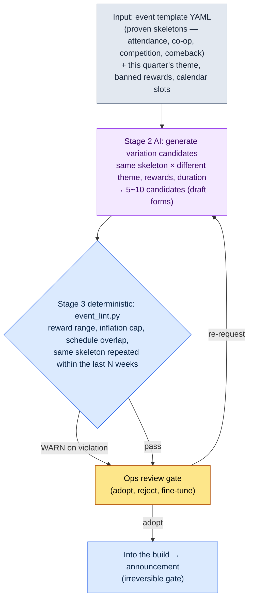

# 15.2 Event and Season Ops — From One Template to Ten Variation Candidates, Only the Review Is Human

> Primary audience: MMORPG designers responsible for live ops (mid-sized teams of 10–50)
> Scaled-down version for solo/hobbyist readers: §15.2.9, "If You Work Solo, Do Just This Much"

I think back to the Monday meetings on a live game in its fourth year of service. Every week, the question of what event to run next week started from a blank page. Someone would say, "How about the attendance event from last time, with the rewards bumped up a bit?" Someone else would say, "We did that two months ago." And how much to bump the rewards was, once again, decided by gut. After the meeting, one live-ops designer spent half a day filling out the event form from scratch. Every week, from a blank page, half a day.

The problem was not a shortage of ideas. The ops team already carried a few proven event skeletons in their heads: attendance, co-op, competition, comeback. Swap a new theme and new rewards into one of those skeletons and you have a one-week event. But because that swapping was done by hand and by gut every time, it was slow and the results wobbled.

This chapter covers how to hand that swapping over to AI. Two things matter. First, encode the proven event skeletons as **variation-ready template YAML**. Second, give AI the tedious job of pulling multiple candidates for next week out of the template, while humans **enforce reward ranges and overlap in code, then review only the tone**. The general theory of event design (attendance events help new-user inflow, co-op events help engagement, and so on) is already well covered in other books, so this chapter focuses only on *running that knowledge as an AI workflow*.

> **A frank note on my ops experience**
> Direct responsibility for post-launch live ops over one-to-two-year stretches covers only part of my career. The workflow in this chapter is my production-and-review tooling (content and HUD) carried over into events, and the effect figures are flagged in the text, case by case, as *industry observation plus author's estimate*. The tool structure (template YAML, lint, review gate) shares its skeleton with the content production tools I actually operate.

---

## 15.2.1 Humans Write the Template and Do the Final Review

The full flow of event production has four stages. The key point: stage 1 (template) and stage 3 (lint) are deterministic, and only stage 2 is AI. It is the same division of labor we saw in content production (§6.2) and HUD compression (§14.1). With the rulebook holding down both the input end and the verification end, the AI sandwiched in the middle can produce a slightly different variation every time without the reward balance or the schedule wobbling.



Human hands touch this diagram in exactly two places. At the top, where the template and this quarter's constraints get entered cleanly. At the bottom, where someone judges what lint cannot catch — "does this theme fit the mood of our game right now?" The tedious candidate generation and reward arithmetic in between is run by the template, the AI, and the lint.

The decisive design choice is that when lint (stage 3) finds a violation, it does not discard the candidate automatically — it only raises a WARN to the ops gate (stage 4). The reason comes in §15.2.5. And the final arrow (the announcement) being **irreversible** is what sets live ops apart from other production work. A city NPC you dislike can simply be scrapped before the build; an event announced to players costs community trust to roll back (§15.2.7).

---

## 15.2.2 Input — The Event Template YAML

Pin the ops team's proven skeletons down into a fixed form. Left as a free-form design doc, the AI does not know what it is supposed to vary. Only when the slots are separated does "swap only this slot" become a workable instruction.

```yaml
# event_templates/coop_raid.yaml — co-op raid skeleton (proven, run 4 times)
template_id: coop_raid
purpose: [existing_player_activation, community]      # 1~2 only. Never chase all four at once
core_loop: the whole server accumulates contribution during the event → server-wide rewards unlock tier by tier
duration_range: [5, 10]              # days. Past 10 days, fatigue builds up
slots:                               # ← the fields AI varies. The skeleton is fixed
  theme: { type: free, 제약: quarter_theme_compliance }
  boss_or_target: { type: free, 제약: reuse_existing_boss_assets_first }
  reward_tiers: { type: reward_list, count: 3~5, 제약: see reward_policy }
reward_policy:                       # ← the fields lint reads. No variation allowed
  강화석_per_event_max: 30           # payout cap per single event
  골드_per_event_max: 50000
  한정코스튬: allowed (permanent ownership, zero economy impact)
  현금성재화_직접지급: prohibited
inflation_guard:
  강화석_분기_누적상한: 90           # summed across all events in the quarter
post_event_kpi:                      # ← auto-measured post-event slots
  - participation rate (joined at least once, out of players shown the event)
  - enhancement stone price movement (30 days post-event, target ±10%)
  - weekday playtime after the event (dependency signal)
```

The most important separation is between `slots` (which AI varies) and `reward_policy` (which lint reads and AI may not touch). Theme and boss can differ every time, but the enhancement stone payout cap is a line drawn by the game economy. If the AI pulls a different number for that line on every call, inflation starts right there. So the AI proposes the reward *items*, while lint enforces that the reward *amounts* move only within the policy range.

The same folder holds `daily_attendance.yaml` (attendance), `pvp_ladder.yaml` (competition), and `comeback.yaml` (comeback) in the same format. These four files are the entire input pool for this quarter's candidate generation.

---

## 15.2.3 [Worked Transcript] One Template → Variation Candidates

Here is one full cycle, end to end, exactly as it runs. The input prompt can be copied as is; the output is a reconstruction of an actual production session.

### Step 1 — The Prompt: Ask for Variation, Enforce the Skeleton and the Policy

```
Using the attached coop_raid.yaml (a co-op raid skeleton proven over 4 runs), give me exactly 5 variation candidates for next week (W2).
This quarter's theme is "summer — water, festival, heat".
Do not touch core_loop at all; change only the slots (theme, boss, rewards).
Keep rewards within the reward_policy caps, and attach one line per candidate explaining why this theme and this reward.
The last 3 weeks were attendance, PvP ladder, and co-op raid, so tag any candidate that runs a co-op raid again with [repeat-risk],
and tag anything you are not sure about with [unsure] and hand it to me. Table only; columns: candidate name, theme, reward tier summary, rationale, flags.
```

Of these six lines of rules, not a single line *specifies* a theme or a reward. Every line is a fence: change only this much, do not cross that line, report when confused. Hand it a loose "make me a summer event" and you get the average of every mobile RPG out there. **Variation scope (slots only), reward caps (reward_policy), repetition alert (the last 3 weeks' history), and "when in doubt, hand it to a human"** — these fences keep the skeleton intact while setting the variation free.

### Step 2 — Claude's Output (Reconstructed from an Actual Session, Excerpt)

```
| Candidate            | Theme                      | Reward tier summary                            | Rationale                                                    | Flags         |
|----------------------|----------------------------|------------------------------------------------|--------------------------------------------------------------|---------------|
| Flood Levee          | hold back the river flood  | 25 enhancement stones / 40,000 gold / costume  | co-op = levee-building metaphor, maps to cumulative contribution |           |
| Floating Lanterns    | summer water festival      | 20 enhancement stones / 30,000 gold / title    | festival tone, mood refresh rather than competition          |               |
| Heatwave Boss Battle | subdue the avatar of heat  | 30 enhancement stones / 50,000 gold / costume  | reuses existing boss assets, rewards at the cap              | [repeat-risk] |
| Ocean Current Race   | ride the currents, compete | 28 enhancement stones / 45,000 gold / mount    | co-op + competition mix                                      | [unsure]      |
| Koi Collection       | collection-based co-op     | 22 enhancement stones / 35,000 gold / title    | low entry barrier for casual players                         |               |

[repeat-risk] Heatwave Boss Battle: core_loop is effectively identical to the W-3 co-op raid.
  Same skeleton repeated at a 3-week interval → player fatigue risk. A different skeleton (attendance/collection) is recommended.
[unsure] Ocean Current Race: mixes cumulative co-op and individual competition in one event.
  The purpose slot grows to [activation + competition]. Possible conflict with the 1~2 purpose rule.
```

The most valuable part of this output is not the table but **the two notes at the bottom** — the place where the AI reports its own limits ("Heatwave Boss Battle shares its skeleton with the event three weeks ago," "Ocean Current Race has grown a second purpose") and hands the call to a human. A good prompt is one that lets the AI say, "I am not confident about this one."

Now lint runs over this batch of candidates.

---

## 15.2.4 Stage 3 Lint — Reward Ranges and Overlap, Enforced in Code

Checking by eye, every time, whether a candidate respects the reward policy and avoids schedule overlap is exactly how things get missed — again. Anything that can be judged from `reward_policy`, `inflation_guard`, and the calendar should be reviewed by code. People spend their time only on the tone and fun judgments code cannot make.

```python
# event_lint.py — validates event variation candidates (skeleton)
# Input: candidate list proposed by AI + template policy + quarter calendar
# Output: list of WARNs (not auto-discarded — escalated to the ops gate)

def lint(candidates, policy, quarter_ledger, recent_weeks):
    warns = []
    stone_used = sum(quarter_ledger.강화석)   # cumulative payout already granted this quarter
    for c in candidates:
        # A: per-event reward cap (policy)
        if c.강화석 > policy["강화석_per_event_max"]:
            warns.append(f"[A] {c.name}: enhancement stones {c.강화석} > cap "
                         f"{policy['강화석_per_event_max']} (per-event excess)")
        # B: quarterly inflation cumulative cap
        if stone_used + c.강화석 > policy["강화석_분기_누적상한"]:
            warns.append(f"[B] {c.name}: quarter total {stone_used + c.강화석} > "
                         f"{policy['강화석_분기_누적상한']} (inflation cap)")
        # C: same skeleton repeated within the last N weeks
        if c.template_id in recent_weeks[-2:]:
            warns.append(f"[C] {c.name}: {c.template_id} skeleton ran within the last 2 weeks (repeat)")
        # D: calendar slot conflict (another major event in the same week)
        if quarter_ledger.slot_taken(c.week):
            warns.append(f"[D] {c.name}: W{c.week} slot already holds a major event")
    return warns
```

Feed the five candidates from the worked transcript above into this code, and this comes out.

```
[PASS] Flood Levee: enhancement stones 25 ≤ 30, quarter total 65+25=90 ≤ 90 (boundary reached)
[WARN] [C] Heatwave Boss Battle: coop_raid skeleton ran within the last 2 weeks (W-3) (repeat)
[WARN] [B] Ocean Current Race: quarter total 65+28=93 > 90 (inflation cap exceeded)
[PASS] Floating Lanterns: enhancement stones 20 ≤ 30, quarter total 65+20=85 ≤ 90
[PASS] Koi Collection: enhancement stones 22 ≤ 30, quarter total 65+22=87 ≤ 90
```

The interesting one here is `Ocean Current Race`. The AI tagged it [unsure] over the purpose conflict, but lint caught it for an entirely different reason — **exceeding the quarterly cumulative inflation cap**. Add its 28 enhancement stones and the quarter total reaches 93, past the policy's 90. The code caught arithmetic the AI missed. Conversely, on `Heatwave Boss Battle`, the AI's [repeat-risk] and lint's [C] pointed at the same thing. Human, AI, and code each filter with a different net.

Thanks to these 30 lines, "isn't this reward a bit rich?" no longer ends as gut versus gut. When the code prints `[B] quarter total 93 > 90`, there is nothing to debate. Lower the reward or swap the candidate.

---

## 15.2.5 One Full Cycle — Review, Rejection, Re-Request

Writing "the ops team reviews it" in the abstract tells you nothing about what this gate actually filters. Let us follow one cycle to the end: after lint passes, what does a human kill, and what does a human keep?

> **[Stage 4 Ops Review — Verdicts]**
>
> The live-ops designer handled the five candidates like this.
>
> - **Heatwave Boss Battle** → **rejected.** Lint's [C] and the AI's [repeat-risk] pointed at the same thing. Run the same co-op raid skeleton again after only three weeks and the fatigue arrives — "cumulative contribution, again?" Memo: carry over to a next-quarter slot.
> - **Ocean Current Race** → **rejected.** Lint [B], inflation cap exceeded. Cutting the reward to 25 would pass, but the purpose conflict the AI's [unsure] flagged (activation + competition) was the more fundamental problem. Mix individual rankings into a co-op event and casual players read it as "a party for the entrenched veterans in the end." Shelved whole, not saved by trimming the reward.
> - **Flood Levee** → **top pick for adoption.** Except — lint passed `quarter total 90 (boundary reached)`, and that *boundary* nagged. Run this event and the quarter's enhancement stone headroom drops to 0. No reward budget left for the season-finale push in the last week of June.
> - **Floating Lanterns / Koi Collection** → **kept.** Both are light on rewards (20 and 22) and leave quarterly headroom.

The heart of this gate is that a human shook the lint-passing `Flood Levee` out of the top spot. The code passed `90 ≤ 90`. No policy violation. But the live-ops designer was looking at *the reward rhythm of the entire quarter*. Lint sees the legality of one event; a human sees all the way to the season finale at quarter's end. So a re-request goes out.

```
Remake the Flood Levee variation with its reward lowered from 25 enhancement stones to 18.
Reason: we must keep 12 enhancement stones of headroom for the season-finale push in the last week of June.
To offset the weaker reward appeal, restructure reward_tiers to shore up
perceived value with limited costumes and titles instead of enhancement stones.
```

The AI came back with a candidate that lowered the enhancement stones to 18 and expanded the limited costumes to 2 (permanent-ownership rewards with zero economy impact). Re-running lint gave `quarter total 65+18=83 ≤ 90`, leaving headroom of 7 for the season finale. The cycle — input → candidate generation → lint → review → rejection → re-request — closes here.

This one loop is the Show standard of this entire book. Unless you watch, at least once and end to end, what the tool emits, what gets caught, and what a human kills, the sentence "we mass-produced events with AI" is hollow.

This cycle is also why the lint is not an auto-discarder. Had lint silently dropped the [B] violation, the ops team would have lost the chance to learn `Ocean Current Race`'s real problem (the purpose conflict), and there would have been no place to shake a candidate like `Flood Levee` — *legal, yet risky for the quarter's rhythm*. The machine nominates the suspects; humans decide adoption and rejection.

---

## 15.2.6 Seasons — A Bigger Rhythm, the Same Separation

If events run on a weekly-to-monthly rhythm, seasons run on a quarterly one. The operating method is the same. Separate a season's proven elements into slots, and each quarter you swap only the theme.

| Season slot | Varies (AI and humans) | Fixed (policy and lint) |
|---|---|---|
| Season theme | summer, winter, new year (free) | — |
| Season pass reward track | reward items per tier | number of tiers, completion difficulty, reward caps |
| Season PvP ranking | ranking reward items | reward inflation cap |
| Meta shuffle | new characters, balance | change-magnitude guardrails (§8.1) |

For the season pass, the key figure humans pin down as policy is the **completion rate target**. A commonly cited industry benchmark is to tune difficulty so that around 70% of active users reach the final tier (author's estimate — it varies by game, so read it as a *direction*, not an absolute: below 30% means frustration, above 90% means no sense of challenge). Once this target sits in a slot, you can force the AI to produce an "expected completion rate" alongside any season pass variation it proposes.

Events and seasons stop colliding only when the quarterly calendar is visible at a glance. It is closer to the ops team's shared desk calendar than to a chart. Conflicts shrink when everyone is looking at the same picture.

<svg viewBox="0 0 720 300" xmlns="http://www.w3.org/2000/svg" role="img" aria-label="Q2 (April–June) combined event and season calendar">
  <rect x="0" y="0" width="720" height="300" fill="#0f1117"/>
  <text x="16" y="26" fill="#e5e7eb" font-family="sans-serif" font-size="15" font-weight="bold">Q2 combined calendar — one season (quarter), events by week</text>
  <!-- Season band -->
  <rect x="16" y="42" width="688" height="30" rx="5" fill="#1e3a5f" stroke="#3b82f6" stroke-width="1.5"/>
  <text x="360" y="62" fill="#bfdbfe" font-family="sans-serif" font-size="13" text-anchor="middle">Season "Summer Festival" (50-tier season pass · PvP ranking) — April–June, all quarter</text>
  <!-- Month dividers -->
  <text x="130" y="96" fill="#9ca3af" font-family="sans-serif" font-size="12" text-anchor="middle">April</text>
  <text x="360" y="96" fill="#9ca3af" font-family="sans-serif" font-size="12" text-anchor="middle">May</text>
  <text x="590" y="96" fill="#9ca3af" font-family="sans-serif" font-size="12" text-anchor="middle">June</text>
  <line x1="245" y1="84" x2="245" y2="270" stroke="#374151" stroke-width="1" stroke-dasharray="4 4"/>
  <line x1="475" y1="84" x2="475" y2="270" stroke="#374151" stroke-width="1" stroke-dasharray="4 4"/>
  <!-- Event blocks: color = skeleton type -->
  <!-- April -->
  <rect x="20" y="110" width="100" height="34" rx="4" fill="#14532d"/><text x="70" y="131" fill="#bbf7d0" font-size="11" text-anchor="middle">W1 Attendance</text>
  <rect x="128" y="110" width="100" height="34" rx="4" fill="#7c2d12"/><text x="178" y="131" fill="#fed7aa" font-size="11" text-anchor="middle">W2 Co-op (Levee)</text>
  <!-- May -->
  <rect x="250" y="110" width="100" height="34" rx="4" fill="#581c87"/><text x="300" y="131" fill="#e9d5ff" font-size="11" text-anchor="middle">W3 PvP Ladder</text>
  <rect x="358" y="110" width="100" height="34" rx="4" fill="#14532d"/><text x="408" y="131" fill="#bbf7d0" font-size="11" text-anchor="middle">W4 Collection Co-op</text>
  <!-- June -->
  <rect x="480" y="110" width="100" height="34" rx="4" fill="#7c2d12"/><text x="530" y="131" fill="#fed7aa" font-size="11" text-anchor="middle">W5 Comeback</text>
  <rect x="590" y="110" width="110" height="34" rx="4" fill="#854d0e"/><text x="645" y="131" fill="#fde68a" font-size="11" text-anchor="middle">W6 Season Finale</text>
  <!-- Inflation gauge -->
  <text x="16" y="180" fill="#9ca3af" font-family="sans-serif" font-size="12">Quarterly enhancement stone inflation total (cap 90)</text>
  <rect x="16" y="190" width="688" height="22" rx="4" fill="#1f2937"/>
  <rect x="16" y="190" width="635" height="22" rx="4" fill="#b45309"/>
  <line x1="651" y1="184" x2="651" y2="218" stroke="#ef4444" stroke-width="2"/>
  <text x="640" y="232" fill="#fca5a5" font-size="11" text-anchor="end">current total 83 / cap 90 (headroom 7 = reserved for the season-finale push)</text>
  <!-- Legend -->
  <rect x="16" y="252" width="14" height="14" fill="#14532d"/><text x="36" y="264" fill="#9ca3af" font-size="11">Attendance/Collection</text>
  <rect x="120" y="252" width="14" height="14" fill="#7c2d12"/><text x="140" y="264" fill="#9ca3af" font-size="11">Co-op/Comeback</text>
  <rect x="240" y="252" width="14" height="14" fill="#581c87"/><text x="260" y="264" fill="#9ca3af" font-size="11">Competition (PvP)</text>
  <rect x="360" y="252" width="14" height="14" fill="#854d0e"/><text x="380" y="264" fill="#9ca3af" font-size="11">Season event</text>
</svg>

This one picture explains the §15.2.5 judgment visually. Color is skeleton type. **If the same color appears twice within 2–3 weeks, the §15.2.4 lint [C] cries out.** And the inflation gauge at the bottom sits just short of the red line (cap 90), with barely 7 of headroom left for the June season finale (W6) — the same 7 secured by lowering the `Flood Levee` reward to 18.

---

## 15.2.7 The Irreversible Gate — Finish Every Review Before the Announcement

One thing decisively separates live ops from city NPCs (§6.2) or the HUD (§14.1). **An announcement cannot be undone.** An NPC whose tone is off can simply be scrapped before the build, and players never know it existed. But once an event has been announced, its rewards, duration, and rules live on in the community. Saying "the event rewards were too generous, so we are clawing them back" after launch carries an irreversible cost.

```mermaid
flowchart LR
    A["Template variation candidates"] -->|reversible| B["Lint review"]
    B -->|reversible| C["Ops review, rejection, re-request"]
    C -->|reversible| D["Build review<br/>(release can be held)"]
    D ==>|irreversible gate| E["Event announcement and start"]
    E -.->|recovery is costly| F["Only late-stage fine-tuning possible<br/>(reward clawbacks and duration changes cost trust)"]
    classDef code fill:#dbeafe,stroke:#2563eb,color:#0b2545;
    classDef human fill:#fde68a,stroke:#b45309,color:#000;
    classDef data fill:#e2e8f0,stroke:#64748b,color:#1e293b;
    classDef fail fill:#fee2e2,stroke:#dc2626,color:#7f1d1d;
    class A data;
    class B code;
    class C,D human;
    class F fail;
```



The principle that runs through this whole book (§5.4.5 voice recording, §8.1 live builds, the same message as Part 12's final render) holds in live ops too. Every review — reward range, inflation cap, schedule conflicts, tone — must finish in the reversible stages before the announcement. That is why the entire production–lint–review–re-request cycle of §15.2.3\~5 turns to the *left* of this irreversible gate. Once past the gate, all that remains is the late-stage fine-tuning of §15.2.8, and even that nibbles away at player trust.

---

## 15.2.8 Signals and Prescriptions During Operation

KPIs are still watched after the announcement. But unlike pre-announcement review, the only lever left here is late-stage fine-tuning. The signals are measured automatically; the prescriptions are human decisions.

| Signal (auto-measured) | Prescription (human decision) |
|---|---|
| Participation below 50% | Slightly strengthen late-stage rewards or extend the duration by +2 days (within the bounds of announced trust) |
| Participation above 95% | Too easy — note the difficulty for the next cycle, keep the current event as is |
| Enhancement stone price beyond -10% in the 30 days post-event | Strengthen sinks (limited shop), lower next quarter's inflation cap |
| Weekday playtime drops after the event | Event-dependency signal — shore up weekday content appeal, adjust event frequency |

The last row (weekday playtime dropping) is the signal most often missed. Watch only DAU (daily active users) during the event window and every event looks like a success. But if players do not come back on weekdays after the event ends, the event is feeding on the everyday appeal of the game. That is why §15.2.2's template carries "weekday playtime after the event" as a `post_event_kpi` slot from the very start. What is not measured cannot be prescribed for.

---

## 15.2.9 How Honest Can We Be About the Effects

An events chapter faces a strong temptation to drop in a table like "we ran a co-op event and retention rose from 30% to 50%." Numbers like that, unverified, erode the book's credibility. There are only three things this chapter can say.

First, **direction can be stated from industry observation.** Boosted attendance rewards lift short-term active user counts, co-op events strengthen community bonds, and limited packages lift revenue during the event window — that is the received wisdom of an industry that has watched live games for years. But *how much* swings widely with the game and its player mix, so carrying another company's numbers over wholesale is dangerous.

Second, **an author's estimate is labeled an estimate.** "Season pass completion target 70%," "fatigue builds past 10 days of event duration," "event production from half a day to one hour" — these are my experience-based estimates and unverified hypotheses. Do not memorize the absolute values; read the *structure* (template plus lint replacing blank-page design).

Third, **only what is measurable gets promised as a KPI.** Outcome metrics like retention are not driven by a single event, so I make no causal claims. What this workflow actually makes measurable is this — lint WARN counts (until reward violations reach 0), quarterly inflation totals (against the cap), repetition intervals for the same skeleton (in weeks), and per-event participation rates with post-event enhancement stone price movement. These four can be spoken in numbers at a meeting, not in "feelings."

---

## 15.2.10 Common Failures

| Pattern | Why it fails | Prescription |
|---|---|---|
| Designing events from a blank page every week | Slow, and results wobble | Enter proven skeletons as template YAML (§15.2.2) |
| Wholesale delegation — "AI, make me a summer event" | You get the average generic RPG event | Fix the skeleton, vary only the slots (§15.2.3) |
| AI freely proposes reward amounts | Inflation starts right there | Lint enforces reward_policy (§15.2.4) |
| Reviewing candidates by eye only | Quarter totals and repetition intervals get missed every time | Automated checks with event_lint.py (§15.2.4) |
| Lint pass = straight to adoption | Misses quarter rhythm and purpose conflicts | The human gate watches the whole quarter (§15.2.5) |
| Trying to claw back rewards after the announcement | Irreversible trust cost | Every review before the announcement (§15.2.7) |
| Measuring only DAU during the event | Misses the erosion of weekday appeal | Post-event weekday playtime slot (§15.2.8) |

The fifth is the one most often missed. Send a lint PASS straight to announcement and you lose the place to shake a candidate like `Flood Levee` — *legal, but one that drains the quarter-end reward headroom to 0*. Code sees the legality of one event; humans see the rhythm of the whole quarter.

---

## 15.2.11 Try It Yourself — One Step You Can Take Today

> **If You Work Solo, Do Just This Much**: You do not need the lint code. Pick one event skeleton that shows up often in your own game (or in a live game you love) and write a template YAML in the §15.2.2 format by hand (the three fields that matter are `core_loop`, `slots`, and `reward_policy`). Then attach the §15.2.3 prompt, pull 5 variation candidates, pick the one whose rewards feel too generous, and push back: "this blows past this month's reward budget — lower it and try again." What adoption and rejection actually bundle together sinks in through your hands.

If you are on a team, start with this one step. Enter the 3–4 event skeletons you run most often as template YAML, and build the three lines of `event_lint.py` — reward cap, quarterly inflation total, repetition interval — in code first. With just the templates and those three lines, you head off the two most common failures: blank-page design every week, and rewards set by gut. This workflow is the first hands-on implementation of §15.1.5's three progressive-application skeleton elements — an event template and season rule library, an AI event candidate generator, and automated post-event measurement.

---

### Key Takeaways
- Enter proven event skeletons as template YAML, and AI mass-produces candidates by varying only the slots.
- Lint enforces reward amounts, inflation caps, and repetition intervals; humans judge tone and the quarter's rhythm.
- Announcements are irreversible, so every review finishes in the reversible stages before the announcement.

### Next Chapter Preview
- 15.3 The Player Feedback Cycle — Balancing Player Opinion with the Director's Vision, plus Automatic Feedback Clustering
