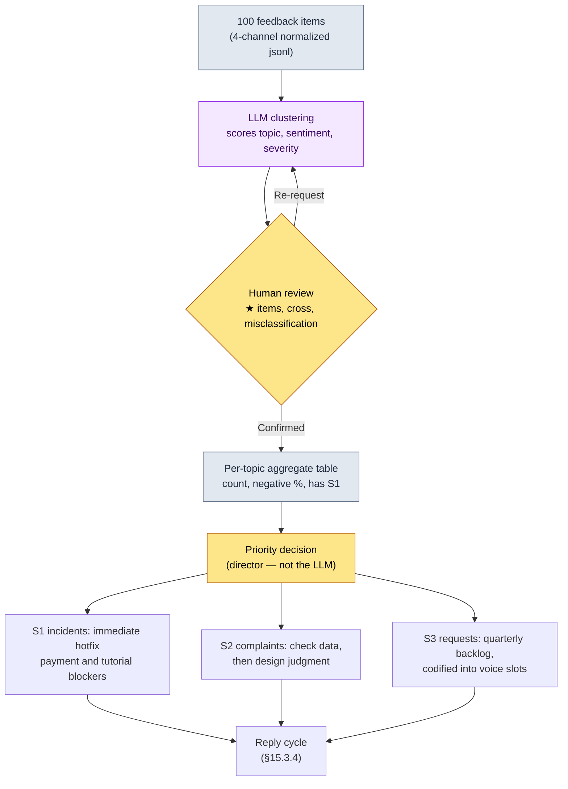

# 15.3 100 Feedback Items into Topics — Clustering Goes to the LLM, Priorities Stay with People

> Primary audience: designers and directors responsible for user-facing live operations (live ops) on a mid-sized team (10–50 people)
> Scaled-down version for solo/hobbyist readers: §15.3.7 "If You're Solo, Just This Much"

Let me be honest up front. I have not spent long stretches — a year or two at a time — personally owning post-launch live ops. Much of this chapter is **industry observation and adjacent experience** layered on top of 24 years in the field. So this chapter does not presume to declare "this is how you run live ops." Instead, I take the *input → AI → verification → human decision* cycle that was proven in pre-launch content production, plug in a new input — **user feedback** — and run it through one full cycle to see what comes out. The skeleton of the tooling is the same as the city_hunting_generator in §6.2; only the input changes, from "city metadata" to "100 items of user feedback."

The first week of live operations looks much the same everywhere. Forum posts, Discord messages, CS (customer support) tickets, and store reviews pile up by the hundreds to thousands a day. No human can read them all, and if no one does, the same bug report gets buried fifty times over. This chapter covers a method where an **LLM clusters that pile into topics and scores the sentiment**, so that people step in only for the **priority decision**: "so what do we fix this week?"

---

## 15.3.1 Feedback Is "Classification Input," Not "Reading Material"

Every live ops textbook has the table that splits feedback into four channels (in-game surveys, forums/Discord, store reviews, CS tickets) and four types (bugs, requests, complaints, praise). It is all true. The problem is that memorizing the table gives you no answer to "how do we handle the 412 items that came in today?" As long as you treat feedback as *something for humans to read and classify*, feedback volume always beats ops headcount.

Shift the perspective. One piece of feedback is **structured input**: a record with five slots, `{source, raw text, topic, sentiment, severity}`. Seen this way, the nature of the work changes. It is not "read everything" but "cluster by topic and rank by priority." Topic clustering and sentiment scoring are tedious for humans, and our criteria drift every time we do them — a machine applies the same yardstick identically to all 100 items. This is exactly the kind of work an LLM does better than people. The division of labor that mass-produced 30 cities in §6.2 (rulebook = deterministic, body text = AI, review = human) holds here unchanged. Only one thing differs: the human's job at the end is not "review the text" but "decide the priorities."

One note on the distribution of feedback types. Users who write voluntarily skew toward the dissatisfied, not the satisfied. Happy customers leave quietly; unhappy customers come back to the counter. So the sentiment distribution on forums and reviews tends to lean more negative than the actual satisfaction of your whole player base (my observation — the exact size of the bias varies by game, channel, and period, so read it as a *direction*, not an absolute number). Keep this bias in mind, and when you see "60% negative" in the clustering results you won't misread it as the game going under.

---

## 15.3.2 [Worked Transcript] 100 Feedback Items → Topic Clusters + Sentiment

Let's actually run one cycle end to end. The input is 100 feedback items collected from four channels over one week; the output is topic clusters, sentiment, and priorities. The input prompt can be copied as is, and the output below is a reconstruction of the format from an actual classification session.

### Step 1 — Input: Turn Feedback into a Machine-Readable Table

Normalize the raw text scraped from each channel into one record per line. This is not new writing — it is extraction and cleanup only.

```jsonl
{"id": "fb_0001", "src": "discord",     "text": "Failed 50 times going for +12 enhancement. Are these rates even right? I want a refund"}
{"id": "fb_0002", "src": "store_review","text": "Graphics are pretty but the lag is so bad I get disconnected every guild war"}
{"id": "fb_0003", "src": "cs_ticket",   "text": "I paid but the diamonds never arrived, order number attached"}
{"id": "fb_0004", "src": "forum",       "text": "When is the new archer class coming T_T you promised it at pre-registration"}
{"id": "fb_0005", "src": "discord",     "text": "First week since launch and the ops team communicates well, notices are fast. Keep it up"}
{"id": "fb_0006", "src": "store_review","text": "One boss (Heukrang) does absurd damage. Full gear and it one-shots me. Balance patch please"}
{"id": "fb_0007", "src": "cs_ticket",   "text": "Can't progress at tutorial step 5, the button won't press (device: Galaxy A series)"}
// ... fb_0008 ~ fb_0100 (omitted)
```

At the input stage the records leave `topic·sentiment·severity` empty. Filling those blanks is the LLM's job in step 2.

### Step 2 — The Prompt: Demand Clustering, but Force the Labels, the Format, and the Escape Hatch

```
Cluster the attached feedback_100.jsonl (100 feedback items from one week) by topic, and score sentiment as well.
Pick topics only from this list (no free generation): Enhancement/Rates, Balance, Server/Performance, Payments/Refunds,
New Content Requests, Tutorial/Onboarding, UI/Controls, Praise/Support, Other. If 'Other' exceeds 8 items, also propose new topic candidates.
Sentiment is Negative·Neutral·Positive; severity is S1·S2·S3·S4.
// (Intent: S1 only when specific, reproducible, and feature-blocking. A merely strong complaint is S2)
If you're not confident about an item, leave it in 'Other', mark a ★ at the end of its id, and pass it to me — don't force-fit it.
Give me just two tables — Table A (per item): id·topic·sentiment·severity / Table B (per topic): topic·count·negative %·1 representative quote·has S1.
```

What determines the classification quality in this prompt is neither the topic list nor the sentiment scale, but three control devices: *pinning* the labels, *nailing down* the format, and *leaving open* an escape hatch. Let the LLM free-generate topics and it invents mushy labels you cannot prioritize with, like "general dissatisfaction" or "requests to improve the game." The allowed-label list (rule 1), the severity definitions (rule 3 — the narrow definition of S1 is the key), the output format (two tables), and "if unsure, mark ★ and hand it to a human" (rule 5). Drop any of these four and the table degenerates from a priority tool into yet another pile of reading material. This label list is itself the *category scheme of the feedback L4 layer* from §15.1.5 — labels must stay fixed so that each quarter's trends can be compared along the same axis.

### Step 3 — Claude's Output (Reconstructed, Excerpt)

```
[Table A] Per-item classification (excerpt)
id       | Topic                | Sentiment | Severity
fb_0001  | Enhancement/Rates    | Negative  | S2
fb_0002  | Server/Performance   | Negative  | S2
fb_0003  | Payments/Refunds     | Negative  | S1
fb_0004  | New Content Requests | Neutral   | S3
fb_0005  | Praise/Support       | Positive  | S4
fb_0006  | Balance              | Negative  | S1
fb_0007  | Tutorial/Onboarding  | Negative  | S1
fb_0042★ | Other                | Neutral   | S3
...

[Table B] Per-topic aggregation (all 100 items)
Topic                | Count | Neg % | Representative quote                       | Has S1
Server/Performance   | 24    | 92%   | "disconnected every guild war"             | Yes (partially reproduced)
Enhancement/Rates    | 21    | 95%   | "failed 50 times going for +12"            | No
Balance              | 14    | 86%   | "Heukrang one-shots full gear"             | Yes
New Content Requests | 12    | 8%    | "when is the archer coming"                | No
Tutorial/Onboarding  | 9     | 78%   | "step 5 button won't press (Galaxy A)"     | Yes
Payments/Refunds     | 8     | 100%  | "the diamonds never arrived"               | Yes
UI/Controls          | 6     | 67%   | "skill buttons too small, mis-taps"        | No
Praise/Support       | 4     | 0%    | "the ops team communicates well"           | No
Other                | 2     | -     | (fb_0042★, fb_0067★ awaiting human call)   | -

Overall sentiment: Negative 71 / Neutral 18 / Positive 11
'Other' at 2 items (under 8) → no new topic proposal needed
Low-confidence ★ marks, 2 items: fb_0042, fb_0067 (human judgment requested)
```

The most valuable part of this output is not the tables but the **two lines at the bottom — the "2 items marked ★."** That is where the LLM reported what it could not cluster and handed it to a human. It is the same design as in §6.2, where the AI flagged the NPC "Grem" as ambiguous on its own. A good prompt makes it possible for the AI to say "I am not confident about this."

### Step 4 — Verification and Veto (the Human's Seat)

You must not accept this output as is. One spot actually snagged.

All 21 items in the `Enhancement/Rates` topic were classified S2 (complaint). But one of them, fb_0001, carries "I want a refund." The LLM read this only as "strong complaint (S2)." Here the human steps in. A complaint about enhancement rates — as long as the data shows the rates working exactly as specified — is not an S1 incident. Dissatisfaction with odds that behave as specced is a *design and perception problem*, not a *bug*. The LLM's S2 call is correct. But the "refund demand" signal needs to be cross-linked to the payments topic so CS can handle it separately. The LLM assigned a single topic label per item and missed the case where one item straddles two topics.

So I re-request.

```
Added rule: when one item straddles two topics (e.g., enhancement complaint + refund demand), write the
secondary topic in a 'cross' column in addition to the main topic. Re-output Table A with a cross column added.
However, keep enhancement-rate complaints themselves at S2, not S1, as long as the data shows the rates match the spec.
```

One round trip and it is done. The LLM re-answered fb_0001 as `topic=Enhancement/Rates, cross=Payments/Refunds, severity=S2`, and I read the two ★ items myself, reassigning fb_0042 to `UI/Controls` and fb_0067 to `Tutorial/Onboarding`. **Reading and classifying 100 items from scratch by hand takes half a day; an LLM draft + human review + one round trip stays under an hour** (my estimate, an unverified hypothesis — the exact savings depend on feedback volume and channel count, so read it not as absolute times but as the structural difference between "by hand from scratch" and "draft + review").

---

## 15.3.3 Priorities Are Not the LLM's to Give — The Human's Seat

Here I draw the decisive line. Table B above only says "which topic has how many items, and how negative they are." **"So what do we fix first this week?" is something the LLM cannot give you.** That decision entangles cost, schedule, and the game's vision, and the responsibility for it rests with the director.

Two ops teams can look at the same table and reach opposite decisions. By count alone, `Server/Performance` (24 items) and `Enhancement/Rates` (21 items) rank first and second. But priority does not follow count order. The reason is **severity and reversibility**.



In this flow, human hands touch only two places: the review gate in the middle (judging ★ items, cross links, and misclassifications) and the priority decision at the bottom. The tedious classification of 100 items in between is the LLM's run. And the actual logic of the priority decision is not the count — it is the following three axes.

| Topic | Count | Priority call (the director's seat) |
|---|---|---|
| Payments/Refunds (S1) | 8 | **First priority.** Few items, but feature-blocking + irreversible (money). 24h hotfix |
| Tutorial/Onboarding (S1) | 9 | **Second.** Directly tied to new-user churn. Reproduced on specific devices → patch |
| Server/Performance | 24 | **Third.** Highest count, but infrastructure work = long schedule. No hotfix possible; next week |
| Enhancement/Rates (S2) | 21 | **Hold.** If the data matches the spec, not a bug. Reviewed separately as a design decision |
| New Content Requests | 12 | **Backlog.** 8% negative (= positive anticipation). Codified into the quarterly voice slot |

`Server/Performance`, first by count, drops to third priority because it is infrastructure work a hotfix cannot cover; `Payments/Refunds`, sixth by count, rises to first because it is an irreversible incident with money on the line. **The LLM cannot do this reordering.** The LLM delivers only the fact: "payments, 8 items, 100% negative." The decision that this is priority one belongs to a person who knows the costs, the legal risks, and the game's vision. This is what §15.1.5's "AI produces the classifications and candidates; people focus on adoption and vision decisions" actually looks like in the feedback domain.

---

## 15.3.4 Replies — An Irreversible Step, so the Review Gate Weighs Heavier

Once priorities are set, you reply to users. In live ops, the absence of replies is where trust takes its biggest damage. Even when there is nothing to say, "under review" beats silence. Reply drafts, too, can be pulled from the LLM per topic.

> **[Reply drafts — LLM output, per topic]**
>
> - **Payments/Refunds (S1)**: "We have confirmed the missing diamond grants. They will be retroactively granted within 24 hours based on order numbers, and we will reply to each of you individually."
> - **Server/Performance**: "We are working to reproduce the disconnects during guild wars. They will be prioritized in next week's maintenance, and we will post progress updates in the notices."
> - **Enhancement/Rates**: "We have confirmed from the data that enhancement rates are applied exactly as listed. We are separately reviewing the feedback on perceived difficulty."
> - **New Content Requests (archer)**: "The new class is on the roadmap, and we will announce the schedule the moment it is confirmed."

Here is the one decisive difference from §6.2: **sending a reply is an irreversible step.** A city NPC can be discarded and regenerated, but a notice or reply text a user has seen once cannot be taken back. If you auto-send "granted within 24 hours" and it actually takes three days, that promise remains in the community as an irreversible mark. So the irreversible-step principle of §15.1.4 operates **more heavily** in the feedback domain than in any other. The LLM produces the auto-reply drafts, but **not a single character goes out automatically before passing the CS review gate.** The reviewer checks only two things: whether the schedule promises (24h, next week) match the actual work schedule, and whether sensitive cases (legal disputes, refund disputes) have slipped into the auto-send pool. It is a seat for the judgment that lint cannot catch.

| Step | Reversibility | Who |
|---|---|---|
| Feedback clustering and sentiment scoring | Reversible (free to rerun) | LLM |
| Topic review and priority decision | Reversible (until confirmed) | Human (director) |
| Reply draft generation | Reversible (discard and rewrite) | LLM |
| **Reply send / notice posting** | **Irreversible (seen by users)** | **Human (after CS review)** |

---

## 15.3.5 Codify User Voice into the Quarterly Retrospective

To keep the same feedback from swinging to different decisions every quarter, the clustering results must be codified as a **fixed input slot in the quarterly retrospective**. Not an offhand "lots of enhancement complaints lately," but a table aggregated along the same label axis every quarter, sitting inside the retrospective table. This is where the decision in §15.3.2 — banning free-form labels and fixing an allowed list — pays off.

> **2026 Q2 user voice (LLM auto-aggregated, quarterly cumulative)**
> ```
> Roughly 5,000 items clustered across 4 channels (counts are actual quarterly tallies — not embellished)
>
> Top negative topics:   Enhancement/Rates > Server/Performance > Balance > Payments/Refunds
> Top requested topics:  New class > New hunting grounds > Guild system > UI improvements
> Quarterly sentiment:   Q1 negative 68% → Q2 negative 71% (slightly worse — driven by the enhancement topic)
> ```

This table becomes the *input* to the quarterly decision. The decision itself belongs to the director; the input belongs to the users. Read the quarterly trend ("Q1 68% → Q2 71%") as *direction* only. The signal is not any single quarter's absolute value but the direction of change along the same label axis. If the negative % rose, trace back which topic pulled it up and connect that to next quarter's priorities. The draft of this quarterly report is itself something the LLM writes in natural language, with the human adding only the decision comments — the actual seat of the auto-drafted quarterly report described in §15.1.5.

---

## 15.3.6 How to Handle Numbers Honestly

A live ops chapter carries a strong temptation to insert a table like "after adopting the feedback cycle, NPS (Net Promoter Score) rose from 20 to 45." I have never measured that causation, so I do not write it. This book's principle is one of three.

First, **actual tallies are written as is.** The per-topic counts in §15.3.2 (server 24, enhancement 21, payments 8) and the quarterly cumulative in §15.3.5 are values counted item by item from classification results, not ratios groomed to look good.

Second, **estimates are labeled as estimates.** "Classifying 100 items: half a day → one hour" (§15.3.2) and "forum sentiment skews negative" (§15.3.1) are my experience- and observation-based estimates, unverified hypotheses. Do not memorize the absolute values; read the *direction* (feedback volume always beats headcount; voluntary posts lean toward complaints).

Third, **only what is measurable gets promised as a metric.** What a feedback cycle can actually measure is not outcome satisfaction (NPS) but process metrics — the backlog of unclassified feedback (target: 0), the lead time from S1 discovery to hotfix, reply response time, and the share of the 'Other' topic (when the allowed labels fail to capture reality, 'Other' balloons). These four let you speak in a meeting with numbers, not "feelings."

---

## 15.3.7 Try It Yourself — One Step You Can Take Today

> **If you're solo, just this much**: You need no CS system and no dataset. Copy 20–30 store reviews or community posts for your game (or a game you love) by hand into a jsonl (`{"id":..., "src":..., "text":...}`), paste the prompt from §15.3.2 as is, and run it once. In the resulting Table B, find one case where the "topic with the highest count" and "the topic you want to fix first" differ, and write one line on why they differ — and you will feel in your bones why priorities are a human's job, not the LLM's.

If you are on a team, start with this one step. First, fix the extraction script that collects 4-channel feedback into one-record-per-line jsonl, and the **allowed topic label list** from §15.3.2. Only with fixed labels can LLM classification and human classification measure along the same axis, and quarterly trends be compared. Auto-replies come after that — replies are irreversible, so never wire them to auto-send without a CS review gate.

---

### Key Takeaways
- Feedback is classification input, not reading material — clustering and sentiment go to the LLM, priorities to people.
- Priority splits on severity and reversibility, not on count (payments 8 items > server 24 items).
- Replies are irreversible, so the CS review gate weighs heavier here than in any other domain.

### Next Chapter Preview
- 16.1 Running TaskForce — A Tool for Drawing Out Cross-Discipline Agreement
