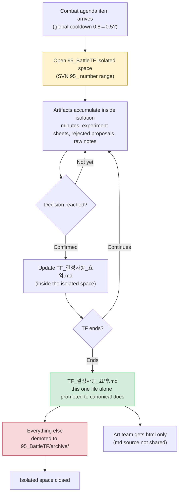

# 16.1 Combat TF Operations — Only Decisions Leave the Isolated Workspace as Canon

Thursday, 4 p.m. The combat TF meeting ended and the seven of us scattered back to our desks. The whiteboard still holds the traces of whether to cut the global cooldown from 0.8 seconds to 0.5. The senior balance designer said, "My sim says 0.5 is right." The code lead said, "At 0.5 the server tick can't keep up." The UI designer said, "I can't speak to either of those, but the cooldown gauge gets too narrow."

All three of them are right. And if all three start writing their own conclusions into their own discipline's documents, those three documents will contradict each other by next week. The balance sheet says 0.5, the code spec says 0.8, the UI guide says 0.6. Nobody can tell which one is the canon.

The combat TF exists precisely to absorb this collision in one place. And only the product of that absorption — a single decision — should rise into the canonical docs, the documents that count as the single source of truth. The debris of everything else debated has to end inside an isolated workspace. This chapter covers that mechanism of isolation and absorption.

---

## 16.1.1 A TF Is Not a Permanent Department but an Isolated Workspace

A major combat system overhaul never ends within one discipline. Touch the global cooldown alone and balance (numbers), code (server tick), UI (gauge rendering), animation (motion length), and sound (hit feel) all shake at once. Run an agenda item like this through each discipline separately and the decision stretches out by two to four weeks — and even once decided, the disciplines end up misaligned.

A TF (task force) is a unit that temporarily gathers several disciplines into one workspace to prevent that misalignment. The key words are "temporarily" and "isolated." If you let the TF's debate flow straight into the company's canonical document system, unverified discussion, rejected proposals, and in-experiment numbers contaminate the canon. So we create an isolated workspace in SVN under a number that starts with `95_`.

`95_BattleTF`. The 95 range is our convention for short-lived TF workspaces. Regular canonical docs use the 10s and 20s; the 90s signal "temporary, isolated, scheduled to end." The folder number alone instantly communicates: this is not canon — do not cite numbers you saw here.

The rules of isolation are simple.

- Every document produced inside the TF (minutes, experiment sheets, rejected proposals, raw notes) lives only inside `95_BattleTF`.
- When the TF ends, **only one file** — `TF_결정사항_요약.md`, the TF decision summary — is promoted to the canonical docs.
- Everything else goes down into `95_BattleTF/archive/` for storage only.

This is why a TF that hardens into a permanent department is dangerous. Once the isolation breaks, unverified numbers from the TF workspace start getting cited as if they were canon, and the same decision gets broken again every quarter in a different room.

---

## 16.1.2 From Isolation to Absorption: The Full Flow

One cycle of the combat TF opens an isolated space, accumulates debate, experiments, and decisions inside it, and at close-out absorbs only the decisions into the canon.



The agenda item enters at the top left, all the noise gets processed inside the yellow isolated space, and only the green box — the decision summary — exits into the canon. Red means demotion. This one diagram is the whole of how a 95-range workspace operates.

---

## 16.1.3 The Worked Transcript — Making the Decision Summary Absorbable

The most labor-intensive job at TF close-out is sifting a quarter's worth of minutes and experiment sheets down to "only the decisions that go to canon." The debate runs long, rejected and confirmed proposals sit mixed together, and the same number is written slightly differently in every meeting. Done by hand, the close-out alone eats a full day.

Below is the prompt I actually ran, Claude's raw output, and the full sequence of how I verified, rejected, and re-requested. I print it as is, without summarizing.

### First Prompt (Full Text)

```
From the 6 sets of 95_BattleTF meeting minutes below, pull only the confirmed decisions to promote to canon
and draft TF_결정사항_요약.md. The TF is closing soon.
Confirmed items only (drop rejected, in-experiment, and "let's revisit later"); format each decision as
decision ID, topic, confirmed value, evidence (data source), decider, confirmation date.
If the same topic changed values across meetings, keep only the final value and drop the earlier ones.
If confirmation is ambiguous, don't drop it — set it aside as [Needs Review]; if no evidence source is given, mark it [No Evidence on Record].

Minutes:
--- Minutes 2026-W14-mon ---
Item 1: Review global cooldown 0.8→0.5. Per balance sim (sim_gcd_0407.xlsx),
0.5 gives DPS variance -12%. Code lead: requests holding 0.5 due to the server tick (33ms) limit.
Decision: first-pass agreement on 0.6 (provisional). Code side to load-test 0.6 by next meeting.
Item 2: Dodge i-frames 12f→10f. Anim director: motion is 8f, so 10f breaks visual continuity.
Decision: keep 12f, confirmed. Decider: design lead.
... (nothing elided here; in practice all 6 sets of minutes went in verbatim) ...
--- Minutes 2026-W16-thu ---
Item 1: Global cooldown. 0.6 load test passed (18% server tick headroom).
Decision: 0.6 confirmed. Decider: design lead. Evidence: sim_gcd_0407.xlsx + load_0415.log.
Item 3: Kill reward coins ×1.2. Balance proposal, no evidence. On hold.
```

### Claude's Raw Output (As Is)

```markdown
# TF_결정사항_요약.md (draft)

## Confirmed Decisions

### D-GCD-01 | Global Cooldown
- Confirmed value: 0.6s (was 0.8s)
- Evidence: sim_gcd_0407.xlsx (DPS variance impact), load_0415.log (18% server tick headroom)
- Decider: design lead
- Confirmed on: 2026-W16-thu
- Note: 0.5 was proposed in W14 but converged to 0.6 due to the server tick limit. The 0.5 proposal is discarded.

### D-IFRAME-01 | Dodge i-frames
- Confirmed value: keep 12 frames
- Evidence: [No Evidence on Record] — only a qualitative judgment is recorded (8f anim motion, visual discontinuity)
- Decider: design lead
- Confirmed on: 2026-W14-mon

## [Needs Review]

### R-COIN-01 | Kill Reward Coins ×1.2
- Status: on hold (balance proposal, no supporting data)
- Judgment: cannot confirm without evidence. Recommend transferring to the balance team as a standalone item after the TF closes.
```

### My Verification — What I Accepted and What I Rejected

I went through the three items one by one.

**D-GCD-01 passed as is.** Dropping the provisional 0.5/0.6 from W14 and keeping only the confirmed 0.6 from W16 is exactly right. Rule 3 was followed properly. Bundling the two evidence sources together is also correct.

**D-IFRAME-01 I rejected.** Claude classified it as "confirmed," but its evidence reads `[No Evidence on Record]`. If a decision enters the confirmed list on a qualitative judgment alone (visual discontinuity), anyone reading the canon later cannot find the grounds for "why 12f." This is a collision case between rules 1 and 5 — Claude saw the decider had confirmed it and called it "confirmed," but I had to apply our docs policy: a confirmation without evidence does not go to canon. That policy is written nowhere in the minutes, so Claude had no way to know it.

**R-COIN-01 was classified correctly, but the prescription overreached.** "Recommend transferring to the balance team as a standalone item" is a procedure Claude invented. Our company has no such transfer track. I accepted the classification (needs review) and threw out the prescription sentence.

### Second Prompt (Re-Request)

```
Redo it with my verification applied. Leave D-GCD-01 as is,
and since D-IFRAME-01 has only a qualitative judgment for evidence, pull it out of confirmed and move it to [Promote After Evidence Added].
For R-COIN-01 keep the classification but drop prescription sentences like "recommend transferring" — you don't know our company's procedures, so record only the status and the facts.
And don't invent procedures, tracks, or team names that aren't in the minutes; if you don't know, leave it as [Design Lead Decision Needed].
// (intent: promotion condition for D-IFRAME-01 = motion frame measurement data from the anim director attached to the minutes)
```

### Second Output (Final)

```markdown
# TF_결정사항_요약.md

## Confirmed Decisions (To Be Promoted to Canon)

### D-GCD-01 | Global Cooldown
- Confirmed value: 0.6s (was 0.8s)
- Evidence: sim_gcd_0407.xlsx, load_0415.log (18% server tick headroom)
- Decider: design lead / Confirmed on: 2026-W16-thu
- Note: the 0.5 proposal was discarded due to the server tick limit.

## [Promote After Evidence Added]

### D-IFRAME-01 | Keep Dodge i-frames at 12f
- Only a qualitative judgment is recorded (visual discontinuity against the 8f anim motion).
- Promotion condition: motion frame measurement data attached to the minutes.

## [Design Lead Decision Needed]

### R-COIN-01 | Kill Reward Coins ×1.2
- Status: on hold. Balance proposal, no supporting data. No confirmed value.
```

From this final version, only the "Confirmed Decisions" section — the single item D-GCD-01 — was promoted to the canonical docs. The other two sections went down to `archive/`. A quarter's worth of six meeting minutes was absorbed into one line of canon.

This is where what the AI did and what it could not do split. The AI tracked value changes on the same topic across six sets of minutes, separated out the rejected proposals, and flagged missing evidence — and that line-by-line cross-checking of six documents is exactly the kind of simple repetition that slips through human hands. But applying the policy that a confirmation without evidence does not go to canon, knowing the company fact that no transfer track exists, and making the final confirmed-or-held call — all of that was human. Delete the AI's paragraphs and what disappears with them is the extraction and sorting labor; the decision of what goes into the canon stays in human hands either way.

---

## 16.1.4 External Requests Come In Through 3-Track Triage

Not every agenda item entering the TF originates inside it. Requests come in from the publisher, art outsourcing vendors, and the business team: "It's combat-related — please handle this." Accept these indiscriminately as TF agenda items and the TF turns into an external complaints desk.

So external requests are triaged into three tracks the moment they arrive. Only those requiring a combat decision go into 95_BattleTF; work that ends within a single discipline is handled solo by its owner; out-of-scope or under-evidenced requests get a written reason and are returned or held. Only the first track enters the TF — that is the first line of defense against the TF degenerating into a complaints desk. The triage itself is a human judgment, but having the AI do a first pass over the incoming request text and tag "how many disciplines does this touch" is perfectly fine.

The ruling order, the worked transcript, and the per-track follow-up of this three-way triage (`request-triangulate`) are the subject of the next chapter, 16.2. Here I only pin down the entrance rule: the TF accepts the first track only.

---

## 16.1.5 The Art Team Gets html Only — Zero md to Learn

Once a TF decision is promoted to canon, it gets shared with the relevant teams. There is one asymmetry here. The art team does not receive the Markdown source (.md); they receive only the rendered html.

The reason is simple. The art team only needs the **outcome** of the decision. "Re-fit the cooldown gauge width to the 0.6-second baseline" — that one line is everything they need. The md source contains the decision ID scheme, atom references, traces of the rejected 0.5 proposal, and evidence data file names. That is a working language shared by design and code, not something art should have to learn.

Hand over the raw md and the art team pays two costs. First, they spend time deciphering a notation system irrelevant to them. Second, they can mistake unverified or rejected information for a decision. html blocks both — only the cleanly rendered decision outcome is visible, and the internal notation is filtered out during the build.

Written as a principle: **the working language (md) circulates only within the disciplines that speak it; only the deliverable (html) goes outside.** It is the same philosophy as the TF workspace isolation (the 95 range). Keep the raw material inside, and send out only the absorbed result.

---

## 16.1.6 The Foundation of TF Operations — Five Principles

For the isolation-and-absorption mechanism to run, five operating principles have to sit underneath it. Drop any one of them and the TF collapses into a debating chamber.

- **Clear decision rights** — Who the final decider is must be fixed per agenda type before anyone sits down. Combat rules: design lead. Numbers: senior balance designer. Implementation approach: code lead. Cross-discipline conflicts: escalate to the game director. When decision rights are ambiguous, meetings stretch into debates.
- **Mandatory minutes** — A decision without minutes is not a decision. It must be recorded inside the isolated space. Those minutes are exactly the raw material absorbed at close-out.
- **Data first** — Input is data, not opinion. When "I feel like..." multiplies, the TF is neutralized. Having `[No Evidence on Record]` flagged automatically in the transcript above is an extension of this principle.
- **Deadlines** — Every agenda item gets deadlines for decision, experiment, implementation, and verification. Items without deadlines drift for a week or two at a time.
- **Periodic re-evaluation** — A TF is not permanent. Its continuation is reviewed every quarter. If quarterly decisions fall below a set count, dissolve or shrink it. But if an agenda surge is forecast for the next quarter, agree on a one-quarter extension in advance.

When the five principles operate together, the isolated 95-range space becomes a decision factory instead of a debating chamber.

---

## 16.1.7 Common Pitfalls

Here are the pitfalls that recur from the mid-stage of TF operations onward, with their remedies.

| Pitfall | Symptom | Remedy |
|---|---|---|
| Degenerates into a discussion club | Opinions exchanged, no decisions | Force N decision slots per meeting |
| Authority encroachment | TF intervenes in other disciplines' decisions | Clarify the decision rights table |
| Member overload | Overlapping membership in 5–6 TFs erodes day jobs | Cap total TF participation at 8 hours per week |
| Becoming permanent | Same meetings repeat with no dissolution | Quarterly re-evaluation |
| Isolation leak | Unverified 95-range numbers cited as if canon | Promote only the one decision summary to canon |
| External disconnect | Decisions not shared outward | Promote to canon + deliver html |

The isolation leak is the quietest and the most dangerous. When the folder number convention collapses, everything collapses.

---

## 16.1.8 Measurement — What the TF Absorbs

From my Project A operating records I carry over only directions and ratios. The figures below are not absolute values but directions of change when running a TF versus not having one — absolute cycle times vary with team size and build cadence (observations from my own environment).

| Item | Without TF | With TF | Direction |
|---|---|---|---|
| Cycle for one combat decision | Per discipline, separately; weeks | A matter of days | Shorter |
| Cross-discipline conflicts after a decision | Many per quarter | Few per quarter | Down |
| Game director escalations | Several per week | 1–2 per week | Down |
| Cross-discipline information sharing | Sporadic | Fixed via minutes and canon promotion | Systematized |

What gets reclaimed most is the game director's time. Because the TF absorbs cross-discipline decisions inside the isolated space, fewer conflicts climb all the way up to the director's desk. A TF is, in the end, a device that takes the cross-discipline consensus-building the director used to mediate case by case and pulls it down into a single workspace.

---

## Key Takeaways

- A TF is a temporary workspace isolated in the 95 range; at close-out, only the one decision summary is absorbed into the canon.
- The AI extracts and sorts decisions across the minutes, but a human decides what gets promoted to canon.
- External requests are triaged into 3 tracks, and the art team receives only the html deliverable.

---

> **Beyond Games.** The principle — from an isolated workspace, only decisions get absorbed into the canon — applies as is to any cross-department project that has nothing to do with games. Picture a TF where marketing, legal, and sales work together on revising the terms of service. Keep the minutes, review comments, and rejected draft clauses in a temporary folder on the shared drive (an isolated space like `95_약관TF`, a terms-revision TF folder), and when the TF ends, move only the single final confirmed-language file (`최종_확정문구.docx`) into the company's canonical document library and send everything else down to the archive. Six months later, when someone asks "why did we settle this clause this way," this is what prevents an unconfirmed draft from passing itself off as the canon.

---

## Try It Yourself — Absorbing Decisions at Quarter Close

**setup**
- In SVN (or any folder system), create the isolated space `95_BattleTF/` and gather a quarter's worth of meeting minutes inside it.
- Create `95_BattleTF/archive/` in advance (where the demoted material will go).

**prompt**
- Paste this chapter's first prompt together with the full minutes. Core rules: ① confirmed decisions only ② only the final value per topic ③ if ambiguous, don't discard — set it apart with a label ④ flag missing evidence ⑤ do not invent company procedures or team names.

**verify**
- Go through the output's "confirmed" classifications one by one. Pull any item whose only evidence is a qualitative judgment back out of "confirmed" (apply your canon-promotion policy).
- Check the AI's prescription sentences (transfers, tracks, recommendations) for procedures that do not actually exist, and delete them.
- Copy only the "Confirmed Decisions" section into your canonical docs, and send the rest down to `archive/`.

---

## 16.1.9 Solo Scale-Down

Isolation and absorption hold just as well for a solo developer working alone. Just replace "TF" with "the several roles inside my head."

- When deciding on a feature, dig a temporary folder like `95_temp_결정/` (a temp decision folder) and dump everything there — sims, notes, rejected ideas.
- Once the decision lands, move the single `결정요약.md` (the decision summary) into your main working folder, and send the temporary folder down to `archive/` wholesale.
- When handing work to outsiders (art outsourcing, translators), render the decision summary to html and deliver only the result; do not hand over your working notes (md).

With an isolated space, folder location alone tells you whether a number is confirmed or still an experiment. Even working alone, this is the cheapest way to avoid handing the same confusion down to your future self.
