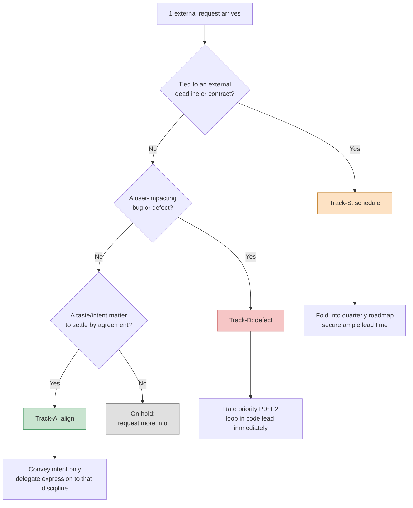

# 16.2 Collaborating with Other Disciplines — Sorting External Requests into 3 Tracks

On a Tuesday morning, the team messenger pinged three times almost at once.

Art lead: "The combat effect colors feel really drab right now — can we go brighter?"

QA lead: "There's a case where the guild attendance reward gets paid out twice. Repro video attached."

Publisher contact: "Please apply the Islamic-market cultural guidelines to the Southeast Asia build. Before next quarter's review."

The three messages were about the same length. But one was a 30-minute job, one was an incident that needed the code lead pulled in immediately, and one was an external schedule item that had to be slotted into the quarterly plan. Treat them with the same weight just because they landed in the same inbox, and you spend half a day on the 30-minute job while the actual incident sits untouched until evening.

The requests that reach a game designer differ in grain as much as the disciplines they come from. The problem is that they all arrive in the same shape: a one-line message. This chapter covers the work of splitting those one-liners into three tracks the moment they arrive. The moment the track is decided, so is what you stop right now and what you push to later.

---

## 16.2.1 Collaboration Decides the Core Work

A game designer doesn't write the code, paint the art, or compose the sound. We write specs, convey intent, and verify results. Every deliverable comes out through another discipline's hands. So the quality of collaboration directly determines the quality of design output.

On Project A — the mobile-first MMORPG I direct, with a mid-sized team (10–50 people) — the disciplines a designer collaborates with day to day look like this.

<svg viewBox="0 0 720 300" xmlns="http://www.w3.org/2000/svg" font-family="sans-serif" font-size="13">
  <rect x="300" y="120" width="120" height="60" rx="8" fill="#2b3a55" stroke="#1a2433"/>
  <text x="360" y="146" fill="#fff" text-anchor="middle" font-weight="bold">Game designer</text>
  <text x="360" y="166" fill="#cdd6e5" text-anchor="middle" font-size="11">40–60% of time</text>

  <g fill="#e8edf5" stroke="#9fb0c9">
    <rect x="40" y="30" width="130" height="44" rx="6"/>
    <rect x="40" y="100" width="130" height="44" rx="6"/>
    <rect x="40" y="170" width="130" height="44" rx="6"/>
    <rect x="40" y="240" width="130" height="44" rx="6"/>
    <rect x="550" y="30" width="130" height="44" rx="6"/>
    <rect x="550" y="100" width="130" height="44" rx="6"/>
    <rect x="550" y="170" width="130" height="44" rx="6"/>
  </g>
  <g fill="#1a2433" text-anchor="middle">
    <text x="105" y="50">Dev (code/tools)</text><text x="105" y="66" font-size="10" fill="#5a6a82">Daily</text>
    <text x="105" y="120">Art</text><text x="105" y="136" font-size="10" fill="#5a6a82">2–3× a week</text>
    <text x="105" y="190">Sound</text><text x="105" y="206" font-size="10" fill="#5a6a82">1–2× a week</text>
    <text x="105" y="260">Animation</text><text x="105" y="276" font-size="10" fill="#5a6a82">1–2× a week</text>
    <text x="615" y="50">QA</text><text x="615" y="66" font-size="10" fill="#5a6a82">Weekly + MS</text>
    <text x="615" y="120">Live ops & CS</text><text x="615" y="136" font-size="10" fill="#5a6a82">Weekly</text>
    <text x="615" y="190">Publisher/platform</text><text x="615" y="206" font-size="10" fill="#5a6a82">1–2× a quarter</text>
  </g>

  <g stroke="#9fb0c9" stroke-width="1.2" fill="none">
    <path d="M170 52 C 240 90, 270 120, 300 135"/>
    <path d="M170 122 C 230 130, 260 140, 300 148"/>
    <path d="M170 192 C 230 175, 260 162, 300 158"/>
    <path d="M170 262 C 240 210, 270 180, 300 170"/>
    <path d="M550 52 C 480 90, 450 120, 420 135"/>
    <path d="M550 122 C 490 130, 460 142, 420 150"/>
    <path d="M550 192 C 490 175, 460 162, 420 160"/>
  </g>
</svg>

Seven disciplines, meshing at rhythms from daily to quarterly. 40–60% of a designer's desk time goes into this collaboration. The core work — design itself — gets roughly the other half. Which means cutting collaboration time is the same thing as growing core-work time. And the biggest drain on collaboration time is failing to classify incoming requests and pouring energy into the wrong place.

---

## 16.2.2 The Three Grains Hidden in a One-Line Request

Back to the three messages. On the surface they all read "please do X." Underneath, three different natures are hiding.

- The art lead's color request belongs to the **territory of taste and intent**. It is not a matter of right and wrong but of agreement. Almost no code or schedule negotiation is involved.
- QA's duplicate-reward bug is a **defect to handle immediately**. It directly touches user assets, so the priority is high and the code lead needs to be on it right away.
- The publisher's guideline request is a **change bound to an external schedule**. The scope is broad, there is an external deadline — the quarterly review — and multiple disciplines are involved.

I call each of these three grains by one word: **align**, **defect**, **schedule**. The work of pushing every incoming request into one of these three first is something we have codified on Project A as a workflow named `request-triangulate`. The name comes from triangulation: you fix the position of one point (the request) by surrounding it with three reference points (the nature of the discipline, urgency, external dependency).

The classification flow looks like this.



The **order** of the questions is the point. Schedule dependency is asked first because, for anything tied to an external deadline, lead time outranks internal judgment. Classify a task whose quarterly review is 3 weeks away as "we'll align on it later," and by the time alignment ends the deadline is on top of you. Defects come second because anything already affecting users always outranks taste discussions. Alignment comes last. Only when something is not urgent, not bound to an external party, and not hurting users does "let's take our time and align" become legitimate.

If all three questions come back "no," that is not a classification failure — it is **missing information**. Don't force a track; put it on hold and ask back. One sentence like "Does this have to make the next build, or is a review enough for now?" usually settles the track.

---

## 16.2.3 Worked Transcript: Splitting the Inbox into Tracks

Do this classification only in your head and it collapses on a busy day. So I run it differently: throw the whole batch of incoming requests at the AI for a first-pass classification, then verify and correct the result. Below is one actual run, reproduced almost verbatim. No summarizing — the parts the AI got wrong and the parts I rejected are left in.

### The Full Prompt

```text
Classify the external requests below into three tracks — Track-S (schedule: tied to external deadlines, contracts, reviews),
Track-D (defect: user-impacting bugs, rated P0~P2), Track-A (align: taste and intent, closed by agreement).
Check external dependency → user impact → taste/intent in that order and lock in the first track that matches;
if none match, put it on hold and give me 1 question to ask back.
Output per request: | Track | Rationale (1 line) | Next action (1 line) |.

[Request list]
1. Art lead: combat effect colors look drab. OK to go brighter?
2. QA lead: guild attendance reward paid out twice. Repro video available.
3. Publisher: apply cultural guidelines to the Southeast Asia build. Before next quarter's review.
4. Sound director: boss BGM intro lags combat start timing by 0.5 seconds.
5. Live ops team: many user reports saying "the guild chat font is too small."
```

### Claude's Raw Output

```text
| # | Track | Rationale | Next action |
|---|------|------|-----------|
| 1 | Track-A | Color tone is taste/intent territory; no external or bug angle | Convey only the intent (combat tension); delegate saturation to art |
| 2 | Track-D | Duplicate rewards = direct impact on user assets, reproducible | Rate P0, loop in code lead immediately, consider hotfix |
| 3 | Track-S | Tied to an external deadline: the quarterly review | Fold into quarterly roadmap; break guidelines into items, then estimate lead time |
| 4 | Track-A | BGM timing looks like a matter of directing taste | Align with the sound director |
| 5 | Track-D | Font readability is a UI defect | File as a P2 bug |
```

### Human Verification / Rejection

I stopped at #4 and #5.

**#4 rejected.** The AI read the BGM intro lag as directing taste (Track-A). But "lags combat start timing by 0.5 seconds" is not taste — it is a **synchronization defect**. It is most likely not the audio asset itself; the trigger point on the Behavior Tree (BT) and the audio cue have probably drifted apart. That can't be closed by agreement — it means touching timing data on the animation and code side. → **Corrected to Track-D.** P2, though, since no user assets are affected.

**#5 demoted to hold.** The AI jumped straight to UI defect (Track-D) on "the font is too small." But whether that is a defect or taste can't be settled from the message alone. If the font renders exactly to design spec and merely *feels* small, that is closer to align (Track-A); if it is rendering broken, smaller than spec, that is a defect (Track-D). → **On hold. Asked live ops back:** "Does it actually render smaller than the spec font size, or is this a request to raise the spec itself?"

### Re-request

The added instruction in the re-thrown prompt, reflecting the two rejections, was short.

```text
Reclassify #4 — '0.5s lag behind combat start' — as a synchronization defect (Track-D, P2).
Append 1 question to pin down where the timing slipped: the BT trigger or the audio cue.
Put #5 on hold, and state a question asking whether it is 'actual render vs. spec.'
```

The re-run came back with #4 corrected to `Track-D / P2 / "check whether the audio cue offset on the BT combat-start node is 0, or whether the BGM clip itself includes 0.5 seconds of leading silence"` and #5 to `On hold / "reconfirm with live ops: rendering smaller than spec vs. a request to raise the spec itself"`. At that point the classification was complete.

What the AI did and what the human did split cleanly here. The AI distributed all five requests in one fast pass and produced a **table with no empty cells**. The human caught the **two cases sitting on a blurry track boundary** — the BGM that looks like taste but is a synchronization defect, and the font that looks like a defect but may be taste. Filling five cells without gaps and noticing that two of them are filled wrong are different abilities, and this worked transcript hands each to the side that does it better.

---

## 16.2.4 Each Track Demands a Different Hand

Once classification ends, each track enters entirely different follow-up work. They start from the same table but arrive at different places.

Requests classified **Track-A (align)** are handled by the principle "convey the intent, delegate the expression." My reply to the art lead's color request was not a saturation value but an intent: "This fight is boss phase 1, so tension is the core. I'd rather have pressure than brightness. Within that, saturation is art's call." The moment a designer specifies the saturation value directly, art's autonomy shrinks and accountability for the result blurs. Guarding the boundary between intent and expression is the whole of the align track.

Requests classified **Track-D (defect)** lead to priority rating and a code connection. The duplicate guild reward (P0) went to the code lead on the spot; the BGM sync issue (P2) was filed to the backlog with a cause-hypothesis question attached. On the defect track, the designer's job is not to fix things but to **rate the priority and supply precise input**. The line between P0 and P2 is "does this affect user assets or progression right now?" Duplicate rewards touch assets directly, so P0; a 0.5-second BGM lag is unpleasant but blocks nothing, so P2.

Requests classified **Track-S (schedule)** go into the quarterly roadmap. The publisher's cultural guidelines arrived as a one-liner but in practice decompose into multiple items — depiction of religious symbols, color taboos, text direction, character costume. The key is to answer "we'll review it" the moment it arrives and put the whole thing onto the quarterly plan. For anything carrying an external deadline, however small it looks, lead time is everything; start late and it blows up without exception.

Side by side, the three branches compare like this.

<svg viewBox="0 0 720 240" xmlns="http://www.w3.org/2000/svg" font-family="sans-serif" font-size="13">
  <g>
    <rect x="20" y="30" width="210" height="180" rx="10" fill="#c9e4d0" stroke="#4f9d6a"/>
    <rect x="255" y="30" width="210" height="180" rx="10" fill="#f6c6c6" stroke="#c25151"/>
    <rect x="490" y="30" width="210" height="180" rx="10" fill="#fde2c4" stroke="#c98a3a"/>
  </g>
  <g text-anchor="middle" font-weight="bold" fill="#1a2433">
    <text x="125" y="58">Track-A · Align</text>
    <text x="360" y="58">Track-D · Defect</text>
    <text x="595" y="58">Track-S · Schedule</text>
  </g>
  <g text-anchor="start" fill="#23303f" font-size="12">
    <text x="38" y="92">Triage question</text>
    <text x="38" y="112" fill="#3c5a45">Taste or intent?</text>
    <text x="38" y="142">Designer's job</text>
    <text x="38" y="162" fill="#3c5a45">Convey intent only,</text>
    <text x="38" y="180" fill="#3c5a45">delegate expression</text>

    <text x="273" y="92">Triage question</text>
    <text x="273" y="112" fill="#7a2e2e">User-impacting bug?</text>
    <text x="273" y="142">Designer's job</text>
    <text x="273" y="162" fill="#7a2e2e">Rate P0–P2,</text>
    <text x="273" y="180" fill="#7a2e2e">loop in code lead</text>

    <text x="508" y="92">Triage question</text>
    <text x="508" y="112" fill="#7a5320">External deadline?</text>
    <text x="508" y="142">Designer's job</text>
    <text x="508" y="162" fill="#7a5320">Break into items,</text>
    <text x="508" y="180" fill="#7a5320">secure lead time</text>
  </g>
</svg>

Classify correctly and the same inbox's five lines scatter cleanly into three separate processing lines. Classify wrong and a defect gets dragged into an alignment meeting and eats the clock, or a schedule item starts late and explodes right before the deadline.

---

## 16.2.5 Collaborating by Isolating into a TF

Sometimes requests arrive not as one or two items but as a single mass — the weeks before a publisher review, or a phase like a full combat-system overhaul. In those moments, isolate the work itself into a temporary task force (TF) workspace like `95_BattleTF`, and when it ends, promote only the decisions back into the canonical docs. The isolation-and-absorption mechanism, and the operating rule of "hand the art team html only (zero md to learn)," were covered in full in the previous chapter, 16.1.

From the 3-track classification view, one line is enough to add. Collaboration that has grown into a mass is usually a Track-S (schedule) item decomposing across multiple disciplines, so when per-track handling can no longer absorb it, you move it into a container one level up: the isolated workspace. If 3-track classification is the entrance, TF isolation is the room that holds the large mass that came through it.

---

## 16.2.6 Common Failures and Remedies

| Failure pattern | Remedy |
|---|---|
| Treating every request with the same weight | Run the 3-track classification on arrival; ask about external dependency first |
| Misclassifying a schedule item as align | Pin the external-deadline question as triage question number 1 |
| Handling a synchronization defect that looks like taste as align | For any "timing/value mismatch," suspect a defect first |
| Declaring taste that looks like a defect a defect | Ask back "is it rendering off-spec?" and put it on hold |
| The designer deciding the expression on the align track | Intent only; delegate expression to the discipline |
| Starting schedule items late | Fold into the quarterly roadmap immediately; secure lead time |

Half of this table is mistakes at the classification stage; half is mistakes in handling after classification. Even an accurate classification loses its effect if the per-track hand is wrong. (For pitfalls around TF isolation, promotion, and media, see the pitfall table in 16.1.)

---

### Key Takeaways

- External requests split into three tracks — align, defect, schedule — and treating them with the same weight means spending half a day on a 30-minute job.
- The triage order is external deadline → user impact → taste; get the order wrong and schedule items explode right before the deadline.
- AI is strong at a gap-free first-pass distribution; humans are the accurate ones at judging track boundaries.

---

> **Beyond Games.** The problem of one-line requests being treated with the same weight just because they landed in the same inbox is not a game thing — it is the everyday reality of every product manager and service designer. The classification that splits incoming requests into the three tracks "align (taste/direction), defect (user-impacting bug), schedule (external deadline)" works unchanged across domains. Say a web service PM's messenger receives, all at once, "make the button color a bit brighter" (align), "payment receipts are being sent twice" (defect), and "privacy-law amendment compliance, deadline 3 weeks out" (schedule): check external deadline → user impact → taste in that order, drop each into the first track that matches, put people on the payment bug immediately, and start the legal change by securing lead time.

---

### Try It Yourself

**Minimal path with a web chatbot (no terminal)** — the core of this chapter is not the workflow script but the idea: split one-line requests into the three tracks of align, defect, and schedule. That idea reproduces as is in a web chatbot (ChatGPT or Claude on the web), with no CLI, hook, or atom infrastructure. The two steps below are the main line.
1. Collect the day's incoming requests, one line each, in no particular format. Scrape them from messengers, email, memos — anywhere.
2. Paste the prompt below into the chatbot's input box, then paste your collected request list beneath it. This is doing by hand, once, the first-pass classification that `request-triangulate` used to do.
   ```
   Classify the requests below into Track-A (align) / Track-D (defect) / Track-S (schedule).
   Check external deadline → user-impacting bug → taste/intent in that order and lock in the first track that matches;
   if none match, put it on hold and give me 1 question to ask back. Output: | Track | Rationale, 1 line | Next action, 1 line |.
   [Paste request list]
   ```
   Then verify just two cells of the output table yourself — if a "timing/value mismatch" got classified as align, suspect a synchronization defect; and if a felt complaint like "X is too small/slow" got declared a defect, ask back "is it rendering off-spec?" and demote it to hold. Bring in scripts and workflows only when this classification is second nature and the daily batch becomes too heavy to do by hand.

**setup.** Gather incoming external requests in one place (a channel or a document). Write down the three track definitions, one line each — align (taste/intent), defect (user-impacting bug), schedule (external deadline).

**prompt.** Throw the collected batch at the AI and pin the triage order.

```text
Classify the requests below into Track-A (align) / Track-D (defect) / Track-S (schedule).
Check external deadline → user-impacting bug → taste/intent in that order and lock in the first track that matches;
if none match, put it on hold and give me 1 question to ask back. Output: | Track | Rationale, 1 line | Next action, 1 line |.
[Paste request list]
```

**verify.** Verify two spots in the output table yourself. (1) If a "timing/value mismatch" was classified as align, suspect a synchronization defect. (2) If a felt complaint like "X is too small/slow" was declared a defect, ask back "is it rendering off-spec?" and demote it to hold. Catch just those two boundary cases by hand and you can trust the rest.

### Solo Scale-Down

If you are a solo developer with no team and no TF, keep the tracks and swap only the inputs. Collect store reviews, Discord reports, and beta tester notes in one document, and batch-classify them once a week with the prompt above. For align (taste): accept it if it doesn't conflict with your vision. For defects (bugs): handle them that week. For schedule (store review, event deadlines): enter them in your calendar with the lead time attached. For running an isolation folder during a focused cleanup period, follow the Solo Scale-Down in 16.1.
