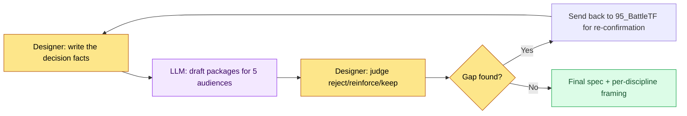

# 16.3 One Decision, Three Packages — Framing Deliverables by Discipline

The 95_BattleTF meeting room. On the afternoon we locked the guild attendance reward at resources +5, I sent that same single decision down three channels: a spec in markdown to the design team's channel, a single data column to the programming team, a one-screen html to the art team. Replies came back from all three almost at once. The programming lead asked where the trigger fired, the art director asked whether the attendance button's position matched the 06_UI guide, and the animator said nothing. It was the same decision, and what the three of them saw was entirely different.

This chapter is the record of turning that "seeing differently" from an accident into a design. Packaging one decision differently for each discipline — that is framing.

---

## 16.3.1 Five People Read the Same Decision Differently

Five audiences attach themselves to a single guild attendance reward decision. Even when they read the same sentence, each picks out only their own territory and lets the rest slide. The accidents happen where things slide.

| Audience | What They Read Closely | What They Instinctively Skip |
|---|---|---|
| Code lead | Data columns, interfaces, trigger timing | Color, narrative, presentation |
| Art director | Screen layout, components, style guide | Data integrity, triggers |
| Sound director | Action triggers, mood, duration | Data details |
| Animator | Motion, timing, state transitions | Visual tone, numbers |
| QA | Acceptance criteria, risks, edge scenarios | Implementation internals |

The problem is not the amount of information but the way it is exposed. Put one thick spec on five desks identically, and the five will each open a different page and close a different page. Framing takes that opening out of chance and arranges it deliberately.

Below is a framing matrix showing how one decision changes clothes as it crosses discipline boundaries.

<svg viewBox="0 0 720 360" xmlns="http://www.w3.org/2000/svg" role="img" aria-label="Framing matrix: one decision splitting into per-discipline deliverables">
  <rect x="0" y="0" width="720" height="360" fill="#fbfbfd"/>
  <!-- source decision -->
  <rect x="270" y="20" width="180" height="52" rx="8" fill="#1f2d3d"/>
  <text x="360" y="42" text-anchor="middle" fill="#ffffff" font-family="sans-serif" font-size="14" font-weight="bold">Decision: attendance reward = resources +5</text>
  <text x="360" y="60" text-anchor="middle" fill="#aeb9c6" font-family="sans-serif" font-size="11">95_BattleTF / single fact</text>
  <!-- arrows -->
  <line x1="360" y1="72" x2="120" y2="140" stroke="#9aa7b4" stroke-width="1.5"/>
  <line x1="360" y1="72" x2="360" y2="140" stroke="#9aa7b4" stroke-width="1.5"/>
  <line x1="360" y1="72" x2="600" y2="140" stroke="#9aa7b4" stroke-width="1.5"/>
  <!-- three framings -->
  <rect x="30" y="140" width="180" height="86" rx="8" fill="#e8f0fe" stroke="#4a73b8" stroke-width="1.5"/>
  <text x="120" y="162" text-anchor="middle" fill="#1f2d3d" font-family="sans-serif" font-size="13" font-weight="bold">Design → markdown</text>
  <text x="120" y="182" text-anchor="middle" fill="#33414f" font-family="sans-serif" font-size="11">Full intent, rules, rationale</text>
  <text x="120" y="200" text-anchor="middle" fill="#33414f" font-family="sans-serif" font-size="11">Includes context to study</text>
  <text x="120" y="218" text-anchor="middle" fill="#7a8794" font-family="sans-serif" font-size="10">spec_guild_attendance.md</text>

  <rect x="270" y="140" width="180" height="86" rx="8" fill="#fdeee8" stroke="#b8674a" stroke-width="1.5"/>
  <text x="360" y="162" text-anchor="middle" fill="#1f2d3d" font-family="sans-serif" font-size="13" font-weight="bold">Art → html</text>
  <text x="360" y="182" text-anchor="middle" fill="#33414f" font-family="sans-serif" font-size="11">One screen: layout, components</text>
  <text x="360" y="200" text-anchor="middle" fill="#33414f" font-family="sans-serif" font-size="11">Zero md to study (handoff only)</text>
  <text x="360" y="218" text-anchor="middle" fill="#7a8794" font-family="sans-serif" font-size="10">guild_screen_v3.html</text>

  <rect x="510" y="140" width="180" height="86" rx="8" fill="#e8f6ec" stroke="#4a9a5e" stroke-width="1.5"/>
  <text x="600" y="162" text-anchor="middle" fill="#1f2d3d" font-family="sans-serif" font-size="13" font-weight="bold">Programming → data</text>
  <text x="600" y="182" text-anchor="middle" fill="#33414f" font-family="sans-serif" font-size="11">Column, interface, trigger</text>
  <text x="600" y="200" text-anchor="middle" fill="#33414f" font-family="sans-serif" font-size="11">Verification lint items specified</text>
  <text x="600" y="218" text-anchor="middle" fill="#7a8794" font-family="sans-serif" font-size="10">guild_table 1 row</text>
  <!-- invariant band -->
  <rect x="30" y="262" width="660" height="72" rx="8" fill="#ffffff" stroke="#c7ced6" stroke-width="1.2"/>
  <text x="360" y="286" text-anchor="middle" fill="#1f2d3d" font-family="sans-serif" font-size="12" font-weight="bold">Invariant facts (what all three packages must preserve)</text>
  <text x="360" y="308" text-anchor="middle" fill="#33414f" font-family="sans-serif" font-size="11">Value = +5 · Timing = first login of the day · Scope = every guild member</text>
  <text x="360" y="326" text-anchor="middle" fill="#7a8794" font-family="sans-serif" font-size="10">Packages may differ — if these three values diverge, framing has failed</text>
</svg>

The packaging differs per audience, but the invariant facts laid underneath — value, timing, scope — must not waver in any of the packages. The craft of framing is not "showing things differently"; it is "showing things differently while preserving the same thing."

---

## 16.3.2 Worked Transcript — One Decision into Three Packages

Hand-molding the framing from scratch every time is enough of a burden that it eventually stops happening. So I throw in one decision and receive draft packages for every discipline in a single pass. Below is the actual exchange over the guild attendance reward decision, transcribed as is, unpolished.

### Full Prompt

```
[Decision facts — confirmed in 95_BattleTF]
- Guild attendance reward = guild resources +5
- Trigger: once, when a guild member logs in for the first time that day
- Scope: every member of that guild, individually
- UI: resource total displayed at the top of the guild screen + an "Attendance" button

Package this one decision for three disciplines.
For design, markdown covering intent, rules, and data impact; for art, the screen spec going into the html,
centered on layout, components, and style guide references (no mention of data or triggers);
for programming, one data row, the interface, the trigger, and verification items.
Bake the invariants (+5, once on first login, every guild member) identically into all three packages,
and don't make up unknown values — mark them [needs confirmation].
```

### Claude's Raw Output (No Summarizing, No Cleanup)

```
1) Design → markdown

## Guild Attendance Reward
- Intent: convert one login per day into a guild-level cooperative resource to lift retention.
- Rule: guild resources +5 when a guild member logs in for the first time that day. Once per day. Accumulates at the guild level.
- Data impact: guild_resource_total increases. Resource inflation needs monitoring [needs confirmation: cap undecided].

2) Art → screen spec (content for the html)
- Resource total displayed in the top area of the guild screen (progress_bar + number badge).
- "Attendance" button on the right. State changes on press follow the button state rules in the 06_UI guide.
- Style: conforms to the 06_UI guide. Colors: [needs confirmation: guild theme color tokens unspecified].
- (Data values and triggers intentionally excluded from this package)

3) Programming → data/interface
- Data: add a column to guild_table — guild_resource_total (int, default 0)
- Interface: GuildResourceManager.add(guild_id, amount)
- Trigger: call add(guild_id, 5) once from the daily first-login event hook
- Verification: integrity_check_guild_resource (no negative values / block calls beyond once per day)
- Concurrency: duplicate grants when the same guild member logs in on multiple devices at once [needs confirmation]
```

### Human Verification and Rejection

I did not use the raw output as is. I caught three things.

- **Rejected**: the sentence in the art package, "State changes on press follow the button state rules in the 06_UI guide." The 95_BattleTF principle is that the art team is handed only the html and never made to study the md, so a guide-reference line provokes a jump to an external document. We decided to inline the state examples so everything closes within the single screen.
- **Reinforcement required**: the two `[needs confirmation]` items in the programming package (the resource cap, duplicate grants across devices) are gaps that were absent from the decision facts. The AI was right to flag them instead of making them up, but these are holes in the decision itself, prior to framing — they have to go back to 95_BattleTF.
- **Kept**: the three invariants (+5, once on first login, every guild member) were entered consistently across all three packages. That part I did not touch.

### Re-request

```
Revise the art package:
- Remove every external-document reference phrase like "follows the 06_UI guide."
- Describe the visual differences of the button's three states — pressed/idle/done — directly in the screen spec.
- Make it self-contained, on the assumption that the art team works from this one page alone, with no jumps to other documents.

Drop the 2 [needs confirmation] items from the programming package's deliverable,
and pull them out into an "Items for 95_BattleTF re-confirmation" block at the top.
```

That single rejection and re-request put the deliverables into a form each of the three disciplines could pick up and use right where they sat. The AI molded three draft packages and even flagged the gaps, but the scissor work — deciding what to trim from which package, pulling the external references out of the art package and the unconfirmed items out of the programming package — stayed in my hands to the end. The core judgment in framing lies on the side of exclusion, not inclusion.

---

## 16.3.3 Three Framing Methods and When They Pay Off

The method splits on where you put the packaging. Which of the three to use is decided by the size of the spec and your operational stamina.

**(1) Per-audience summaries inside one document.** Append per-discipline summary sections after the body. Five people share one file, but each reads only their own section.

```markdown
## Per-Audience Summary

### Code (Implementation)
- Data: guild_table.guild_resource_total (int)
- Interface: GuildResourceManager.add(guild_id, amount)
- Trigger: once on first login of the day
- Verification: integrity_check_guild_resource

### Art (Visual)
- Screen: resource total at the top of the guild screen + attendance button
- Components: progress_bar, badge, button (3 states)
- Priority: this milestone

### QA (Verification)
- Acceptance criteria: guild resources +5 applied after attendance; block anything beyond once per day
- Risks: resource inflation, duplicate grants on multiple devices
```

**(2) Separate deliverables per audience.** One body document, with per-discipline files split off on their own. The 95_BattleTF practice of sending the art team only the html and never the md is this method in production form — even for the same decision, the medium itself differs by discipline.

```
spec_guild_attendance.md     — design body (full context)
guild_screen_v3.html         — art (html only, zero md to study)
guild_table 1 row + add()    — programming (data/interface)
qa_guild_attendance.md       — QA (acceptance criteria, risks)
```

It suits large specs, and each medium goes straight into the discipline's own tools. In exchange, when one decision changes, several deliverables must be fixed together, so the operational burden is heavy.

**(3) A wikilink graph.** Put only the per-discipline entry points into the body as links, and let everyone explore down their own branch.

```
[[spec_guild_attendance]]
   ├── [[code_guild_table]]
   ├── [[ui_guild_screen_v3]]
   └── [[qa_guild_attendance]]
```

The costs and payoffs of the three methods are as follows. Among the figures below, the "effect" values are the author's estimate (unverified); trust only the direction and the relative ratios.

| Method | Cost | When It Pays Off |
|---|---|---|
| (1) Per-audience summaries | Around +30% body length | Pays off immediately on almost every spec |
| (2) Separate deliverables | Operating N sets of deliverables | Pays off only when the spec is large and the media differ by discipline |
| (3) Wikilink graph | Upfront investment in graph infrastructure | Pays off once specs accumulate and the graph itself is an asset |

For most specs, (1) is the right fit. It costs the least and pays off the fastest. Use (2) only where the media have already split, as with the art html, and switch on (3) once enough specs have piled up for the link graph to earn its exploration value.

---

## 16.3.4 Fix the Audience at Five

Redefining the audience for every spec means re-molding the framing every time. So I fix the codes.

| Audience Code | Domain |
|---|---|
| code | Code, systems, data |
| art | Art, visuals, UI |
| sound | Sound, audio |
| anim | Animation, motion |
| qa | QA, verification |

These five are the internal operating standard. External audiences such as outsourcing partners and legal are handled separately, outside this standard. Fixing the count at five means the audience definitions don't have to be rewritten each time framing is handed to an LLM, and a checklist can catch any audience that got dropped.

---

## 16.3.5 Automation and Its Pitfalls

Hand-writing five discipline summaries for every spec eventually means not writing them at all. So I bundled the flow like this.



The designer writes only the decision facts, the LLM produces the five draft packages, and the designer judges each piece: reject, reinforce, or keep. When a gap (`[needs confirmation]`) surfaces, it is not handled in framing but sent back to the decision stage — because framing is a tool for carrying a settled decision, not a tool for plugging the holes in one.

Here are the four pitfalls this cycle steps into repeatedly, each with its remedy.

| Pitfall | Symptom | Remedy |
|---|---|---|
| Duplicated information | The same content repeats across body and summaries, raising the upkeep burden | State it once in the body; summaries carry only what differs |
| Missing information | A value critical to one discipline drops out entirely | Check for omissions against the fixed five-audience checklist |
| Body ignored | People read only the summary and let the body's context slide | End each summary with "rationale is in the body" |
| Medium confusion | Sending md to art, imposing a study burden | Fix the discipline-medium principle (art = html) |

Automation lowers the writing burden to around five minutes per spec, but the reject-reinforce-keep judgment does not get automated along with it. That judgment is the human's seat.

---

## 16.3.6 Measurement — With Framing On

The following compares before and after introducing framing on Project A, which I run. The absolute figures are the author's estimate (unverified); what to trust is the direction of change and the relative ratios.

| Item | Without Framing | With Framing | Direction |
|---|---|---|---|
| Per-discipline misreading incidents | 15–20 per quarter | 3–5 per quarter | Sharp decrease |
| Time an audience spends reading a spec | 15–30 minutes | 5–10 minutes (own section only) | Decrease |
| Decision → work start | 1–2 days | 4–8 hours | Shortened |
| Cross-discipline interpretation conflicts | 8–12 per quarter | 2–3 per quarter | Decrease |
| Spec writing time | 1–2 hours | 1.5–2.5 hours (LLM-assisted) | Slight increase |

Writing the spec itself gets a little longer, because the per-discipline packaging is layered on top. But the discipline work cycles that follow get shorter, so the total time from decision to work start goes down. That trade-off is the core case for adopting framing. For a team that finds LLM-assisted review burdensome, the safe order is to first establish handwritten five-audience summaries under method (1), then layer automation on top.

---

> **Beyond Games.** Framing — packaging one decision differently per audience while preserving the invariant facts (value, timing, scope) everywhere — carries straight over to announcement and release communication in any organization, not just games. Say you decide one thing: raise the subscription fee to 9,900 won (about $7), effective July 1. For the development team it is packaged as data, the billing table column and the effective date; for the design team, a single announcement banner screen; for customer support, a response script for anticipated inquiries. The three packages all differ, but the moment the three numbers — 9,900 won, July 1, all new and existing subscribers — diverge in any package, a customer dispute erupts on the spot.

---

## 16.3.7 Try It Yourself

**setup**

- Enter the five discipline audiences (code, art, sound, anim, qa) into your team wiki as a fixed definition.
- Set a medium principle per discipline (e.g., art = html, programming = data row, design = md).
- Prepare one spec in decision-facts form (state the invariants: value, timing, scope).

**prompt**

```
[Decision facts]
(one line each for value, timing, and scope)

Package this decision for the relevant disciplines among code, art, sound, anim, and qa.
In each package, drop the information that discipline doesn't care about, but bake the invariants (value, timing, scope) identically into every package.
Make the art package self-contained on its single page with no references to other documents, and don't make up unknown values — mark them [needs confirmation].
```

**verify**

- Compare the packages line by line to confirm the invariants (value, timing, scope) all match.
- If a `[needs confirmation]` remains, send it back to the decision stage (a task force like 95_BattleTF), not to framing.
- If any external-document reference phrases remain in the art package, remove them.

**Solo Scale-Down**

If you work alone, cut the audience down to two — "future me" (implementation) and "the reviewer" (QA). Write one line of decision facts, ask the LLM to "split this into an implementation memo and a review checklist," and then just check that the key numbers match across the two. Even with only two audiences, the skeleton of framing — package the same decision differently while preserving the invariants — works exactly the same.

---

### Key Takeaways
- Packaging the same decision differently per discipline while preserving the invariants is the essence of framing
- The core judgment in framing is not what to put in, but what to take out of which package
- The LLM provides the draft packages and even the gap flags; the reject-reinforce-keep judgment belongs to the human
