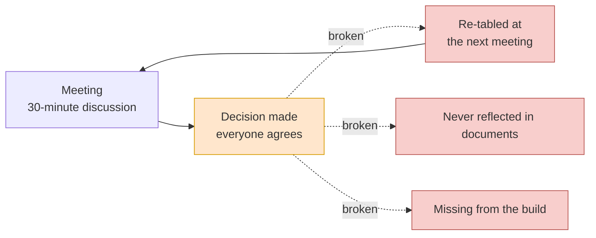
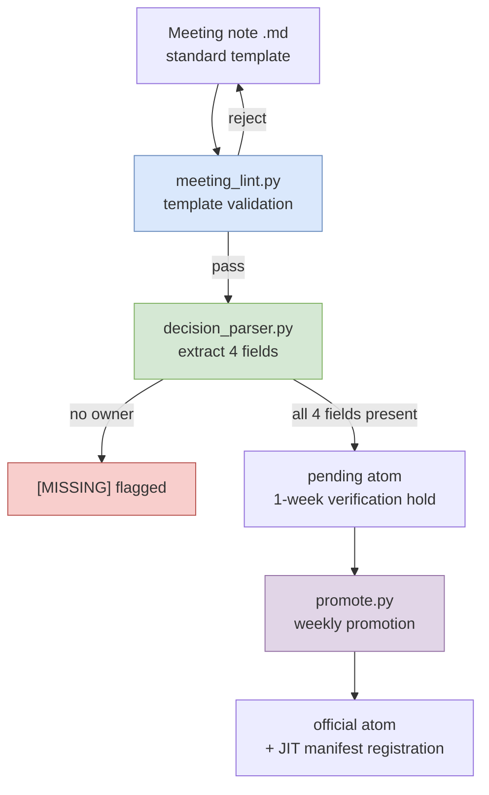

# 17.1 Why Meeting Notes Are the Biggest Pain

Five minutes after the meeting ended, the whiteboard in the meeting room still had the writing on it: "Combat hit detection goes client-side first. But server validation priority moves to the next sprint." A conclusion five people spent 30 minutes reaching. Everyone nodded, and someone took a photo.

Three weeks later, the same five people gathered in the same meeting room. The first line of the agenda read: "Combat hit detection — client-side first vs. server validation. Decision needed." Nobody remembered the conclusion from three weeks earlier. The whiteboard photo was somewhere in someone's camera roll, and that someone was on vacation that day. Another 30 minutes were spent. This time the conclusion came out the opposite way.

That is the entire reason meeting notes are the biggest pain. Decisions do get made in meetings. But those decisions fail to **propagate** to the next meeting, the next document, the next build. The decision happened; the propagation did not. This chapter is the story of reconnecting that broken link with data.

---

## 17.1.1 Meeting → Decision → Execution: Where It Breaks

The personal R&D system I run is split across 17 documents — an atom naming standard, relationship-map automation, a Layer mapping guide, JIT injection infrastructure, and so on. The single document that has absorbed the most time among them is the meeting-notes improvement plan. Its weight is comparable to the other 16 combined.

At first this puzzled me. Meeting notes — don't you just write down what was said? But when I measured, the pain was located not in *writing* meeting notes but in what happens *after* them. Decisions were clearly made in the meeting. The problem was that the moment we walked out the meeting room door, it all evaporated — whose responsibility the decision was, on what grounds, by when, and what it led to.

Drawn as a single scene, the break looks like this.



The dotted lines are the broken propagation. The decision (orange) was made, but it flows to none of the three branches (red). A decision that fails to flow comes back as a meeting three weeks later. That loop — the arrow bending upward and returning to the meeting — is the body of the pain.

When propagation breaks, four things happen at once.

You lose the history of decisions. "Why did we decide that?" gets answered with "Nobody remembers, so let's schedule another meeting." Repeat meetings multiply. The same agenda item gets re-tabled every quarter. New joiners cannot pick up context. Because the accumulation of decisions is invisible, you have to explain it 1:1 every single time. And AI assistance goes limp. With no context, the answers stay generic. If your meeting notes are scattered, you cannot hand the AI "how our team decided this item before," and the AI returns the internet's average.

All four grow from the same root. **Decisions are treated as memos, not as data.** Memos evaporate; data flows.

---

## 17.1.2 Treat Meeting Notes as a Decision Database, Not a Deliverable

Here you have to flip your perspective once. If you see meeting notes as "the deliverable of a meeting," then writing them down and filing them completes the mission. A filed meeting note is like a memo slip on your desk: visible that day, gone who-knows-where the next week.

If you see meeting notes as a "decision database," it becomes a completely different job. The asset is not the meeting note itself but the **decisions** extracted from it, and those decisions must be searchable, referenceable, and propagatable. The meeting note is merely the ore vein you draw decisions up from.

Enforcing this shift in code is the backbone of all of Part 17. My system carries one atom that props up this shift. Its name is `decision_summary_not_clickup_mirror`. Spelled out, it is the principle that "the decision summary in meeting notes is not a mirror of ClickUp (our task tracker)."

Why this atom was needed strikes the dead center of the pain. Many teams simply copy the decision slot of their meeting notes onto the task board. Then the "to-do" survives, but the "why we decided that (the rationale)" disappears. A task tracker holds *what to do*, not *why it was decided*. This is exactly why the meeting repeats three weeks later. The tasks were closed, but with no rationale, when someone asks "wait, why did we decide to do it this way?" there is no one who can answer. So the decision summary must not become a mirror of the tracker; it has to be an independent asset that carries its rationale. The atom name itself is that line you do not cross.

---

## 17.1.3 Split a Decision into Four Fields

The difference between a decision that propagates and a decision that evaporates lies in structure. A decision that evaporates is a single sentence: "we go client-side first." A decision that propagates decomposes into four fields.

<svg viewBox="0 0 720 300" xmlns="http://www.w3.org/2000/svg" font-family="sans-serif">
  <rect x="0" y="0" width="720" height="300" fill="#fbfbfb" stroke="#ddd"/>
  <text x="360" y="32" font-size="17" font-weight="bold" text-anchor="middle" fill="#333">1 decision = 4 fields</text>
  <!-- decision -->
  <rect x="30" y="60" width="310" height="80" rx="6" fill="#dae8fc" stroke="#6c8ebf"/>
  <text x="46" y="86" font-size="14" font-weight="bold" fill="#1f3a5f">decision</text>
  <text x="46" y="108" font-size="12" fill="#333">What was decided</text>
  <text x="46" y="128" font-size="11" fill="#666">"Hit detection client-side first"</text>
  <!-- owner -->
  <rect x="380" y="60" width="310" height="80" rx="6" fill="#d5e8d4" stroke="#82b366"/>
  <text x="396" y="86" font-size="14" font-weight="bold" fill="#2d5016">owner</text>
  <text x="396" y="108" font-size="12" fill="#333">Who is accountable</text>
  <text x="396" y="128" font-size="11" fill="#666">Team member A ([MISSING] if empty)</text>
  <!-- rationale -->
  <rect x="30" y="160" width="310" height="80" rx="6" fill="#ffe6cc" stroke="#d79b00"/>
  <text x="46" y="186" font-size="14" font-weight="bold" fill="#7a4f00">rationale</text>
  <text x="46" y="208" font-size="12" fill="#333">Why it was decided</text>
  <text x="46" y="228" font-size="11" fill="#666">"Perceived responsiveness first; accept cheating risk"</text>
  <!-- follow_up -->
  <rect x="380" y="160" width="310" height="80" rx="6" fill="#e1d5e7" stroke="#9673a6"/>
  <text x="396" y="186" font-size="14" font-weight="bold" fill="#4a2d5f">follow_up</text>
  <text x="396" y="208" font-size="12" fill="#333">What it leads to</text>
  <text x="396" y="228" font-size="11" fill="#666">"Server validation task next sprint"</text>
  <!-- caption -->
  <text x="360" y="278" font-size="12" text-anchor="middle" fill="#555">If owner is empty, the pipeline flags [MISSING] — enforcing the line of accountability for propagation</text>
</svg>

Of the four fields, the most important is `owner`. A decision without an owner is nobody's job, and a decision that is nobody's job does not propagate into execution. That is why my extraction pipeline does not just move on when owner is empty — it explicitly flags `[MISSING]`. The very fact that the line of accountability is empty gets pulled up to the surface.

`rationale` is where the `decision_summary_not_clickup_mirror` principle lives. Without the rationale, the meeting repeats three weeks later. `follow_up` is the bridge that carries the decision into actual execution. If this field is empty, the decision remains only a decision and never reaches the build.

---

## 17.1.4 The Extraction Pipeline — Drawing Decisions Up from Meeting Notes

A person could fill these four fields by hand every time, but then the enforcement is weak. My system uses a pipeline that automatically extracts decisions from meeting notes and flags missing fields. Three scripts connect in series.



The first stage, `meeting_lint.py`, checks whether the meeting note follows the standard template: is the frontmatter there, are the four slots (agenda/decisions/actions/next meeting) filled in? A note with a broken template is rejected here and returned to its author. An automatic parser can only process input whose format is enforced, so this lint acts as the entry gate for the whole pipeline.

The second stage, `decision_parser.py`, is the core. It reads the decision slot and decomposes it into the four fields (decision/owner/rationale/follow_up). When it cannot find an owner, it does not discard the decision — it flags it as `[MISSING]`. Quietly letting an ownerless decision pass is the most dangerous thing you can do.

The third stage is that an extracted decision does not immediately become an official asset; it waits one week in `pending` status. This verification period is a reversible gate. If within that week it turns out that "this was a discussion, not a decision" or "the rationale was wrong," it gets discarded. Then `promote.py` moves only the decisions that survived the weekly review into the official atom folder and registers them in the JIT manifest. From the next session on, a registered decision is automatically injected into related work. At last, the decision begins to flow.

The boundary between reversible and irreversible sits right here. Up to a pending discard, everything is reversible. But once promote completes and the decision has propagated into other documents, data sheets, and builds, from that point it is irreversible — teammates' understanding changes and dependent decisions stack on top of it. So all review must finish just before promote, that is, inside the pending reversible window.

---

## 17.1.5 Worked Transcript — Running One Broken Meeting Note Through

Speaking only in the abstract does not land, so here is the record, copied as is, of actually feeding one broken meeting note into the pipeline. The input is a meeting note whose format is about half collapsed.

**Input — `2026-06-02-battle.md` (bad format)**

```markdown
---
type: meeting_note
date: 2026-06-02
category: battle
---

## Agenda
1. Hit detection location (client vs. server)

## Decisions
- Hit detection will be applied client-side first. The prevailing view:
  perceived responsiveness matters more than the server round trip. Accept the cheating risk.
- Server validation goes to the next sprint as a separate task.

## Action Items
- [ ] Design server validation
```

This note did record the decisions, but owner appears nowhere. Who takes server validation is blank. The next-meeting schedule slot is missing entirely. I fed it to the parser and watched what came out.

**Prompt (the full LLM-assist prompt attached to decision_parser.py)**

```
Read the "## Decisions" slot of the meeting note below and extract
4 fields for each decision: decision, owner, rationale, follow_up.
- If the owner cannot be identified in the text, you must write "[MISSING]".
  Do not fill it in by guessing.
- For rationale, quote only the grounds written in the text. If none, "[MISSING]".
- Link follow_up to the action items or any next-sprint mentions.
Output only a JSON array.

[meeting note body pasted here]
```

**Claude's raw output (as is, not summarized)**

```json
[
  {
    "decision": "Apply hit detection client-side first",
    "owner": "[MISSING]",
    "rationale": "Perceived responsiveness matters more than the server round trip. Cheating risk accepted",
    "follow_up": "Proceed with server validation as a separate task in the next sprint"
  },
  {
    "decision": "Split server validation into a separate task for the next sprint",
    "owner": "[MISSING]",
    "rationale": "[MISSING]",
    "follow_up": "Linked to the action item 'Design server validation' (owner unassigned)"
  }
]
```

I stopped here and reviewed the output. Both decisions came back with owner as `[MISSING]`. Correct — there was no owner anywhere in the note, so not filling it in by guesswork is the right behavior. The second decision's rationale is also `[MISSING]`, and in fact the text contained no grounds for the second decision. That means the parser did not make anything up, which earns trust.

One spot was ambiguous, though. The first decision's follow_up — "server validation in the next sprint" — overlaps with the body of the second decision. The parser saw the boundary between the two decisions a little blurrily. This is where a human steps in.

**Human veto + re-request**

```
The first decision's follow_up duplicates the body of the second decision.
Narrow the first decision's follow_up to "create the server validation task,"
and move the specifics of server validation over to the second decision.
Also, since both decisions have owner [MISSING],
prepend a warning line at the very top of the output saying that owner
confirmation is required before this meeting note goes up to pending.
```

**Claude's re-output (raw)**

```
⚠️ Warning: both decisions have owner [MISSING]. Owner confirmation
   from the meeting facilitator is required before pending promotion.

[
  {
    "decision": "Apply hit detection client-side first",
    "owner": "[MISSING]",
    "rationale": "Perceived responsiveness first; cheating risk accepted",
    "follow_up": "Create server validation task (details in decision #2)"
  },
  {
    "decision": "Split server validation into a separate task for the next sprint",
    "owner": "[MISSING]",
    "rationale": "[MISSING]",
    "follow_up": "Link to the 'Design server validation' action item"
  }
]
```

What this transcript shows is the heart of Part 17. The parser drew the decisions up, but it did not hide the fact that the line of accountability — owner — was empty. `[MISSING]` got stamped twice, and that went back to the meeting facilitator as a signal: "confirm the owners." For a decision to propagate into execution there must be an owner, and when there is none, the system pushes that fact up to the surface. For one broken meeting note to pass this gate, a human has no choice but to fill in the owner. The first knot of propagation gets tied right here.

For reference, the `⚠️` in the output above is just a console warning line, not part of the document format. The meeting note itself still remains clean four-slot Markdown.

---

## 17.1.6 Pruning the Side Branches and Standing Up the Spine

Part 17 was originally designed as six chapters (motivation, extraction, categories, captions, sync, AI assistance) and was consolidated into four. Image captions and sync were side branches of the meeting-notes problem, and it was right to bundle the biggest pain — decision propagation — into one chapter and put it up front. The biggest pain (meeting → decision → execution propagation) was pulled up to §17.1, and the pipeline that resolves it (meeting_lint → decision_parser → promote) was placed right after.

Seeing meeting notes as a database, splitting decisions into 4 fields, the gate that flags `[MISSING]` when owner is empty, and the one-week reversible verification in pending — these four reconnect the broken propagation. The pain of "the decision was made but it does not flow" dissolves once you shape the decision into a form that can flow.

---

### Key Takeaways
- The body of the pain is not writing meeting notes but the break in meeting → decision → execution propagation.
- A decision flows only when split into 4 fields (decision/owner/rationale/follow_up). No owner → flag [MISSING].
- Meeting notes are a decision database, not a deliverable. They must not become a mirror of the tracker.

---

> **Beyond Games.** The pain of "a decision was made in the meeting, but it fails to flow into the next meeting" repeats every week in the meeting rooms of every workplace, not just game development. Writing a decision down not as a one-sentence memo but split into four fields (what, who, why, next action), and surfacing an empty owner as `[MISSING]`, transfers to any meeting as is. For example, if your weekly marketing meeting agreed that "the next campaign centers on Instagram," attach owner (who executes it), rationale (why Instagram — last quarter's conversion-rate evidence), and follow_up (draft the budget). Three weeks later, the question "who was supposed to do that?" never comes up again.

---

## Try It Yourself

**Minimal path with a web chatbot (no terminal)** — The core of this chapter is not the scripts but the idea: split decisions into 4 fields so they can flow. That idea reproduces as is with only a web chatbot (ChatGPT or Claude on the web), without CLI, hooks, or atom infrastructure. The three steps below are the main path.
1. When a meeting ends, copy the meeting notes (or your meeting memo) as is. No template needed.
2. Paste the prompt below into the chatbot's input box, then paste the meeting notes underneath it (where `[meeting note body]` goes). This does by hand, once, what `decision_parser.py` was doing.
   ```
   From the meeting note below, extract 4 fields per decision as a table:
   decision (what), owner (who is accountable), rationale (why), follow_up (next action).
   - If the owner cannot be identified, you must write "[MISSING]". No guessing.
   - For rationale, only grounds written in the text. If none, "[MISSING]".
   [meeting note body]
   ```
3. For every cell stamped `[MISSING]` in the output table, check with the meeting facilitator and fill it in. Append the completed tables, in date order, to a single document like `decisions.md` — that document is itself your decision database. For search, in-document find (Ctrl+F) is plenty. Bring in scripts, atoms, and JIT only when this habit has piled up enough that search becomes a burden.

**setup** (infrastructure version — once the minimal path above feels familiar)
- Settle on one standard meeting-note template: frontmatter (type/date/category) + 4 slots (agenda/decisions/actions/next meeting).
- Set up three scripts: `meeting_lint.py` for template validation, `decision_parser.py` for decision extraction, and `promote.py` for promotion (at first, lint and parser alone are enough).
- Make the 4 decision fields explicit: decision, owner, rationale, follow_up. Put a rule into the parser that forces `[MISSING]` when owner is empty.

**prompt** (the LLM-assist prompt attached to decision_parser)
```
Read the "## Decisions" slot of the meeting note below and extract 4 fields
for each decision: decision, owner, rationale, follow_up.
- If the owner cannot be identified, you must write "[MISSING]". No guessing.
- For rationale, quote only grounds written in the text. If none, "[MISSING]".
- Link follow_up to action items and next-sprint mentions.
Output only a JSON array.
[meeting note body]
```

**verify**
- Check that every decision in the output has an owner filled in. If there is even one `[MISSING]`, request owner confirmation from the meeting facilitator before anything goes up to pending.
- Check that rationale does not invent grounds absent from the text (if there are none, `[MISSING]` is the correct result).
- Leave decisions in pending for one week, then promote only the ones that survive the weekly review to official atoms with `promote.py`.

## 17.1.7 Solo Scale-Down

If three scripts feel like too much, shrink it down like this. Unify only the meeting-note template into 4 slots, and when a meeting ends, tear off just the decision slot and run it through an LLM once with the prompt above. Only for decisions whose owner comes back `[MISSING]`, write in the owner on the spot. Even this alone, with no automation, blocks the single most common propagation break: a decision with no owner. Add lint and promote when the notes pile up and you actually need search.
