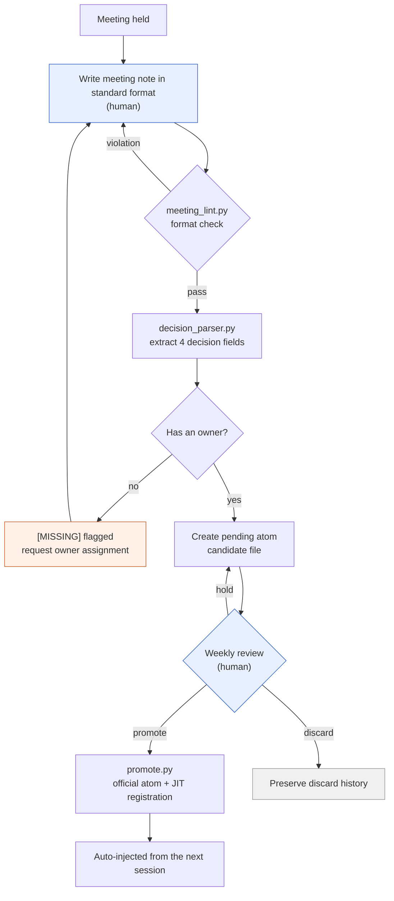

# 17.2 An Extraction Pipeline That Mines Decisions from Meeting Notes

Wednesday morning, the moment I got to work, a notification popped up in the team messenger. "We did decide last week to expand inventory to 30 slots, right? And who was supposed to fix the data sheet?" Nobody in the thread can answer. The meeting notes definitely exist — in a folder somewhere. Open them and the agenda items and discussion are packed in tight, but "so what did we decide, and who owns it" is dissolved somewhere between the sentences. So at the next meeting, the same agenda item gets brought up again from scratch.

This chapter is the story of the machine that fills that three-day gap. One meeting note goes in; it passes a format check, the four decision fields get extracted, ownerless decisions get tagged [MISSING], a candidate file is created, and a week later, after review, it becomes an asset that is injected automatically. Human hands touch only the two ends: the entrance, where the meeting note is written, and the exit, the once-a-week review.

---

## 17.2.1 The Full Pipeline Flow

First, the whole thing in one picture. Each box is either a small script or a human judgment call. Only two boxes are handled by hand; the rest flows automatically.



Only the two blue boxes (writing the meeting note, the weekly review) are human; everything else is a script. The orange box (the [MISSING] flag) is where the automated check calls a human back. When a decision has no owner, the pipeline doesn't simply stall — it sends the decision back to the note-writing stage until someone is made responsible. That is the core design of this pipeline: don't pass over blanks quietly, flag them loudly.

The overall asset folder structure is laid out like this.

<svg xmlns="http://www.w3.org/2000/svg" viewBox="0 0 720 300" font-family="monospace" font-size="13">
  <rect x="10" y="10" width="700" height="280" fill="#fafafa" stroke="#cccccc"/>
  <text x="24" y="38" font-weight="bold">meeting_pipeline/</text>
  <line x1="40" y1="48" x2="40" y2="270" stroke="#bbbbbb"/>
  <text x="52" y="68">scripts/</text>
  <text x="80" y="92" fill="#3366cc">meeting_lint.py</text>
  <text x="300" y="92" fill="#777777">format and required-section check</text>
  <text x="80" y="116" fill="#3366cc">decision_parser.py</text>
  <text x="300" y="116" fill="#777777">extract 4 decision fields + flag owner [MISSING]</text>
  <text x="80" y="140" fill="#3366cc">promote.py</text>
  <text x="300" y="140" fill="#777777">pending → official atom + JIT manifest update</text>
  <text x="52" y="172">meetings/</text>
  <text x="80" y="196" fill="#999999">2026-05-18_battle_tf.md</text>
  <text x="300" y="196" fill="#777777">standard-format meeting note (input)</text>
  <text x="52" y="228">atoms/pending/</text>
  <text x="80" y="252" fill="#cc6633">meeting_decision_2026-05-18_D1.md</text>
  <text x="300" y="252" fill="#777777">candidate (awaiting 1-week verification)</text>
</svg>

---

## 17.2.2 Step 1 — A Lint That Enforces the Format

For extraction to work at all, the meeting note has to be in a shape a machine can read. If there is no "## Decisions" section, or the decisions are blended into a paragraph of running prose, the parser can't pull out anything. So the very first thing in the pipeline is a format check. What `meeting_lint.py` does is simple: is the required frontmatter there, are the required sections there, and are the decision slots filled in `D1`, `D2` format?

```python
# meeting_lint.py skeleton
REQUIRED_FRONTMATTER = ["type", "date", "category", "attendees"]
REQUIRED_SECTIONS = ["## Agenda", "## Decisions", "## Action Items", "## Next Meeting"]
ALLOWED_CATEGORIES = ["art", "battle", "daily", "issue", "review"]

def lint(meeting_note_path):
    fm, body = parse_markdown(meeting_note_path)
    errors = []
    for key in REQUIRED_FRONTMATTER:
        if key not in fm:
            errors.append(f"Missing frontmatter: {key}")
    if fm.get("category") not in ALLOWED_CATEGORIES:
        errors.append(f"Invalid category value: {fm.get('category')}")
    for section in REQUIRED_SECTIONS:
        if section not in body:
            errors.append(f"Missing section: {section}")
    if "## Decisions" in body:
        block = extract_section(body, "## Decisions")
        if not any(l.strip().startswith("- D") for l in block.split("\n")):
            errors.append("Decision slots empty (D1, D2... format required)")
    return errors
```

I wire this check into a pre-commit hook for meeting notes. Break the format and the commit itself is blocked. Leave it as a recommendation and people quietly skip it on a busy day, and a format skipped once collapses the following week. Stay blocked for a week or two and the format becomes second nature. But if it's too strict, people start postponing the meeting notes themselves — so the realistic way to run it is to clean up the false positives once, after the adjustment period.

---

## 17.2.3 Step 2 — A Parser That Mines the Four Decision Fields

From a meeting note that passed the format check, `decision_parser.py` reads the decision slots. There are exactly four things to extract from each decision: **what was decided (decision), who is responsible (owner), why it was decided that way (rationale), and what to do next (follow_up).** These four fields are what turn a decision into an asset. Especially owner. A decision without an owner isn't a decision; it's wishful thinking. So when owner is empty, the parser doesn't quietly leave a blank — it writes in `[MISSING]` and raises a flag.

From here to the end, I'll follow one meeting note all the way to becoming an asset, without skipping a single line. It's one continuous example, from input to atom promotion.

```text
================ Input: meetings/2026-05-18_battle_tf.md ================
---
type: meeting
date: 2026-05-18
category: battle
attendees: [Minsoo Lee, teammate_a, teammate_b]
related_atoms: [combat_global_cooldown_constant]
---
## Agenda
- Unify the combat global cooldown (GCD) value
- Whether healing skills are exempt from the GCD

## Decisions
- D1: Unify the combat global cooldown at 0.5 seconds. (owner: teammate_a) [rationale: 0.5 seconds was the most stable in input-response feel tests against the refgame]
- D2: Exclude healing skills from the global cooldown. [rationale: risk of breaking the healing cycle]

## Action Items
- @teammate_a: apply 0.5 across the cooldown column in the combat data sheet (~MM-DD)

## Next Meeting
- MM-DD 14:00, review of the one-week healing-cycle test results

================ $ python meeting_lint.py meetings/2026-05-18_battle_tf.md ================
[OK] frontmatter 4/4, sections 4/4, 2 decision slots detected. Commit allowed.

================ $ python decision_parser.py meetings/2026-05-18_battle_tf.md ================
[
  {
    "id": "D1",
    "decision": "Unify the combat global cooldown at 0.5 seconds.",
    "owner": "teammate_a",
    "rationale": "0.5 seconds was the most stable in input-response feel tests against the refgame",
    "follow_up": "apply 0.5 across the cooldown column in the combat data sheet (~MM-DD)",
    "source_meeting": "2026-05-18_battle_tf.md",
    "category": "battle",
    "related_atoms": ["combat_global_cooldown_constant"]
  },
  {
    "id": "D2",
    "decision": "Exclude healing skills from the global cooldown.",
    "owner": "[MISSING]",          # ← owner not specified. Parser flags it
    "rationale": "risk of breaking the healing cycle",
    "follow_up": null,             # ← no follow-up action either
    "source_meeting": "2026-05-18_battle_tf.md",
    "category": "battle",
    "related_atoms": ["combat_global_cooldown_constant"]
  }
]
[WARN] D2: owner=[MISSING] — decision with no owner. Pending creation withheld; returned to the meeting-note author.

================ pending created: only D1 passes ================
$ cat atoms/pending/meeting_decision_2026-05-18_D1.md
---
name: meeting_decision_2026-05-18_D1
description: Decision to unify the combat global cooldown at 0.5 seconds
status: pending
type: decision
source_meeting: 2026-05-18_battle_tf.md
owner: teammate_a
category: battle
related_atoms: [combat_global_cooldown_constant]
created: 2026-05-18
---
## Decision
Unify the combat global cooldown at 0.5 seconds.
## Rationale
0.5 seconds was the most stable in input-response feel tests against the refgame.
## Follow-Up Actions
- [ ] @teammate_a: apply 0.5 across the cooldown column (~MM-DD)

================ One week later: weekly review ================
$ python promote.py atoms/pending/meeting_decision_2026-05-18_D1.md
[PROMOTE] → atoms/combat_global_cooldown_constant_decisions/meeting_decision_2026-05-18_D1.md
[JIT] manifest registered: trigger=(전투|쿨다운|GCD|cooldown), atoms 18 → 19
[OK] From the next session, typing "global cooldown" auto-injects this decision.
```

This one box is the entire pipeline. The spot to watch is D2. The decision content is fine and the rationale is there, but owner is empty. The parser does not let it through. It writes in `[MISSING]`, withholds the pending file, and returns the decision to the author. A few days later, D2 picks up an owner at the "review of the one-week healing-cycle test results" meeting and comes back in. That single bounce at the blank is what keeps "wait, who was supposed to do that?" from ever appearing in the team messenger three days later.

The rule itself — flag any decision without an owner — is pinned down in an atom (`decision_summary_not_clickup_mirror`, §17.1.2). The task tool may well show a to-do that says "fix the data sheet," but why that to-do exists, and what decision it follows from, survives only in the meeting-note atom.

---

## 17.2.4 Step 3 — Let Decisions Sit in Pending for a Week

A decision the parser passes does not become an official atom right away; it waits a week in `pending/`. Decisions made confidently in a meeting are routinely overturned after a week of actually running them. D2 in the example above sat exactly in that danger zone: the decision "healing is excluded from the GCD (global cooldown)" could flip again if the healing cycle breaks down in the one-week test. pending is the slot that forcibly sets aside time for the ink to dry.

And discards are kept as assets too. If a decision like D2 had collapsed in the one-week test, I wouldn't just delete it — I'd create a discard-history atom.

```markdown
---
name: meeting_decision_2026-05-18_D2_DISCARDED
status: discarded
discarded_reason: healing-cycle DPS curve collapsed in the one-week test
---
## Original Decision
Apply the 0.5-second global cooldown to healing skills as well.
## Reason for Discard
Healing-cycle DPS dropped in the one-week test and broke the overall balance. Reverted to the exclusion decision.
## Lesson
"Healing excluded from the GCD is the standard" → promoted to the combat_healing_skill_cooldown_exception atom.
```

The discard history becomes the answer to "didn't we try this before?" at the next meeting. It's the cheapest tool there is for not making the same mistake twice. Discard records do pile up into search noise, though, so they need a quarterly trim: deduplicate and keep only the lessons.

---

## 17.2.5 Step 4 — The Weekly Review and Promotion

At a fixed time each week, I go through the pending candidates in one batch. Each one ends in one of three outcomes.

| Outcome | Handling |
|---|---|
| Promote | Move pending → official atom folder, register in the JIT manifest |
| Discard | Decision overturned → remove from pending, preserve a discard-history atom |
| Hold | Not enough information → extend pending by one week |

The review takes about 15 minutes per 10 atoms. Once promotion is decided, `promote.py` handles the file move and the manifest update in one shot.

```python
# promote.py skeleton
def promote(pending_path):
    fm, body = parse_markdown(pending_path)
    target = ATOM_BASE / f"{fm['related_atoms'][0]}_decisions" / f"{fm['name']}.md"
    move(pending_path, target)
    manifest = json.load(open(JIT_MANIFEST))
    manifest['atoms'].append({
        "name": fm['name'],
        "path": str(target),
        "trigger_regex": build_trigger(fm),   # related_atoms + category keywords
        "description": fm['description'],
        "added": today(),
    })
    json.dump(manifest, open(JIT_MANIFEST, "w"), indent=2)
    log_promotion(fm['name'])
```

When `trigger_regex` matches user input in a later session, this decision is injected automatically. In the example above, typing "global cooldown" brings in the D1 decision along with its rationale. This is the point where a decision I used to carry over by hand becomes an asset that surfaces on its own, the moment it's needed.

---

## 17.2.6 Measurement — What Changed from Copying by Hand

This is my impression from running Project A, comparing the stage where I had only the standard format with the stage where the pipeline was running. The numbers below are not precise measurements — they are directions and rough ratios as felt during operation, and they include the author's estimates (unverified).

| Item | Format Only (Manual Extraction) | Pipeline Running |
|---|---|---|
| Meeting note → decision extraction time | 20–30 minutes per meeting | Under 1 minute |
| Share of decisions promoted to atoms | 5–10% (no time to organize) | 60–80% (full review) |
| "Didn't we already decide this?" re-meetings | 5–10 per quarter | 0–2 per quarter |
| Ownerless decisions | Not tracked | Immediately visible via [MISSING] flags |

The biggest change is the promotion rate. When I organized by hand, more than 90% of decisions evaporated for lack of time. With automation, full review became possible, and the decisions worth keeping survive without exception. The direction is clear; the exact ratios will vary with team size and meeting frequency.

---

## 17.2.7 Common Failures and Their Fixes

| Pattern | Fix |
|---|---|
| Running lint as a recommendation only | Enforce it with a commit hook |
| Writing the discussion into the decision slot | One sentence per decision; rationale in a separate field |
| Letting an empty owner through | Flag [MISSING] + withhold pending and bounce it back |
| Pending review keeps slipping | A fixed slot in the weekly retrospective — even 5 minutes, every week |
| Not keeping discard history | Preserve discards as separate atoms too |

These five lines are nearly all of it. Minimize the spots that depend on human willpower, and hand the format and owner checks to the machine — that is where this system finds its stable point.

---

## Key Takeaways
- One meeting note flows automatically through lint → parser → pending → review → JIT registration and becomes an asset.
- If owner — one of the four decision fields — is empty, the parser writes in [MISSING] and bounces the decision back.
- The one-week pending period and the preserved discard history force time for the ink on a decision to dry.

---

> **Beyond Games.** This structure — one meeting note rides a conveyor of format check → decision extraction → one-week verification → official registration, and humans touch only the entrance (writing) and the exit (the weekly review) — ports to the document operations of any knowledge-work team, not just games. For example, when a consulting team handles client meeting notes: standardize the note format, have an LLM do a first-pass extraction of the "decision / owner / rationale / next action" slots, raise `[MISSING]` and bounce back anything with an empty owner, and promote only the decisions that have aged a week into the official action tracker. Meeting decisions that evaporated more than 90% of the time when organized by hand become, on the conveyor, subject to full review — and they survive without exception.

---

## Try It Yourself

**setup.** Put a standard-format template in your meeting-notes folder and wire `meeting_lint.py` into a pre-commit hook. Make the four frontmatter fields and the four sections required.

**prompt.** Feed one meeting note to the parser with an instruction like this.

> From the `## Decisions` section of this meeting note, extract the four fields decision / owner / rationale / follow_up as JSON for each decision. For any decision without an explicit owner, set owner to `[MISSING]` and collect it on a separate warning line. Do not fill in guesses.

**verify.** If the output JSON contains any decision marked `[MISSING]`, do not create a pending file for it — return it to the meeting-note author. Create pending candidate files only for decisions whose owner is filled in, and decide promote, discard, or hold at the weekly review one week later.

### Solo Scale-Down
If you work alone, three scripts plus a commit hook is overkill. Standardize only the `## Decisions` section of your meeting notes, and write each decision as one line: `D1: what / owner: me / rationale: why`. Once a week, scrape just the decision lines from that week's notes into a single file (`decisions.md`), and mark `[MISSING]` yourself on any line with an empty owner so you fill it in the following week. Adding the scripts later, once your hands start to hurt, is not too late. The core is three habits: one line per decision, an explicit owner, and a weekly collection pass.
