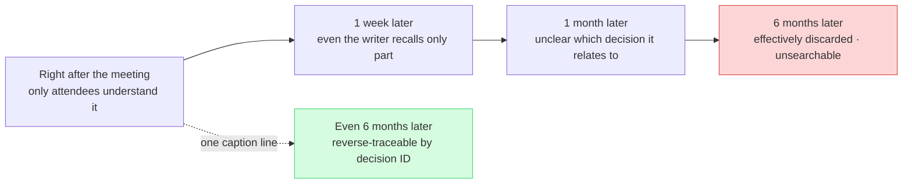
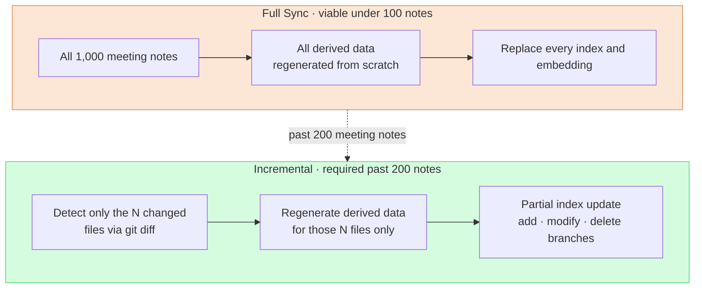

# 17.3 Meeting Categories, Captions, and Sync — The Three Axes That Turn Meeting Notes into Assets

> The goal of meeting notes is not to pile them up. The goal is for them to still be searchable six months later, to lead to decisions, and to look exactly the same on two different PCs.

---

Tuesday afternoon. I remembered that in a meeting a year earlier, we had clearly agreed to lower the saturation of a character's outfit by one step. But I could not find the meeting note. When I opened the folder, 200 files like `meeting_0413.md`, `회의_수정본_final.md`, and `IMG_2034.png` sat there, sorted only by date. No categories, no captions, no consistent naming. The decision was in there somewhere, but the path to reach it was gone.

For meeting notes to become an asset, three things have to work at the same time. **Categories** create the first entry point for search, **captions** keep the image half of the notes searchable, and **sync** ties processing cost to the changed files only, even past 1,000 notes. If any one of the three is missing, meeting notes become a dead pile that only gets heavier as it grows.

In §17.1 and §17.2 I set up the flow that turns meeting notes into an extraction pipeline — `meeting_lint.py` checks the format, `decision_parser.py` pulls the four decision fields (`decision` / `owner` / `rationale` / `follow_up`), reports `[MISSING]` when there is no owner, collects candidates as pending atoms, and promotes them with `promote.py`. This chapter covers the three operating standards that keep that pipeline from decaying over the long run.

---

## 17.3.1 Categories — The First Entry Point for Search

Meeting notes grow into the hundreds and then the thousands. Material that cannot be searched is not an asset. Categories are the first fork in that search. It is the same as putting labels on office filing cabinets: a cabinet without labels is one nobody ever opens.

On Project A (an MMORPG in development) that I run, we grouped meetings into five categories. The key is to keep them **small and orthogonal**.

<svg viewBox="0 0 720 220" xmlns="http://www.w3.org/2000/svg" font-family="sans-serif" font-size="13">
  <rect x="10" y="10" width="130" height="190" rx="8" fill="#fce7d6" stroke="#d98a4a"/>
  <text x="75" y="34" text-anchor="middle" font-weight="bold">art</text>
  <text x="75" y="58" text-anchor="middle" font-size="11">Visual/art direction</text>
  <text x="75" y="78" text-anchor="middle" font-size="10" fill="#666">Concept reviews</text>
  <text x="75" y="94" text-anchor="middle" font-size="10" fill="#666">Env tone alignment</text>
  <text x="75" y="120" text-anchor="middle" font-size="10" fill="#a05a20">→ captions ↑</text>

  <rect x="150" y="10" width="130" height="190" rx="8" fill="#d6e7fc" stroke="#4a7ad9"/>
  <text x="215" y="34" text-anchor="middle" font-weight="bold">battle</text>
  <text x="215" y="58" text-anchor="middle" font-size="11">Combat/balance</text>
  <text x="215" y="78" text-anchor="middle" font-size="10" fill="#666">Cooldowns, DPS</text>
  <text x="215" y="94" text-anchor="middle" font-size="10" fill="#666">Damage curves</text>
  <text x="215" y="120" text-anchor="middle" font-size="10" fill="#2050a0">→ atom extraction ↑</text>

  <rect x="290" y="10" width="130" height="190" rx="8" fill="#d6fce0" stroke="#4ad97a"/>
  <text x="355" y="34" text-anchor="middle" font-weight="bold">daily</text>
  <text x="355" y="58" text-anchor="middle" font-size="11">Routine progress</text>
  <text x="355" y="78" text-anchor="middle" font-size="10" fill="#666">Stand-ups</text>
  <text x="355" y="94" text-anchor="middle" font-size="10" fill="#666">Today's tasks</text>
  <text x="355" y="120" text-anchor="middle" font-size="10" fill="#207040">→ almost no decisions</text>

  <rect x="430" y="10" width="130" height="190" rx="8" fill="#fcd6d6" stroke="#d94a4a"/>
  <text x="495" y="34" text-anchor="middle" font-weight="bold">issue</text>
  <text x="495" y="58" text-anchor="middle" font-size="11">Urgent issue response</text>
  <text x="495" y="78" text-anchor="middle" font-size="10" fill="#666">Build failures</text>
  <text x="495" y="94" text-anchor="middle" font-size="10" fill="#666">Pre-launch incidents</text>
  <text x="495" y="120" text-anchor="middle" font-size="10" fill="#a02020">→ post-hoc cleanup required</text>

  <rect x="570" y="10" width="130" height="190" rx="8" fill="#ece6fc" stroke="#7a4ad9"/>
  <text x="635" y="34" text-anchor="middle" font-weight="bold">review</text>
  <text x="635" y="58" text-anchor="middle" font-size="11">Milestones/QA</text>
  <text x="635" y="78" text-anchor="middle" font-size="10" fill="#666">MS sign-off</text>
  <text x="635" y="94" text-anchor="middle" font-size="10" fill="#666">Quarterly retros</text>
  <text x="635" y="120" text-anchor="middle" font-size="10" fill="#502090">→ summary atoms</text>

  <text x="360" y="172" text-anchor="middle" font-size="11" fill="#444">The five buckets never overlap — one meeting goes in exactly one bucket</text>
  <text x="360" y="192" text-anchor="middle" font-size="11" fill="#444">Grow to six, and "is this art or battle?" stalls a meeting every week</text>
</svg>

Five is not the right answer for every team. If your project centers on non-combat systems, you adjust — swap `battle` for `system`, and so on. The point is not the number; it is the principle of keeping classification decisions **small enough that they never stall the meeting itself**.

### One Meeting, One Category

Meetings that straddle two buckets happen all the time. If a character concept review ended up settling combat motion too, is it art or battle? The rule is **exactly one, by primary deliverable**. If the concept is the primary deliverable, classify it as art and record the combat motion as a secondary entry in the `sub_topic` field.

```yaml
---
type: meeting_note
category: art
sub_topic: [character, battle_motion]
date: 2026-05-18
attendees: [teammate_a, teammate_b, teammate_c, Minsoo Lee]
related_atoms: [character_concept_kim, battle_motion_kim]
confidential: internal
---
```

`sub_topic` is only a secondary search filter; it is never used for routing decisions. Routing always operates on the single `category` value alone. If this single-value rule collapses, `promote.py` from §17.2 can no longer decide which folder an atom goes to, and per-category statistics stop adding up. Orthogonality is not a matter of tidiness — it is a precondition for pipeline integrity.

### Each Category Runs Differently — That Is the Real Value of the Split

The real reason for the five buckets is not search labels. Each bucket is operated differently, and only a clean split lets that differentiated operation fall into place naturally.

`art` notes carry many attached images, so the caption standard in the next section is mandatory; decisions are visual, so the decision slot holds image references like ``. `battle` decisions are numbers and rules, so it has the highest rate of automatic atom promotion, and since a one-line decision can cascade into bulk data sheet changes, visualizing the blast radius (the relationship maps from Part 11) matters. `daily` is supposed to have almost no decisions, and it accumulates fast, so it goes into automatic weekly folders (`daily/2026-W21/`). `issue` notes are messy by nature, so cleanup within 24 hours is mandatory and recurrence-prevention atoms are extracted into `issue_postmortem/`. `review` notes run long, so a separate 5–10 line summary atom is written and gets auto-cited in the next quarterly retrospective.

Adding a new category is something I treat with great caution. It must occur at least 5 times per quarter, be operated in a way clearly different from the existing five, need its own routing folder, and still be holding at 5 or more occurrences a month later — only when all four conditions pass do I even consider it. In my experience the five have held for over a year, and when candidates like `tech_review` or `external` came up, they were ultimately absorbed into `sub_topic`.

### The AI Classifier Must Stay a Backup

Categories are entered by the person writing the note — that is the primary path. Only notes with missing categories, such as material received from outside, get AI-assisted classification. A keyword dictionary catches about 90%, and only the remaining `uncertain` cases go to an LLM or a human.

When delegating to an LLM, a prompt with hard constraints is the stable choice. Here is the exact prompt I use.

```
The following is a meeting note. Classify it into exactly one of the 5 categories.

Categories:
- art: visual and art direction
- battle: combat systems and balance
- daily: routine progress sharing
- issue: urgent issue response
- review: milestone and QA reviews

Meeting note:
[full text or first 500 characters]

Response format: one category word only. No explanations, rationale, or hedging of any kind.
Any response that is not one of the 5 categories is treated as a system failure.
```

When I fed in a meeting note (below is the opening of an art meeting), Claude's raw output looked like this.

> Input meeting note:
> `Character K_007 (Scholar) concept v3 review. Feedback that the outfit's color saturation is too high. Agreed to lower it by one step. Combat motion tone to be checked together at the next meeting.`

> Claude output:
> `art`

A clean single word. But when I fed a daily meeting note into the same prompt, this also happened.

> Input: `The build broke overnight; the cause looks like a data sheet merge conflict. Hotfix first, proper fix to follow.`

> Claude output:
> `issue`

On the surface this was said in a daily stand-up, but Claude read the content and classified it as `issue`. **This is exactly why the classifier must not be the primary path.** A human makes the operational call — "this is a build incident that surfaced mid-daily, so it should be split off into a separate issue meeting." The AI only looks at text and stamps a label. The label may be right, but it cannot decide whether the meeting should be split. So humans come first, and the LLM only backfills the gaps.

At the quarterly retrospective I tally meeting counts per category to see where the time goes. The distribution below is the author's estimate (unverified): the absolute counts are illustrative, and only the relative order matches my actual operating experience.

| Category | Share (estimated) | Notes |
|---|---|---|
| `daily` | about 1/3 | daily and routine, almost no decisions |
| `battle` | about 1/5 | combat task force, twice a week |
| `art` | about 1/7 | art reviews + external meetings |
| `issue` | low | build incidents and the like |
| `review` | lowest | milestones, quarterly retrospectives |
| Other | about 1/5 | 1:1s, external, and other non-categorized |

If `issue` spikes in a given quarter, improving build and CI stability rises to the top of the priority list. Categories are not just for search — they are a mirror of how the organization spends its time.

---

## 17.3.2 Captions — The One Line That Keeps Half Your Images Alive

Half the body of an `art` meeting note is images. And an image without a caption is like a pile of photos stacked on a desk. On the day itself you remember everything; a month later, only the photos with a one-line note on the back survive.



If images are half the meeting note and they cannot be searched, then half of the asset is gone. What keeps that half alive is one line of caption.

### The Three Caption Elements

Project A's caption standard ends in three lines.

```markdown


**[Figure 1]** Character K_007 (Scholar) concept v3 — outfit color saturation lowered one step
*Decision: D2 (outfit saturation -10%) | Next action: v4 work (~MM-DD)*
```

Each of the three elements opens a different search path. The **number + one-line description** gives the body a way to cite it ("see Figure 1"); the **decision ID reference (D2)** enables the reverse lookup "images linked to this decision"; the **next action** leaves a trail to the follow-up work. All three lines take under a minute to write. "Attach immediately" does not mean "write during the meeting." Realistically, you only tidy the decisions during the meeting and fill in the captions within ten minutes after it ends.

### File Names and Folders Are the First Entry Point

Just as important as captions are file names, because folders and file names themselves are the first entry point for search.

```
meeting notes folder/
├── 2026-05-18_art_review.md
└── images/
    └── 2026-05-18_art_review/
        ├── character_kim_concept_v3.png
        ├── env_palette_comparison.png
        └── reference_external_game_a.png
```

The rule is `<topic>_<item>_<version or note>.<ext>`, and Korean characters, spaces, and special characters are banned (to prevent path-encoding accidents). `IMG_2034.png` (zero meaning), `김캐릭터 v3.png` (Korean plus a space), `final_final_v3_real.png` (meaningless versioning), and `untitled.png` (a deletion candidate) are all anti-patterns. Rather than relying on willpower, it is better to enforce these names by adding a check rule to `meeting_lint.py` — one extra file-name check on top of the format lint we automated in §17.2 is enough.

### External Source Attribution and Confidential Ratings

Meetings often cite external games and art as references. Without attribution, that is a straight line to a copyright incident.

```markdown


**[Figure 3]** Reference image — refgame (Developer Y, 2024)
*Reason for citation: comparing saturation treatment of a similar concept. No direct borrowing.*
```

State all three: the source (game title, developer, year), the reason for citation, and whether anything was directly borrowed. And because images leak more easily than text, the rating goes in the frontmatter.

```yaml
confidential: internal   # internal / restricted / external_ok
images:
  - file: character_kim_concept_v3.png
    confidential: restricted
    reason: unreleased character design
```

`internal` means company-wide sharing, `restricted` means the relevant task force and owners only, and `external_ok` means approved for marketing and external sharing. When the meeting notes are built, output is split by rating, and any image not marked `external_ok` is automatically blurred in the external-share build. This automatic split is what drives external-share masking accidents to effectively zero.

### AI Drafts the Captions, Too

Writing 50 captions by hand for 50 images is a burden. Give the AI the body text and the file names and get a batch of drafts.

```
The following is a meeting note body plus a list of image files.

[meeting note body]
[10 image file names]

Draft a caption for each image.

Format:
- [Figure N] <description> — <key decision or change>
- *Decision: D? | Next action: ?*

For any image whose grounding cannot be found in the body, mark it as "content unknown — writer confirmation needed".
```

The last line is the key. Given the same meeting note, Claude wrote captions for the images grounded in the body, but for `reference_external_game_a.png` it answered like this.

> Claude output (excerpt):
> `[Figure 3] reference_external_game_a.png — content unknown, writer confirmation needed. The body does not state the reason for citing this external reference image.`

The AI reported what it did not know as unknown. The writer takes that and fills in the citation reason. When the body context alone is not enough, send just the 5–10 key images to a Vision model (image token costs are high, so do not run all of them).

```python
# Apply selectively to the 5-10 key images only — token cost per image is high
response = client.messages.create(
    model="claude-opus-4-8",
    messages=[{
        "role": "user",
        "content": [
            {"type": "image", "source": {"type": "base64", "data": img_b64}},
            {"type": "text", "text": "Describe this image in one line of Korean. No guessing — only what is visible."},
        ],
    }],
)
```

The writer then shapes that one line into the caption format. There is no need to run Vision on every image; the 5–10 key ones raise searchability plenty.

A year of well-captioned meeting notes becomes a visual development document in its own right. You can trace the visual evolution of `character_kim` v1 → v2 → v3 by decision ID; filtering on the `external_ok` rating auto-curates external reporting material; and collecting key images plus captions per discipline produces onboarding material for new team members. Expressing the before/after of caption adoption as the author's estimate (unverified), the **direction** is this — search success on six-month-old meeting notes rises sharply, the "where did I see this image?" re-asks drop sharply, and external-share masking accidents converge to 0. The absolute numbers will differ by team, but steps 1 and 2 alone (file-name standard + caption format) made the direction unmistakable.

---

## 17.3.3 Sync — Only the Changes, Not the Whole

Meeting notes themselves are text files, so git is enough. The real targets of sync are the data **derived** from them — the pending atom candidates from §17.2, the JIT manifest, category statistics, the decision index (`decision_index.json`), the caption index, the per-confidential-rating build outputs, and the LLM embeddings for vector search. All of these must react to every meeting-note change.

The problem is that once meeting notes pass 1,000, reprocessing everything each time eats half of the operating budget. It is like stopping the entire production line and remanufacturing every part — when only one part changed.



Full Sync is simple to implement and carries zero risk of state divergence, so in the early days (under 100 notes) it is actually the safer choice. Full is not a bad method. But its cost scales linearly with the note count, and somewhere past 200 notes that becomes the bottleneck. That is when you switch to Incremental.

### Detect Changes with git diff

The first step of Incremental is judging precisely which files changed. File mtime is fast but inaccurate — a mere `touch` registers as a change. File hashes are content-based and accurate, but weak at distinguishing additions from deletions. My recommendation is **git diff**. Record the commit hash of the last sync, then process only the files changed since. It catches additions, modifications, and deletions accurately, with the smallest extra state-management burden.

```python
# incremental_sync.py skeleton
def get_changed_files(last_sync_commit):
    result = subprocess.run(
        ["git", "diff", "--name-only", last_sync_commit, "HEAD", "--", "meetings/"],
        capture_output=True, text=True
    )
    return result.stdout.strip().split("\n")

def sync():
    last_commit = read_state("last_sync_commit")
    for path in get_changed_files(last_commit):
        if not os.path.exists(path):
            handle_deletion(path)        # delete atoms, index entries, and embeddings together
        elif is_new(path, last_commit):
            handle_creation(path)        # lint → decision extraction → pending atom → index → embedding
        else:
            handle_modification(path)    # invalidate existing derivatives, then reprocess
    write_state("last_sync_commit", get_current_commit())
```

There is one more branch that splits the cost most sharply: whether the **body** of the note changed, or only the **frontmatter**.

```python
def detect_change_scope(file_path, last_commit):
    diff = subprocess.run(
        ["git", "diff", last_commit, "HEAD", "--", file_path],
        capture_output=True, text=True
    ).stdout
    fm_lines, body_lines = split_diff_by_section(diff)
    return {"frontmatter_changed": bool(fm_lines), "body_changed": bool(body_lines)}

scope = detect_change_scope(path, last_commit)
if scope["body_changed"]:
    full_reprocess(path)          # includes embedding regeneration
elif scope["frontmatter_changed"]:
    metadata_only_update(path)    # zero embedding regeneration
```

If only metadata like `category` or `confidential` changed, there is no need to regenerate the LLM embeddings. Embeddings are usually the single largest chunk of sync cost, so this one branch cuts the bill substantially. Embeddings are cached by `content_hash` — if the body hash is unchanged, the cached embedding is reused as is, and a frontmatter-only edit results in zero embedding calls.

The **direction** of the cost difference is clear (the following is the author's estimate, not absolute values). In an operation with about 50 changes per week, Incremental's embedding cost came out dozens of times lower than a weekly full re-embed. As the notes accumulate, Full's cost grows in proportion to the pile, while Incremental's cost stays tied only to the weekly change count — nearly flat, regardless of accumulation. This "accumulation-independent" property is the essential value of Incremental.

### Two Safety Nets — Periodic Full Re-Sync and Single-PC Sync

Incremental is fast, but it carries the risk of accumulating divergence. If a small bug drops a single atom, that omission will not heal itself in the next Incremental run. So I bolt on guardrails — Incremental daily, a Partial Full over the most recent week as weekly verification, and a **full re-sync monthly** to check index and embedding consistency. When the monthly check finds a mismatch, the change-detection logic gets reinforced. That once-a-month pass is the last safety net of long-term operation.

On top of this sits the split-PC setup. I handle meeting notes on two machines, the office PC and the home PC. The rule: **sync work runs on one PC only**.

| Flow | Handling |
|---|---|
| Office PC → git push | the office PC owns the sync work (regenerating derived data) |
| Home PC → git pull | update `last_sync_commit` only; no reprocessing |
| Both changed, then merge | recompute the changed files against the merge result |

If both sides sync at once, the `last_sync_commit` state collides, and that collision silently skews the indexes. Pinning one PC as the sync owner is the simplest rule and the surest defense.

---

## 17.3.4 Where the Three Axes Meet in One Pipeline

Categories, captions, and sync are not free-floating standards. The three are bound into one flow on top of the extraction pipeline from §17.2.

When a meeting note is written, `category` decides the routing in `promote.py`; the caption's decision ID links to the four decision fields that `decision_parser.py` extracted; and Incremental sync picks out only the changes to refresh all the derived data built that way. The starting point for operating this chapter is `decision_summary_not_clickup_mirror` (§17.1.2). Categories open the path to find a decision, captions preserve the decision's visual evidence, and sync keeps that decision asset in the same state on both PCs.

That Tuesday-afternoon helplessness — the state of having clearly agreed on something with no path left to reach it — disappears the moment these three axes are running. `category: art` narrows the folder, the caption's `Decision: D2` lands on the exact decision, and sync shows me that meeting note at home, looking exactly the same.

---

> **Beyond Games.** The principle that material becomes an asset only when it can be searched, referenced, and synced is not a game-meeting-notes story; it is the shared problem of every working professional who handles documents. The three axes — categories (small and orthogonal), captions (a one-line description for every attached image), and sync (only the changes, never the whole) — stay the same when you swap out the domain. Say a sales team accumulates a year of client meeting material: fix the categories at five or fewer, such as "new proposals / contract negotiation / post-sale support," attach a line like "[Figure 1] Company A second quote — unit price cut 5%" to every quote screenshot, and have the cloud sync pick out only the changed files. That is what lets you answer "why did we cut that price back then?" six months later from a single caption line.

---

## 17.3.5 Try It Yourself

**setup**
1. Define 5 or fewer meeting categories (start from art / battle / daily / issue / review and swap 1–2 to fit your team).
2. Add two checks to `meeting_lint.py` — that `category` is one of the defined values, and that image file names match the `<topic>_<item>_<version>` pattern (no Korean characters or spaces).
3. Add a `confidential` field to the frontmatter and prepare a state file to record `last_sync_commit`.

**prompt** (classification backup for notes with missing categories)
```
The following is a meeting note. Classify it into exactly one of the 5 categories.
[5 lines of category definitions] / [first 500 characters of the meeting note]
Response format: one category word only. No explanations, rationale, or hedging of any kind.
Any response that is not one of the 5 categories is treated as a system failure.
```

**verify**
1. Pick any six-month-old meeting note and try to find it using only the category plus the caption's decision ID.
2. Check that the number of changed files caught by `git diff --name-only <last_sync_commit> HEAD` matches the number of meeting notes you actually edited.
3. Do not accept AI classification uncritically — have a human re-check the `uncertain` cases and the "decision that surfaced mid-daily" cases.

---

## 17.3.6 Solo Scale-Down

If you are a game designer working alone, shrink it down like this.

- **Categories**: start with just 2 — `decision` (meetings with decisions) and `log` (progress records). Only meetings with decisions get captions and atoms; the rest pile up in date folders.
- **Captions**: skip the confidential ratings and the Vision assist entirely, and attach the three caption elements **only to images tied to a decision**. One line per image is enough.
- **Sync**: no need to build derived data all the way to embeddings. Keep one file, `decision_index.json` (decision ID → meeting note path mapping), and update just that line when you save a note. Git itself is your sync, and until the pile grows big enough to distinguish Full from Incremental, regenerating everything each time is fine.

Even at solo scale, the one invariant is this — **leave a path that reaches the decision**. Categories, captions, and sync are just the three pillars holding up that path, and you can make them as thin as your scale allows.

---

### Key Takeaways
- Keep categories at 5 or fewer, small and orthogonal; route every meeting by exactly one category.
- The three caption elements (number, decision ID, next action) keep the image half alive even six months later.
- Sync only the git diff changes, not the whole — and correct with a Full pass monthly.

### Next Chapter Preview
- 17.4 AI-Assisted Meeting Notes and Decision-Tracking Automation — Full Automation from Extraction to Promotion
