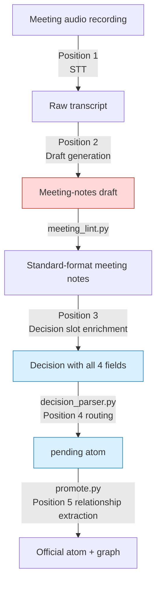
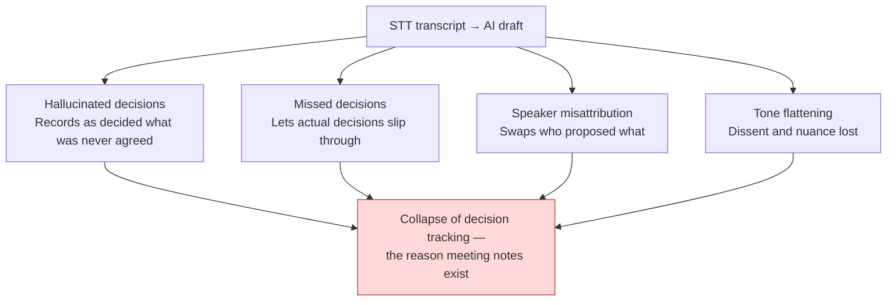

# 17.4 Turning Meeting Notes into a Decision Database — Five AI Automation Points

> Three days before the milestone demo, over lunch, one of the designers sets down a tray and asks: "The quest reward gold going up to 1.5x — we decided that in the meeting, right? Can I put it in the data sheet?" The next seat over answers, "Wasn't that just someone saying, why don't we try it?" The 90-minute recording exists, and so do the two pages of notes someone hammered out on a keyboard. But that record captured "what was talked about" — not "what was decided, who is responsible, and why."

When I lined up the company's 17 R&D documents in order of pain, the largest share belonged to the meeting-notes improvement plan. That surprised me. It wasn't combat balance, and it wasn't the content production pipeline. The sorest spot was one single thing: decisions made in meetings were not propagating into execution.

So I redesigned the meeting-notes system as a decision-tracking database, and over six months of running it myself I verified where AI belongs in that flow and where it does not. This chapter is the map of those five points.

---

## 17.4.1 The Five Points Where AI Automation Can Plug In

From the audio recording all the way to updating the decision graph, there are exactly five places in the meeting-notes pipeline where an AI assistant can sit. I do not turn on all five at once. Each spot differs in maturity and in the risk of accidents.



Red (Position 2) is the most tempting and the most dangerous spot; blue (Positions 3 and 4) are the safe ones I adopted first. The middle of the pipeline — `meeting_lint.py` → `decision_parser.py` → `promote.py` — is deterministic script, not AI. AI enters only the "gaps that need judgment" between the bones of this deterministic skeleton.

One line each on the character of the five points:

- **Position 1 (STT, speech-to-text)**: audio → text. Highest maturity, lowest risk.
- **Position 2 (draft generation)**: transcript → meeting-notes draft. Most tempting, highest risk.
- **Position 3 (decision slot enrichment)**: fills in rationale and impact for decisions a human has declared. No. 1 ROI (return on investment).
- **Position 4 (atom routing)**: recommends which folder a decision should be filed in.
- **Position 5 (relationship extraction)**: infers dependencies between atoms. Most exposed to non-determinism.

---

## 17.4.2 The Deterministic Skeleton — Create the Gaps for AI to Fill First

Before talking about AI automation, you have to look at the non-AI script skeleton first. The reason meeting notes can become a decision database lies not in the LLM but in three small Python scripts.

Standard-format meeting notes end with a decisions block. Each decision in the block enforces four fields.

```markdown
## Decisions

D1:
  decision: Unify the combat global cooldown at 0.5 seconds
  owner: teammate_a
  rationale: At 0.3s, skill-chaining tests showed frequent dropped inputs (transcript 14:22)
  follow_up: Reflect GCD 0.5 in the combo design sheet, by 6/13
```

`decision_parser.py` reads this block. Its core behavior is simple — if any of the four fields is empty, it prints `[MISSING]` and reports it. The hardest stop is reserved for a missing `owner`: a decision without an owner is "a decision nobody is responsible for," that is, a decision that will not be executed.

```
$ python decision_parser.py 2026-06-06_combat-sync.md

D1: OK   (owner=teammate_a)
D2: [MISSING owner]  "Consider exempting healing skills from the GCD" — no owner, promotion blocked
D3: [MISSING rationale]  rationale field empty, warning
```

D2, flagged `[MISSING owner]`, does not even make it to the `pending` folder. Until a human fills in the owner, it is not treated as a decision. This is the structural guard against "we held the meeting, but nothing moved."

Decisions that pass are turned into `pending atom`s by `promote.py`, and once a human approves them at the weekly review gate, they are promoted to official atoms. The principle applied here is the `decision_summary_not_clickup_mirror` atom (§17.1.2). The task board tracks "what to do"; the decision database tracks "why we decided it." Mix the two and both break.

These three scripts are the skeleton, and AI is the assistant that fills the blanks inside it. Reverse the order — let AI build the skeleton — and hallucinations destroy the very credibility of the decision database.

---

## 17.4.3 The Most Dangerous Spot — Why Position 2 Comes Last

Position 2 (STT transcript → auto-generated meeting-notes draft) is the spot every team wants to do first. The picture — "just toss in the recording and meeting notes come out" — is simply too attractive. And that very attraction is why it fails most expensively.

The failure comes in four shapes.



The deadliest of these is the hallucinated decision. Someone in the meeting merely floated an opinion — "Wouldn't 0.5 seconds be better for the global cooldown (GCD)?" — and the AI draft writes "agreed: global cooldown 0.5 seconds." Three weeks later that one line is reflected in the data sheet, the combo design gets built on top of it, and QA cases get written. A decision that was never agreed on propagates irreversibly.

So Position 2 runs under absolute rules.

- An AI draft **always** goes through facilitator review. There is no auto-commit, under any circumstances.
- AI does **not** fill the decision slots. AI summarizes only agenda items and statements; whether a decision exists is declared by a human.
- The original STT transcript is **archived permanently, separate** from the summary. Keep only the summary, and once the rationale has gone fuzzy, verifying against the original becomes impossible.

This does not mean "never do Position 2." Once Positions 3, 4, and 1 are stable and the facilitator has learned the limits of AI output firsthand, Position 2 is well worth adopting. The point is that **it comes last**.

---

## 17.4.4 Position 3 — Why Decision Slot Enrichment Is the Top ROI

This is where six months of operation produced the biggest payoff. A human declares that the decision exists, and AI fills in the decision's supporting fields. The decisive difference from Position 2 is that **a human pins down the very fact that there is a decision, first**.

AI drafts the three things that take too much time to fill in by hand:

- **rationale**: quotes the statements in the meeting transcript that grounded the decision
- **affected_atoms**: recommends candidate systems and data sheets the decision affects
- **follow_up**: candidate follow-up actions derived from the decision

The crux is a prompt that **forces evidence quotation and explicitly bans hallucination**. Below is the full text of the enrichment prompt I actually ran.

### Worked Transcript — Decision Slot Enrichment

**Prompt (human input):**

```
Look at the meeting transcript below and fill in only the four fields —
owner / rationale / affected_atoms / follow_up — for decision D1
("unify the combat global cooldown at 0.5 seconds"), which the facilitator declared.
Do not create new decisions. In the rationale, quote transcript statements verbatim
with their timestamps, and for any field with no evidence, do not guess —
write "no evidence."
// (Intent: affected_atoms only from systems/sheets mentioned in the transcript, max 3)

[Meeting transcript]
(14:18) teammate_a: The GCD is 0.3 seconds right now, and inputs keep getting eaten when I chain skills.
(14:22) teammate_b: In yesterday's combo test too, at 0.3 seconds the second skill failed to come out
        in about 30 percent of cases. I kept the logs.
(14:25) teammate_a: Then let's raise it to 0.5 seconds. I'll reflect it in the combo sheet.
(14:26) Facilitator: We go with 0.5 seconds. Decided.
(14:31) teammate_c: If healing skills are on the GCD, you can't use them in an emergency — what about...
(14:33) Facilitator: Let's take that up separately next time.
```

**Claude output (raw, as is):**

```
1. owner: teammate_a
   Evidence: (14:25) "I'll reflect it in the combo sheet." — teammate_a
   explicitly took ownership.

2. rationale:
   - (14:18) teammate_a: "inputs getting eaten when chaining skills at GCD 0.3 seconds"
   - (14:22) teammate_b: "in the combo test, at 0.3 seconds the second skill failed
     to fire in about 30% of cases, logs kept"
   → The dropped-input problem at 0.3 seconds is the direct basis for the 0.5-second decision.

3. affected_atoms (candidates based on transcript mentions):
   - atoms/combat/global_cooldown
   - combo design sheet (transcript 14:25 "combo sheet" mention)
   - atoms/combat/skill_recovery  ← note: at (14:31) the healing-skill
     GCD exemption discussion was "deferred to later" (14:33). Unclear whether it
     falls within this decision's scope. Weak evidence; needs human confirmation.

4. follow_up:
   - teammate_a: reflect GCD 0.5 seconds in the combo design sheet
   - [Separate agenda item] Whether healing skills are exempt from the GCD is
     outside this decision's scope; split it into the next meeting's agenda
     (facilitator's statement at 14:33)
```

**Human verification/rejection:**

The facilitator reviewed the output. The owner and rationale quotes were accurate, so they were adopted as is. For the third `affected_atoms` candidate, `skill_recovery`, the AI itself had flagged "weak evidence; needs human confirmation," and the facilitator's judgment was to **exclude** it from this decision's scope — the healing-skill exemption is a matter for a separate decision, not an effect of this D1. The follow_up suggestion to "split it off as a separate agenda item" was adopted and registered on the next meeting's agenda.

What matters here is that the AI did not bulldoze the uncertain item through as a hallucination but **reported its own uncertainty**. The prompt's constraint — "no guessing, no hallucination; if there is no evidence, state 'no evidence'" — is what produced this honest output. Remove the constraint and the AI confidently puts `skill_recovery` into affected_atoms, and that hallucination propagates into the graph.

The reviewed decision block passes `decision_parser.py` — all four fields filled, so no `[MISSING]` — and moves on as a `pending atom`.

---

## 17.4.5 Position 4 — Atom Routing and Position 5 — Relationship Extraction

When a pending atom that cleared Position 3 is promoted into an official folder, AI recommends which folder to send it to (Position 4).

```
For this atom ("unify combat global cooldown at 0.5 seconds / owner teammate_a"),
pick up to 3 of the folders below, in priority order, as the best place to file it.
Do not propose creating new folders — choose only from this list.
- atoms/combat/  atoms/character/  atoms/operations/  atoms/visual/
```

"No creating new folders" is the key constraint. Drop it and the AI proposes folders like `atoms/combat_timing/` and `atoms/gcd_rules/` without end; categories multiply unboundedly, and search and auto-injection collapse. The principle is to keep categories small and orthogonal, unchanged for a year or more. AI picks only from within that closed list.

Position 5 (relationship extraction between atoms) is adopted last and most cautiously. This is the spot that infers dependency relationships among promoted atoms.

```
New atom A: "Healing skills are exempt from the global cooldown"
Existing atom B: "Global cooldown unified at 0.5 seconds"

Inferred relationships:
  A.exception_of: [B]
  A.derives_from: [B]
  B.affects: [A]   ← reverse direction assigned automatically
```

The problem is that this inference is directly exposed to LLM non-determinism. The same input produces different relationships yesterday and today. There are three mitigations — `temperature=0` plus a fixed seed on models that support it; a review gate where candidates are proposed and a human approves; and extracting only one direction, with a script deterministically filling in the reverse. Hand both directions to the LLM and one side goes missing.

---

## 17.4.6 One or Two at a Time — Rollout Order Is the Safety Mechanism

Turning on all five points at once is the most common and most expensive failure. The operating burden arrives before the benefits do, and the team abandons the system wholesale. Here is the order I actually followed.

<svg viewBox="0 0 720 240" xmlns="http://www.w3.org/2000/svg" font-family="sans-serif" font-size="13">
  <line x1="40" y1="40" x2="40" y2="210" stroke="#999" stroke-width="2"/>
  <!-- step 1 -->
  <circle cx="40" cy="50" r="7" fill="#2980b9"/>
  <text x="60" y="48" font-weight="bold">Step 1 · Position 3, decision slot enrichment</text>
  <text x="60" y="66" fill="#666">1–2 months · Start with the No. 1 ROI, lowest risk</text>
  <!-- step 2 -->
  <circle cx="40" cy="95" r="7" fill="#2980b9"/>
  <text x="60" y="93" font-weight="bold">Step 2 · Position 4, atom routing recommendations</text>
  <text x="60" y="111" fill="#666">+1 month · Enforce a closed list of folder candidates</text>
  <!-- step 3 -->
  <circle cx="40" cy="140" r="7" fill="#27ae60"/>
  <text x="60" y="138" font-weight="bold">Step 3 · Position 1, STT</text>
  <text x="60" y="156" fill="#666">Once self-hosted infrastructure is in place · Avoid external APIs for security</text>
  <!-- step 4 -->
  <circle cx="40" cy="185" r="7" fill="#c0392b"/>
  <text x="60" y="183" font-weight="bold">Step 4 · Position 2, meeting-notes draft</text>
  <text x="60" y="201" fill="#666">After the three above are stable; the most cautious · Never auto-commit</text>
  <!-- step 5 -->
  <circle cx="40" cy="225" r="7" fill="#8e44ad"/>
  <text x="60" y="223" font-weight="bold">Step 5 · Position 5, relationship extraction</text>
</svg>

Putting Position 2 last is the heart of this order. You do the spot you most want to do, last — counterintuitive, but staffing the most dangerous inspection station with the most practiced hands is a basic workshop safety principle.

The order is rational on cost as well. At 100 meetings per month, Position 3 runs about $5–10 and Position 4 about $1–2 (author's estimate from my own operating environment, unverified), so **turning on just those two stays under $10 a month**. The two highest-impact spots are the cheapest.

---

## 17.4.7 Before / After — One Meeting, Two Sets of Notes

The difference between recording the same meeting in two ways is the summary of this whole chapter.

**Before — free-form meeting notes (no AI, or Position 2 trusted with the decision slots too):**

```markdown
## 2026-06-06 Combat Sync Meeting

Discussed GCD. Opinions that 0.3 seconds is too short.
Apparently there were problems in the combo test. 0.5 seconds came up.
Healing-skill exemption also briefly mentioned.
Overall the mood seemed to settle toward 0.5 seconds.
```

Open these notes again three weeks later, and **nobody can reconstruct** whether "the mood settled toward 0.5 seconds" was a decision or an opinion, who agreed to put it in the sheet, or whether the healing-skill exemption was decided or deferred. No speakers, no owner, and the evidence is "somewhere in the transcript," so you are back to listening to the recording.

**After — decision slots + Position 3 enrichment:**

```markdown
## 2026-06-06 Combat Sync Meeting

### Agenda Summary (AI-assisted)
- Dropped-input problem with the 0.3-second combat global cooldown (GCD)
- Whether healing skills are exempt from the GCD (split into a separate agenda item)

### Decisions  (human-declared + AI-enriched)
D1:
  decision: Unify the combat global cooldown at 0.5 seconds
  owner: teammate_a
  rationale: |
    - (14:18) teammate_a: inputs getting eaten when chaining skills at 0.3 seconds
    - (14:22) teammate_b: combo test at 0.3 seconds, second skill failed to fire ~30%, logs kept
  follow_up: teammate_a — reflect GCD 0.5 seconds in the combo design sheet (by 6/13)
  affected_atoms: [atoms/combat/global_cooldown, combo design sheet]

### Split-Off Agenda Items
- Healing-skill GCD exemption → next meeting (facilitator decision at 14:33)
```

Three weeks later, these notes have been read by `decision_parser.py` and wired into the graph, and anyone asking "why 0.5 seconds?" gets an immediate answer from the two quoted lines in the rationale. The owner is explicit, so whether the follow_up was executed can be tracked, and even the fact that the healing-skill exemption is **a deferred agenda item, not a decision** is preserved.

What made the difference is not the amount of AI but **a structure that preserves the human's place to declare decisions while assigning AI only the filling-in of evidence**. Delete every paragraph the AI filled in the After notes (the agenda summary, the rationale quotes, the affected_atoms candidates), and what remains is a single decision line and an owner — more than half the information in the notes came from AI enrichment, but the crux is that all of that half is evidence quotation that passed human review.

---

## Key Takeaways

- Stand up the deterministic skeleton of the meeting notes first (meeting_lint → decision_parser → promote); AI only fills the blanks in its gaps.
- A human declares that a decision exists; AI enriches only the rationale, owner, and impact — letting Position 2 auto-generate decisions invites irreversible hallucinations.
- Do not turn on all five points at once: start with Positions 3 and 4, one or two at a time, and adopt the most tempting Position 2 last.

---

> **Beyond Games.** The principle "a human declares that a decision exists; AI fills in only the evidence, the owner, and the impact" is a safety line that applies, exactly as is, to any office worker using AI to write up recordings — not just in games. The most tempting spot (auto-generating full meeting notes straight from a recording) is the most dangerous because of the hallucination that turns the opinion "wouldn't 0.5 seconds be better?" into the decision "agreed on 0.5 seconds." For example, when an HR team writes up a performance-review meeting, have the facilitator personally pin down only the decision — "finalized at grade B" — and ask the AI only this: "Quote the statements in the recording that support this grade; if there are none, say so." Let AI create the decisions, and an evaluation that was never agreed on ends up in someone's HR record, irreversibly.

---

## Try It Yourself

**setup**
1. In your standard meeting-notes format, create a `## Decisions` block and enforce the four fields `decision / owner / rationale / follow_up` on every decision.
2. Write `decision_parser.py` — if any of the four fields is empty, print `[MISSING <field>]`; in particular, if `owner` is empty, block promotion.
3. Write down the rule that the decision summary is an independent asset holding the "why," not a mirror of the task board (`decision_summary_not_clickup_mirror`).

**prompt**
4. Use the Position 3 enrichment prompt. Constraints it must include: "do not create new decisions / quote transcript evidence with timestamps / if there is no evidence, write 'no evidence' / no guessing, no hallucination." Request the four slots: rationale, owner, affected_atoms, follow_up.
5. In the Position 4 routing prompt, include "no creating folders that are not on the list + the closed folder list."

**verify**
6. Run the enriched decision block through `decision_parser.py` and confirm there is no `[MISSING]`.
7. Have a human directly review every affected_atoms entry the AI flagged as "weak evidence," excluding or adopting each one. Never auto-commit, under any circumstances.

**Solo Scale-Down**
If you work alone or have no time to install tooling, skip the scripts and just hand-write a four-line decision block (`decision / owner / rationale / next action`) at the end of your meeting notes. Write the name even when the owner is yourself. Ask the AI only this: "Quote the evidence for this decision from my meeting memo; if there is none, say so." Even without a pipeline, **a place where decisions are declared and a prompt that forces evidence quotation** — those two alone are enough for meeting notes to start becoming a decision database.
