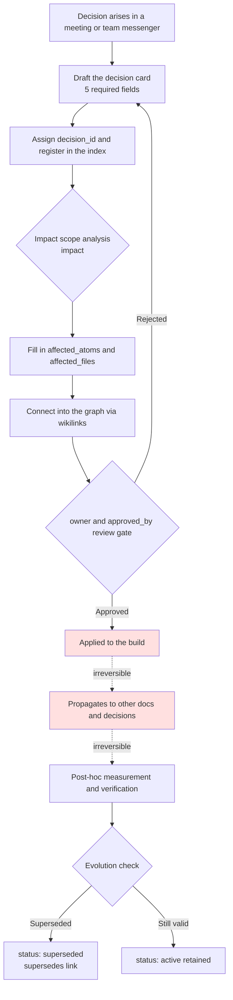

# 18.1 The Decision-Tracking System

We were in the middle of a quarterly meeting. The combat designer proposed unifying the global cooldown at 0.5 seconds, and everyone nodded. Then the senior designer in the next seat raised a hand. "Doesn't this conflict with the 0.3-second decision we made in Q4 last year? Why did we go with 0.3 back then?" The room went quiet for a moment. Nobody remembered the rationale for that decision. We dug through the meeting minutes and found a single line: "Discussed in the combat task force." We ended up spending 30 minutes reconstructing last year's decision, and even then we never found out why it was 0.3.

Decisions are harder to track than to make. When hundreds pile up in a year, no human head can keep up with which decisions are alive, which have been retired, and which rest on other decisions as premises. This chapter covers a system that pins decisions down as atoms and turns them into a trackable asset. The core is simple. Record each decision as a card with `decision_id`, `owner`, and `rationale`; connect the cards with wikilinks to form a graph; and trace backward with grep to see how far the impact spreads.

## 18.1.1 The Decision Card: Pinning Decisions Down as Atoms

The minimum unit of decision tracking is the decision card. I brought over, as is, an actual card from Project A (an MMORPG in development) that I run. It is the very 0.5-second unification decision that collided in the meeting above.

```yaml
---
decision_id: D2026_Q2_017
title: Unify the combat global cooldown at 0.5 seconds
type: system_change
status: active        # active / superseded / deprecated
created: 2026-04-18
owner: teammate_a      # combat designer; proposed and owns the decision
approved_by: Minsoo Lee    # Design Director
approval_meeting: 95_BattleTF_2026-04-18

scope:
  - combat_system
  - all_active_skills

content: |
  Apply a 0.5-second global cooldown to all combat active skills.
  Healing skills are an exception (separate decision D2026_Q2_018).

rationale:
  - Combo input readability problem (accumulated player feedback)
  - Simulations point toward longer average combat length
  - Flatten the learning curve for new players

affected_atoms:
  - combat_global_cooldown_constant
  - combat_skill_cooldown_rule

affected_files:
  - CombatBalance.xlsx
  - CombatFormula_v3.md
  - UI/skill_cooldown_indicator

implementation:
  target_build: 2026-05-09
  impl_owner: teammate_b    # code lead
  qa_owner: teammate_c      # QA senior

related_decisions:
  - supersedes: D2025_Q4_034   # the previous 0.3-second decision
  - relates_to: D2026_Q2_018   # healing exception
---
```

Three fields are the spine. `decision_id` gives the decision a permanent address. `owner` nails down who is responsible for this decision. `rationale` answers the "why did we do that?" six months later. The "why was it 0.3?" the meeting failed to find is exactly what should have been sitting in the `rationale` field of `D2025_Q4_034`. The remaining fields (`scope`, `affected_atoms`, `related_decisions`) are wiring for impact tracing and graph connections.

One piece of deliberate design goes in here. Force all 12 fields and people start dodging card writing altogether. So I split them into 5 required fields (`decision_id`, `title`, `owner`, `status`, `rationale`) and 7 optional ones. Fill in just the 5 required fields right after the decision is made in the meeting and the card is alive; the rest get filled in during implementation.

## 18.1.2 The Full Decision-Tracking Flow

The skeleton of the tracking system is the path a single card travels from creation to retirement. Pay attention to where the irreversible gates sit.



Everything from drafting (B) to the review gate (G) is reversible. Fixing or discarding the card costs almost nothing. After the change lands in the build (H), though, it is effectively irreversible. Even if a hotfix rolls back a change players have already felt, it leaves a mark on community perception, and once follow-up decisions start stacking on top of this one as a premise, the cost of reversal grows exponentially. So every review by the decision-maker has to finish at gate G. This is exactly the same structure as the "recording and casting are irreversible stages" principle covered in Part 5.

## 18.1.3 The Decision Graph: Connecting the Cards

Once cards are atoms, they can be connected to each other. `supersedes` and `relates_to` in `related_decisions` become the edges of the graph. The collision in that meeting was, in fact, one small piece of this graph.

<svg viewBox="0 0 640 280" xmlns="http://www.w3.org/2000/svg" font-family="sans-serif" font-size="13">
  <defs>
    <marker id="arrow" markerWidth="10" markerHeight="10" refX="9" refY="3" orient="auto" markerUnits="strokeWidth">
      <path d="M0,0 L9,3 L0,6 Z" fill="#555"/>
    </marker>
  </defs>
  <!-- nodes -->
  <rect x="40" y="20" width="220" height="48" rx="6" fill="#eef2f8" stroke="#888"/>
  <text x="150" y="40" text-anchor="middle" fill="#333">D2025_Q4_034</text>
  <text x="150" y="58" text-anchor="middle" fill="#777" font-size="11">Global cooldown 0.3s (deprecated)</text>

  <rect x="40" y="116" width="220" height="48" rx="6" fill="#dff0df" stroke="#5a5"/>
  <text x="150" y="136" text-anchor="middle" fill="#333">D2026_Q2_017</text>
  <text x="150" y="154" text-anchor="middle" fill="#777" font-size="11">Global cooldown 0.5s (active)</text>

  <rect x="380" y="116" width="220" height="48" rx="6" fill="#dff0df" stroke="#5a5"/>
  <text x="490" y="136" text-anchor="middle" fill="#333">D2026_Q2_018</text>
  <text x="490" y="154" text-anchor="middle" fill="#777" font-size="11">Healing-skill cooldown exception (active)</text>

  <rect x="380" y="212" width="220" height="48" rx="6" fill="#fdf3df" stroke="#cb5"/>
  <text x="490" y="232" text-anchor="middle" fill="#333">D2026_Q2_025</text>
  <text x="490" y="250" text-anchor="middle" fill="#777" font-size="11">PvP global cooldown variant (active)</text>

  <!-- edges -->
  <line x1="150" y1="68" x2="150" y2="116" stroke="#555" marker-end="url(#arrow)"/>
  <text x="160" y="96" fill="#555" font-size="11">supersedes</text>

  <line x1="260" y1="140" x2="380" y2="140" stroke="#555" marker-end="url(#arrow)"/>
  <text x="285" y="132" fill="#555" font-size="11">relates_to</text>

  <line x1="490" y1="164" x2="490" y2="212" stroke="#555" marker-end="url(#arrow)"/>
  <text x="500" y="192" fill="#555" font-size="11">relates_to</text>
</svg>

With this graph, the meeting would have ended in 30 seconds. Open `D2026_Q2_017` and `supersedes: D2025_Q4_034` is right there; one click into that card's `rationale` and the "why 0.3" is laid out as is. The graph is the evolution history of the decisions, and the evolution history of the decisions is the history of the game. Even branches derived from the main decision, like the PvP variant (`D2026_Q2_025`), are traceable at a glance.

## 18.1.4 Extracting the Impact Scope Automatically — impact

If a human fills in a decision card's `affected_atoms` and `affected_files` one by one, things get missed. Project A has an impact-scope extraction procedure called `impact`. It takes a decision atom and sweeps the graph in three directions.

- **Inbound edges**: other atoms that reference this atom (who depends on me)
- **Ontology `affects` links**: relationships explicitly declared as "affects"
- **Wikilink backreferences**: every document that cites `[[combat_global_cooldown_constant]]` in its body

The union of the three paths is the decision's true impact scope. On top of that, the `portal_layer_change_impact_check` atom separately checks whether the decision touches the portal layer (externally exposed documents and API specs). If the portal layer is involved, the grade goes up one level — external propagation is more expensive to undo.

## 18.1.5 Worked Transcript: From Meeting Notes to Decision Card

That is it for theory. Here is the full process of actually throwing a chunk of meeting notes at an LLM and getting a decision card back, with the prompts in full and the raw output included as is. No summarizing. You see where Claude got confused, where the human rejected, and the rework request — all of it.

### First Prompt (in Full)

```
Turn the meeting notes below into a decision card in YAML. The schema is
decision_id / title / type / status / owner / approved_by / scope /
content / rationale / affected_atoms / affected_files / related_decisions.
owner is the proposer; approved_by is the approver. For affected_atoms and
related_decisions, use only what actually appears in the notes — do not guess.
// (intent: decision_id is D{YYYY}_Q{n}_{seq}; if seq is unknown, XXX)

[Meeting notes]
- Decided to unify the combat global cooldown at 0.5 seconds (proposed by teammate_a).
  Cooldowns currently vary per skill, and feedback keeps piling up that combo readability is poor.
- Last year's 0.3 seconds was called out as too fast — combos got mushed together.
- Healing skills can't handle crisis response at 0.5 seconds. Needs an exception.
- Approved by the director (Minsoo Lee). teammate_b implements, teammate_c handles QA.
- Target build is May 9.
```

### Claude's First Output (Raw, Unedited)

```yaml
---
decision_id: D2026_Q2_XXX
title: Unify the combat global cooldown at 0.5 seconds
type: system_change
status: active
owner: teammate_a
approved_by: Minsoo Lee
approval_meeting: 95_BattleTF
scope:
  - combat_system
  - all_skills          # ← healing skills are an exception, yet it grabbed all_skills
content: |
  Apply a 0.5-second global cooldown to all combat skills.
rationale:
  - Accumulated feedback on combo readability
  - Last year's 0.3 seconds was too fast; combos got mushed
affected_atoms:
  - combat_global_cooldown      # ← differs from the real atom name. A guess
affected_files: []              # ← left empty. Not specified in the notes
implementation:
  target_build: 2026-05-09
  impl_owner: teammate_b
  qa_owner: teammate_c
related_decisions:
  - supersedes: D2025_Q4_XXX    # last year's 0.3-second decision. seq unknown
  - relates_to: healing-skill exception decision (ID undetermined)  # ← filled with a description, not a link
---
```

Honestly assessed, this output scores about 60 out of 100. The good and the wrong are mixed together.

- **Good**: the `owner`/`approved_by` distinction is correct; `target_build`, implementer, and QA are correct; it caught the `supersedes` relationship.
- **Wrong (1)**: it put `all_skills` in `scope`. The healing-skill exception was explicit, yet it grabbed everything.
- **Wrong (2)**: it guessed `combat_global_cooldown` into `affected_atoms`. The project's actual atom name is `combat_global_cooldown_constant`. It violated the "do not guess" instruction.
- **Wrong (3)**: it filled the healing exception in `related_decisions` with a natural-language description, not a link.
- **Ambiguous**: it left `affected_files: []` empty. That follows the instruction faithfully, but there is no way the list of impacted files is empty.

### Human Verification and Rejection

I did not accept this card as is. I wrote up (1), (2), and (3) as rejection reasons and requested a rework. The heart of the rejection is the **guessed atom name**. If an atom ID is off by even one character, every grep and backreference downstream misses. The accuracy of the tracking system is bound to the accuracy of its atom IDs.

### Second Prompt (the Rework Request, in Full)

```
Fix three things. For scope, healing skills are an exception, so use
all_active_skills instead of all_skills, and put the healing exception in
content. For affected_atoms, I told you not to guess and you guessed —
if you don't know the real atom name, leave [needs verification] and only
add a comment on what to check; I'll check the index myself. For
related_decisions, set the healing exception to relates_to D2026_Q2_018,
and supersedes to D2025_Q4_034. affected_files as [needs verification]
candidates only.
```

### Claude's Second Output (Raw)

```yaml
affected_atoms:
  # [needs verification] Candidates below. Confirm exact atom IDs against the index.
  - combat_global_cooldown_constant   # global cooldown constant value
  - combat_skill_cooldown_rule        # per-skill cooldown rule (includes exception handling)
affected_files:
  # [needs verification] Not in the notes. Usual impact candidates for type=system_change:
  - CombatBalance.xlsx        # cooldown values sheet
  - CombatFormula_v3.md       # combat formula doc
  - UI/skill_cooldown_indicator   # cooldown UI indicator
related_decisions:
  - supersedes: D2025_Q4_034
  - relates_to: D2026_Q2_018
scope:
  - combat_system
  - all_active_skills
content: |
  Apply a 0.5-second global cooldown to all combat active skills.
  Healing skills are an exception (separate decision D2026_Q2_018).
```

The second pass came back honest. Instead of guessing atoms and asserting them, it attached `[needs verification]` flags with supporting comments. I opened the atom index, confirmed that the two names `combat_global_cooldown_constant` and `combat_skill_cooldown_rule` actually exist, and removed the flags. The three `affected_files` candidates were also confirmed against the index. The final card at the top of this chapter is the result.

The lesson of this transcript is a single one. **An LLM is powerful as the drafter of decision cards, but the final confirmation of atom IDs and decision IDs has to be done by a human checking against the index.** The AI explores candidates; the human adopts them. Mix the two roles, and a wrong atom name contaminates the entire graph.

## 18.1.6 Tracing Impact Backward with grep

Once the cards and the graph are bound together by atom IDs, "where does this decision have impact" is answered with one line of grep. Take decision `D2026_Q2_017`'s core atom, `combat_global_cooldown_constant`, and sweep the manuscripts, sheets, and all decision cards for backreferences.

```
rg "combat_global_cooldown_constant" --type md --type yaml -l
# → D2026_Q2_017.yaml          (the decision card itself)
#   D2026_Q2_025.yaml          (PvP variant — re-cites this constant)
#   CombatFormula_v3.md        (formula doc)
#   95_BattleTF_2026-04-18.md  (original meeting notes)
```

This result is the impact map: change this constant and four places shake. The fact that the PvP variant card cites the same constant is easy for human memory to miss, but grep does not miss it. It works because the atom ID was exact — grep for the first output's `combat_global_cooldown` and not one of these four lines would have matched. Grade classification (§18.2), the full-cycle workflow (§18.3), and the refined grep workflow (§18.4) all stand on this atom ID accuracy.

## 18.1.7 The Difference a Tracking System Makes

Here is a before-and-after comparison from my Project A. The figures below are the author's estimate (unverified); read them for direction and ratio rather than absolute values.

| Item | Without the system | With the system | Direction |
|---|---|---|---|
| "Did we decide this before?" re-discussions | 8–12 per quarter | 0–2 per quarter | Sharply down |
| Mapping a decision's impact scope | 1–2 days | Minutes with grep | Sharply shortened |
| Tracing decision evolution history | Reliant on senior memory | Automatic via the graph | Human dependency removed |
| New team members learning decision history | 1–2 months | 1–2 weeks | Biggest effect |

The biggest effect is the last row. Instead of cornering a senior to ask "why is this game the way it is," a new team member reads down the decision graph on their own. Decision tracking becomes the company's decision-making learning asset. That said, the first quarter after the system comes in does carry a real card-writing burden. The safe path is to establish the 5 required fields first and expand gradually.

## 18.1.8 From Conservative to Progressive — Automation Stands on Atom Decomposition

The operation so far is the conservative application. Humans decide in meetings, write the cards, and identify the affected atoms; automation handles only indexing, search, grep, and graph visualization. Humans own the core judgment; automation owns storage and retrieval.

The next step is the direction the transcript above pointed to. With raw meeting notes as input, an LLM drafts all 12 fields of the decision card, explores affected-atom candidates along the graph, and even recommends a grade. What remains in human hands narrows to two things: reviewing whether the AI-filled card and atom names match the index, and final approval. The burden of filling 12 fields from zero and the burden of checking an LLM draft's atom names against the index are different in kind.

For this progressive application to take root, three skeletons are needed. First, a **decision graph** in which every decision is registered as an atom and connected by wikilinks. A blob of meeting notes cannot serve as automation's input — it has to be decomposed into decision units. Second, an **automatic impact grader** (§18.2) that computes the number of affected domains, the rollback cost, and the player impact scope on top of the graph and recommends a grade. Third, **grep and LLM impact tracing** (§18.4) that operates precisely on atom IDs and wikilinks.

Here the message that runs through this whole book surfaces once more. Decomposing decisions into atoms, graphs, and grades has "convenience of search and backreference" as its surface, but the essence lies in the fact that **from an undecomposed blob of meeting notes, automated impact analysis cannot even tell what the unit of a decision is**. The general thesis (§6.6) — decomposition holds unifying the collaboration language as its surface purpose and the precondition for procedural automation as its essential purpose — appears in the decision-making domain as the decision graph, atoms, and grades. It is the same skeleton as the world BT (Behavior Tree) and quest cloud in Part 5 and progressive balancing in Part 8. The theory was possible in the 2010s too, but automatically decomposing meeting notes into decision atoms was the blocker; after 2023, with LLMs taking on the draft of that decomposition, much of the vision that lived only on paper entered the realm of the practicable.

## Key Takeaways

- Pin a decision down as a card with `decision_id`, `owner`, and `rationale`, and you can answer "why did we do that" six months later.
- Atom ID accuracy is the lifeline of tracking — the LLM drafts the card; the human confirms the atom names.
- Layer decomposition (the decision graph) has unifying the collaboration language as its surface; its essence is being the precondition for automated impact analysis.

> **Beyond Games.** The decision card is a device that lets any organization — not just a game team — answer "why did we decide it that way back then," even six months later. The marketing team wasting 30 minutes because "we decided to drop this channel last quarter — why was that again?" cannot be found in a one-line meeting note: that disappears with a single three-field card of `decision_id`, `owner`, and `rationale`. For example, when HR sets a policy like "standardize on two remote days per week," write the proposer, the approver, the rationale (productivity data, employee survey), and the ID of the superseded previous policy on that one card, and a year later, at the policy review, the grounds for the past judgment are still alive.

## Try It Yourself

**The minimal web-chatbot path (no terminal)** — The core of this chapter is not the decision-card directory or grep; it is the idea of pinning a permanent address (`decision_id`), an owner (`owner`), and a rationale (`rationale`) onto each decision, and looking up past decisions before making a new one. That idea reproduces with nothing but a web chatbot (ChatGPT or Claude on the web), no CLI or atom index required. The three steps below are the main road.
1. Write one decision as one line. A single ordinary document named `decisions.md` is enough. No YAML, no scripts.
   ```
   - [D17] Unify global cooldown at 0.5s (owner: me, rationale: combo readability, supersedes: D08)
   ```
2. When turning meeting notes into cards, paste the following into the web chatbot. It carries over the four constraints of the first prompt as is.
   ```
   Turn the decisions in the meeting notes below into a table. Columns:
   decision_id / title / owner / rationale / superseded past decision.
   If you can't identify the owner, put [MISSING]; if you don't know atom or
   file names, put [needs verification]. Do not guess.
   // (intent: decision_id is D{year}_{seq}; if seq is unknown, XXX)
   [meeting notes body]
   ```
3. Before making a new decision, search `decisions.md` first with in-document find (Ctrl+F) — that alone settles the one question, "did we decide this before?" This is the hand-cranked version of grep backtracing. Bring in the atom index, YAML cards, and the `rg` workflow only when decisions number in the hundreds and a single document becomes too heavy to search.

**setup** (the infrastructure version — once the minimal path above feels routine) — Create a decision-card directory and an index file.

```
decisions/
  D2026_Q2_017.yaml
  _index.json        # by_status / by_scope / by_quarter aggregates
```

**prompt** — When you throw a meeting's decision items at an LLM, always include the four constraints from the first prompt above. In particular, state "do not guess atom names; leave them as [needs verification]."

**verify** — Check the produced card's `affected_atoms` entries against the atom index, confirm the real names, then remove the flags. Then run `rg "<atom_id>" -l` on the core atom and cross-check that the impacted files match the card's `affected_files`.

### Solo Scale-Down

If you are working alone with no team infrastructure, drop the YAML card. Write one decision as one line of Markdown.

```
- [D17] Unify global cooldown at 0.5s (owner: me, rationale: combo readability, supersedes: D08's 0.3s)
```

Stack these one-liners in a single `decisions.md` file, and before making a new decision, search past decisions first with `rg "cooldown" decisions.md`. No cards, no graph, no tooling — but the one question, "did we decide this before?", is solved. Ninety percent of a tracking system starts with this one-line habit.
