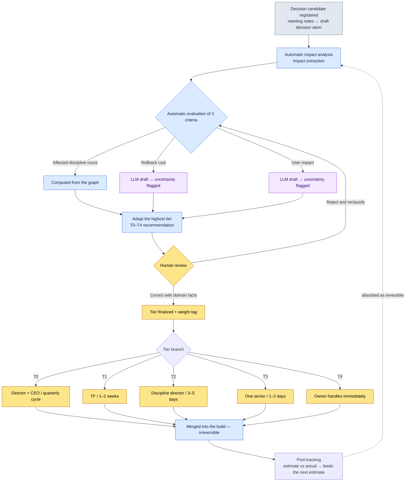
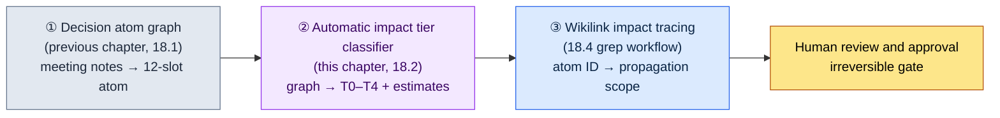

# 18.2 Impact Propagation and Tier Classification

I was tidying up the meeting notes after a meeting. One decision sat there in a single line: "Unify the global cooldown at 0.5 seconds." In the meeting, agreement took less than 30 seconds. Everyone nodded, and we moved on to the next item.

That one line ate the next two months. All 277 skills in the combat data were affected, the UI's cooldown gauge animation had to be redrawn, and the balance spreadsheet was torn up and rebuilt twice. Another decision written in the same meeting notes — "fix typos in the tutorial guidance text" — was done in five minutes.

On the page, both decisions were equally one line. Even their character counts were similar. Yet one took five minutes and the other took two months. Making that difference visible at the moment the meeting notes are written — that is impact tier classification. When the tier is invisible, a two-month decision gets buried in the same line as a five-minute one.

This chapter covers how to automatically classify a decision's impact into five tiers, and how to trace how far that impact spreads across the decision atom graph. The tools are the decision atoms and the `impact` extraction built in the previous chapter, plus the `portal_layer_change_impact_check` atom.

---

## What Happens When Tiers Are Invisible

First, let me describe what things look like without tier classification. When every decision sits on the same line, two kinds of accidents take turns blowing up.

One is **under-handling**. A decision that shakes the whole quarter, like the global cooldown one, gets treated as a "five-minute" item and enters the build without verification. The impact only surfaces two months later, and by then the cost of rolling it back has piled up like a mountain.

The other is **over-handling**. Fixing a single typo convenes a task force (TF) and requires the game director's sign-off. Decision cycles explode, and the time the director should be spending on T0 decisions gets sucked into typo meetings.

The two accidents look like opposites, but they share the same root: **the weight of a decision is invisible.** Because the weight is invisible, we spend effort on light decisions and let heavy ones slip through. Tier classification is the work of attaching a weight label to each decision, and the moment the label is attached, the handling path splits automatically.

---

## 18.2.1 The Five Impact Tiers — T0 Through T4

On Project A — the MMORPG project I run — decision impact is divided into five tiers. The higher the tier, the heavier the decision, and the more people and time it takes to handle.

| Tier | Definition | Examples | Decider | Cycle |
|---|---|---|---|---|
| T0 | Game vision, core systems | Mobile-first decision, core mechanic change | Game director + CEO | Quarterly |
| T1 | Systems, multi-discipline | Global cooldown unification, adding a new class | TF chair + director | 1–2 weeks |
| T2 | Single discipline, mid-size | Adjusting a specific skill's numbers, adding a UI component | Discipline director | 3–5 days |
| T3 | One-off, small | Editing a single NPC's dialogue, fine-tuning a color | One senior | 1–2 days |
| T4 | Immediate, hotfix | Bug fix, text typo | Owner | Hours |

The table looks textbook-clean. But the practical difficulty is not memorizing the table — it is **judging which cell the decision in front of you goes into**. You need to know that "global cooldown unification" is T1 at the moment you write the meeting notes, not after the meeting is over. That is why the three criteria in the next section are the core.

---

## 18.2.2 The Three Criteria That Decide the Tier

Tiers are not assigned by gut feeling. We evaluate three criteria and adopt the highest tier among them.

<svg viewBox="0 0 720 300" xmlns="http://www.w3.org/2000/svg" font-family="sans-serif" font-size="13">
  <rect x="0" y="0" width="720" height="300" fill="#fafafa" stroke="#ddd"/>
  <text x="20" y="30" font-size="15" font-weight="bold">Tier Decision Matrix — 3 Criteria × 5 Tiers</text>
  <!-- header row -->
  <rect x="20" y="50" width="160" height="40" fill="#2c3e50"/>
  <text x="30" y="75" fill="#fff" font-weight="bold">Criterion \ Tier</text>
  <rect x="180" y="50" width="100" height="40" fill="#c0392b"/><text x="215" y="75" fill="#fff" font-weight="bold">T0</text>
  <rect x="280" y="50" width="100" height="40" fill="#e67e22"/><text x="315" y="75" fill="#fff" font-weight="bold">T1</text>
  <rect x="380" y="50" width="100" height="40" fill="#f1c40f"/><text x="415" y="75" font-weight="bold">T2</text>
  <rect x="480" y="50" width="100" height="40" fill="#2ecc71"/><text x="515" y="75" fill="#fff" font-weight="bold">T3</text>
  <rect x="580" y="50" width="120" height="40" fill="#95a5a6"/><text x="625" y="75" fill="#fff" font-weight="bold">T4</text>
  <!-- row 1: affected disciplines -->
  <rect x="20" y="90" width="160" height="60" fill="#ecf0f1" stroke="#bbb"/><text x="30" y="125">Affected disciplines</text>
  <rect x="180" y="90" width="100" height="60" fill="#fff" stroke="#bbb"/><text x="220" y="125">5+</text>
  <rect x="280" y="90" width="100" height="60" fill="#fff" stroke="#bbb"/><text x="315" y="125">2–4</text>
  <rect x="380" y="90" width="100" height="60" fill="#fff" stroke="#bbb"/><text x="425" y="125">1</text>
  <rect x="480" y="90" width="100" height="60" fill="#fff" stroke="#bbb"/><text x="525" y="125">1</text>
  <rect x="580" y="90" width="120" height="60" fill="#fff" stroke="#bbb"/><text x="635" y="125">1</text>
  <!-- row 2: rollback cost -->
  <rect x="20" y="150" width="160" height="60" fill="#ecf0f1" stroke="#bbb"/><text x="30" y="185">Rollback cost</text>
  <rect x="180" y="150" width="100" height="60" fill="#fff" stroke="#bbb"/><text x="200" y="185">Very high</text>
  <rect x="280" y="150" width="100" height="60" fill="#fff" stroke="#bbb"/><text x="315" y="185">High</text>
  <rect x="380" y="150" width="100" height="60" fill="#fff" stroke="#bbb"/><text x="415" y="185">Medium</text>
  <rect x="480" y="150" width="100" height="60" fill="#fff" stroke="#bbb"/><text x="515" y="185">Low</text>
  <rect x="580" y="150" width="120" height="60" fill="#fff" stroke="#bbb"/><text x="600" y="185">Very low</text>
  <!-- row 3: user impact scope -->
  <rect x="20" y="210" width="160" height="60" fill="#ecf0f1" stroke="#bbb"/><text x="30" y="245">User impact scope</text>
  <rect x="180" y="210" width="100" height="60" fill="#fff" stroke="#bbb"/><text x="215" y="245">All</text>
  <rect x="280" y="210" width="100" height="60" fill="#fff" stroke="#bbb"/><text x="320" y="245">High</text>
  <rect x="380" y="210" width="100" height="60" fill="#fff" stroke="#bbb"/><text x="415" y="245">Medium</text>
  <rect x="480" y="210" width="100" height="60" fill="#fff" stroke="#bbb"/><text x="515" y="245">Low</text>
  <rect x="580" y="210" width="120" height="60" fill="#fff" stroke="#bbb"/><text x="600" y="245">Very low</text>
</svg>

Of the three criteria, the **number of affected disciplines** can be counted mechanically on the decision atom graph. Collect the discipline tags (combat, UI, data, narrative, and so on) of the atoms the decision touches, and you are done.

The problem is the other two. **Rollback cost** and **user impact scope** do not reduce to numbers on the graph. "How much would it cost to undo this decision two months from now" is a natural-language judgment. This was the last wall standing in front of automatic impact classification before 2023. The discipline count had been automated, but the two natural-language cells stayed empty, so in the end a person regraded everything from scratch anyway. The wall came down when LLMs started reading the body of a decision atom and drafting those two cells.

Let me be honest here. What the LLM fills in is a **draft**, not a verdict. Even if the LLM estimates the rollback cost as "high," a discipline director can rule, "Given our sheet structure, this is medium." Automatic classification does not replace human judgment — it keeps **the human from starting with empty cells**.

---

## 18.2.3 Worked Transcript — Having the LLM Classify One Decision

This is the actual process of feeding one decision atom from the previous chapter into the LLM, as is, and having it assign a tier. I am reproducing the whole exchange without summarizing, including the rejection and the follow-up request.

### Input — The Decision Atom

```yaml
# decisions/D2026_Q2_017.md (the atom registered in the previous chapter, 18.1)
id: D2026_Q2_017
title: Unify global cooldown at 0.5 seconds
date: 2026-04-18
proposer: teammate_a
decider: Minsoo Lee    # Design Director (same as approved_by in 18.1)
context: Per-class cooldown baselines vary, so balance recalculation costs
         pile up every time a new class is added. Proposal to unify on a 0.5-second global baseline.
affected_atoms: [combat_cooldown_rule, skill_table, ui_cooldown_gauge]
reversible: ?
status: proposed
```

### The Full Prompt

```
Assign an impact tier from T0–T4 to the decision atom below.
Evaluate the three criteria separately — affected discipline count / rollback cost /
user impact scope — and adopt the highest tier among them. For any cell
you are not confident about, write "uncertain" and say a human needs to review it.
// (intent: T0 = 5+ disciplines, very high cost, all users; T1 = 2–4, high, high; T2 = 1, medium; T3 = 1, low; T4 = 1, very low)

[atom text attached]
```

### Claude's Raw Output (Unedited)

```
Evaluating the three criteria:

1. Affected discipline count
   From affected_atoms:
   - combat_cooldown_rule → combat
   - skill_table → data
   - ui_cooldown_gauge → UI
   Three disciplines are explicit.
   However, given the context — "balance recalculation every time
   a new class is added" — the balance discipline is also likely
   to be indirectly affected.
   Direct 3 + indirect 1 = effectively in the 2–4 range. → T1 signal

2. Rollback cost
   Undoing the global cooldown unification would mean re-splitting
   every skill cooldown in skill_table back to per-class baselines.
   The exact cost is uncertain since the row count of skill_table
   is unknown, but "unify → restore the split" is generally
   expensive. → high (T1 signal)
   ※ This cell cannot be finalized without the size of skill_table. Marked uncertain.

3. User impact scope
   Cooldowns apply to every combat situation, so nearly all users
   will feel this. → high (T1 signal)

Adopted tier: T1
Rationale: all three criteria point to T1. It is not T0 —
this does not rise to a "core mechanic change"; it is a parameter
unification within an existing mechanic.

Needs human confirmation:
- Rollback cost cell: actual row count of skill_table required
- The reversible slot is empty ("?") → this classification assumes
  reversible will be filled in as "hard".
```

### Human Verification and Rejection

I did not accept this as is. Item 1 of the output needed a correction. The LLM read the balance discipline as "indirectly affected," but in Project A's actual structure, unifying the cooldown overhauls the balance spreadsheet **directly** — the balance formula for new classes takes the cooldown value as an input. So balance is not indirect; it is the fourth directly affected discipline. The affected discipline count is 4. Even so, the adopted tier, T1, does not change.

One more thing: the "uncertain" mark on the rollback cost cell was accurate. `skill_table` actually held 277 skill rows, and undoing the unification would mean re-splitting the cooldown of all 277 rows. The cost was closer to "very high" than "high." Still, one cell moving up does not push the adopted tier to T0 — the discipline count and the user impact remain in T1 range, so the highest tier is still T1.

### Follow-Up Request

```
Correction: add balance_sheet to affected_atoms (the balance formula takes
the cooldown value as an input, so the impact is direct). That makes 4 affected
disciplines, and skill_table has 277 rows.
Apply this, fill in reversible, and finalize the tier.
```

```
Applied.

Affected disciplines: combat, data, UI, balance = 4
Rollback cost: very high (re-splitting all 277 rows of skill_table)
User impact: high

reversible: hard (close to effectively irreversible — re-splitting
277 rows requires 1–2 builds plus a quarter of balance re-verification)

Final tier: T1
Caveat: looking at the rollback cost cell alone, it is a T0 signal,
but 4 affected disciplines and "high" user impact are T1 range.
Two of the three criteria point to T1, so T1 stands.
I do recommend marking this decision as "on the heavy end of T1" —
because its rollback cost is T0-grade.
```

That last sentence was more careful than the human. The tier is T1, but it proposed labeling the decision "on the heavy end of T1" because the rollback cost is T0-grade — a judgment that was nowhere in the original prompt. I took it. I added a `weight: heavy` tag to this decision and raised its post-tracking priority.

This transcript shows one thing above all. **The LLM produces the draft classification and its reasoning; the human corrects it with domain facts (balance is directly affected; 277 rows).** Neither works alone. A human alone starts from empty cells and is slow; an LLM alone writes "high" without knowing about the 277 rows.

---

## 18.2.4 Code That Traces Impact Propagation Automatically

Once the tier is set, the next question is "how far does it spread?" We apply the `impact` extraction from the previous chapter — inbound edges, the ontology's `affects` relation, wikilink reverse references — to the decision atom.

```python
# impact_propagation.py — trace a decision atom's propagation scope

def trace_impact(decision):
    # 1st hop: atoms and files the decision touches directly
    direct = decision.affected_atoms + decision.affected_files

    # 2nd hop: atoms that reverse-reference 1st-hop atoms via wikilink (impact inbound edges)
    secondary = []
    for atom in direct:
        secondary.extend(find_inbound_refs(atom))   # [[atom]] reverse references
        secondary.extend(find_affects_edges(atom))   # ontology affects

    secondary = dedup(secondary) - set(direct)

    return {
        "direct": direct,
        "secondary": secondary,
        "affected_fields": determine_fields(direct + secondary),
        "estimated_hours": estimate_hours(direct, secondary),
    }
```

The key is `find_inbound_refs` — the function that collects the **incoming** arrows on the atom graph, the ones pointing at a given atom via `[[...]]`. What a decision touches (outgoing arrows) is written in the atom itself, but who depends on those atoms (incoming arrows) only becomes visible by scanning the whole graph in reverse. Two-month-scale impact almost always hides on this **inbound edge** side.

Here, honestly, is what running this trace on D2026_Q2_017 produced. direct was the 4 atoms confirmed above. secondary was the atoms reverse-referencing `skill_table` — skill description text, skill icon mappings, per-class skill trees, and more — which came spilling out in a chain. **The numbers vary by point in time, so I will not pin them down.** What the trace established is the direction — "secondary is tens of times larger than direct" — and the exact atom count depends on the state of the graph. The direction alone is enough: when secondary is an order of magnitude larger than direct, that is a T1 signal, and it means the decision is a post-tracking target.

---

## 18.2.5 Where Tier Classification Plugs In — Mermaid

Classification is not a standalone step; it is fixed as a gate in the middle of the decision flow. When a decision candidate is registered, the automatic analysis recommends a tier, and only after a human reviews and adjusts it does the decision move on to the decision meeting.



In this flow, **there is exactly one irreversible step: merging into the build (I).** Everything before it is reversible — if the wrong tier gets recommended, a human can reject it, and a weight tag can simply be removed. It becomes irreversible only after it enters the build and propagates into other documents. That is why the gate (the human review at F) sits in front of the build. A human blocks once, before the irreversible line is crossed.

The final dotted line — the arrow from post-tracking (J) back to the automatic analysis (B) of the next decision — is what turns this system into a learning cycle. Measured data from the irreversible step (for example, QA took longer than estimated) is absorbed into the reversible stage of the next decision.

---

## 18.2.6 Post-Tracking — Turning the Gap Between Estimate and Actual into Learning

One week to one month after a decision enters the build, we put the estimate and the actual side by side. This is the post-tracking form for D2026_Q2_017.

```
Post-tracking for decision D2026_Q2_017  (form example · numbers are fictional inputs)
─────────────────────────────────
Work hours (estimate → actual)
  code:    16h → 22h  (+38%)
  data:     8h →  6h  (-25%)
  UI:       4h →  4h  (=)
  QA:       8h → 12h  (+50%)
  total:   36h → 44h  (+22%)

Affected atoms (estimate → actual)
  direct:    4 →  4   (exact)
  secondary: est. tens → actual tens  (direction matched, exact count not disclosed)

Incidents: 0
Error pattern: QA exceeds the estimate every time (+50% this time)
Apply to next decision: add a default +20% margin to QA estimates
```

The block above is a form example showing **what post-tracking looks like**. The hour and percentage values are not real project data — they are fictional inputs filling out the form — so on your own project, fill it in with your own numbers. Exactly as this book promises: we show the structure, and you measure the numbers. One thing is real regardless of the form: **the direction of the error — "QA exceeds the estimate every time"** — and the procedure of feeding that direction back into the next decision. That is where the prescription comes from: attach a QA margin (say, +20%) to the next estimate from the start.

The value of post-tracking is not in nailing exact numbers but in feeding back the direction of the error. As estimates get more accurate, trust in the tier classification rises; as trust rises, delegation becomes possible.

---

## 18.2.7 Accident Patterns and Prescriptions by Tier

Each tier has its own recurring accidents. And its own prescriptions.

| Tier | Accident pattern | Prescription |
|---|---|---|
| T0 | Vague vision → confusion all quarter | Require a one-line vision statement in the decision document |
| T1 | Cross-discipline conflict → schedule slips | Every affected discipline sends a representative to the TF |
| T2 | Missed impact on adjacent systems → follow-up decisions explode | Mandatory secondary tracing |
| T3 | Small decisions accumulate → consistency erodes | Review T3s as a batch in the quarterly retrospective |
| T4 | Insufficient verification → repeat hotfixes | Even a hotfix gets at least a one-person review |

Every prescription in this table runs on tools from the preceding sections. T2's "mandatory secondary tracing" is `find_inbound_refs` from §18.2.4, and T1's "every affected discipline sends a representative" is settled by the `affected_fields` that §18.2.4 captures — that is what determines who needs to be in the room.

The most expensive accident is nowhere in this table: **getting the tier itself wrong.** When a senior decides a T0 alone, the vision takes damage; when the director personally handles a T4, a bottleneck forms. Get the tier wrong, and every prescription beneath it operates in the wrong place. That is why the human review gate of §18.2.3 is not a mere formality.

---

## 18.2.8 Measurement — The Effect of Running Tiers

Here is a before-and-after comparison of introducing tier classification on Project A. The absolute values below are fabricated examples; **the direction (the inequality) is the real trend.**

| Item | Without tiers | With tiers |
|---|---|---|
| Decision cycle | Uniform 1–2 weeks for everything | Differentiated, from quarterly T0 to hour-scale T4 |
| Mishandled decisions | Many per quarter | Few per quarter |
| Director's weekly decision load | High (every decision routes to the director) | Low (T2–T4 delegated) |
| Hotfix cycle | 1–2 days | 4–24 hours |
| Decision analysis at the quarterly retrospective | Hard to group | Aggregated as per-tier statistics |

The reason the table is written in directions rather than definitive numbers comes down to row 3 alone. **Reclaiming the director's time is the biggest effect of tier classification.** Without tiers, every decision, from typos to vision, converges on one person — the director. With tiers, T2 and below split off to discipline directors, seniors, and owners, and the director concentrates on T0 and T1. Delegation becoming possible means the director gets back the time for the decisions that are genuinely heavy.

---

## 18.2.9 This Chapter's Place in the Progressive-Application Skeleton

The previous chapter built the decision atom graph; this chapter put an automatic tier classifier on top of that graph. They are not tools drifting apart — they are consecutive positions in one skeleton.



The three elements run in series. The graph produces the input (①), the classifier weighs it (②), and the impact trace unfolds the propagation scope (③). This chapter is the middle position.

All three entered the realm of the feasible only after LLMs advanced. The last wall to fall was ②'s two natural-language cells — rollback cost and user impact scope (the "last wall" of §18.2.2) — and once LLMs began drafting them, ①→②→③ finally started running in series.

The reversible/irreversible alignment also interlocks with this skeleton. As the §18.2.5 flowchart shows, the only irreversible line is merging into the build; the merge itself cannot be undone, but its measured results come back as reversible learning that makes the next decision more accurate.

---

## 18.2.10 Common Failures

| Pattern | Prescription |
|---|---|
| Handling every decision on the same cycle | Differentiate cycles by tier |
| No tier classification; everyone judges on their own | A three-criteria classification gate |
| Ignoring tiers (a senior decides a T0) | Enforce the decider table |
| Skipping the pre-decision impact assessment | Make automatic analysis a gate before the decision meeting |
| Finalizing natural-language cells straight from LLM output | A human corrects them with domain facts |
| Closing a decision without post-tracking | Compare estimate vs actual at 1 week to 1 month |
| Not feeding estimate errors into the next decision | Apply the error direction to the next estimate's margin |

---

> **Beyond Games.** An impact tier is a label that makes visible, in advance, whether a one-line request is a five-minute job or a two-month one — so it works in any workplace where decisions pour in. When a one-line edit to the company wiki and a "change the leave policy for every department" both arrive as "one agenda item" and ride the same approval line, the light work gets over-handled and the heavy work slips through unverified. For example, when an operations team takes in work requests, attaching T0–T4 by three criteria — number of affected departments, rollback cost, customer impact scope — automatically splits what the owner can handle on the spot from what needs a team lead's sign-off, and the manager's time is reclaimed for the decisions that are genuinely heavy.

## Try It Yourself — Classify One Decision

**setup.** Prepare one decision atom from the previous chapter. Its `affected_atoms` slot must be filled in. If it is empty, you cannot count the affected disciplines.

**prompt.** Use the full prompt from §18.2.3 as is. Do not drop the three key lines — (1) evaluate the three criteria separately, (2) adopt the highest tier, (3) mark any unconfident cell "uncertain" and request human confirmation. Without the third line, the LLM will assert things it does not know.

**verify.** When the LLM output comes back, check two things yourself. First, even if the LLM counted the affected disciplines, recount them directly on the atom graph — it may have promoted an indirect impact to direct, or missed one (the balance case in the transcript). Second, fill the cells marked "uncertain" with domain facts (real scale, like skill_table's 277 rows). Only after both checks do you finalize the tier and pass it to the build gate.

## Solo Scale-Down

If you are building a project alone — no team, no TF — five tiers are overkill. Cut it down to three.

- **Heavy**: a decision that changes the game's direction or multiple systems. Sleep on it and look again in the morning. No impulse decisions.
- **Medium**: a decision that closes within a single system. Handle it on the spot, but leave a one-line decision atom.
- **Immediate**: typos and bugs. Fix them right away. You can even skip the record.

Start with zero lines of code on the tooling side, too. When you jot down a decision, just prefix it with a `[heavy]`, `[medium]`, or `[immediate]` tag. That alone makes you pause once more in front of a decision tagged "heavy" — the essence of tier classification is, in the end, the habit of pausing before heavy decisions, and automation is merely the device that makes that pause keep working at team scale.

---

### Key Takeaways
- The same one-line decision splits into five minutes or two months depending on its impact tier, and when the tier is invisible, under- and over-handling take turns blowing up
- Of the three criteria, the two natural-language cells (rollback cost and user impact) were the last wall for automation, and it came down once LLMs began drafting them
- The biggest effect of tier classification is reclaiming the director's time, which makes delegation possible
