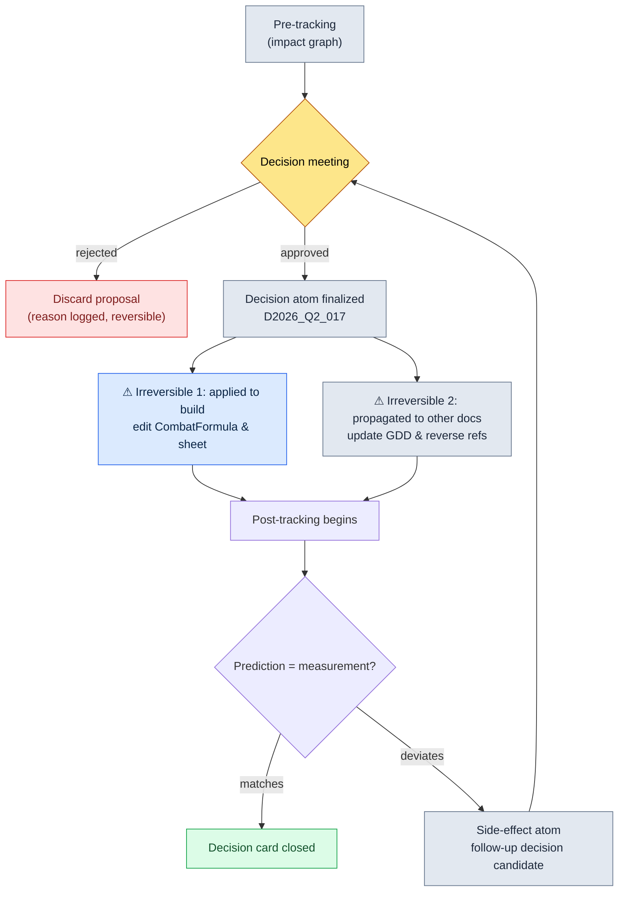

# 18.3 Pre- and Post-Decision Impact Tracking Workflow

Three weeks after launch, we sat in a retrospective tracing why PvP balance had collapsed. Working backward across the whiteboard, we arrived at a single decision made a month earlier: "Raise the global cooldown from 0.3 to 0.5." It was a reasonable proposal, agreed on within two hours in response to feedback that combos were hard to read. But that change raised the tank classes' survival rate 14% more than expected, and that broke PvP. Nobody in the decision meeting said the decision would reach all the way to tanks. The decision itself wasn't wrong. The cause of the accident was failing to see how far the decision would spread **before deciding**.

Impact tracking has to happen in two places: **before** you commit a decision (pre), to see how far it will spread, and **after** you apply it (post), to confirm it really spread only that far. This chapter ties those two trackings into a single workflow.

---

## 18.3.1 Pre-Tracking and Post-Tracking Read the Same Graph Twice

The core of decision impact analysis is surprisingly simple. Treat a single decision atom as a node, and read the edges **coming into** that node and the edges **going out** of it. Pre-tracking asks "if we change this decision, what gets affected?" (outbound plus reverse references); post-tracking asks "did the impact actually land as intended?" (the same edges, compared against measurements).

On my Project A, decisions are kept as atoms in the `decisions/` folder. Twenty-six have accumulated so far, and each atom carries the date, the people involved, the rationale, and the impact scope in its frontmatter. The tool that extracts the impact scope is `impact`, and the atom that enforces those extraction rules at the decision level is `portal_layer_change_impact_check`. These three are the actual assets behind pre- and post-tracking.

<svg viewBox="0 0 720 300" xmlns="http://www.w3.org/2000/svg" font-family="sans-serif" font-size="13">
  <rect x="0" y="0" width="720" height="300" fill="#fbfbfd"/>
  <!-- center decision node -->
  <rect x="300" y="120" width="120" height="60" rx="8" fill="#2b6cb0" stroke="#1a4971"/>
  <text x="360" y="146" text-anchor="middle" fill="#fff" font-weight="bold">Decision atom</text>
  <text x="360" y="164" text-anchor="middle" fill="#cfe2f3" font-size="11">D2026_Q2_017</text>
  <!-- inbound (left) -->
  <rect x="40" y="40" width="150" height="38" rx="6" fill="#e6f0fa" stroke="#2b6cb0"/>
  <text x="115" y="64" text-anchor="middle" fill="#1a4971">Basis: user feedback</text>
  <rect x="40" y="130" width="150" height="38" rx="6" fill="#e6f0fa" stroke="#2b6cb0"/>
  <text x="115" y="154" text-anchor="middle" fill="#1a4971">Parent decision D_011</text>
  <rect x="40" y="220" width="150" height="38" rx="6" fill="#e6f0fa" stroke="#2b6cb0"/>
  <text x="115" y="244" text-anchor="middle" fill="#1a4971">Reverse ref: GDD link</text>
  <!-- outbound (right) -->
  <rect x="540" y="40" width="150" height="38" rx="6" fill="#fdeee6" stroke="#c05621"/>
  <text x="615" y="64" text-anchor="middle" fill="#7b3d12">CombatFormula.md</text>
  <rect x="540" y="130" width="150" height="38" rx="6" fill="#fdeee6" stroke="#c05621"/>
  <text x="615" y="154" text-anchor="middle" fill="#7b3d12">CombatBalance sheet</text>
  <rect x="540" y="220" width="150" height="38" rx="6" fill="#fdeee6" stroke="#c05621"/>
  <text x="615" y="244" text-anchor="middle" fill="#7b3d12">UI combo display</text>
  <!-- inbound arrows -->
  <line x1="190" y1="59" x2="300" y2="135" stroke="#2b6cb0" stroke-width="1.5" marker-end="url(#a)"/>
  <line x1="190" y1="149" x2="300" y2="150" stroke="#2b6cb0" stroke-width="1.5" marker-end="url(#a)"/>
  <line x1="190" y1="239" x2="300" y2="165" stroke="#2b6cb0" stroke-width="1.5" marker-end="url(#a)"/>
  <!-- outbound arrows -->
  <line x1="420" y1="135" x2="540" y2="59" stroke="#c05621" stroke-width="1.5" marker-end="url(#b)"/>
  <line x1="420" y1="150" x2="540" y2="149" stroke="#c05621" stroke-width="1.5" marker-end="url(#b)"/>
  <line x1="420" y1="165" x2="540" y2="239" stroke="#c05621" stroke-width="1.5" marker-end="url(#b)"/>
  <text x="115" y="22" text-anchor="middle" fill="#1a4971" font-weight="bold" font-size="12">Inbound (why this decision)</text>
  <text x="615" y="22" text-anchor="middle" fill="#7b3d12" font-weight="bold" font-size="12">Outbound (where it spreads)</text>
  <defs>
    <marker id="a" markerWidth="8" markerHeight="8" refX="6" refY="3" orient="auto"><path d="M0,0 L6,3 L0,6 Z" fill="#2b6cb0"/></marker>
    <marker id="b" markerWidth="8" markerHeight="8" refX="6" refY="3" orient="auto"><path d="M0,0 L6,3 L0,6 Z" fill="#c05621"/></marker>
  </defs>
</svg>

Pre-tracking reads the right side (outbound) to predict "it spreads this far"; post-tracking pulls in measurements from those right-side nodes and compares them against the prediction. The same graph, read twice, for two different purposes.

---

## 18.3.2 Pre-Tracking — Reading the Graph Before You Commit the Decision

From here on, this is an actual session. I am not summarizing: the full prompt, Claude's raw output, and how a human rejected it and asked again are reproduced as they happened.

`impact` is a small pipeline that takes a decision atom's ID and produces an impact graph. It merges the inbound edges (the decision's rationale), the outbound edges (files the decision will modify), the ontology's `affects` relations, and the wikilink reverse references (other documents pointing at this decision via `[[D2026_Q2_017]]`) into a list of impact candidates.

### Prompt (Full Text)

```
Evaluate the proposal-stage pre-impact of decisions/D2026_Q2_017.md.
- Files this decision will modify (outbound)
- Documents that reverse-reference this decision as [[D2026_Q2_017]] (inbound wikilinks)
- Systems connected through the ontology's affects relations
Combine the three into impact candidates, and for each candidate, classify whether
it needs my confirmation (T1) or can be confirmed automatically. Don't fill gaps
with guesses; if there is no supporting file, mark it 'no evidence'.
```

### Claude's Raw Output

> I read `decisions/D2026_Q2_017.md`. Here is the impact graph extracted from the frontmatter.
>
> **Outbound (directly modified by this decision)**
> - `data/CombatFormula.md` — the `global_cooldown` field (explicit in the atom)
> - `sheets/CombatBalance` — the healing-skill exception rows (explicit in the atom)
> - `ui/ComboIndicator` — inferred from the atom's `affected_teams: [ui]`. **However, no specific file is in the atom → no evidence (inferred)**
>
> **Inbound wikilinks (reverse references to this decision)**
> - I searched with `grep` for `[[D2026_Q2_017]]`, but the current index shows **0 reverse references**. This appears to be a new decision that nobody has cited yet.
>
> **Ontology affects relations**
> - The ontology contains the relation `CombatFormula → affects → TankSurvival`.
> - This decision therefore indirectly affects the `TankSurvival` metric. Estimated impact: +12%.

This is where the human stops. The last line, "estimated impact +12%," is the problem.

### Human Verification and Rejection

> Rejected. Where did "estimated impact +12%" come from? That number is in neither the atom nor the ontology. If you made it up, take it out. Report only the fact that the affects relation **exists** — the size of the impact comes from running a simulation. And if you classified the UI item as 'no evidence,' why did you put it in the candidate list as T1?

### Claude's Follow-Up Response

> You're right. I'm correcting two things.
>
> 1. **"+12%" withdrawn.** There is no basis for that number anywhere in the atom or the ontology. It is a value I generated. I should report only that `TankSurvival` **is affected**, and the size should be filled in from the simulation (Layer 2) results. Its current value is `unmeasured`.
> 2. **UI item reclassified.** Since I could not find a specific file, it should have been demoted from T1 (needs confirmation) to `insufficient evidence — a human needs to specify the file`. The corrected table is below.

| Impact candidate | Edge type | Evidence | Classification |
|---|---|---|---|
| `CombatFormula.md` global_cooldown | outbound | explicit in atom | auto-confirmed |
| `CombatBalance` healing exception rows | outbound | explicit in atom | auto-confirmed |
| `TankSurvival` metric | affects | ontology relation | affected / size unmeasured |
| UI combo display (file unknown) | inferred | no evidence | human must specify file |
| inbound reverse references | wikilink | grep: 0 hits | not applicable |

This table is the deliverable of pre-tracking. The key row is `TankSurvival`. The impact that broke PvP in the opening anecdote is already showing up in pre-tracking as **"affected / size unmeasured."** If we had seen this in the meeting, the response would have been "then let's measure the size with a simulation before we decide." Letting the AI make up +12% would have been more dangerous, not less. Fake precision makes people skip verification.

---

## 18.3.3 The Decision and the Irreversible Stages

Once pre-tracking is done, the meeting decides. The moment the decision is finalized as an atom, two **irreversible stages** begin.



The reason they are irreversible is simple. A number applied to the build has already been played by users, and content propagated to other documents has already been used by teammates as the basis for their next tasks. That is why the `portal_layer_change_impact_check` atom sits as a gate **right before** these two stages. Its rule fits in one line: "If a decision includes a change that crosses Layers (data → formula → UI), a human must approve the impact candidate list once before it is applied." If only auto-confirmed items remain, it passes; if even one item reads 'human must specify file,' it blocks. The UI item from 18.3.2 becomes a blocking reason.

---

## 18.3.4 Post-Tracking — Attaching Measurements to the Same Graph

Post-tracking runs one week to one month after the change lands in the build. The job is to attach a **measured value** to each row of the impact candidate table that pre-tracking produced.

### Prompt (Full Text)

```
Post-tracking for D2026_Q2_017. Attach a measurement to each candidate in the pre-tracking table (18.3.2).
Measurement sources:
- CombatBalance sheet git diff (to confirm the change landed)
- 1000-run simulation log sim_2026q2_017.json
- launch week-1 KPI export kpi_w1.csv
Compute the gap between intended and measured values, and collect separately only the rows outside the 10% error range.
Mark missing data as 'not collected'.
```

### Claude's Raw Output

> I combined the measurements with the pre-tracking table.

| Candidate | Intended | Measured | Gap | Verdict |
|---|---|---|---|---|
| global_cooldown 0.3→0.5 | applied | confirmed via git diff | — | applied |
| healing exception rows | applied | confirmed in sheet | — | applied |
| combat duration | +15% | +14.2% | -0.8%p | within range |
| TankSurvival | (unmeasured) | +44% | no baseline | **no verdict** |
| 5:5 PvP win rate | +15%p | +29%p | +14%p | **deviation** |
| UI combo readability | improved | 65% positive user feedback | — | matches |

> Rows outside the error range (±10%): **PvP win rate +29%p (intended +15%p)**. `TankSurvival` has no intended value because its size was not measured beforehand, so no verdict is possible.
>
> Connecting the two rows: `TankSurvival +44%` appears to be the cause of the PvP win-rate deviation. Leaving `TankSurvival` as "size unmeasured" in pre-tracking foreshadowed this deviation.

### Human Verification

> Correct. Not measuring `TankSurvival` in the simulation is the root of the accident. Create a follow-up decision atom: a proposal to bring the PvP win rate back into the intended range with a dmg adjustment for the tank classes.

### Claude's Follow-Up Response

> I generated a draft of `decisions/D2026_Q2_025.md`. I set `[[D2026_Q2_017]]` on its inbound side, making it explicit via reverse reference that this decision is a **side-effect correction** of decision 17. Querying atom 17 with `impact` again now picks up one inbound reverse reference (number 25) — the slot that was 0 in 18.3.2.

This is where the graph closes. The node that was "affected / size unmeasured" in pre-tracking was confirmed as a deviation in post-tracking, and a follow-up decision came in as a reverse reference pointing at that node. The decision's entire cycle made one full loop on the same graph.

---

## 18.3.5 The Actual Commands Behind the Tracking — The grep Workflow

The inbound reverse-reference extraction in `impact` is not some fancy tool; it is one line of `grep`. It searches every document for wikilinks pointing at the decision atom.

```bash
# All documents that reverse-reference D2026_Q2_017 (inbound wikilinks)
grep -rln "\[\[D2026_Q2_017\]\]" decisions/ manuscript/ gdd/

# The decision atom's outbound edges — extract affected_files from the frontmatter
grep -A20 "affected_files:" decisions/D2026_Q2_017.md

# Post-tracking: only the rows that deviate from intent (the verdict column)
grep -E "이탈|판정 불가" tracking/D2026_Q2_017_post.md
```

Three lines run the skeleton of pre- and post-tracking. The LLM's place is to **read and interpret** these results, not to replace the search itself. grep supplies the facts (which files point at this decision), the LLM weaves those facts into an impact candidate table, and a human takes responsibility for the size of the impact and the verdict. This separation is why "don't make up +12%" worked in §18.3.2.

---

## 18.3.6 Measurement — When Pre- and Post-Tracking Are Tied Together

These figures compare my Project A before and after standardizing the decision cycle. The absolute time figures are the author's estimate (unverified), dependent on team size (mid-sized, 10–50 people); the ratios and directions were observed in actual operation.

| Item | Pre/post tracking separated | Pre/post tracking unified |
|---|---|---|
| Share of decisions where post-tracking actually ran | about 30% | 90% or more |
| Impacts flagged pre that blew up as accidents post | common | almost none (gated up front) |
| Side effect → follow-up decision linkage rate | low (passed along verbally) | auto-candidates via reverse references |
| Completeness of inbound reverse references in the decision graph | patchy | closed loop |

One thing matters most. When pre-tracking and post-tracking share the **same candidate table**, a hole left as "size unmeasured" up front gets checked in exactly that spot afterward. When they are separate, what was seen beforehand and what was measured afterward live in different formats, so they cannot be compared — which is why the tracking rate stalls at 30%. That said, targeting 100% reverse-reference completeness from day one only adds operational burden. The realistic path is to start with the habit of writing `affected_files` in decision atoms, and to fold the reverse-reference grep into your retrospective cycle, expanding gradually.

---

## 18.3.7 Common Failures

| Pattern | Remedy |
|---|---|
| Saw the impact up front but decided without measuring its size | hold the decision on every "size unmeasured" row until the simulation runs |
| The LLM makes up impact numbers | no supporting file → 'no evidence'; sizes come from simulation only |
| Post-tracking uses a different format from the pre table | add only a measured column to the same candidate table |
| Side effects handed over verbally | enforce a follow-up decision atom + reverse-reference wikilink |
| Layer-crossing changes applied without a gate | make passing `portal_layer_change_impact_check` mandatory |

---

### Key Takeaways
- Pre- and post-tracking are one workflow that reads the decision graph twice.
- An impact whose size you could not measure must surface as 'unmeasured' — that is what keeps it from becoming an accident.
- The LLM interprets the impact; the numbers are the responsibility of simulations and grep.

---

> **Beyond Games.** Reading twice — checking "how far will this spread?" before you commit a decision (pre) and "did it really spread only that far?" after you apply it (post) — is a basic move of all change management, not just games. When a company changes its pricing policy, putting the affected departments (sales, CS, billing) on a candidate table beforehand and leaving the size as "unmeasured until simulated" heads off the post-launch accident of "why didn't the billing team know about this?" For example, before introducing a new membership tier, add post-tracking columns such as CS ticket volume and churn rate to the pre table as blank cells; a month later you fill those cells with measurements and compare intent against reality directly in the same table.

## Try It Yourself

**setup** — Create the decisions folder and the tracking folder.
```bash
mkdir decisions tracking
# In one decision atom, record affected_files and affected_teams in the frontmatter
```

**prompt** — Connect pre-tracking to post-tracking through the same table.
```
Pre-impact assessment for decisions/<ID>.md: combine the outbound edges (files to modify),
inbound wikilinks, and ontology affects relations into an impact candidate table,
marking items without evidence as 'no evidence' and sizes as 'unmeasured'. Don't make up numbers.

(after the change lands in the build)
Attach only a measured column to the same candidate table and collect the rows more than 10% off from intent.
Turn each deviating row into a follow-up decision atom draft and set a [[<ID>]] reverse reference.
```

**verify** — Confirm with grep that the graph has closed.
```bash
grep -rln "\[\[<ID>\]\]" decisions/   # loop closed if the follow-up decision's reverse reference shows up
grep -E "이탈|미측정" tracking/<ID>_post.md   # check for remaining gaps
```

## Solo Scale-Down

If you are a solo game developer, drop the meetings, owners, and deadlines entirely. When you write a one-line decision in a `decisions/` markdown file, fill in **just two fields**: `affected_files:` (the files this decision will touch) and `expected:` (the change you intend). After you build, open those files and check with your own eyes that things went as intended; if something is off, add one `actual:` line to the same file. One tool is enough: `grep -rln "[[decision-ID]]"`. One field before, one field after — that is the minimal form of pre/post tracking.
