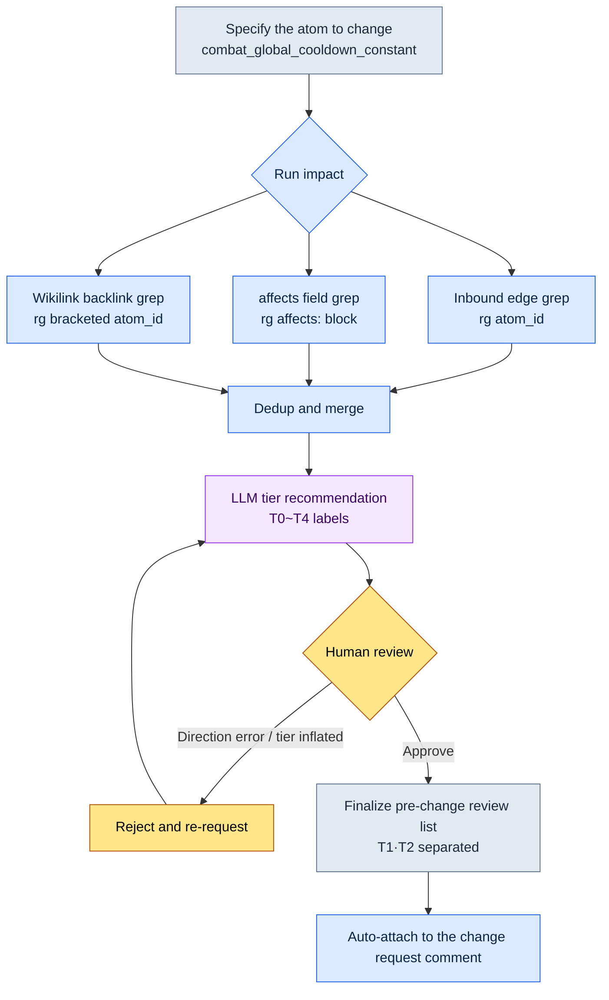

# 18.4 The Document Impact Grep Workflow — Pulling the Impact Scope with impact

Monday, 10 a.m. Team member A, who owns combat, dropped one line into the team messenger: "Can we lower the global cooldown (GCD) from 0.5 seconds to 0.4?" It is a one-number change. On the surface. I read that line and my hands stopped. How many documents have this number entered in them, how many skill balance atoms were built on this constant as a premise, which sheets' formulas break if it changes — none of it came to mind. And believing it has come to mind is exactly how accidents happen. The misses that kept erupting at 8 to 12 per quarter — the "I never saw that document" kind — were precisely this illusion.

So I decided to stop memorizing the answer. Instead, I type one line.

```
impact combat_global_cooldown_constant
```

This chapter looks at what that one line spits out, raw and unedited. It shows that "extracting the impact scope" is not an abstraction — it is the concrete act of scraping three channels with grep: inbound edges, ontology affects, and wikilink backlinks.

---

## 18.4.1 The Impact Scope Arrives Through Three Channels

"What is affected if I change this atom?" is actually three questions. Mix the three and the answer blurs; separate them and each one falls out as a single line of grep.

First, **inbound edges** — who points at me. If atom A references atom B, that is an edge in the A→B direction. When you change B, the danger lies in the As pointing at B — the arrows coming into B. So you look at inbound, not outbound (who I point at). The shockwave of a change travels backward, up the arrows.

Second, **ontology affects** — what it semantically influences. This is the `affects:` field declared in an atom's frontmatter. Even when the name never appears in the text, it is a semantic link the designer declared in advance: "this affects that." It is the alias-and-synonym problem — the one grep cannot catch — entered by a human ahead of time.

Third, **wikilink backlinks** — documents that explicitly link to me in `[[atom_id]]` form. This channel is the most reliable, because it is not a coincidental word match but a link an author placed on purpose.

Here is how the three channels relate.

<svg viewBox="0 0 640 300" xmlns="http://www.w3.org/2000/svg" font-family="sans-serif" font-size="13">
  <rect x="250" y="125" width="140" height="50" rx="8" fill="#2d3142" />
  <text x="320" y="148" fill="#ffffff" text-anchor="middle" font-weight="bold">combat_global</text>
  <text x="320" y="165" fill="#ffffff" text-anchor="middle" font-weight="bold">_cooldown_constant</text>

  <rect x="20" y="20" width="170" height="44" rx="6" fill="#e8eaf0" stroke="#5b6178" />
  <text x="105" y="40" text-anchor="middle" font-weight="bold">Inbound edges</text>
  <text x="105" y="56" text-anchor="middle" font-size="11">Who references me</text>

  <rect x="20" y="128" width="170" height="44" rx="6" fill="#e8eaf0" stroke="#5b6178" />
  <text x="105" y="148" text-anchor="middle" font-weight="bold">Ontology affects</text>
  <text x="105" y="164" text-anchor="middle" font-size="11">Declared affects: field</text>

  <rect x="20" y="236" width="170" height="44" rx="6" fill="#e8eaf0" stroke="#5b6178" />
  <text x="105" y="256" text-anchor="middle" font-weight="bold">Wikilink backlinks</text>
  <text x="105" y="272" text-anchor="middle" font-size="11">Explicit [[atom_id]] links</text>

  <line x1="190" y1="42" x2="252" y2="135" stroke="#5b6178" stroke-width="2" marker-end="url(#arr)" />
  <line x1="190" y1="150" x2="248" y2="150" stroke="#5b6178" stroke-width="2" marker-end="url(#arr)" />
  <line x1="190" y1="258" x2="252" y2="165" stroke="#5b6178" stroke-width="2" marker-end="url(#arr)" />

  <rect x="450" y="125" width="170" height="50" rx="8" fill="#3d5a3d" />
  <text x="535" y="148" fill="#ffffff" text-anchor="middle" font-weight="bold">Impact scope list</text>
  <text x="535" y="165" fill="#ffffff" text-anchor="middle" font-size="11">Deduplicated · tier labels</text>
  <line x1="390" y1="150" x2="448" y2="150" stroke="#3d5a3d" stroke-width="2.5" marker-end="url(#arr2)" />

  <defs>
    <marker id="arr" markerWidth="8" markerHeight="8" refX="6" refY="3" orient="auto"><path d="M0,0 L6,3 L0,6 Z" fill="#5b6178"/></marker>
    <marker id="arr2" markerWidth="8" markerHeight="8" refX="6" refY="3" orient="auto"><path d="M0,0 L6,3 L0,6 Z" fill="#3d5a3d"/></marker>
  </defs>
</svg>

`impact` is the tool that bundles the three channels into one. The next section shows the output this tool actually produces, in full.

---

## 18.4.2 Worked Transcript — Running impact Once

Instead of explaining in the abstract, I walk through one real cycle from start to finish: the full prompt, the tool's raw output (untouched), the parts I verified and rejected, and the re-request — all of it.

### Prompt (Full Text)

I asked Claude to run the `impact` workflow. The workflow itself is a shell script that calls ripgrep, but interpreting the results and recommending tiers is Claude's job.

```
Run the impact workflow on combat_global_cooldown_constant.
Pull each of the three channels (inbound edges / affects / wikilink backlinks) with grep,
merge the duplicates, and attach an impact tier recommendation to each affected target.
The change: "global cooldown 0.5s → 0.4s".
```

### Claude's Raw Output (Verbatim, No Summary)

```
I will run the three channels in order.

[1/3] Inbound edges — locations that reference this atom
$ rg -n "combat_global_cooldown_constant" --type md docs/ atoms/

atoms/combat/combat_skill_cooldown_rule.md:34:  base: combat_global_cooldown_constant
atoms/combat/combat_gcd_ui_feedback.md:12:  depends_on: combat_global_cooldown_constant
docs/spec/combat_v3.md:42:  based on the global cooldown (combat_global_cooldown_constant)
docs/spec/skill_design.md:18:  cooldowns are designed as multiples of combat_global_cooldown_constant
docs/balance/refgame_comparison.md:77:  refgame is 0.5s; our combat_global_cooldown_constant is the same

→ 5 direct references found.

[2/3] Ontology affects — places that name this atom in an affects field
$ rg -n "^\s*-?\s*combat_global_cooldown_constant" -B3 atoms/ | rg -B3 "affects:"

atoms/combat/combat_dps_curve.md:
  affects:
    - combat_global_cooldown_constant   ← (note: direction needs checking)

→ 1 hit. Note, however, that this is dps_curve declaring that it "affects" this atom,
  so the direction may be reversed. Human review needed — see the verification items below.

[3/3] Wikilink backlinks — [[...]]-style links
$ rg -n "\[\[combat_global_cooldown_constant" --type md

docs/spec/combat_v3.md:42:  ...[[combat_global_cooldown_constant]]...
atoms/combat/combat_skill_cooldown_rule.md:34: ...[[combat_global_cooldown_constant]]...

→ 2 hits. Both are locations already caught in [1/3] (duplicates).

[Merged — unique affected targets after dedup]
1. atoms/combat/combat_skill_cooldown_rule.md   (inbound+wikilink)
2. atoms/combat/combat_gcd_ui_feedback.md       (inbound)
3. docs/spec/combat_v3.md                        (inbound+wikilink)
4. docs/spec/skill_design.md                     (inbound)
5. docs/balance/refgame_comparison.md            (inbound)
6. atoms/combat/combat_dps_curve.md              (affects — direction unconfirmed)

[Tier recommendations — per the five impact tiers of 18.2]
1. combat_skill_cooldown_rule    → T1 (every skill cooldown is a multiple of this constant)
2. combat_gcd_ui_feedback        → T2 (UI feedback timing; visual recalibration needed)
3. combat_v3.md                  → T3 (spec doc number update)
4. skill_design.md               → T3 (design doc number update)
5. refgame_comparison.md         → T2 (benchmark comparison table; recompute the gap vs. refgame)
6. combat_dps_curve.md           → TBD (tier after direction check)
```

### Human Verification / Rejection

Two places stopped me here.

Rejection 1 — **the affects direction**. `combat_dps_curve.md` listing our constant in its `affects:` field is a declaration that dps_curve *affects* this constant. But what we are changing now is the constant itself. The arrow points the other way. dps_curve does not change the constant; rather, when the constant changes, the premise of dps_curve's calculation is shaken. Claude was right to hold it honestly with "direction needs checking." I **kept it as an affected target** but reclassified it — not affects, but a "reverse-direction semantic dependency." Confirmed at T2.

Rejection 2 — **rating the refgame comparison table T2** was an overestimate. `refgame_comparison.md` is a plain number-comparison table against an external game. If our number changes, you fix one cell from 0.5 to 0.4 and you are done; no system uses this table as input. Demoted to T3 (doc number update).

### Re-Request

```
Two corrections — redo the impact table.
1) Keep combat_dps_curve.md as an affected target, relabel it "reverse-direction semantic dependency",
   tier confirmed T2.
2) Demote refgame_comparison.md from T2 to T3 (no system uses it as input; one table cell to fix).
Then pull out only T1 and T2 into a "must review before the change" list.
```

Claude's final result came back as follows.

```
[Must review before the change — T1·T2]
T1  combat_skill_cooldown_rule.md   every skill cooldown is a multiple of this constant
T2  combat_gcd_ui_feedback.md       recalibrate UI feedback timing
T2  combat_dps_curve.md             reverse-direction semantic dependency — recheck the DPS curve's premise

[Doc number updates only — T3]
T3  combat_v3.md / skill_design.md / refgame_comparison.md
```

The six affected targets that "did not come to mind" at the start became a prioritized list after one grep cycle and two human judgments. That is what impact-scope extraction actually is. The tool scrapes the candidates exhaustively; a human settles direction and tier.

---

## 18.4.3 The Extraction Pipeline — What Is Automated and What Is Human

Generalizing the previous section's cycle into a flow gives this. The key is where the automated steps and the human step part ways.



The automated parts are the three grep channels, the merge, and the tier *draft*. The human part is exactly one thing: **the final call on direction and tier**. The affects reversal and the refgame demotion from the earlier cycle happened precisely at this spot. Trust the tool 100% and you get two kinds of accidents: dropping the reversed affects from the affected list, or overprotecting a comparison table and running a needless review every single time. Placing the boundary between automation and human judgment at this one point is the design intent of the workflow.

---

## 18.4.4 The Three-Channel Grep Pattern Reference

Here are the ripgrep patterns impact calls internally, written out as is. This is what the tool really is — not fancy infrastructure, but three proven lines of regex.

Inbound edges. Every location where the atom ID appears in document text. The widest scrape.

```bash
rg -n "combat_global_cooldown_constant" --type md docs/ atoms/
```

The affects field. Only the cases where the atom ID sits inside an `affects:` block. `-B3` pulls in the three preceding lines, so a human can eyeball whether it is an affects block or some other field.

```bash
rg -n "combat_global_cooldown_constant" -B3 atoms/ | rg -B3 "affects:"
```

Wikilink backlinks. Only explicit links wrapped in double brackets. The most reliable, so they go to the front of the review queue.

```bash
rg -n "\[\[combat_global_cooldown_constant" --type md atoms/ docs/
```

Across the three patterns, precision and recall trade off exactly. Wikilinks are nearly 100% precise but miss anything the author never linked. Inbound edges scrape everything but mix in coincidental word matches (noise). Affects captures meaning but muddles direction. Only together do they plug the holes. Use any one alone and something will always leak.

---

## 18.4.5 Tying into the Decision Card — portal_layer_change_impact_check

Impact-scope extraction is one stage of the decision cycle (§18.3). The moment a decision card is registered, impact runs with the card's `affected_atoms` slot as input. The atom that enforces this link is `portal_layer_change_impact_check`.

This atom's job is to make sure that when a change crosses Layers, the impact check cannot be skipped. The cooldown constant change is one number in L1 (systems), but its impact spreads to L3 (data sheet formulas) and L4 (build QA items). portal_layer_change_impact_check judges whether a change crosses a Layer boundary, and if it does, it forces an impact run.

```yaml
---
name: portal_layer_change_impact_check
type: gate
description: A change that crosses a Layer boundary must not ship to the build before passing the impact check
trigger:
  - affected_atoms is non-empty when a decision card is registered
  - the changed atom's layer != the affected atom's layer
action:
  - run impact (three-channel grep)
  - if any T1·T2 affected targets exist, block the merge until the "review complete" box is checked
---
```

In the cooldown case, what this gate caught was not `combat_skill_cooldown_rule` (L1) but the CombatBalance sheet (L3) that takes the rule as input. The sheet's cooldown-multiplier column builds its formulas on the constant. Grep scraped the atom out of the documents, and the gate pushed back: "this crosses a Layer — check the sheet too." Without the two tied together, you get the classic miss: the documents get updated while the sheet keeps running on the old premise.

---

## 18.4.6 Measurement — What the Workflow Recovered

These are the changes observed in my Project A operations. The time figures are the author's estimates (unverified); the miss counts are values actually tallied in the quarterly retrospectives.

| Item | Without the workflow | With impact in operation |
|---|---|---|
| Time to identify affected atoms | relying on memory (incomplete) | 1–2 minutes (exhaustive grep) |
| Missed-change accidents | 8–12 per quarter (tallied, measured) | 1–2 per quarter (tallied, measured) |
| Impact attached to change requests | a human, occasionally | enforced by the gate |
| New team member grasping impact | days (oral handover) | 30 minutes (tool + cards) |
| Infrastructure cost | graph DB adoption under review | ripgrep + shell only |

The last row is the conclusion of this entire chapter. Project A evaluated a graph DB and a search index, and ended up settling on ripgrep and a small shell script. A precision instrument is, in fact, more accurate than a tape measure. But the tool you pull out every day converges on the tape measure — the one that does not break and needs no infrastructure. Misses dropped from 8–12 to 1–2 per quarter not because the tool is sophisticated, but because it runs every single time, without exception.

---

## 18.4.7 Limits — What Grep Cannot Catch

Even with the three channels bundled, leaks remain. Using a tool while knowing its limits is different from trusting it blindly.

Aliases and abbreviations. If a document writes only "GCD (Global Cooldown)," it never matches a `combat_global_cooldown_constant` grep. The mitigation is to expand the search term into a regex — `(combat_global_cooldown_constant|GCD|전역\s?쿨다운)`. Keep a team abbreviation dictionary as a separate file and compose it into searches automatically.

The irreversible zone. Grep is a tool for the reversible stage. Before a change ships to the build, the impact among documents, atoms, and sheets is fully visible to grep. But what happens after the build goes out and players feel the 0.4-second cooldown — community complaints, a shift in perceived tempo — is not something grep can search. So the principle is simple: **finish every grep review before the change ships to the build.** Once you cross into the irreversible stage, what grep can tell you drops off sharply.

Where LLM review fits. Just as a human settled the affects direction and the tiers in the earlier cycle, inserting an LLM to judge the relevance of grep candidates filters out the noise. But the LLM is not 100% either, so final approval stays with a human. Accuracy reaches an operable level in a structure where tool, LLM, and human each filter one stage. Remove any one stage, and the kind of accident that stage was catching comes right back.

---

> **Beyond Games.** The habit of finding "what shakes if I change this item" by exhaustive search instead of memory pays off the same way for any office worker who lives in documents and spreadsheets. When you revise one clause in a terms-of-service document, trying to recall from memory every contract, notification email, and customer FAQ that cites that clause number guarantees a miss; grep the whole folder by keyword, scrape it exhaustively, then have a human sort each hit into "must fix / flag only / unrelated," and the misses disappear. For example, when an accountant changes a particular account code, searching exhaustively for every settlement sheet, report template, and macro that references the code, and turning the hits into a pre-change review list, structurally prevents the quarterly closing accident of "I never saw that one sheet."

## 18.4.8 Try It Yourself

### setup

If your documents and atoms live in plain text (.md) and ripgrep (`rg`) is installed, you are ready. An atom ID naming convention (snake case, unique IDs) raises grep precision considerably.

```bash
# Verify: how many times one atom ID appears across all docs
rg -c "combat_global_cooldown_constant" docs/ atoms/
```

### prompt

Give it the atom you are changing and the change itself, and ask for the three-channel extraction plus tier recommendations.

```
Run impact on <atom_id>.
Pull each of the three channels (inbound edges / affects / wikilink backlinks) with grep,
merge the duplicates, then recommend an 18.2 impact tier (T0~T4) for each.
The change: <what, changed to what>.
Separate out only T1·T2 into a "review before the change" list.
```

### verify

Do not take the tool's output on faith; check two things by hand.

1. **The affects direction** — for each item caught via affects, check whether it is the side doing the affecting or the side being affected. If the direction is reversed, fix the label.
2. **Tier inflation/deflation** — if a table or a comparison-only document comes up as T1·T2, ask: "Does any system use this document as input?" If not, demote it to T3.

After checking, attach only the T1·T2 list to the change request comment, and the cycle closes.

### Solo Scale-Down

If you work alone — no tooling, no atom graph — one command and one memo column get you the same effect.

```bash
# Exhaustive search of the whole folder for the concept name you are about to change
rg -n "전역쿨다운|GCD|global_cooldown" .
```

Paste the search results straight into a notepad and, next to each line, write one of three labels by hand: "must fix / flag only / unrelated." That is the one-person version of impact. The point is not the tool's sophistication but the procedure itself: scrape exhaustively instead of relying on memory, then have a human classify. With the procedure, misses shrink; without it, that Monday-morning blankness repeats every time.

---

### Key Takeaways
- The impact scope arrives through three channels — inbound edges, affects, and wikilink backlinks — and impact scrapes all three exhaustively
- Automation covers up to the grep merge and the tier draft; the human owns exactly one point — the affects direction and the tier call
- Grep is a tape measure for the reversible stage: finish the review before the change ships to the build — and it outlasts a graph DB

### Next Chapter Preview
- 19.1 The Team Lead's Operation — how decision and impact tracking runs at team scale
