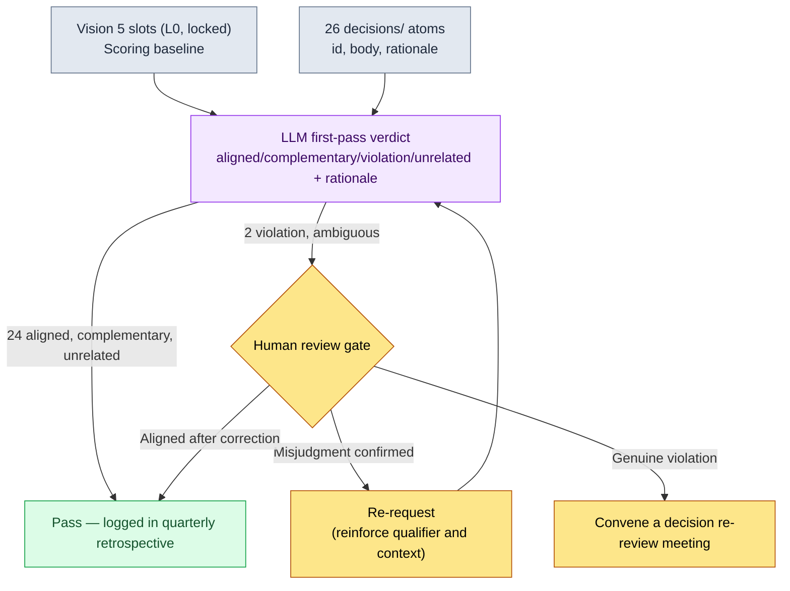

# 19.1 Turning the Vision into a Scorecard for Decisions — Running 26 decisions/ Atoms Through an LLM

> Primary audience: design directors and lead designers running mid-sized (10–50 person) teams
> Scaled-down version for solo/hobbyist readers: §19.1.8 "If You're Solo, Just This Much"

Even teams that have written a solid one-page vision document repeat the same accident. The vision hangs on the wall, but nobody checks whether the decisions piling up every week actually match it. Someone pulls it out once at the quarterly retrospective, but by then three more decisions have already been stacked on top of the one that drifted. For a vision to become "the reference point in disputes," what matters is not the writing but **running every decision against it**. And that cross-checking is exactly the kind of work that is tedious and easy to skip when done by hand — a perfect job to hand to AI.

This chapter ties two things together. The front half is a workflow that turns an already-written vision into a scorecard for decisions — one full cycle of running the 26 actual decision atoms from my project through an LLM, receiving "vision slot violation" verdicts, and having a human catch one misjudgment among them. The back half is the question of whose decisions that scorecard covers — that is, **delegation of authority**. General leadership theory (why vision matters, why delegation is a growth tool) already fills other books, so this chapter stays in one spot: *running those principles as an AI workflow*.

---

## 19.1.1 Vision, Roadmap, Schedule — Just Enough on Why the Three Layers Differ

First, what does it mean for a vision to filter decisions? Vision, roadmap, and schedule are not the same thing. They differ in time unit and rate of change, and when that difference collapses, schedule pressure starts shaking the vision.

| Layer | Horizon | Rate of change | What checking against the vision means |
|---|---|---|---|
| Vision | 5–10 years | Almost never | The baseline decisions must align with |
| Roadmap | 1–3 years | Quarterly | The middle layer that translates vision into a timeline |
| Schedule | 1–3 months | Weekly | Not checked against the vision directly |

The key point is that **decisions are checked against the vision — the layer that changes least**. When the schedule is tight, you do not change the vision; when the schedule conflicts with the vision, you fix the schedule. This hierarchy has to be firm for the automated check in the next section to mean anything. If the baseline of the check wobbles every week, the check itself is pointless.

The vision is one page, five slots, done. Here is the skeleton of my project's vision document. These slots become the scoring criteria for the LLM check in §19.1.3, so take in the shape first.

```markdown
---
title: Project A Vision v2
layer: L0
locked: true   # Changes require game director + CEO agreement
---

## Slot 1. What We Are Building
A mobile-first MMORPG set in a Korean fantasy world.

## Slot 2. Who It Is For
Users in their 30s to 50s, mostly on mobile, who enjoy serious storytelling.

## Slot 3. Why (Differentiation)
- Deep storytelling through a multi-layered narrative (depth, not mass production)
- Simultaneous operation in Southeast Asia + Korea

## Slot 4. How (Values)
- Respect users' time (minimize filler content)
- Decisions balance data + people
- Team consensus takes priority over decision speed

## Slot 5. What We Are Not
- Not a runaway F2P monetization model
- Not PvP-centric
- No forced N hours of daily attendance
```

Slot 5 ("What We Are Not") does the most work in the check. Violations usually come not from "what we decided to do" but from quietly doing "what we decided not to do."

---

## 19.1.2 The Decisions Are Already Stacked Up as Atoms

What do you run the vision against? My team pins every major decision down as one atom each in the `decisions/` folder. Each is a factual record with date, parties, and rationale spelled out, and 26 of them have accumulated so far. The input to the check is these 26 — you are not creating anything new, you are running what already exists.

Here is the actual shape of one decision atom (anonymized).

```markdown
---
type: decision
id: D0019
date: 2026-05-12
deciders: [game director, data director]
tier: T1
---
# refgame_selective_adoption_for_mobile
Selectively adopt part of the reference MMORPG's combat data for the
mobile build.
Rationale: the combat pacing is proven on a 6-inch mobile screen, and
redesigning from zero would push the alpha schedule back by a quarter.
However, the monetization and attendance-incentive structures are not
adopted.
```

From the 26, here are a few representative ones used as check input (actual atom names, §A.3.3).

| atom id | atom name (anonymized) | tier | One-line summary |
|---|---|---|---|
| D0007 | `claude_role_transition_phase2` | T1 | Promote Claude from passive assistant → active partner |
| D0014 | `dataset_scope_alpha_split` | T2 | Finalize the alpha dataset split criteria |
| D0019 | `refgame_selective_adoption_for_mobile` | T1 | Selectively adopt reference game combat data |
| D0021 | `procedural_capability_frontier_5stage` | T1 | Define the 5 stages of procedural generation capability |
| D0023 | `class_keyword_world_only` | T2 | Restrict class keywords to the game world |

This table is the input data for the prompt in the next section. Running all 26 at once is the point: if a human cross-checks 26 decisions against the vision one by one at a retrospective, it takes half a day, focus fades from the midpoint, and violations slip through. That tedious first pass is what gets handed to the LLM.

---

## 19.1.3 [Worked Transcript] Running 26 Decisions Against the Vision

Let's watch one cycle all the way through. The input prompt can be copied as is; the output is a reconstruction of an actual session.

### Step 1 — The Prompt: Hand Over the Vision as a Scorecard and Force a Verdict Format

```
Run each of the 26 decision atoms below against the 5 vision slots, and
judge whether each decision is aligned, complementary, a violation, or
unrelated. For violations and unrelated ones, add a one-line rationale
saying which slot and why (pay special attention to Slot 5, "What We
Are Not"). Mark anything ambiguous as "ambiguous" and pass it to me.
No rationale needed for aligned ones. Give me a table only
(id | verdict | conflicting slot | rationale | ambiguous), no overall
commentary.

[Vision 5 slots — paste the full text from §19.1.1]
[26 decision atoms — id, body, rationale]
```

Half of this prompt is "forcing the verdict format." Given free rein, the LLM smears all 26 into "broadly aligned." **The four-label verdict scheme, the rationale requirement only for violation and unrelated, and the escape hatch "if it's ambiguous, pass it to a human"** are the heart of this prompt. Naming Slot 5 explicitly in the rationale instruction is deliberate too — violations come from "what we decided not to do."

### Step 2 — Claude's Output (Reconstructed, Excerpt)

```
| id    | Verdict   | Conflicting slot | Rationale                                  | Ambiguous |
|-------|-----------|------------------|--------------------------------------------|------|
| D0007 | Unrelated | —                | Claude ops decision. Different axis from the game vision |      |
| D0014 | Unrelated | —                | Dataset split. Internal infrastructure decision |      |
| D0019 | Violation | Slot 5           | Adopts reference game combat data → possible | ★    |
|       |           |                  | conflict with "not a runaway F2P monetization model" |      |
| D0021 | Aligned   | Slot 3           |                                            |      |
| D0023 | Aligned   | Slot 1           |                                            |      |
| ...   |           |                  |                                            |      |

(Of 26: 18 aligned · 3 complementary · 3 unrelated · 2 violations)
Violation/ambiguous review requested: D0019, D0026 — human review needed
```

The most valuable part of the output is not the table but **the bottom: the two violations and the ambiguity flags**. The LLM automatically filtered out 24 of the 26 and raised only the 2 that a human needs to look at. A half-day cross-check shrank to reviewing 2 items. But one of those 2 is a misjudgment.

### Step 3 — Verification and Veto (the Human's Seat)

A human rereads the D0019 (`refgame_selective_adoption_for_mobile`) verdict. The LLM saw "adopts reference game combat data" and judged it to conflict with Slot 5's "not a runaway F2P monetization model." On the surface, the words look plausible — the reference game is famous for aggressive monetization.

But read the atom body to the end and there is a final sentence: **"However, the monetization and attendance-incentive structures are not adopted."** The decision takes only the combat pacing data and explicitly excludes the monetization structure. If anything, it is a decision that upholds Slot 5. The LLM failed to give that final qualifying sentence its weight in the verdict and, pulled by the source word "reference game," classified the decision as a violation. This is not a Slot 5 violation — it is **aligned**.

Why this kind of misjudgment happens is clear. The LLM weighs the decision's *source* (which game it came from) and the decision's *content* (what was taken and what was discarded) equally. A human knows that the qualifying clause "however, we do not adopt X" is the heart of the decision. So the human vetoes and re-requests.

```
Look at D0019 again. The last sentence of the body — "However, the
monetization and attendance-incentive structures are not adopted" — is
the key. Split what is adopted (combat pacing data) from what is
excluded (monetization/attendance structures), and judge again which
slot each side falls under.
```

The LLM answered again: "The adopted part (combat data) aligns with Slots 1 and 2; the excluded part (monetization structure) actively supports Slot 5. Overall verdict: aligned. The previous violation verdict was an error — an overreaction to the source word." With this one round trip, D0019 was corrected from violation to aligned. The remaining genuine review item is one: D0026.

This cycle is the heart of this chapter. **The LLM reduces 26 items to 2, but one of those 2 can be a misjudgment.** The automated check does not eliminate human review; it is a tool that lets a human focus on 2 items instead of 26. If a human does not read those 2 to the end, a perfectly sound decision goes to a meeting labeled "vision violation" and sparks a pointless dispute.

---

## 19.1.4 The Check Flow at a Glance

Keep the cycle above as a diagram, and the same flow repeats every quarter from then on. The key point is that an LLM verdict never overturns a decision automatically. Only violations and ambiguous items go up to the human gate, and discarding, correcting, or approving is done by a human.



Human hands touch only two places: where vision and decisions are entered cleanly (the top), and the gate where the few items the LLM raised as violation or ambiguous are read to the end and judged (the middle). The tedious 26-item cross-check in between is run by the LLM. It is the same design as the city generator in §6.2, where lint did not auto-discard violations but only raised alerts to the writer gate — the machine picks the suspects, and a human decides whether they live or die.

---

## 19.1.5 Whose Decisions Does the Vision Check Cover — Delegation of Authority

A natural question follows: did the game director make all 26 decisions? They had better not have. If the lead makes every decision personally, they become the bottleneck; if they delegate everything, the vision weakens. The vision check is also a safety net for **running delegated decisions through the same scorecard**.

Decisions have tiers, and the tier is the authority. Here is my team's authority matrix.

| Tier | Decider | Reviewer | Notified | Vision check target? |
|---|---|---|---|---|
| T0 vision/core | Game director + CEO | All leads | Whole team | The vision itself (the check baseline) |
| T1 system/cross-discipline | TF chair + game director | TF members | Discipline teams | ✅ Required |
| T2 discipline/mid-level | Discipline director | Seniors | Discipline team | ✅ Required |
| T3 one-off/small | Senior | Owner | Directly affected | Spot check |
| T4 immediate/hotfix | Owner | Senior (after the fact) | Game director (after the fact) | Excluded from the check |

Most of the 26 in `decisions/` are T1 and T2 — delegated decisions. The game director does not personally look at every T2. Instead, the vision check (§19.1.3) runs the delegated T1/T2 decisions against the vision once a quarter. **The safety net of delegation is the vision check itself.** T0 is not a check target but the check's baseline, and T4 hotfixes are excluded because they are high-volume and have almost no vision impact.

Delegation itself does not go to full autonomy in one move; it advances gradually through four stages.

| Stage | Authority | Relation to the LLM check |
|---|---|---|
| 1. Direct instruction | "Do it this way" | The delegator decides; no check needed |
| 2. Advice + decision report | "Decide with X in mind" | Vision cross-check reviewed together at reporting |
| 3. After-the-fact report | "Decide, then tell me the outcome" | Atom pinned → included in the quarterly check |
| 4. Autonomous decision | No reporting duty (within tier limits) | As long as an atom is left, the check covers it after the fact |

Stage 4 autonomous decisions carry the greatest risk of drifting from the vision — and that is exactly the risk the §19.1.3 check catches after the fact. Even a T2 decision made autonomously gets caught by the quarterly check automatically, as long as it is pinned as an atom. This is why the freedom of delegation and the consistency of the vision do not collide — decide freely, but the decision is left as an atom, and the atom is run against the vision every quarter.

---

## 19.1.6 Handling Numbers Honestly

A vision-and-delegation chapter faces a strong temptation to insert tables like "after adopting the vision, meetings dropped from 90 to 45 minutes" or "after delegating, the director's decision load fell from 30 a week to 5." Numbers like that, unverified, erode the book's credibility. The numbers in this chapter are handled in exactly one of three ways.

First, **countable things are recorded as measured**. The `decisions/` atoms currently number 26 (measured as of May 2026). The number of items the LLM's first pass raised to the human gate, and the number corrected as misjudgments, are measured values counted from session logs. That 1 of the 2 violation verdicts in the worked transcript above (D0019) was a misjudgment is also the result of an actual session.

Second, **effects are stated as direction only**. "A half-day cross-check shrank to reviewing a handful of items" is the direction of the structure, not an absolute time. The exact time saved varies with decision count, team size, and atom body length, so the right reading is the structural difference between "26 by hand" and "LLM first pass + human gate." Outcome metrics like meeting time or morale scores are not driven by the vision alone, so I do not assert causation.

Third, **only the measurable is promised**. What this workflow can actually measure: the number of decisions run through the vision check per quarter, the number raised to the human gate, the misjudgment rate (the share of LLM violation verdicts a human corrected to aligned), and the number of unpinned decisions (delegated decisions that escaped the check because no atom existed). These four can be spoken in meetings as numbers, not "feelings." The **misjudgment rate** in particular proves, with a number every quarter, why LLM verdicts must not be taken at face value.

---

## 19.1.7 Common Failures

| Pattern | Why it fails | Remedy |
|---|---|---|
| Writing the vision but never running decisions against it | The vision stays wall decoration and decisions go their own way | Run the 26 atoms against the vision every quarter (§19.1.3) |
| Taking LLM violation verdicts straight to a meeting | Misjudgments (like D0019) spark pointless disputes | For violation/ambiguous items, a human reads the atom body to the end |
| Not leaving decisions as atoms | Delegated decisions drop out of the check entirely | Make atom pinning mandatory in after-the-fact reporting (delegation stage 3) |
| Checking even T4 hotfixes | Volume grows while vision impact stays near zero | Limit check targets to T1/T2 |
| Skipping from delegation stage 1 to 4 | Autonomous decisions accumulate out of line with the vision | Gradual delegation + quarterly checks as after-the-fact cover |

The third is the one most often missed. The more smoothly autonomous a team is, the more it agrees on decisions verbally and never pins the atom. Then the §19.1.3 check sees only pinned decisions, and the most freely made decisions fall into the check's blind spot. The freedom of delegation is safe only on the premise of atom pinning.

---

> **Beyond Games.** Running the vision against every decision, and delegating authority, are not homework unique to game teams — they are every manager's job. Pin your department's mission down as one page with five slots ("what we do / for whom / why / how / what we are not"), and once a quarter you can have an LLM do a first-pass cross-check of whether the practical decisions piling up each week have drifted from that mission — it is especially good at catching violations where something you decided not to do creeps back in quietly. For example, running the decisions a team lead has delegated through the department mission each quarter becomes a safety net that catches, after the fact, autonomous decisions that strayed off course. Just do not take the items the LLM flags as "violations" straight into a meeting — one of them may be a misjudgment, so a human has to read them to the end.

## 19.1.8 Try It Yourself — One Step You Can Take Today

> **If You're Solo, Just This Much**: You do not need a decision atom folder. Write the vision for your own project (or hobby game) as a single page using the five slots from §19.1.1. Then jot down the last 5–10 decisions you made as one-line memos, paste the prompt from §19.1.3 as is, and run them through an LLM once. If even one "violation" verdict comes back, reread that decision's memo to the end and argue back yourself about whether the LLM is right. That is how you internalize what bundle of judgments a vision check really is — and why LLM verdicts must not be taken at face value.

If you are on a team, start with this one step. Lock the vision as one page with five slots (L0, locked), and pin each T1/T2 decision from the latest quarter as one atom in a `decisions/` folder. With even 10 atoms accumulated you can run the §19.1.3 prompt once, and if that first cycle catches a single delegated decision out of line with the vision, the value of this workflow shows immediately.

---

### Key Takeaways
- A vision matters less in the writing than in the running — run the 26 decisions/ atoms against the 5 vision slots every quarter.
- The LLM reduces 26 items to a handful, but one of them can be a misjudgment (D0019).
- Leave delegated T1/T2 decisions as atoms, and the vision check becomes delegation's after-the-fact safety net.

### Next Chapter Preview
- 19.2 Conflict Management, Team Culture + Meeting Leadership — divided authority breeds friction. Classifying conflict and backing meeting operations with AI
