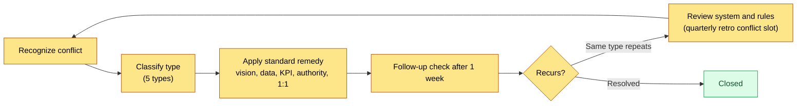
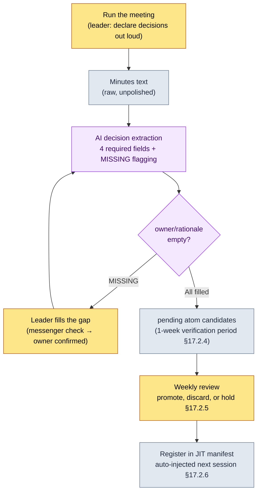

# 19.2 Classify Conflicts and Don't Let Meeting Decisions Slip Away — AI Assistance for Meeting Leadership

> Primary audience: directors and team leads who make 50+ decisions per quarter in meetings (midsize teams of 10–50)
> Scaled-down version for solo/hobbyist readers: §19.2.8 "If You're Solo, Just This Much"

I once ran a meeting well for 90 minutes, only to watch the same agenda item land back on the meeting table a week later. We had clearly decided — but who owned what was written down nowhere. The minutes said only "Discussed global cooldown," and "settled on 0.5 seconds, owner: Team Member A" evaporated from the heads of the people in the room within a week. The place where a leader's meetings collapse is mostly not during the meeting, but **in the short gap right after it ends, before the decision hardens into a record**.

This chapter covers two chunks of a team lead's job. The first half is **how to route conflicts to standard remedies by type instead of solving each one from zero**; the second half is the spine of this chapter — **a worked transcript in which AI extracts the decisions from a meeting but is forced to block any whose owner or rationale is empty**. General leadership theory (casting a vision, listening, empathy) is covered well enough in other books, so this chapter sticks to one spot: *where that theory turns into an AI workflow that prevents decision leakage*.

---

## 19.2.1 The Goal Isn't Zero Conflict — It's Classification

It's a misconception that a zero-conflict team is a healthy team. If a midsize team of 10–50 people makes more than 50 decisions a quarter and friction never once shows, the conflict isn't absent — it has sunk below the surface, and sunken conflict is more dangerous.

A leader's job is not to eliminate conflict but to **classify it quickly by type and route it to a standard remedy**. If the same conflict gets resolved a different way every time, the time it takes to resolve starts piling up from zero every time.

| Conflict Type | What's Actually Colliding | Standard Remedy |
|---|---|---|
| Value conflict | Differing readings of the vision (revenue vs. user time) | Cite the vision slots |
| Fact conflict | Different interpretations of the same data | Check the data (metagame report) |
| Priority conflict | "My area matters more" | Compare impact grade and KPI impact |
| Authority conflict | "This is my call" | Recheck the authority matrix |
| Personal conflict | Relationships and communication styles | 1:1s, separate facts from feelings (outside the system) |

For the first four types, the remedy is **citing the system**. When the vision, data, KPIs, and authority matrix are written down, the weight of a decision shifts from people's mouths to the system, and the debate gets shorter. Only the fifth, personal conflict, sits outside the system — 1:1s and separating facts from feelings; almost no tool besides time and sincerity works there. But "the system can't solve it" is no license for the leader to let go. The territory the system can't solve is still the leader's job — that is what makes this seat hard.

Classification doesn't restart from scratch each time; it runs as one loop.



The key is the branch on the right. When the same type of conflict keeps recurring, that's not a people problem — it's a system problem. At that point, instead of mediating between people, you fix the rules: the vision, the authority matrix. This becomes the input to the quarterly retro conflict slot covered in §19.2.7.

---

## 19.2.2 Meetings Exist to Make Decisions, and Decisions Must Not Slip Away

Just as four of the five conflict remedies are all "cite the system," a meeting, too, is ultimately **a device that produces decisions and hardens them into records**. The five principles a leader must hold in meetings are interlocked. Drop any one and the rest wobble with it.

1. Share the agenda 24 hours before the meeting. (If people gather unprepared, the meeting drifts into an open-ended discussion)
2. Enforce a time limit on each item. (5 minutes for information sharing, 15–20 for decisions, 30–45 for discussion; anything over carries forward)
3. State "today's decisions" explicitly at the end of the meeting. (End without decisions, and the next meeting reopens the same items)
4. The minutes are generated the moment the meeting ends. (Let a person "write them up later" and they evaporate)
5. Track owner, rationale, and follow-up actions for every decision. (An untracked action disappears before the next week)

The incident from the opening was principles 3, 4, and 5 collapsing. The decision was made out loud (principle 3, partially met), never hardened into a record (principle 4, failed), and no owner was entered (principle 5, failed). So the same item came back a week later.

The problem is that if you leave principles 3, 4, and 5 to human willpower, they are the first to collapse in a busy week. The moment a meeting ends, the leader is already running to the next one. So we move these three principles into **an AI-assisted pipeline.** Decisions are extracted automatically from the minutes text, but anything with an empty owner or rationale is not allowed to pass. This pipeline takes the meeting → minutes → atom extraction flow built in Part 17 (§17.2) and looks at it once more from the leader's seat.

---

## 19.2.3 [Worked Transcript] Extract Decisions from the Minutes, but Block Any Without an Owner

Here is one full cycle of how this actually runs. The scene is right after a combat TF meeting on my project (a mobile-first MMORPG, "Project A" hereafter). The input prompts can be copied as is; the outputs are reconstructed from an actual session.

### Step 1 — Input: Throw In the Raw Minutes as They Are

Don't pretty up the minutes. The input is rough text — utterances interleaved, lines that may or may not be decisions left as they are. Cleanup is the AI's job, not something a person does first.

```text
[2026-06-05 Combat TF meeting minutes — excerpt, unpolished]

Team Member A: The sim results for taking the global cooldown to 0.5s came out stable.
Team Member B: If we lock healing skills to 0.5s too, I think the healing cycle breaks.
Team Member A: Let's carve those out. Healing gets a GCD exception.
Minsoo Lee: Sounds good — unify the GCD at 0.5s, healing is the exception. A, please
        do a full pass over the cooldown column in the data sheet.
Team Member C: For the targeting priority rules, let's look further next week and decide then...
Team Member B: The minimap zoom toggle probably needs the UI team in the room. On hold for now.
Minsoo Lee: Right, that goes to the next meeting.
```

Mixed in here are two decisions (GCD 0.5s, healing exception) and two holds (targeting, minimap). When a person picks them out by eye, one slips through each time. That was the incident from the opening.

### Step 2 — Prompt: Demand Extraction, but Forbid Blank Owner and Rationale Fields

```text
From the attached meeting minutes, pull out only the "decisions". Discussion,
holds, and information sharing are not decisions.
For each decision, fill four fields — decision (one sentence) / owner / rationale / follow_up —
but if you can't find the owner or rationale in the text, do not guess;
write "[MISSING — not finalized in the meeting]" instead. Put holds and items carried
over to the next meeting under deferred, and lines that may or may not be decisions
under ambiguous, and hand those to me. Output only the three blocks:
decisions / deferred / ambiguous.
```

Notice that half of this prompt is "blank enforcement." Give the AI freedom and it will invent a plausible owner or promote a hold into a decision. The escape hatch — **"if you can't find it, don't guess; report [MISSING]"** — is the heart of this workflow. A decision has value only when a person declares it explicitly (the principle of §17.6.3); the AI goes only as far as *exposing* that something is empty.

### Step 3 — Claude's Output (Reconstructed from an Actual Session)

```text
decisions:
  - decision: Unify the combat global cooldown at 0.5 seconds.
    owner: Team Member A ("A, please do a full pass over the cooldown column in the data sheet" — Minsoo Lee)
    rationale: "The sim results for taking the global cooldown to 0.5s came out stable" (Team Member A)
    follow_up: Full pass over the cooldown column

  - decision: Exclude healing skills from the global cooldown.
    owner: [MISSING — not finalized in the meeting]
    rationale: "If we lock healing to 0.5s too, I think the healing cycle breaks" (Team Member B)
    follow_up: Reflect the healing-skill cooldown exception in the data

deferred:
  - Targeting priority rules (Team Member C, further review next week)
  - Minimap zoom toggle (needs UI team consultation, on hold)

ambiguous: (none)
```

The most valuable part of this output is not the clean table of the first decision but **the second decision's `owner: [MISSING]`**. The healing exception was clearly decided, yet nowhere in the minutes did it say who would reflect it in the data. The AI didn't fill that hole with a guess; it reported it honestly. A good prompt lets the AI say "this slot is empty."

### Step 4 — Verification and Rejection (the Leader's Seat)

Don't accept this output as is. A `[MISSING]` flag means **the meeting finished only half of a decision**. The leader's job here is not to fix the AI's output but to make the decision the meeting left unmade.

At this point I asked Team Member A one line over the team messenger: "You're also covering the data work for the healing exception, right?" A answered "Yes." That one line confirms the missing owner. Then I re-request.

```text
The owner for the second decision (healing exception) is confirmed as Team Member A
(confirmed with them directly over the team messenger). Reflect this and give me
decisions again, and also convert both decisions into pending atom candidate format.
// (intent: include status: pending, source_meeting, owner, related_atoms — §17.2.4 format)
```

The AI answered again with the two owner-filled decisions converted into two pending atom candidates. These candidates do not become official decisions right away; they go through **a one-week verification period in pending status** (§17.2.4), because what a meeting settles sometimes gets overturned after a week of operation. It gives the ink time to dry. The cycle — input → extraction → MISSING flag → human completes the decision → re-request — closes here.

This one loop structurally prevents the incident from the opening. When a decision is only half made, that fact surfaces **right there, right after the meeting** — not a week later.

---

## 19.2.4 The Full Pipeline — Human Hands Touch Only Two Places

Lay the worked transcript above on top of Part 17's minutes pipeline and the whole picture looks like this. The leader's hands touch only two places: the seat where decisions are *declared* in the meeting (the very front), and the seat where the `[MISSING]` flags the AI raises get *filled* (the middle). The extraction, conversion, and registration in between are automatic.



What the AI **does not** do in this pipeline matters more. The AI does not make decisions. It does not invent owners. It does not promote holds into decisions. What it does is pick decision candidates out of the minutes and *expose* the blanks — and there it stops. Declaring the decision and filling the blanks are done by people. This is the leader's-eye application of the principle from §17.6.3, "no AI auto-generation for decision slots" — once a decision propagates into other documents, sessions, and builds, it leaves irreversible traces, so at the entry gate we preserve a seat where a person declares it explicitly.

---

## 19.2.5 Enforcing [MISSING] Underpins the Equal Decision Culture

Among the team-shared atoms on the office PC is a concept atom named `team_equal_decision_culture`. It pins down vocabulary that kept recurring in retrospectives, and it names in one phrase a team culture: "decisions are made by evidence, not by job title." Not the director pressing "I decided, end of story," but every decision keeping its who and why, so that **anyone can later retrace the decision from its evidence**.

The `[MISSING]` enforcement of §19.2.3 is exactly the technical backbone of that culture. Refusing to let owner and rationale pass as blanks means a decision's authority rests not on "the director said so" but on "it came from this utterance in the minutes." Because a decision is blocked when its evidence citation is empty, a decision pushed through by title structurally cannot become an atom.

This culture also connects in a straight line to the conflict remedies of §19.2.1. Resolving value conflicts by citing the vision, fact conflicts with data, authority conflicts with the matrix — these are all the same principle: **resolve with recorded evidence instead of someone's mouth**. The equal decision culture is the soil the conflict remedies grow in, and `[MISSING]` enforcement is the tool that works that soil at every single meeting so it never hardens.

On top of this sits another axis of team culture: the boundary between open and closed. Meeting minutes, decision cards, KPI data, and incident reports live in the open zone; 1:1 conversations, performance reviews, salary, and personal circumstances live in the closed zone. Everything the decision-extraction pipeline handles is in the open zone. The same reason explains why personal conflict (the fifth type in §19.2.1) sits outside the system — it belongs to the closed zone, so it is never pinned into an atom.

---

## 19.2.6 How to Handle Numbers Honestly

A leadership chapter comes with a strong temptation to drop in a table like "we adopted the meeting pipeline and meeting time fell by half." Numbers like that, left unverified, cut into the book's credibility. This book's principle is one of three.

First, **promise only measurable things as metrics.** What the meeting pipeline can actually count is this: the number of missing `owner`/`rationale` fields per decision (target: 0), the share of decisions extracted from minutes that get promoted to pending atoms, and the number of "didn't we already decide this?" repeat meetings. These three can be spoken in a meeting as numbers, not feelings.

Second, **label an estimate as an estimate.** The claim that decision extraction right after a meeting takes "manual minutes cleanup, 20–30 minutes → AI draft plus gap-filling, under 5 minutes" is an estimate based on my experience — an unverified hypothesis. Don't memorize the absolute values; read the *structural difference* ("a person picks everything out from scratch" vs. "AI extracts, a person fills only the blanks"). The exact time saved varies with meeting size and decision count.

Third, **don't assert causation.** I don't nail down that "repeat meetings went down" is entirely thanks to this pipeline. Team maturity and project stage are at work too. State only the direction (when a decision omission surfaces right after the meeting, the system works toward fewer repeat meetings), and don't invent a multiplier.

---

## 19.2.7 The Conflict and Decision Slots in the Quarterly Retrospective

The conflict remedies and the decision pipeline run one inspection cycle in the quarterly retrospective. The retro carries a "conflict slot" and a "missed decision slot."

```text
2026 Q2 quarterly retrospective — conflict & decision slots
─────────────────────────────────
[Conflicts] Top 3 this quarter
1. Global cooldown (value conflict) → closed by citing the vision.
   Learning: reconfirmed that the five vision slots work as decision criteria.
2. New dungeon priority (priority conflict) → compared KPI impact.
   Learning: no priority table, so we compared ad hoc every time → introduce a table next quarter.
3. Character design authority (authority conflict) → rechecked the authority matrix.
   Learning: the matrix needs a 'visual vs. functional' division-of-labor item.

[Missed decisions] [MISSING] occurrences this quarter
- Healing exception decision, owner not recorded (2026-06-05) → fixed over the team messenger.
  Learning: add "name the owner on the spot when a decision is declared" to the TF meeting facilitation checklist.
```

Conflicts and missed decisions are both inputs to the retro. When the same type of conflict recurs, you fix the system (the vision, the authority table); when `[MISSING]` keeps appearing in the same pattern, you fix how the meeting is run. The "review system and rules" branch that exited to the right in the §19.2.1 flowchart takes concrete form here.

---

> **Beyond Games.** The meeting failure of "we clearly decided, yet the same item is back a week later" doesn't care what industry you're in. Feed your raw meeting notes to an LLM without polishing them, have it extract only the decisions, and have it report `[MISSING]` instead of guessing when the owner or rationale is empty — and the fact that a decision was only half made surfaces on the spot, right after the meeting. For example, in a weekly sales meeting, if "A will take this account" is only spoken and never recorded, it floats loose the following week; but if the AI extraction raises `owner: [MISSING]`, you confirm the owner with a one-line message right then and erase one repeat meeting. The division of labor is the core: people declare decisions and fill the blanks, AI does the extraction.

## 19.2.8 Try It Yourself — One Step You Can Take Today

> **If You're Solo, Just This Much**: You don't need a team or a minutes pipeline. Take the notes from a recent meeting you attended (a study group, a club, even a one-person project discussion all count) and paste them into the prompt from §19.2.3 as they are, then run it once. If even one decision comes back with `owner: [MISSING]`, that's the item your team (or you yourself) will be reopening a week from now. Filling that blank now is enough to make one repeat meeting disappear.

If you have a team, start with this one step. Put your next meeting's minutes — unpolished — into the extraction prompt from §19.2.3, and keep only rule 2 (the `[MISSING]` enforcement) alive. Pending atoms and JIT registration (§17.2) come after that. Even that single blank-enforcing line catches the most expensive omission — the decision you thought you made but never wrote down — right after the meeting.

---

## 19.2.9 Common Failures

| Pattern | Why It Fails | Remedy |
|---|---|---|
| Solving every conflict the same way | No type ever gets resolved all the way | Classify into 5 types → per-type remedy (§19.2.1) |
| Being content with a zero-conflict team | Conflict sinks below the surface (more dangerous) | Conflict is a health signal; quarterly retro slot |
| Making decisions out loud only, never writing them | Same item re-meets a week later | AI extraction + pinning as pending (§19.2.3) |
| AI fills in owners by guessing | A wrong owner hardens into an atom | Enforce `[MISSING]`, forbid guessing (§19.2.2) |
| AI auto-generates decisions | The decision's authority drifts away from its evidence | People declare decisions; AI only reinforces (§17.6.3) |
| Promoting a hold into a decision | An unconfirmed item propagates irreversibly | Separate it into the deferred block (§19.2.3) |

The third and fourth most often blow up together. A team that doesn't write decisions down hands the whole job to the AI — "just tidy this up for me" — and the AI helpfully invents an owner. Once that invented owner hardens into an atom, a week later you get a more expensive conflict: "I never agreed to take that." The `[MISSING]` enforcement blocks both failures with a single line.

---

### Key Takeaways

- Conflict isn't something to drive to zero but something to classify into 5 types, four of which are resolved by citing the system.
- AI extracts the meeting's decisions, but anything with an empty owner or rationale is blocked as `[MISSING]`.
- People declare decisions and fill the blanks; AI handles extraction, conversion, and registration.

### Next Chapter Preview

- 19.3 AI Adoption Strategy and Communicating Upward — the order in which to bring AI into a team, and how to translate the same decision data for senior audiences
