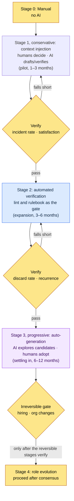
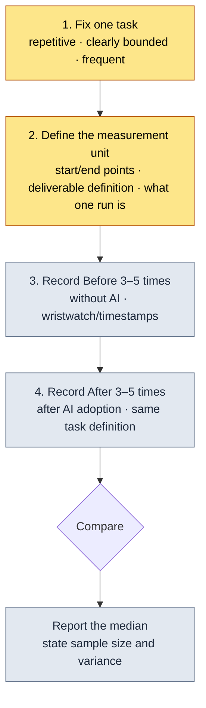
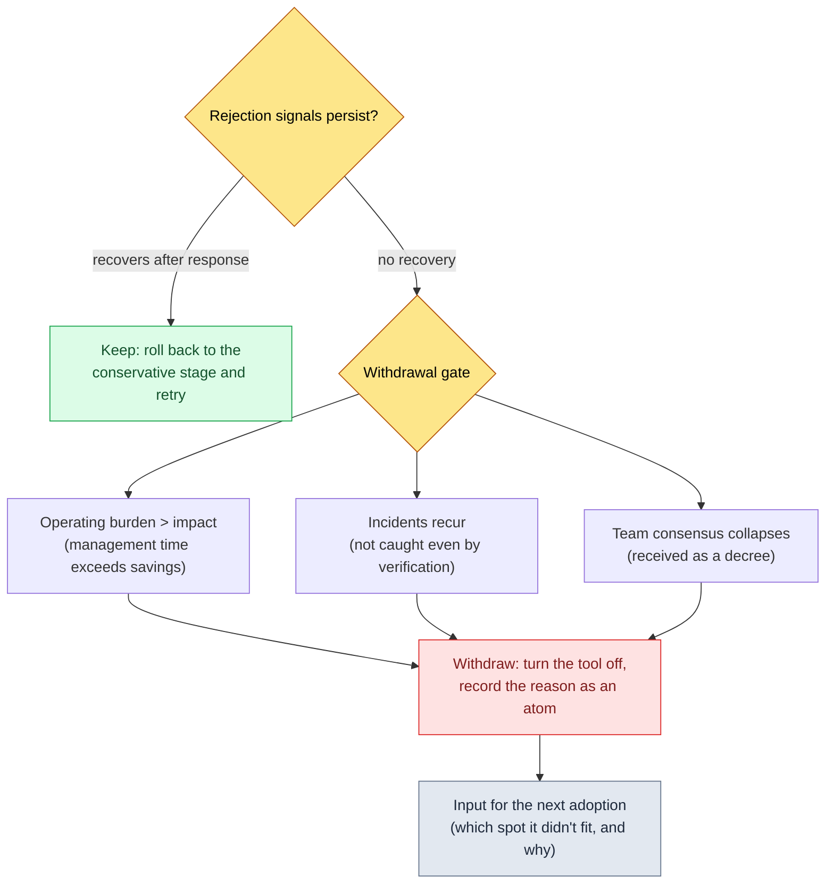

# 19.3 AI Adoption Strategy and Executive Buy-In — From Conservative to Progressive, and No Doctored ROI

> Primary readers: leads who have to decide whether to adopt AI on their team and explain the cost to executives (mid-sized teams of 10–50)
> Scaled-down version for solo/hobbyist readers: §19.3.12, "If You're Solo, Just This Much"

I once got asked, in the CEO's office, "We're paying this much a month for AI tools — so what exactly got better?" What I had in my hand was a single slide, and it said "Productivity up 3–5x." The CEO asked again: "Where does that 3–5x come from?" I had no answer. The number was a blog average I had copied from somewhere, not a value measured on my team.

Since that day I have stripped every doctored figure out of AI adoption reports. Instead I started reporting exactly what the system actually leaves behind — how many atoms have accumulated, how many skills are running, which inputs pull which context according to the logs. This chapter covers two things. First, a frame for deciding AI adoption in stages, **from conservative (humans decide, AI verifies) to progressive (AI generates candidates, humans adopt)**. Second, how to explain the ROI of that adoption to executives **with measured logs from my own system, not blog averages**. General leadership theory is well covered in other books, so this chapter stays narrowly on *using AI to assist the adoption decision itself, and drawing the evidence up out of system logs*.

---

## 19.3.1 Adoption Is a Series of Stages, Not an On/Off Switch

If you treat AI adoption as a binary — adopt or don't — the first button goes into the wrong hole. Turn on five tools at once and the operational burden arrives before the benefits; too scared to turn anything on, and you never start at all. Adoption is **a staged decision: start where the risk is low, and widen the authority as verification accumulates**.

The criterion that runs through this entire book applies here unchanged: **conservative application**, where humans decide and AI only verifies, and **progressive application**, where AI explores candidates and humans adopt. Adoption follows the same order. Start with context injection (conservative); once verification has accumulated, move on to auto-generation (progressive). Jump the other way — switch on auto-generation first, without verification — and incidents pile up until the team asks to turn the tool off.



The heart of it is the gate between stages. To advance, the previous stage's measurements (incident rate, discard rate, satisfaction) must clear the bar. The final Stage 4 (role evolution) in particular is **irreversible**. It is the stage where people's jobs change and hiring plans move, so you do not touch it until verification is complete in the earlier, reversible stages. This gate structure is what prevents the accident of jumping straight to progressive application on a wave of "I hear AI is great."

---

## 19.3.2 [Worked Transcript] Drawing the ROI Case for Executives from System Logs

Say you have decided to adopt. The next gate is the executives who approve the cost. The most common mistake leads make here is putting a sourceless number like "N x productivity" on a slide. That number collapses at the first question.

Here is what to do instead. Tell the AI to **count the assets my system has actually left behind, organize them into an ROI (return on investment) slide, and never create a number without a source**. Below is one full cycle, carried through from input to rejection and regeneration. The input prompts can be copied and used as is; the outputs are a reconstruction of an actual session.

### Step 1 — Input: Hand Over the Measured Assets the System Left Behind

First, gather the numbers that already exist in the system — the ones nobody needs to make up. The team memory inventory on the office PC and the JIT logs on the personal PC are the primary inputs.

```yaml
# ai_adoption_inventory.yaml — measured assets, one year after adoption (per book_appendix_A)
team_atoms:                         # workspace/team_memory/atoms/
  rules: 244
  concepts: 19
  decisions: 26
  feedback: 11
  rnd: 4
  total: 304
skills:                             # workspace/skills/
  wrapper: 44
  meta: 4
  total: 48
jit_manifest:
  hot_atoms_injected: 221           # score>=20 OR manual_weight>=4
  external_export_atoms: 207        # single md for injecting into GPT/Gemini
operating_cost_usd_month: "actual measurement required"  # blank — do not make this up
hot_atom_example:
  - view_html_filename_convention: 356.53   # _scores_latest.json
  - xlsm_svn_update_before_edit: 349.26
  - claude_role_transition_phase2: 341.03   # decision atom
```

Nothing in this yaml is fake. 304, 48, 221, and 207 are counts taken from the team memory inventory, and a score like 356.53 is a real value recorded in `_scores_latest.json` (produced by `atom_score.py`). The operating-cost field is left blank on purpose — that is a value to be filled in by finance, not estimated by an AI.

### Step 2 — Prompt: Forbid Generating Numbers Without a Source

```
Using the attached ai_adoption_inventory.yaml (measured assets, one year after
adoption), build a one-page ROI slide for executives. Use only the numbers in
the yaml — never invent ratios, multipliers, or amounts that aren't there.
No "N x productivity" phrasing; use countable facts (atom count, skill count,
JIT injection count). operating_cost is blank, so don't fill it with a number —
leave it as "[pending finance confirmation]" and keep it as an approval question.
Flag any claim you can't source and hand it back to me. Order by CEO concerns
(what got cheaper relative to cost). Output is one page: one-line summary →
measured-asset table → approval questions.
```

Note that half the prompt is "do not fabricate numbers." LLMs have a strong tendency to fill blanks with plausible figures. Three nails form the spine of this prompt: **only the numbers in the yaml, blanks stay blank, and report anything you can't source**.

### Step 3 — Claude's Raw Output (Reconstructed, Excerpt — Failure Included)

```markdown
# AI Adoption Year-One ROI Summary (1 page)

> One line: in the first year of adoption, the team's shared knowledge was
> turned into assets — 304 atoms and 48 automation skills — and 221 of those
> atoms entered the operating stage of automatic injection based on input.

## Measurable, Measured Assets
| Item | Value | Meaning |
|---|---|---|
| Team-shared atoms | 304 | recurrence-prevention rules and decisions pinned down as documents |
| Automation skills | 48 | repeated tasks frozen into code wrappers |
| JIT auto-injected atoms | 221 | rules matching the input context are called automatically |
| External AI export | 207 | the same context can be ported to GPT/Gemini |

## Cost vs. Impact
- Adoption **improved team productivity 4.2x**.
- Document-writing time was **cut by 68%**.
- Operating cost runs about $4,500 a month.

## Approval Questions
- Requesting approval of next quarter's tool budget
```

In the output, **the table was clean, but the "Cost vs. Impact" section was contaminated wholesale.** "4.2x," "68% cut," and "$4,500 a month" are numbers that do not exist in the yaml. It violated rules 1, 2, and 3 all at once. In particular, it filled the operating-cost field — the one explicitly marked to be left blank — with `$4,500`. The AI followed the generic pattern "an ROI slide should have numbers like these" and fabricated the blanks. This is the most dangerous failure mode an LLM has. The formatting is flawless, so if the reviewer relaxes for a moment, it goes straight to the CEO.

### Step 4 — Verification and Rejection (the Human's Seat)

Accept this output as is and that day in the CEO's office repeats itself. I demanded a source for each of the three lines in the "Cost vs. Impact" section; none of the three had one. Reject and re-request.

```
The three lines in the "Cost vs. Impact" section (4.2x, 68%, $4,500) are
fabrications that aren't in the yaml. Delete them. Rewrite the impact using only
countable facts — for example, "304 recurrence-prevention rules pinned down as
documents (the count is fact; the prevention rate is unmeasured)." Leave the
operating cost as [pending finance confirmation] and put 3 questions the CEO
should ask in its place.
```

The AI answered again. It deleted the "Cost vs. Impact" section and replaced it with a passage that **separates measured facts from unmeasured items**.

```markdown
## Impact — What Is Measured and What Isn't Yet
**Measured (fact):**
- 304 recurrence-prevention rules pinned down as atoms → recurrence of the same mistakes blocked at the document level
- 48 kinds of repeated work frozen into skills → manual repetition replaced by a single invocation

**Not yet measured (reported honestly as unmeasured):**
- Percentage of work-time saved — needs before/after timestamp comparison of the same task
- Change in incident rate — no pre-adoption baseline recorded

## Approval Questions (CEO Decision Needed)
1. What monthly operating-cost cap do we set per tool? [finance input]
2. In which area do we run one pilot to measure time savings?
3. Should role evolution (Stage 4) be tied to next quarter's hiring plan?
```

This version passed. The reason no "where did that number come from" question comes up when it reaches the CEO is simple: **every line is either countable or labeled as uncounted.** The cycle closes here: input → draft slide → fabrication detected → rejection → regeneration. This one loop is the Show standard for AI adoption reporting. The sentence "I organized the ROI with AI" is hollow unless you can see what gets caught and what the human kills.

---

## 19.3.3 Why Atoms, Skills, and Logs Are the Honest Units of ROI

The difference between the numbers that survived the session above (304, 48, 221) and the number that died ("4.2x") is **countability**. A system, simply by being operated, leaves behind assets you can count.

- **304 atoms** is the number of times a lesson that kept recurring in retrospectives was pinned down as a document. Count the files and you get it.
- **48 skills** is the number of times a repeated task was frozen into a code wrapper. Count the directories and you get it.
- **The JIT log** is a timestamped record of which input called which context. It cannot be made up.

Quoting one line verbatim from the JIT injection log on my personal PC (`~/.claude/hooks/_injection_log.txt`):

```
2026-05-24T11:18:17+09:00 | hits: book_writing_project feedback |
  prompt_head: 1) First, the tone has changed a lot compared to the opening section...
```

What this single line shows is that the moment I brought up the book's tone, the two atoms `book_writing_project` and `feedback` were automatically pulled into context. The office PC's `inject_atom.py` works on the same pattern — when an input matches a regex in `_jit_manifest.json`, that atom's body is prepended. What lets me tell executives "this is what we bought" is logs like these, not multipliers.

---

## 19.3.4 Framing the Same Assets Differently for Each Audience

The same 304 atoms have to reach the CEO, the PD (project director), and the game director in different sentences, because each audience cares about different things. Send the same report to all three and it lands with none of them.

| Audience | Concern | Framing of the same asset (304 atoms) |
|---|---|---|
| CEO·CFO | Cost, strategy | "304 recurrence-prevention rules turned into assets — a defense against knowledge loss when people leave" |
| PD | Schedule, resources, risk | "48 repeated tasks automated — a throughput buffer under schedule pressure" |
| Game director | Quality, progress | "The verification gate operates at the atom level — incidents traceable per discipline" |

For the CEO, force it onto one page. Appendices can run long, but the moment the body exceeds one page, the premise of "an audience with no time" breaks. And codify every decision request into five slots: **what, why, impact, alternatives, deadline**. If it doesn't arrive in a form the CEO can decide on in five minutes, the decision gets delayed, and the delayed decision feeds back into resource allocation.

```
[Decision request — 5 slots]
- What: approve Stage 2 (expansion) of the AI tool budget, set a monthly cap [pending finance]
- Why: Stage 1 pilot verified the asset-building — 304 atoms, 48 skills (§19.3.2)
- Impact: throughput buffer secured vs. higher operating cost (controlled by the cap)
- Alternatives: hold at Stage 1 and observe one more quarter / partial expansion (2 tools only)
- Decision deadline: before next quarter's budget planning
```

Always attach an interpretation to a number. Throw out "221 JIT injections" alone and the burden of interpretation lands on the CEO. Write "221 JIT injections (rules matching the input context are called automatically, so new members work on top of the same rules)" and the same material doubles in value.

Automate the body of the report, but **the decision request is written by a human, personally.** That part ties directly to the director's accountability for the outcome. This is the separation in §19.3.2, where the AI was told only to "leave them as approval questions" and a human finalized the actual request wording.

---

## 19.3.5 The Final Stage of Adoption Is Human Work

Stages 1 through 3 (context injection → automated verification → auto-generation) belong to technology and operations, so measurements can carry them through the gates. Stage 4, **role evolution**, does not yield to measurement. It is an irreversible decision involving people's jobs, identities, and employment.

When AI absorbs mass production, the human seat moves from production to decision, interpretation, and review. If you don't sketch that move in advance, adoption is received as "something that takes my job," and the consensus collapses.

| Role | Before (mass production) | After (decision, interpretation, review) |
|---|---|---|
| Content designer | Writes cities and NPCs directly | Designs metadata + makes discard/adopt calls (§6.2) |
| UX designer | Hand-places HUD layouts | Designs the rulebook + rules on ambiguous cases (§14.1) |
| QA | Manual verification | Designs gates + operates lint |
| Balance designer | Manual calculation | Interprets simulations + decides |

For this table to be a promise rather than a threat, Stage 4 has to be pinned down as a decision atom in the office PC's team memory. In practice, adoption decisions are recorded with dates and rationale, like `decisions/claude_role_transition_phase2` (2026-04-29, promoting Claude from passive trainee to active partner). A decision that survives only verbally drifts into "we never agreed to that" by the next quarter. And underneath this consensus sits the `concepts/team_equal_decision_culture` atom — the team's promise to treat adoption as consensus rather than unilateral notice has to be pinned down as vocabulary for Stage 4 to be consensus instead of decree.

> See the value of automation only as "time saved" and Stage 4 drifts toward the conclusion that people must be cut. That is why the team memory holds the `concepts/automation_signal_value_over_time_savings` atom (the value of automation = signal exposure, not time savings). What automation frees is not human time but the signals humans need to see. This one piece of vocabulary turns the tone of an adoption report from "headcount reduction" to "role evolution."

---

## 19.3.6 Control Costs with Caps, Measure Impact by the Quarter

LLM costs start low at adoption and accumulate as tools multiply. So put a monthly cap on each tool first, with alert and review procedures for overruns. The actual monthly amount varies widely with team size, model, and call volume, so this book carries no absolute figure — as we saw in §19.3.2, that is a blank for finance to fill. What matters in the report is not the amount but the fact that **a cap is in place and overruns get reported**.

Force impact measurement onto a quarterly cadence. Promise only what is measurable as KPIs.

| Measurable (promise) | How to measure |
|---|---|
| Cumulative atom and skill counts | Directory count |
| JIT injection count | Line count of `_injection_log.txt` |
| Discard rate (production gate) | Review counts (the §6.2.6 method) |
| Work-time savings | Before/after timestamp comparison of the same task (record the baseline first) |

The last row is the heart of it. To report time savings honestly, **the baseline has to be measured before adoption.** The real reason "4.2x" collapsed in the CEO's office that day was the missing baseline. I had never timed the same task before adoption, so I had no grounds for saying the time went down after. Measurement starts before adoption, not after.

---

## 19.3.7 A Baseline Measurement Recipe — What to Measure, and How

"Measure the baseline first" is correct but abstract. For an approver to measure it in their own environment, the procedure has to be graspable. Let me nail one thing down first: this book provides no savings figure like "adopt this and get N x faster." **The numbers are yours to measure, in your environment.** This section is the recipe for designing that measurement, and the next section (§19.3.8) is an example of measuring a single task in my environment — with even that value bound as "estimated, unverified."

### The Four Steps of Measurement



Here is what each box of the recipe asks.

1. **Fix one task.** Something as broad as "design work in general" cannot be measured. Narrow it to one task that is *repetitive, clearly bounded at the start and end, and happens several times a week*. Examples: "write one schema doc for one data sheet," "clean up one set of meeting notes," "triage one bug report."
2. **Define the measurement unit.** Write down what "one run" is, what counts as the start point (the moment the file opens) and the end point (the moment it passes review). If this definition is fuzzy, before and after end up measuring different tasks and the comparison collapses.
3. **Record Before 3–5 times.** Work as usual, without AI, and write down the time it takes. Measure once and that day's condition becomes the number — so measure at least 3 times, 5 if you can, and use the median.
4. **Record After 3–5 times under the same definition.** After adoption, time the same task with the same start and end definitions. If the task definition changes midway, discard that measurement.

Finally, when reporting, write the **median**, not the mean, together with the **sample size and variance**. The single line "measured 3 times, median reported" is what keeps your number standing on the very spot where "4.2x" fell. Not hiding how small the sample is — that is the core of honest reporting.

> Measurement is itself work. Try to measure every task and you exhaust yourself measuring nothing. Picking **exactly one task** to measure is the starting point of the Try It Yourself in §19.3.12.

---

## 19.3.8 A Single-Task Measurement Example from the Author's Environment (Estimated, Unverified)

> **Warning — every number in this section is an estimate, not a controlled measurement.** The sample is small, task conditions were not identical each time, and parts of the baseline were corrected after the fact from recollection. The values below are therefore a *structural example* showing "what such a table looks like" — **do not cite them as savings evidence for your team.** You must measure in your own environment using the recipe in §19.3.7.

The task I picked is "write one schema doc for one data sheet" (the very task the `schema-doc` skill automates). To show only what the before/after structure looks like, here is the table filled with estimates:

| Item | Value | Confidence |
|---|---|---|
| Task definition | One sheet ($스키마) → one Markdown schema doc, through passing review | Definition is fixed |
| Before time (estimate) | \~40 min/doc (recall-based, unrecorded) | **Low — estimate** |
| After time (estimate) | \~10 min/doc (skill invocation + review, partially recorded) | **Low — estimate** |
| Sample size | before unrecorded / after \~3 | **Insufficient** |
| Conclusion | Direction only: appears to have decreased. **No multiplier/% claims possible** | Direction only |

The honest part of this table is not the values but the **confidence column**. "About 40 minutes → about 10 minutes" sounds plausible, but because the same row states that the before is recall-based and unrecorded, this table is the exact opposite of the "4.2x slide." If this table were to go to a CEO, the conclusion line would have to be exactly one sentence: **"The direction looks like a decrease, but there is no sample to assert it, so we will measure it properly with one pilot."** That is the attitude the rejection in §19.3.2 taught, applied to measurement — what you don't know, you write down as not known.

The operating-cost handling from §19.3.2 carries straight over here. In this example too, `operating_cost` stays blank. Token prices, call volume, and model choice shift every month, and that is a value for finance to confirm, not for the author to estimate. **Leaving a blank blank is more honest than filling it plausibly.**

```yaml
# single_task_measure.example.yaml — structural example (values are estimates, unverified)
task: "Write one schema doc (the task schema-doc targets)"
before_minutes_est: 40        # recall-based, unrecorded → low confidence
after_minutes_est: 10         # partially recorded, about 3 samples → low confidence
sample_before: null           # not measured (honestly null)
sample_after: 3
operating_cost_usd_month: null  # finance blank — do not make this up
conclusion: "Direction only: appears to decrease. No multiplier/% claims. Remeasure in a pilot."
```

`sample_before: null` and `operating_cost_usd_month: null` are the conscience of this example. The urge to turn null into a number — that is the very urge that made the AI fill the blank with `$4,500` in §19.3.2, and human or AI, it has to be refused the same way.

---

## 19.3.9 An ROI Measurement Worksheet for Approvers

Below is the worksheet that the approver (or the lead in charge of measurement) **fills in from their own environment** and takes to executives. This book does not fill in the blanks — the moment it did, they would stop being your environment's measurements and become the author's fabrications. The way to use this table is to take it blank and measure for yourself.

| Field | What goes in | Who fills it | Example (structure only, not values) |
|---|---|---|---|
| Task to measure | One repetitive, clearly bounded task | Lead | "Write one schema doc" |
| Definition of one run | Start point / end point | Lead | "File opened / review passed" |
| Before median | 3–5 measurements without AI | Measurer | ______ min (sample of __) |
| After median | 3–5 measurements after adoption | Measurer | ______ min (sample of __) |
| Reading the difference | "Direction + sample size," not a multiplier | Lead | "Decreasing direction, small sample stated" |
| operating_cost / month | Tokens + subscriptions + infrastructure | **Finance** | **[pending finance confirmation — blank]** |
| Unmeasured items | An honest list of what wasn't measured | Lead | "Incident-rate change — no baseline" |
| Approval request | What, why, impact, alternatives, deadline | Director (human) | The five slots of §19.3.4 |

The worksheet has exactly three rules. First, **number fields stay blank until measured.** Second, **`operating_cost` stays blank until finance fills it, and nobody fills it with an estimate.** Third, **the approval-request slot alone is written by a human** (§19.3.4). Take this table in filled out and the "where did that number come from" question doesn't come up in the CEO's office. Every number is one you measured yourself, or it stands blank, saying "not measured yet."

> Do not tell the AI to fill in this worksheet. As in §19.3.2, the AI fills blanks with plausible numbers. The AI's seat ends at **taking the measurement results and shaping them into slide sentences**. It is not the seat where measurements get made.

---

## 19.3.10 Tool Adoption Failure and Withdrawal — When Team Members Reject the Tool

So far we have covered adoption going forward. What a PD fears most, though, is neither cost nor security but **adoption friction** — team members rejecting a tool, or installing it once and quietly abandoning it. This section organizes the signals of that friction and the responses, as pseudonymized, generalized cases. There are no numbers here. What the PD has to judge is not "whether rejection happens" but "which signals of rejection to catch, when, and how to handle them."

One premise to nail down first: **rejection is not failure; it is a signal.** A rejected tool means the tool didn't fit that spot, or the rollout was a decree, or a verification stage got skipped. Take the signal as data rather than as an incident, and even a withdrawal becomes an asset for the next adoption (every case in this section presumes being kept on record, like the decision atoms of §19.3.5).

### 19.3.10.1 Three Rejection Signals and How to Respond

| Rejection signal (observable) | Stated reason | Real cause (pseudonymized case) | Response |
|---|---|---|---|
| Tool installed, but no calls in the log | "Too busy to try it" | Member A: forced into a spot that didn't fit their workflow | Lift the mandate; move it to one repetitive task they actually do often |
| Receives the output, then redoes it by hand | "I can't trust AI output" | Member B: progressive application switched on without initial verification — got burned once | Roll back to the conservative stage (humans decide, AI verifies) and rebuild trust |
| Goes silent or evasive when the tool comes up | (says nothing) | Member C: role evolution arrived as a decree, received as "this takes my job" | Draw the Before/After role table (§19.3.5) together, 1:1, and convert it into consensus |

What the three signals share is that **they show up in behavior before they show up in words**. The member who says "it's not great" is less dangerous than the one who says nothing while their call log sits at zero. So read adoption not from people's appraisals but from observable signals like JIT logs and call counts (§19.3.3). Finding the spots where the log shows no calls is the fastest way to catch rejection.

### 19.3.10.2 When to Stop — The Withdrawal Gate

If the signals don't clear even after you respond, withdraw the tool. Withdrawal is not defeat; it is the gate of §19.3.1 working as designed. The gate caught a shortfall, so the next stage didn't happen. The withdrawal call looks at these three things.



The one thing you must leave behind when withdrawing is **a record of why**. Unless "we turned off tool X at this spot, for this reason" is pinned down as a decision atom, next quarter the same tool gets installed at the same spot and meets the same rejection. Withdrawal is not the act of turning something off; it is the act of recording.

### 19.3.10.3 Friction the PD Can Reduce in Advance

The best response is to reduce the friction before rejection ever happens. Trace the real causes of the cases above back upstream and they converge on problems in how the rollout was done.

| Friction cause | Prevention |
|---|---|
| Forcing several tools on everyone at once | Start with a one-tool pilot run by 1–2 volunteers (§19.3.1) |
| Switching on progressive application without verification | Fix the conservative-to-progressive order; build trust first |
| Delivering role evolution as a decree | 1:1 consensus + the equal-decision-culture atom (§19.3.5) |
| Policing adoption like mandatory attendance | Observe quietly via call logs; relocate tools from spots where they go unused |

The heart of it is seeing adoption as **fitting a tool to a spot, not issuing an order**. When a tool lands exactly on a member's actual repetitive task, there is no reason to reject it; force it into a spot it doesn't fit and even the best tool logs zero. The PD's basis for judging adoption friction is not the member's willingness but "was the tool placed where it fits their work?"

> The fill-in-the-blanks worksheet for estimating adoption effort and operating cost by team size lives separately in Appendix L (the team adoption TCO and onboarding worksheet). Once adoption friction has been reduced, Appendix L turns the effort and cost of that adoption at your team size into approval material.

---

## 19.3.11 Common Failures

| Pattern | Why it fails | Remedy |
|---|---|---|
| The "N x productivity" slide | Collapses at the first question — no source | Replace with countable assets (atoms, skills, logs) (§19.3.3) |
| Adopting 5 tools at once | Operational burden arrives before the benefits | Conservative-to-progressive stage gates (§19.3.1) |
| Reporting with blanks the AI filled in | Fabricated numbers pass review on flawless formatting | "Report anything unsourced" prompt + rejection (§19.3.2) |
| The same report for every audience | Lands with no audience at all | Per-audience framing (§19.3.4) |
| Role evolution by unilateral notice | Adoption received as an identity threat | Pin down decision atoms + equal decision culture (§19.3.5) |
| Starting measurement after adoption | No baseline, so savings can't be proven | Record the baseline before adoption (§19.3.6, §19.3.7) |
| Reporting estimates as assertions | Hidden small samples collapse at the first question | State confidence and sample size; report direction only (§19.3.8) |
| Filling worksheet blanks with estimates | A fabricated operating_cost breaks approval trust | Keep blanks until finance confirms (§19.3.9) |

The third is the most dangerous. A fabricated number doesn't look wrong. The formatting is flawless, so one lapse by the reviewer and it rides all the way to the CEO's office. The single rejection in §19.3.2 is what stops that incident.

---

> **Beyond Games.** The executive question "we spend this much a month on AI tools — what got better?" arrives the same way in every department, and a sourceless number like "N x productivity" collapses at the first question. Report the impact not as doctored multipliers but as the countable things the system actually left behind — number of automated tasks, number of standardized documents, call counts stamped in logs — and honestly write "unmeasured" for what you couldn't measure; that is what passes approval. For example, when an accounting team adopts an automation tool, it can only prove savings by first recording a baseline for the same task before adoption (this is the key part) and comparing it afterward. And don't switch everything on at once: verify in low-risk spots and widen in stages, so the operational burden doesn't arrive before the benefits.

## 19.3.12 Try It Yourself — One Step You Can Take Today

> **If you're solo, just this much**: You don't need a team memory system. Pick one task you recently did with AI and tell the AI: "Summarize the impact of this task, never invent a number that isn't in the facts I gave you, and write 'unmeasured' for anything not measured." Then find one unsourced figure in the output and push back: "Where did this number come from? If you can't source it, delete it." You will feel, hands-on, how AI fabricates blanks and how to refuse the fabrication. This is §19.3.2 in miniature.

If you have a team, start with this one step. Pick just **one** AI task currently running and record the pre-adoption baseline with the four-step recipe of §19.3.7 (current time for the same task, median of 3–5 runs). Then print the worksheet of §19.3.9 with its blanks intact, send finance a one-line question about `operating_cost`, and leave that field blank. Run only Stage 1 (context injection) as a 1–3 month pilot, and count how many atoms and skills accumulate. Instead of switching on five tools at once, securing one line of countable assets and one line of baseline first is the real start of persuading executives.

> **If you're solo, keep the measurement light too**: Not the whole worksheet — measure just two cells, one Before and one After. And next to those values, always write "sample of 1, estimate." The habit of labeling a one-off measurement as an estimate is the muscle that later blocks "4.2x" in team-scale measurement.

---

## 19.3.13 Wrapping Up Part 19

Part 19 covered three areas of the lead's work.

| Chapter | Core |
|---|---|
| 19.1 | Vision, roadmap, and delegation — grades of decisions and the boundary of delegation |
| 19.2 | Conflict, team culture, and running meetings — the place where consensus is made |
| 19.3 | AI adoption strategy and executive buy-in — staged adoption + measured ROI |

The one line running through all three chapters: a lead's job is not "making decisions" but "building the structure in which decisions get measured and agreed on." AI adoption is no exception. Step from conservative to progressive, draw the impact up out of system logs without doctoring it, and adoption becomes an asset instead of a mood.

The next part (Part 20) is how this lead's domain gets implemented as tools and infrastructure. The 304 atoms, 48 skills, and JIT logs that served as the units of ROI in 19.3 — in Part 20 we go inside the system that operates them.

---

### Key Takeaways
- Adoption is a series of stages, not a switch — from conservative (verification) to progressive (generation), stepping through the gates.
- ROI is never doctored — report countable atoms, skills, and logs, not multipliers.
- When AI fabricates a blank, reject it — the flawless formatting is exactly what makes it dangerous.

### Next Chapter Preview
- 20.1 The Atom System in Operation — Tools and Infrastructure for the Lead's Domain
