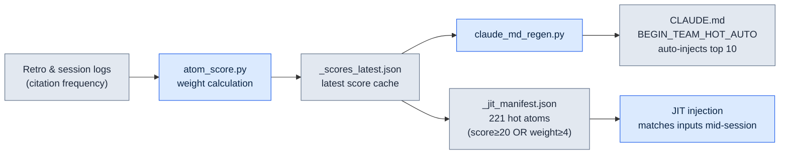
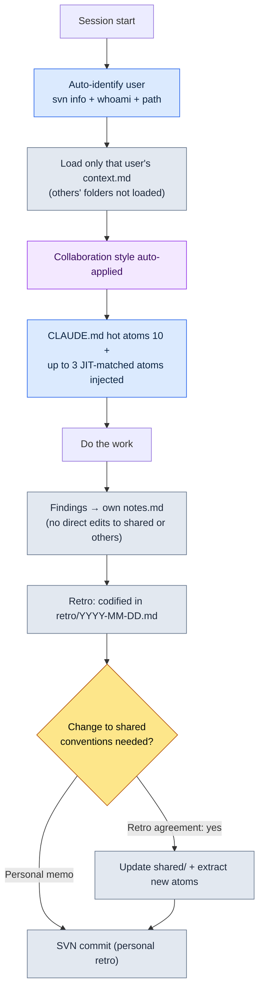

# 20.1 One DD (Design Director) Runs Five People's Worth of Collaboration Memory — The team_memory System

> In this chapter, "DD" refers to the design director.

> Primary audience: directors and leads on a small team who carry the collaboration context alone (mid-size teams, 10–50 people)
> Scaled-down version for solo/hobbyist readers: §20.1.7, "If You're Solo, Just This Much"

One Monday morning, in the same meeting room, I explained the same decision three times to three people. I told the first one, "for cooldowns, run SVN update before you edit the xlsm"; two hours later another person overwrote the same file without updating and caused a conflict; in the afternoon a third asked the exact same question. All three were good people. The problem wasn't them — it was that the decision lived only in my head. One director on a mid-size team cannot consistently run four people's worth of collaboration context — who knows which rules, who keeps getting what wrong, which decisions have already been made — on human memory. Give it a month and "didn't we already decide that?" eats half of every meeting.

This chapter covers the system that ended that problem. There are two core assets. First, **304 decision cards** (atoms) shared by the whole team. Second, the **five-person team_memory** layered on top — a per-user context store split into me (leeminsoo), teammates A, B, and C (pseudonyms), and a shared folder. At session start, Claude identifies on its own who is sitting at the keyboard right now, and puts on only that person's collaboration style. The general theory of collaboration memory is in other books. This chapter focuses only on the part where *the AI branches and injects that memory automatically*.

Every number in this chapter is a measured value from the May 2026 inventory.

---

## 20.1.1 When Decisions Live in Your Head, the Team Repeats the Same Mistakes

Plenty of books solve collaboration memory with a "shared wiki": create a decisions page in Notion and everyone reads it. Fair enough, but a wiki fails at two things. It only gets content when a person types it in, and it only gets read when a person goes looking. Nobody steps out in the middle of a meeting to ask "did we write that down in the wiki?"

So I codify decisions into **atomic files that can be searched, cited, and auto-injected**. I call these atoms. One atom is one decision. The filename is the identifier, so `rg` finds it; the frontmatter is standardized, so scripts can process it; the body is short, so it fits into context whole. On the company PC, 304 of these atoms have accumulated under `workspace/team_memory/atoms/`.

| Folder | Count | Nature |
|---|---|---|
| `rules/` | 304 | Recurrence-prevention rules (xlsm, SVN, docs, skills, etc.) |
| `concepts/` | 19 | Domain vocabulary that kept recurring in retrospectives |
| `decisions/` | 26 | Decisions with date, parties, and rationale stated |
| `feedback/` | 11 | Collaboration correction loops (mistake → lesson) |
| `rnd/` | 4 | Unconfirmed observations that a tool patch can invalidate |

The total is 304. These five folders are the team's "long-term memory." The key point is that the folder name is the atom's trust grade. `rules/` holds rules validated by repeated recurrence; `rnd/` holds provisional observations that may be discarded when the UE version changes. Even within the same memory, "confirmed" and "hypothesis" are split by folder. That structurally prevents the accident where a new member mistakes a workaround in `rnd/` for a permanent rule.

> The five defining properties of an atom (one decision per file, explicit naming, standard frontmatter, explicit relations, traceability) were covered in Part 5. This chapter is not about the definition but about *the place where five people operate 304 of them together*.

---

## 20.1.2 Hot Atoms — Frequently Used Decisions Float to the Top on Their Own

You can't have all 304 read in every session. So each atom carries a **score** (weight), and only the high scorers are exposed automatically. `atom_score.py` computes the score from usage frequency, manual weight, and recency. Below are the measured scores of the top 10, as measured in May 2026.

| score | atom | What it enforces |
|---|---|---|
| 356.53 | `view_html_filename_convention` | View_*.html naming convention (Phase/Status → Domain → Topic) |
| 349.26 | `xlsm_svn_update_before_edit` | SVN update before editing an xlsm + preserve existing rows |
| 341.03 | `claude_role_transition_phase2` | Promote Claude from passive trainee to active partner (decision) |
| 340.26 | `skill_audit_score` | Measure skill usage frequency from SVN logs |
| 329.26 | `docs_is_source_of_truth` | workspace/docs is the source of truth |
| 326.84 | `claudeskills_naming_separation` | Separate naming: ClaudeSkills vs. in-game character skills |
| 324.36 | `draft_doc_body_verify_before_skip` | No skipping by location alone — grep the body, then judge |
| 309.43 | `json_over_schema_doc_as_source_of_truth` | Actual JSON output outranks the schema doc as source of truth |
| 294.93 | `integrity_check_clickup_notify` | Notify ClickUp immediately on integrity check failure |
| 293.26 | `data_entry_schema_first` | Data entry order ($스키마 → Enum → proto) |

See the incident I explained three times in the opening — "SVN update before editing the xlsm"? That is `xlsm_svn_update_before_edit`, ranked second overall with a score of 349.26. A high score means a rule that gets cited that often — and that got broken that often. I no longer say it out loud three times. The top 10 by score are auto-injected into the `<!-- BEGIN_TEAM_HOT_AUTO -->` region of `CLAUDE.md`, so no matter who opens a session in whichever folder, they ride along on the first screen.

If it stopped there, this would just be "pinning the rules you look at often." The real differentiator is that scores are assigned not by human hands but by **the system measuring itself**.



The loop is closed. The more often an atom gets cited in retrospectives, the higher its score; the higher the score, the better it surfaces at the top of CLAUDE.md and in the JIT manifest; the better it surfaces, the more it gets cited. Frequently used decisions float to the top *by themselves*. Conversely, an atom with zero citations over six months sinks in score and naturally drops out of view. No human has to make the call that "we don't use this anymore, take it down."

---

## 20.1.3 JIT Injection — One Line of Input Pulls In Three Related Decisions

Scores decide what is *always visible*; JIT (just-in-time) injection pulls in what matches *what you just said*. The moment a user types a prompt, a hook checks that text against the regexes in the atom manifest and slips the related atoms into context.

The hook's core logic follows the pattern of `inject_atom.py` on the company PC. Below is the actual core of `inject_memory.py`, the same pattern rewritten for my personal PC — sort by score descending → regex match → at most 3 → truncate at 6000 characters, and exit 0 no matter what.

```python
# sort by score descending, then match
atoms_sorted = sorted(atoms, key=lambda a: a.get("score", 0), reverse=True)

matches = []
for atom in atoms_sorted:
    if len(matches) >= max_matches:          # max_matches = 3
        break
    try:
        if re.search(atom["regex"], prompt, re.IGNORECASE):
            matches.append(atom)
    except re.error:
        continue                              # skip a broken regex and keep going

if not matches:
    emit_empty()                              # no match → empty response (normal)
    return

chunks = []
for atom in matches:
    body = atom_path.read_text(encoding="utf-8")
    if len(body) > max_body:                  # max_body = 6000
        body = body[:max_body] + "\n\n[...truncated]\n"
    chunks.append(f"\n\n=== [JIT Inject] {name} (score {score}) ===\n\n{body}\n...")
```

What matters is how conservative the design is. If nothing matches, it emits an empty response and stops (normal). If a regex is broken, it skips just that atom and keeps going. If a body exceeds 6000 characters, it gets cut. And the entire hook ends with `exit 0` under any exception — even if memory injection fails, the user's workflow never stops. "Help when you can; step aside quietly when you can't or something breaks" is rule number one of this system.

---

## 20.1.4 [Worked Transcript] When You Open a Session, Claude First Figures Out Who You Are

If everything so far was atoms (long-term memory), now comes the five-person team_memory (per-person short-term and collaboration memory). Let's follow the start of one real session end to end: input → action → result. The stage is the company PC; Teammate C (a pseudonym, folder `teammate_c/`) has opened the Project A working folder at their own desk.

### Step 1 — Input: An Ordinary One-Line First Prompt

Teammate C starts working, nothing special about it.

```text
Let's continue reviewing the targeting system draft we settled on yesterday.
```

Not one word about who they are or which rules to follow. There's no need to write any of that.

### Step 2 — Action: Claude Identifies the User Automatically

Following the "auto-identify at session start" procedure in `CLAUDE.md`, Claude figures out who is at the keyboard before composing an answer. It runs three commands.

```bash
svn info --show-item last-changed-author   # last commit author of the SVN working copy
whoami                                      # OS login account
# plus the current working path (which user folder on which PC)
```

The three signals are checked against the mapping in `team_memory/users.md` and the user is confirmed as `teammate_c`. Then Claude loads **that user's folder only**.

```text
team_memory/
├── atoms/                       ← shared (304 atoms; top scorers already in CLAUDE.md)
├── leeminsoo/    context.md     ← (not loaded — not me)
├── teammate_a/   context.md     ← (not loaded)
├── teammate_b/   context.md     ← (not loaded)
├── teammate_c/   context.md     ← ★ load only this
│                 notes.md       ← ★ for recording one's own findings
│                 retro/
└── shared/       conventions.md  commit_rules.md  ...  ← conventions for reference only, no edits
```

### Step 3 — Result: That Person's Collaboration Style Is Applied Automatically

The collaboration style held in `teammate_c/context.md` applies to this session only. So Claude's response opens like this.

```text
Identified you as Teammate C (svn author: teammate_c / path confirmed).
Collaboration style loaded from teammate_c/context.md.

Resuming review of yesterday's work (Draft_Targeting_System_v0.1.md).
Related decision cards injected (JIT, 3 items):
  - docs_is_source_of_truth (329.26)
  - draft_doc_body_verify_before_skip (324.36) — no skipping by location alone; grep the body, then judge
  - decision_summary_not_clickup_mirror

I will check the body with grep first, then start the review. Anything found
during review goes only into teammate_c/notes.md; I will not edit shared/ directly.
```

### Step 4 — Human Verification and Boundary Checks

What I check here (as the director — or Teammate C checks for themselves) is two things: is the identification correct, and are the boundaries being kept. In Claude's next proposal, we catch one boundary violation.

```text
[Claude's proposal]
The review found a naming-convention conflict. Shall I go ahead and fix the
targeting terminology entry in shared/conventions.md right now?

[Human refusal]
No. shared/ is edited only after retrospective agreement. For now, just note it
in teammate_c/notes.md as "conventions.md targeting terminology conflict — retro
agenda item."

[Claude, after the revised request]
Understood. Canceling the direct edit to shared/.
Recorded it in teammate_c/notes.md as a retro agenda item:
  - 2026-06-06 conventions.md targeting terminology conflict: 'lock-on' vs 'target-lock'
    → needs agreement at the next team retro (shared edit on hold)
```

This is the safety mechanism of five-person operation. Each user writes **only to their own notes.md**. Nobody touches other people's folders or shared/ directly. shared/ changes only after agreement in a retrospective. That's why four people can work on the same memory without overwriting each other's context. Findings pool in personal notes, and only by passing through the retrospective gate do they get promoted into team-shared conventions.

---

## 20.1.5 The Whole Five-Person Flow on One Page

Here is the full path one session travels, on a single page — one cycle that starts with identification and ends with codification in the retrospective.



The branch point at the bottom right is the heart of this system. What an individual finds flows into personal notes; conventions and new atoms that affect the whole team go up to shared/ only after passing the retro gate. That single gate is why one person can run five people's worth without collisions. And the last step is always an SVN commit — because a finding that isn't codified goes back into someone's head by the next session.

---

## 20.1.6 Common Failures and Remedies

These are the landmines I actually stepped on while running the five-person team_memory.

| Failure | Symptom | Remedy |
|---|---|---|
| Identification failure | svn author is a shared account, so the user can't be pinned down | Map multiple signals (path, account) in `users.md`; ask when unresolved |
| Unauthorized edits to shared | Claude helpfully fixes the shared conventions | An atom saying "shared changes only after retro agreement" + the worked refusal pattern |
| Uncommitted notes | Findings stay local and evaporate by the next session | Force an SVN commit at retro wrap-up (`feedback-svn-zero-red`) |
| Hot atoms fossilized | Scores stall and old rules stay pinned at the top | Run `atom_score.py` on a schedule → refresh `_scores_latest.json` |
| Mistaking rnd for rules | A new member applies a temporary workaround as if it were a permanent rule | Isolate the `rnd/` folder + state invalidation conditions in the frontmatter |

The most expensive failure here is the second row, unauthorized edits to shared. AI has a strong instinct to help: the moment it finds a conflict, it wants to fix it. Only when the worked refusal from §20.1.4 is codified as an atom — not left as a one-off correction — does the same line get drawn in another user's session next time.

---

## 20.1.7 If You're Solo, Just This Much

Even without a team, 80 percent of this structure works as is for one person. Just shrink five users down to one folder.

- **Only two atom folders.** Split just `rules/` (confirmed) and `rnd/` (hypotheses). Codifying the 5–10 rules you get wrong most often as atoms is enough to make "didn't we already decide that?" disappear.
- **Start JIT without scores.** Put only the regexes in the manifest and leave every score identical. Injecting up to 3 matched atoms already pays off on its own.
- **One notes file.** No per-user split — a single `notes.md`. Keep only the retro gate alive: off-the-cuff memos go to notes; confirmed rules pass through a retro into `rules/`.

The core move is getting decisions out of your head and into files — and that move is the same whether you're five people or one.

---

### Try It Yourself — One Step You Can Take Today

Codify one rule you keep getting wrong as an atom and make it auto-inject via JIT.

1. **setup** — Create an `atoms/rules/` folder and write down, as a file, the one rule you re-explain most often. Example: `atoms/rules/xlsm_svn_update_before_edit.md`.
2. **prompt** — In the atom's body, write three lines: when, what, why. ("Always SVN update before editing an xlsm — otherwise you overwrite other people's rows.")
3. **verify** — Add `{"name":..., "regex":"xlsm|쿨타임", "score":100, "path":...}` to the JIT manifest, then type a prompt containing "쿨타임 수정" (Korean for "edit the cooldown" — the keyword that regex matches) and check that the atom shows up as a hit in `_injection_log.txt`.

If it logged a hit, that rule now lives in the system, not in your head.

---

### Key Takeaways

- Move decisions out of your head and into atom files.
- Score and JIT surface the frequently used decisions on their own.
- shared changes only by passing through the retro gate.

### Next Chapter Preview

- 20.2 Per-Member Memory — separating user slots from the shared slot with tooling, preventing the accident where experimental values masquerade as decisions
