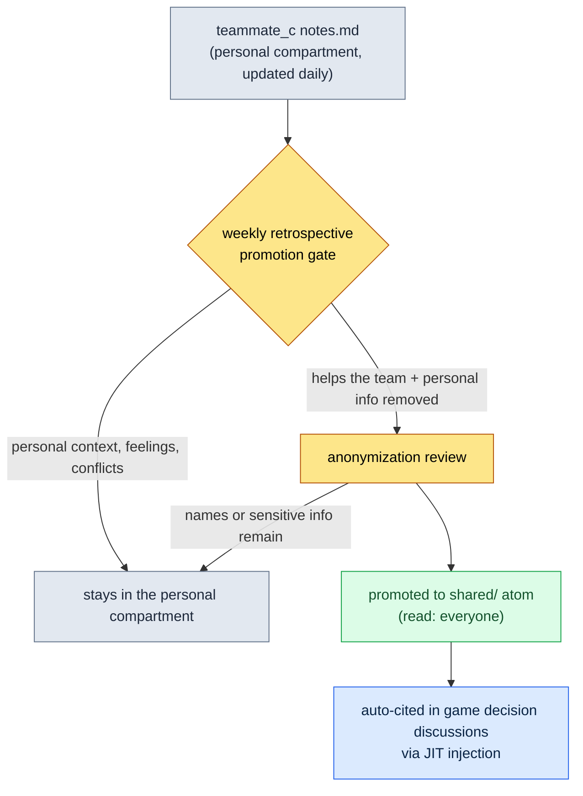

# 20.2 Per-Member Memory — Separating User Compartments and the Shared Compartment

Around lunch on a Wednesday, team member B sent a message on the team messenger. "Last week you set the combat cooldown at 0.8 seconds — my notes say 0.6. Which one is right?" I went blank for a moment. 0.8 seconds was the shared decision; 0.6 was a value team member B had been trying out temporarily in their own test build. Both were written down in "memory." The problem was that the two sat mixed in the same compartment. Team member B mistook their own experimental value for a company decision, and very nearly updated the data sheet with the wrong number.

This incident did not happen because memory lacked data. If anything, the data had piled up all too well — what was missing was a boundary marking which compartment was shared and which was personal. If §20.1 laid down the selling point that five people see the same facts (shared atoms), this chapter is the other side of that story — **five people each keeping a compartment of their own**. One cabinet, two kinds of compartments. And unless the tooling enforces those two kinds, the 0.6-second incident above is guaranteed to happen.

---

## 20.2.1 A Cabinet with Five Compartments

Project A's `team_memory/` is divided into five compartments: mine (leeminsoo), team member A's, team member B's, team member C's, and `shared`. The first four are per-user personal compartments; the last one is the shared compartment everyone opens.

<svg viewBox="0 0 720 250" xmlns="http://www.w3.org/2000/svg" font-family="sans-serif" font-size="13">
  <rect x="10" y="10" width="700" height="230" fill="#fafafa" stroke="#ccc" rx="6"/>
  <text x="30" y="38" font-weight="bold" font-size="15">team_memory/  (one cabinet)</text>
  <!-- personal compartments x4 -->
  <g>
    <rect x="30" y="60" width="150" height="160" fill="#eef4ff" stroke="#5a7fbf" rx="4"/>
    <text x="105" y="84" text-anchor="middle" font-weight="bold">leeminsoo/</text>
    <text x="105" y="106" text-anchor="middle" font-size="11" fill="#555">director (me)</text>
    <line x1="42" y1="118" x2="168" y2="118" stroke="#cdd" />
    <text x="105" y="140" text-anchor="middle" font-size="11">context.md</text>
    <text x="105" y="160" text-anchor="middle" font-size="11">notes.md</text>
    <text x="105" y="180" text-anchor="middle" font-size="11">+ strategy/evaluation</text>
    <text x="105" y="205" text-anchor="middle" font-size="10" fill="#a33">highest protection tier</text>
  </g>
  <g>
    <rect x="195" y="60" width="120" height="160" fill="#eef4ff" stroke="#5a7fbf" rx="4"/>
    <text x="255" y="84" text-anchor="middle" font-weight="bold">teammate_a/</text>
    <line x1="207" y1="118" x2="303" y2="118" stroke="#cdd" />
    <text x="255" y="140" text-anchor="middle" font-size="11">context.md</text>
    <text x="255" y="160" text-anchor="middle" font-size="11">notes.md</text>
  </g>
  <g>
    <rect x="330" y="60" width="120" height="160" fill="#eef4ff" stroke="#5a7fbf" rx="4"/>
    <text x="390" y="84" text-anchor="middle" font-weight="bold">teammate_b/</text>
    <line x1="342" y1="118" x2="438" y2="118" stroke="#cdd" />
    <text x="390" y="140" text-anchor="middle" font-size="11">context.md</text>
    <text x="390" y="160" text-anchor="middle" font-size="11">notes.md</text>
  </g>
  <g>
    <rect x="465" y="60" width="120" height="160" fill="#eef4ff" stroke="#5a7fbf" rx="4"/>
    <text x="525" y="84" text-anchor="middle" font-weight="bold">teammate_c/</text>
    <line x1="477" y1="118" x2="573" y2="118" stroke="#cdd" />
    <text x="525" y="140" text-anchor="middle" font-size="11">context.md</text>
    <text x="525" y="160" text-anchor="middle" font-size="11">notes.md</text>
  </g>
  <!-- shared compartment -->
  <g>
    <rect x="600" y="60" width="90" height="160" fill="#fff2e0" stroke="#c98a3a" rx="4"/>
    <text x="645" y="84" text-anchor="middle" font-weight="bold">shared/</text>
    <line x1="612" y1="118" x2="678" y2="118" stroke="#e3c">  </line>
    <text x="645" y="142" text-anchor="middle" font-size="11">atom</text>
    <text x="645" y="162" text-anchor="middle" font-size="11">(shared)</text>
    <text x="645" y="205" text-anchor="middle" font-size="10" fill="#a33">read: everyone</text>
  </g>
</svg>

The four personal compartments are painted blue, the one shared compartment orange. The colors differ because the access rules differ. A blue compartment opens only for its owner and the director; the orange one opens for everyone. The 0.6-second incident happened because team member B took an experimental value that belonged in their own blue compartment, called it just "memory" with no color distinction, and treated it like a shared decision. Split the compartments physically — that is, split the directories — and you at least gain a clue for telling the two apart by where something was written.

The point here is not two folders but that **each compartment comes with its own rules**. What goes into `shared/` is a company decision, and anyone can read it. What goes into `teammate_b/` is that person's working context, read only by them and by me. The same 0.6 seconds reads as "experimenting" or "decided" depending on which compartment it sits in.

---

## 20.2.2 Two Files Inside Each Person's Compartment

Open a per-user compartment and you see two files: `context.md` and `notes.md`. The names are plain, but their roles are exact opposites.

`context.md` records **who that person is right now**. Role, systems they own, work in progress, working style. It is relatively stable, and it is the file I, as director, open five minutes before a 1:1. Open team member A's `context.md` and you find things like "owns the combat system, currently balancing skill cooldowns, the type who asks for data evidence first." Walk into a 1:1 without reading it and you burn the first ten minutes on "so, what are you working on these days?"

`notes.md` records **what that person is going through right now**. Day-to-day experimental values, stuck points, small decisions, records of mistakes, memos from discussions with other members. It is highly volatile and updated often. Team member B's 0.6 seconds belonged here in the first place. Like this: "Tested at 0.6s; too fast, inputs pile up — going with the 0.8s shared decision."

The two files are split because their update cycles differ. `context.md` needs touching once a quarter; `notes.md` piles up daily. Mix them and the stable information drowns in daily noise. If you work alone, this split can look excessive — in that case, run just `notes.md` and keep `context.md` in your head. But the moment the team grows past two people, being able to read someone else's `context.md` in five minutes and walk prepared into a 1:1 is a big difference.

---

## 20.2.3 The Retrospective as the Gate to Shared

Splitting personal and shared compartments is not the end of it. The trickiest part is that **some of what sits in a personal compartment must go up to the shared one**. Say team member C wrote a mistake into their own `notes.md`: "if the enum order drifts during data sheet import, it breaks silently at runtime." That is a personal record, but if the whole team knows it, the same mistake gets prevented. That does not mean sharing the entire personal `notes.md` — it is mixed with working style, the frustration of being stuck, conflicts with other members.

So between personal → shared there has to be a **gate**. The retrospective is that gate. When writing a retrospective, you filter once on "of what I went through this week, what does the team need to know," and only what passes gets promoted to a `shared/` atom. The flow looks like this.

The gate judges on two criteria. **First, does it help the team?** Personal taste or how someone felt that day does not count. Second, **is the personal information removed?** Not "team member C messed up an enum again" but "let's add enum-order validation to the data sheet import" — only the fact remains. Only what clears both checkpoints goes to `shared/`. What fails stays in the personal compartment as is.

Without this gate, you fail one of two ways. If the gate is too loose, personal information leaks into the shared compartment — the mirror image of the 0.6-second incident, where private memos get exposed to everyone. If there is no gate at all, team member C's enum lesson stays locked in their compartment and team member A repeats the same mistake. Use the retrospective as the gate, and you can pull apart two opposite outcomes — "leaking personal information" and "turning lessons into team assets" — with a single motion.

The promotion prompt I actually use is short. Right after the retrospective, I throw this.

> "From my notes.md for this week, pick only the items that would help the whole team. In each item, remove people's names and the specifics of how someone failed, and rewrite it as an atom candidate sentence keeping only the 'what and how.' Exclude memos about personal feelings, styles, or conflicts from the candidates, and state in one line why each was excluded."

The last sentence — making it state exclusion reasons — is the important part. When the AI shows what it did not promote, a human can review whether the gate is so tight it is blocking real lessons too.

---

## 20.2.4 Worked Transcript — The Moment the Promotion Gate Gets Rejected

The gate does not always run clean. In practice the AI misses on the first pass, the human rejects, and a round trip of redoing happens. Here is the actual round trip, reproduced as is, from trying to promote one week of team member B's `notes.md` to shared.

**[Prompt — Round 1]**

> "Below is team member B's notes.md for this week. Pick only the items that would help the whole team as shared atom candidates. Remove people's names and the specifics of failures, and keep only the 'what and how.'
> ---
> - Tue / Tested 0.6s cooldown, inputs pile up. Following the 0.8s shared decision
> - Wed / The skill enum team member A wrote conflicts with my import. Felt awkward telling A directly, so passed it along through the director
> - Thu / The web portal's View_skill_table.html resets the filter on refresh. Annoying
> - Fri / Not feeling well, took the afternoon off"

**[Claude raw output — Round 1]**

> I extracted the following 4 items as shared atom candidates.
> 1. The combat cooldown causes input pile-up at 0.6 seconds, so 0.8 seconds is the standard.
> 2. The skill enum written by team member A conflicts with the import, so advance sharing is needed when enums change.
> 3. View_skill_table.html resets its filter state on refresh, so a state-preservation feature is needed.
> 4. (Excluded) Friday afternoon off — judged a personal schedule item and excluded.

Here I **rejected item 2.** "Written by team member A" is still in there. The name was stripped, but "whose enum it was" is still identifiable — and on top of that, "felt awkward telling them directly, so passed it through the director," a piece of *personal-conflict context*, has been disguised as a factual item. This is not a learning asset; it is a relationship issue to handle separately in a 1:1. Promote it as is, and team member A would find a conflict record with their own name spelled out sitting in the shared compartment.

**[Human verification/rejection → re-request]**

> "Item 2 is rejected. The enum conflict is worth keeping as a fact, but who wrote it and the relay path (who it was passed through) belong to the realm of personal relationships. Remove those two and rewrite it purely as 'a procedure that prevents data conflicts.' And item 3, the web portal bug, goes to the portal issue tracker, not an atom — drop it from the candidates and state the reason."

**[Claude raw output — Round 2]**

> Revised.
> 2. (Revised) When changing a skill enum, share it in advance with other people who import the data sheet. Changes to enum order or values can break silently on the import side.
> 3. (Excluded) View_skill_table.html filter reset — a tool bug; a portal issue entry is more appropriate than a shared atom, so it was removed from the candidates.
> Final shared promotion candidates: item 1 (cooldown 0.8s), item 2 (advance sharing of enum changes). 2 items.

Round 2 passed. In item 2, both the person and the relay path are gone; only the procedure remains. Of the four items we started with, two went up to shared, one stayed in the personal compartment (the afternoon off), and one was routed to portal issues (the filter bug). This is what the gate looks like when it actually works — it does not happen in one pass, the human rejects once, and what was dropped and why stays on record. A summary would look tidy, but reading only the tidy summary erases the fact that item 2 almost went up wearing a person's name. That risk is why this gate exists.

---

## 20.2.5 JIT Injection — Which Compartment Opens Is the Interface

Even with compartments split and a gate in place, the operation gets heavy if you have to open the right compartment by hand for every conversation. So the last piece is **having the compartment that fits the conversation open automatically**. On my PC, the UserPromptSubmit hook (`inject_memory.py`) does this. It picks only the compartments that match the input sentence and injects them into the context.

The rules are simple. Discuss a game decision, and the `shared/` atoms open. Prepare a 1:1 with a specific team member, and that person's `context.md` opens together with `shared`. Write a quarterly retrospective, and the project memory plus my own director compartment open. Write an external report, and the director compartment plus part of shared open. Which compartment opens is the memory's interface.

Here the compartment split pays off again. When preparing a 1:1, team member B's personal compartment opens but team member C's does not — it has nothing to do with the current conversation. Without split compartments, everything opens every time and drowns in noise; worse, an unrelated person's private memos get dragged into a 1:1. The separation is security and injection accuracy at the same time.

---

## 20.2.6 Same Data, Multiple PCs — Where Sync Accidents Get Blocked

Even with the compartment structure in place, one last trap remains. I move between a home PC and an office PC, and memory syncs through a cloud folder. If the two PCs edit the same compartment at the same time, you get a conflict. If one side overwrites the other wholesale, that day's `notes.md` is gone.

The remedy differs by compartment. Keep the frequently updated personal `notes.md` in a merge-capable store like git, and merge both sides on conflict. The stable `context.md` and `shared/` atoms update rarely, so a lock or a daily backup is enough. The key is to take "sync overwrites one side" out of the default behavior. A personal compartment slipping into a shared folder through wrong folder permissions and syncing there — that is the quietest, deadliest accident. Mark down which sync zone each compartment belongs to, and you block "mixing" accidents of the same family as the 0.6-second incident right at the entrance.

---

## Try It Yourself

**setup**
1. Under `team_memory/`, create one folder per person — yourself plus each team member — and one `shared/`. Use pseudonyms for the folder names (leeminsoo, teammate_a …).
2. In each personal folder, place two files: `context.md` (stable — role, ownership, style) and `notes.md` (volatile — each day's experiments, mistakes, decisions).
3. Make the folder permissions explicit: read for everyone on `shared/`, read for the owner plus the director on personal folders.

**prompt** (right after the weekly retrospective — the personal → shared promotion gate) — use the promotion prompt from §20.2.3 as is (remove names and failure specifics + keep only the "what and how" + state exclusion reasons).

**verify**
1. Read the output candidate sentences yourself and check whether any names, relay paths, or descriptions of feelings remain. If even one does, reject and re-request with "remove that information and keep only the procedure."
2. Move only the passing candidates into `shared/` atoms, and leave the dropped items in the personal compartment.
3. Check the sync folder permissions — make sure no personal compartment sits inside a shared folder path.

**Solo Scale-Down**
If you are alone, five folders are overkill. Keep just one `notes.md`, written daily, and keep `context.md` in your head. But keep the gate alive — once a week, filter your own notes with "pick only the lines from these notes worth seeing again later," and your volatile memos split from the lessons that became assets. The moment a second person joins, split the compartments then.

---

### Key Takeaways

- The memory cabinet splits into per-user personal compartments and a shared compartment everyone opens; unless the tooling enforces the two differently colored compartments, experimental values get disguised as decisions.
- On the way from a personal compartment up to shared stands the retrospective gate, which separates turning lessons into team assets from leaking personal information in a single motion.
- JIT injection opens only the compartments that fit the conversation, making the compartment split work as security and injection accuracy at once.

### Next Chapter Preview

- 20.3 Building the Web Portal — a unified interface that reaches scattered tools and compartments from one screen
