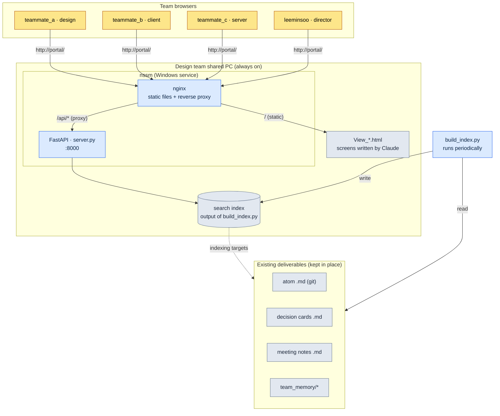

# 20.3 The Design Portal — Where the Team Comes In Through a Browser

Late Thursday afternoon, just before a build goes up, teammate B — a client programmer — posts in the team messenger: "Did we agree on 0.8 seconds for the global cooldown constant at last week's combat TF (task force)? Which document is that written in?" Five minutes later, teammate A, a game designer, replies: "It should be in the meeting notes somewhere... looking." Seven more minutes pass. "Which git folder was it again?"

That 12-minute round trip didn't happen because the information was missing. The information clearly exists. It's written in the atom file, in the meeting notes, in the decision card. It's just that those three live in different drawers, and each drawer opens a different way. The problem isn't the drawers — it's the handles.

This chapter is about merging those handles into one. Not an in-house full-stack build, but a thin web layer laid over the design deliverables already piling up in folders, so that a teammate gets in by typing a single word, `portal`, into the browser address bar. Only three tools are involved: FastAPI to stand up a search API in Python, nginx in front of it, and nssm to keep everything alive for as long as the PC is on, without anyone having to start it.

---

## 20.3.1 Scattered Deliverables, a Unified Entrance

Design deliverables scatter by nature. Not because anyone scatters them on purpose, but because each deliverable lands in its most natural spot. Atoms go into the git repository as Markdown, schedules go to the task management tool, real-time conversation goes to chat, KPIs go to a separate dashboard. Each one being in its proper place is correct. The problem is that a person has to carry a map of all those places in their head.

For a new hire, that map itself is the entry barrier. To find "the global cooldown value," you have to (1) judge whether it's a decision card, an atom, or meeting notes, (2) open the corresponding tool, and (3) query again in that tool's search syntax. All three steps are tacit knowledge that comes from experience.

The idea behind the portal is simple. Leave the deliverables where they are. Instead, lay a single layer of search index on top of them and expose the index through a browser. Don't set up seven desks; set up one desk with seven drawers. The drawers stay the same, but a person sits down only once.

Here is the configuration of the portal I actually run on Project A. No dedicated server hardware — it runs always-on, on a single shared PC in the design team.



In the diagram, the gray cluster at the bottom is what already existed; what the portal adds is only the three thin layers above it — the index, FastAPI, and nginx. The structure opens a new entrance without touching the deliverables.

---

## 20.3.2 The Four Parts: build_index.py · server.py · nginx · nssm

The whole portal comes down to five small files. Taken one at a time, each does exactly one job.

**build_index.py — converts deliverables into a searchable form.** It walks the git repository, reads all the Markdown among the atoms, decision cards, meeting notes, and everything under `team_memory/`, extracts titles, bodies, and tags, and drops them into a single index file. All this script does is "flatten scattered files into one-line records." It never touches the files themselves, so even if the index breaks, the originals are safe. Re-run it periodically (say, every 30 minutes, or from a git commit hook) and it stays current.

**server.py — stands up the search API with FastAPI.** It loads the index into memory, and when a `/api/search?q=...` request comes in, it returns the matching records as JSON. The code doesn't exceed one screen.

```python
# server.py (excerpt — skeleton of the search endpoint)
from fastapi import FastAPI
import json, pathlib

app = FastAPI()
INDEX = json.loads(pathlib.Path("index.json").read_text(encoding="utf-8"))

@app.get("/api/search")
def search(q: str):
    q = q.strip().lower()
    hits = [r for r in INDEX
            if q in r["title"].lower() or q in r["body"].lower()]
    # group by kind and return → atoms / decisions / meeting notes / memory
    by_kind = {}
    for r in hits:
        by_kind.setdefault(r["kind"], []).append(
            {"id": r["id"], "title": r["title"], "path": r["path"]})
    return {"query": q, "count": len(hits), "results": by_kind}
```

The search algorithm deliberately starts as plain substring matching. With a mid-sized team (10–50 people) and documents in the thousands, this simplicity actually lowers maintenance cost. Morphological analysis or vector search can be layered on after the complaint "search is weak" actually shows up — that won't be too late.

**nginx — serves the static screens and proxies to the API.** It serves the `View_*.html` files I asked Claude to build (a search screen, a results screen, a dashboard screen) as static files, and forwards only the requests under `/api/` to the FastAPI (:8000) behind it. From a teammate's point of view, the screens and the search all happen at one and the same address, `http://portal/`. Because Claude draws the screens directly in HTML, when a designer needs a new screen, the whole job is asking "make me a screen that shows only the decision cards," receiving `View_decisions.html`, and dropping it into the folder. Having no front-end build pipeline is a clear advantage for a mid-sized team.

**nssm — keeps it alive without anyone turning it on.** The portal's core requirement is "teammates must be able to search even when I'm not at my desk." If you launch server.py from a terminal, it dies the moment that terminal closes, and it's gone after a PC reboot. nssm (the Non-Sucking Service Manager) registers this Python process as a Windows service: it comes up automatically when the PC boots, and it gets revived automatically if the process dies. Registration takes one pass.

```powershell
# Register FastAPI as a Windows service with nssm (one time)
nssm install Portal "C:\Python\python.exe" "C:\portal\portal_run.py"
nssm set Portal AppDirectory "C:\portal"
nssm start Portal
```

Here `portal_run.py` is a five-line launcher: one line that starts server.py with uvicorn, plus the minimal skeleton that keeps the service from exiting. The only command a human has to remember is `nssm start`, and even that never needs typing again once it's registered.

Here is the division of labor among the four parts at a glance.

<svg xmlns="http://www.w3.org/2000/svg" viewBox="0 0 720 250" font-family="sans-serif" font-size="13">
  <rect x="0" y="0" width="720" height="250" fill="#fbfbfd"/>
  <!-- columns -->
  <g>
    <rect x="20" y="40" width="150" height="170" rx="8" fill="#eef4ff" stroke="#5b8def"/>
    <text x="95" y="65" text-anchor="middle" font-weight="bold" fill="#244">build_index.py</text>
    <text x="95" y="92" text-anchor="middle" fill="#345">deliverables → index</text>
    <text x="95" y="112" text-anchor="middle" fill="#345">flattening · tagging</text>
    <text x="95" y="148" text-anchor="middle" fill="#789" font-size="11">originals untouched</text>
    <text x="95" y="168" text-anchor="middle" fill="#789" font-size="11">re-run periodically</text>
  </g>
  <g>
    <rect x="200" y="40" width="150" height="170" rx="8" fill="#eafaf0" stroke="#3aa76d"/>
    <text x="275" y="65" text-anchor="middle" font-weight="bold" fill="#244">server.py</text>
    <text x="275" y="92" text-anchor="middle" fill="#345">FastAPI :8000</text>
    <text x="275" y="112" text-anchor="middle" fill="#345">/api/search</text>
    <text x="275" y="148" text-anchor="middle" fill="#789" font-size="11">groups by kind</text>
    <text x="275" y="168" text-anchor="middle" fill="#789" font-size="11">returns JSON</text>
  </g>
  <g>
    <rect x="380" y="40" width="150" height="170" rx="8" fill="#fff5e9" stroke="#e08a3c"/>
    <text x="455" y="65" text-anchor="middle" font-weight="bold" fill="#244">nginx</text>
    <text x="455" y="92" text-anchor="middle" fill="#345">serves View_*.html</text>
    <text x="455" y="112" text-anchor="middle" fill="#345">proxies /api/</text>
    <text x="455" y="148" text-anchor="middle" fill="#789" font-size="11">single address</text>
    <text x="455" y="168" text-anchor="middle" fill="#789" font-size="11">no build pipeline</text>
  </g>
  <g>
    <rect x="560" y="40" width="150" height="170" rx="8" fill="#f6eefe" stroke="#8a5be0"/>
    <text x="635" y="65" text-anchor="middle" font-weight="bold" fill="#244">nssm</text>
    <text x="635" y="92" text-anchor="middle" fill="#345">Windows service</text>
    <text x="635" y="112" text-anchor="middle" fill="#345">auto-start on boot</text>
    <text x="635" y="148" text-anchor="middle" fill="#789" font-size="11">revives if it dies</text>
    <text x="635" y="168" text-anchor="middle" fill="#789" font-size="11">always-on guaranteed</text>
  </g>
  <text x="360" y="232" text-anchor="middle" fill="#456" font-size="12">Data flow: deliverables → index → API → screens → browser (left to right)</text>
</svg>

---

## 20.3.3 One Scene of the Team Actually Searching

Descriptions of the parts alone don't make the portal's value land. Let's throw the question that ate 12 minutes earlier back at the portal. What follows is the prompt I gave Claude when building the search screen, the output I received, and the verification process, reproduced without compression.

My prompt:

> Build a single HTML page that fetches `index.json` and searches it. When a keyword is typed into the input box, call `/api/search?q=`, and show the results as cards in four groups: atoms / decision cards / meeting notes / memory. Clicking a result navigates to its original path (`path`). No external CSS/JS frameworks — one file. Name it `View_search.html`.

Claude's raw output (excerpt, exactly as received):

```html
<!-- View_search.html -->
<input id="q" placeholder="atom or keyword">
<div id="out"></div>
<script>
document.getElementById('q').addEventListener('keydown', async e => {
  if (e.key !== 'Enter') return;
  const r = await fetch('/api/search?q=' + encodeURIComponent(e.target.value));
  const d = await r.json();
  const order = ['atom','decision','meeting','memory'];
  const label = {atom:'atom', decision:'decision cards',
                 meeting:'meeting notes', memory:'memory'};
  out.innerHTML = order.filter(k => d.results[k]).map(k =>
    `<h3>${label[k]} (${d.results[k].length})</h3>` +
    d.results[k].map(x =>
      `<a href="${x.path}">${x.title}</a>`).join('<br>')
  ).join('') || 'No results';
});
</script>
```

This output was not a finished product. I didn't take it as is — I rejected two spots.

First, using `out` like a global variable without `getElementById` is risky code that leans on a browser idiom — it doesn't work in some environments. Second, `path` is an internal git path, so putting it straight into `href` means the browser can't open the file. It has to be fixed to go through `/view?path=`, so the portal routes that path back to one of its own screens.

My follow-up request:

> Fix two things. (1) Get `out` explicitly with `document.getElementById`. (2) Don't link results straight to the original path — route them through the `/view?path=` viewer endpoint. I'll add the viewer to server.py, so just change the links on the front end.

This round trip is the heart of it. Claude's first output was 80% right, but the remaining 20% were defects that only a human could catch — you have to know the context that this portal sits on top of git deliverables. Verification stays the human's job.

Run a search once, and a teammate's screen shows results grouped like this.

| Group | Results for the query "global cooldown" |
|---|---|
| atoms | `combat_global_cooldown_constant` |
| Decision cards | `D2026_Q2_017` (finalized at 0.8 seconds) |
| Meeting notes | `95_BattleTF`, session 2 |
| Memory | 1 one-on-one note from teammate B |

The 12-minute Thursday-afternoon round trip shrinks to 20 seconds of typing one word into a search box. And what matters more: those 20 seconds become something teammate B can finish alone, so teammate A's 12 minutes are never spent at all.

---

## 20.3.4 Costs and Benefits — How Far Is It Worth Building

There are roughly three ways to build a portal: develop a full stack in-house from scratch, adopt an external all-in-one tool like Notion or Coda, or lay thin automation over basic tools, as here. I chose the third, and the reason lies in scale — a mid-sized team.

In-house full-stack development gives the most freedom, but the burden of having to keep maintaining that web app arrives before the benefit does. Operational labor — authentication, deployment, DB migrations — lands on the design team. External all-in-one tools are fast, but they come with a monthly subscription, and above all a migration cost: the Markdown deliverables accumulated in git have to be moved into the tool's format. The FastAPI + nginx + nssm combination, by contrast, leaves the deliverables in place and adds only a single layer of index, so it's up and running in a few days, and maintenance amounts to occasionally touching up build_index.py.

Here is the change I felt on Project A before and after introducing the portal. The figures in the table are not precise measurements but the author's estimate (unverified); read the direction and the proportions, not the absolute values.

| Item | Without the portal | With the portal | Direction |
|---|---|---|---|
| Time per information lookup | Several minutes | Under 1 minute | Sharply reduced |
| Frequency of "where is this?" questions | Frequent | Rare | Decreased |
| New member tool onboarding | Around 2 weeks | A few days | Shortened |
| Filing rate of meeting notes and decision cards | About half | Most | Increased |

The last row is the most essential. When information becomes easy to find, it isn't just search that gets faster — the motivation behind the act of leaving records goes up. The cynicism of "why write meeting notes nobody will ever find" turns into "I write them because they show up in search." The portal is a search tool and, at the same time, a device that invites record-keeping. This virtuous cycle creates more value than merging a tool or two ever would.

That balance, though, is bound to team size. Once the team passes 50 people and deliverables swell into the tens of thousands, the limits of substring search and of single-PC serving show up at the same time. At that point, in-house full-stack development or adopting a search engine becomes justified. This configuration is "the right answer for a mid-sized team," not the answer at every scale.

---

## 20.3.5 Try It Yourself

**setup.** Pick one shared PC for the design team (or any PC that stays on). Install Python, nginx, and nssm. Confirm the locations of the deliverable folders to index (atoms, decision cards, meeting notes, team_memory).

**prompt.** Ask Claude for three things, in order.

> (1) "Build a build_index.py that reads the Markdown in this folder, extracts title, body, tags, and kind, and drops them into `index.json`. Determine the kind from path rules."
> (2) "Build a FastAPI server.py that loads that index.json into memory and searches it at `/api/search?q=`. Group the results by kind in the response."
> (3) "Build a single HTML file (View_search.html) that fetches index.json and searches it. No external frameworks — one file."

**verify.** Check three things yourself. (1) After running build_index.py, confirm the deliverable counts in index.json are right — look for missing folders. (2) Start server.py and call `/api/search?q=testkeyword` directly from the browser to see that the JSON comes back grouped. (3) Read the screen code Claude produced and catch whether the link paths expose internal git paths as is, and whether any code leans on global variables — the two defects from the previous section get filtered out exactly here. Finally, register the service with nssm and reboot the PC, to confirm the portal stays alive without anyone starting anything.

## 20.3.6 Solo Scale-Down

Even without a team, this configuration is useful as is, because a solo worker's deliverables scatter too. In setup, use your own PC instead of a shared one, and you can skip the nssm registration (start it with `python portal_run.py` only when needed). Keep the prompt the same — get all three of build_index.py, server.py, and View_search.html — but drop the team_memory part and index only the atoms, decisions, and meeting notes. For verify, checking the index.json count and running one search is enough. The core is the same — leave the deliverables in place, and open just one new search entrance.

---

### Key Takeaways

- Leave deliverables where they are; add a single index layer to unify the search entrance
- With the three parts FastAPI, nginx, and nssm, a mid-sized team's portal is running in a few days
- When search gets easy, the motivation to leave records rises with it

### Next Chapter Preview

- 20.4 MCP Project Management — Connecting the Tools the Company Already Uses to the LLM and the Portal
