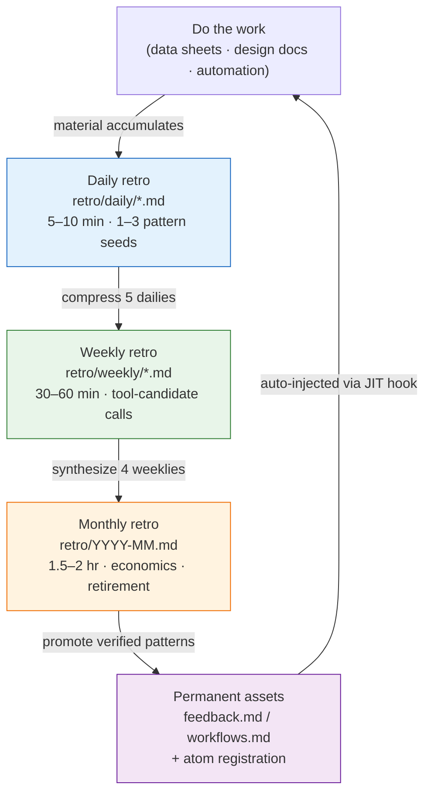

# Part 21 · Chapter 1. The Retrospective as the Starting Point of Everything

Friday, 6:40 p.m. I was about to close my laptop and head home when the day's work felt strangely familiar. I had tracked down and fixed a broken enum reference in a data sheet — and I was certain I had fixed the same thing last week. And the week before that. Each time I retyped the same prompt; each time I checked the same items in Claude's output. I only realized it was the third time just before the laptop lid closed.

That sensation — "this feels strangely familiar" — is the single most important moment in this entire book. Let it slip, and next week you repeat the same task a fourth time. Catch it and write it down as one line, and that line becomes a skill next week, and that skill becomes an atom a month later, injected automatically. The place where you catch it is the retrospective.

The other parts of this book covered "here is a tool" and "here is a pattern." This chapter covers where all those tools and patterns ignite. Where does a new slash command get made, how does a new atom get codified, and who weeds out the tool that gets used less than once a month? The answer always converges on the same place: the retrospective.

---

## 1.1 Catching Familiarity in One Line — A Worked Transcript

A retrospective is not a grand ritual. Let me open one of my actual daily retro files as is. The real path is `retro/daily/YYYY-MM-DD.md`; after a month, these files get compressed into weeklies (`retro/weekly/YYYY-Www.md`) and then into monthlies (`retro/YYYY-MM.md`). The rules live in `retro/README.md`.

The flow I actually use is not writing the retro file by hand. I hand the AI that day's work log and have it extract the patterns. Below is a reconstruction of an actual exchange from one Friday evening. The full prompt comes first, then Claude's raw output, unsummarized — including the parts that miss.

**[Prompt — typed by the human]**

> Summarize today's work as a retrospective. What I did today: ① fixed a broken enum reference in the character data sheet (the grade column didn't match the enum sheet) ② unified the tone of NPC dialogue ③ reran relation-map.
> If any of these is **a task I've repeated two or more times this week**, flag it, and if there is **a candidate worth turning into a tool**, list it separately. If there's nothing, say so. Don't force it.

**[Claude's raw output — no summary, no embellishment]**

> Here is today's work retrospective.
>
> **Repeated patterns detected**
> - ① Fixing the broken enum reference → the same item appears in this week's Tuesday retro. Flagging it as **repeated 2+ times**.
> - ② Unifying NPC dialogue tone → first appearance this week. Not a repeat.
> - ③ Rerunning relation-map → you are already using the relation-map-gen skill, so this task is already tooled. Not an additional candidate.
>
> **Tool candidates**
> - Enum reference validation **looks like it could become a skill** — something that cross-checks the data sheet's column values against the enum sheet and reports mismatches.
> - That said, I don't know the exact structure of the two sheets, so I can't be confident this is truly a repeatable pattern. You need to confirm whether Tuesday's breakage and today's breakage are **the same kind of breakage**. If the same column broke for the same reason, this is a strong skill candidate; if a different column broke for a different reason each time, it's hard to bundle into a skill.

The last paragraph is the key. The AI did not declare "let's build a skill." It asked back: **a human should confirm whether it's the same kind of breakage.** This is why the retrospective is not automatic.

**[Human verification — taking the AI's suggestion, but filtering it]**

I opened Tuesday's retro and compared. Tuesday's breakage was the `grade` column; today's breakage was also the `grade` column. **The same kind.** The AI's candidate suggestion passed verification. So I left one line in the daily retro.

> Repeated task: enum-grade reference validation (Tue & Fri, 2 times) → **skill candidate**. Decide on promotion at the next weekly retro.

That one line is everything. It took less than five minutes. And that one line is the first beat of the self-improving loop. If item ③ — the one the AI flagged as already tooled — had also gone onto the candidate list, one more unused duplicate tool would have been floating around a month later. With both the AI's filter and the human's filter working, exactly one real candidate remained.

---

## 1.2 Why the Retrospective Is the Starting Point

Which tasks repeat, which tools get used often, which atoms are missing — none of this is visible from a single work session. In the transcript above, the enum breakage surfaced as a candidate not because of "today" but because "Tuesday and today" were overlaid. Patterns emerge only when you overlay traces accumulated over a week, a month, a quarter. The retrospective is the time you deliberately create that overlay.

Patterns found in a retrospective split into two branches.

- A repeating pattern with valuable results → codify into a tool (skill, atom, hook)
- A pattern that repeats but produces no value → retire or simplify

You cannot make this call in the middle of work, because it breaks the work flow. In the moment of fixing the enum breakage, there is no room to ask "is this the third time?" The retrospective time you set aside separately is the seat of that judgment.

Whether a tool actually delivers value after it is built is measured in the same seat. A tool used once a month and a tool that saves an hour are not worth the same. Both the measurement and the retirement decision happen in the retrospective. Without it, tools only accumulate and never get cleaned up. A few years on, dozens of unused tools are getting in the way of search and operations.

To use a drawer analogy: the retrospective is the time you periodically empty your desk drawer. If the pen you use every day and the notepad you haven't pulled out in a year share one compartment, finding the pen costs a few extra seconds every time. Tools are exactly the same.

---

## 1.3 The Compression Flow of Daily, Weekly, and Monthly Retros

My retrospectives run on three tiers. The daily collects pattern seeds, the weekly bundles those seeds and compresses them into tool candidates, and the monthly evaluates each tool's economics and either codifies it as an asset or retires it. Each tier takes the output of the tier below as its input.

The last arrow closes the loop. Patterns codified as permanent assets are injected automatically into the next work session through a JIT (Just-In-Time) hook. In my environment, a hook called `inject_memory.py` picks out the relevant atoms and inserts them every time user input comes in. Once enum-grade validation is codified as an atom, the next time I type something like "validate the data sheet," that atom comes along on its own. The human no longer has to remember "right, there was that validation rule" every single time.

Take the retrospective out, and only the top-to-bottom arrows remain; the final arrow that returns assets to the work is severed. The loop does not close. The meaning of the word self-improving is precisely that this loop is turning. Tools improve the tools themselves; atoms grow more atoms. The engine is the one hour of retrospective a human sets aside.

---

## 1.4 The Five Things a Retrospective Sparks

From my impression after about half a year of running retrospectives on an MMORPG project I operate, a single retrospective sparks the following five kinds of output. The frequencies below are not precise statistics but my operational feel (author's estimate, unverified), and not every retrospective produces all five. On a quarterly scale, all five show up at least once.

Spelled out, the five are these. If you repeated the same decision two or more times this week, that is a **new atom candidate**. If you retyped the same prompt pattern several times in one week, that is a **new skill candidate** (the enum-grade validation in the previous section was this case). If a skill you used this week gave lackluster results, that is an **existing-skill improvement** — prompt adjustment, added verification, input standardization. An atom built last quarter that matched zero times over a month is a **retirement candidate**; unused, it only takes up tokens. Finally, **economics evaluation** weighs each tool's usage frequency against the manual effort it saves and decides keep, improve, or retire.

Here is how the five sit on one screen as a matrix. The horizontal axis is "does it repeat"; the vertical axis is "is it valuable."

<svg viewBox="0 0 520 320" xmlns="http://www.w3.org/2000/svg" font-family="sans-serif" font-size="13">
  <rect x="0" y="0" width="520" height="320" fill="#ffffff"/>
  <!-- axes -->
  <line x1="90" y1="40" x2="90" y2="280" stroke="#333" stroke-width="1.5"/>
  <line x1="90" y1="280" x2="500" y2="280" stroke="#333" stroke-width="1.5"/>
  <text x="295" y="305" text-anchor="middle" fill="#333">Repetition frequency  →  high</text>
  <text x="30" y="160" text-anchor="middle" fill="#333" transform="rotate(-90 30 160)">Outcome value  →  high</text>
  <!-- quadrants -->
  <rect x="92" y="42" width="200" height="118" fill="#fdecea"/>
  <rect x="294" y="42" width="204" height="118" fill="#e8f5e9"/>
  <rect x="92" y="162" width="200" height="116" fill="#f5f5f5"/>
  <rect x="294" y="162" width="204" height="116" fill="#fff8e1"/>
  <!-- labels -->
  <text x="192" y="95" text-anchor="middle" fill="#b71c1c" font-weight="bold">High value · low repetition</text>
  <text x="192" y="118" text-anchor="middle" fill="#444">→ Leave as is (hold off on tooling)</text>
  <text x="396" y="80" text-anchor="middle" fill="#1b5e20" font-weight="bold">High value · high repetition</text>
  <text x="396" y="103" text-anchor="middle" fill="#444">→ New skill / new atom candidate</text>
  <text x="396" y="126" text-anchor="middle" fill="#444">(enum-grade validation goes here)</text>
  <text x="192" y="215" text-anchor="middle" fill="#666" font-weight="bold">Low value · low repetition</text>
  <text x="192" y="238" text-anchor="middle" fill="#444">→ Ignore</text>
  <text x="396" y="215" text-anchor="middle" fill="#e65100" font-weight="bold">Low value · high repetition</text>
  <text x="396" y="238" text-anchor="middle" fill="#444">→ Retire / simplify candidate</text>
</svg>

What a retrospective does, in the end, is scatter the week's tasks across these quadrants. What lands in the upper right becomes a tool; what lands in the lower right gets weeded out. This sorting is how self-improving actually operates.

---

## 1.5 Where Patterns Get Codified as atoms

Let me follow the enum-grade validation candidate from the previous section the rest of the way: promoted to a skill, and from there codified as an atom. An atom is the form a pattern takes when something roughly discovered in a retrospective has passed verification and become a permanent asset.

My memory already holds atoms codified that way. One of them is `retro_atom_natural_invitation`. As the name says, it carries the principle that "in a retrospective, an atom appears as a natural invitation, not a command." This atom is itself a meta-pattern discovered over many cycles of retrospectives — only after experiencing several times that compulsively forcing "this must be pinned down as an atom" mid-retro turns the retrospective into a formality did it harden into one line.

Whether codification actually pays off is also managed by score. My environment has a script called `atom_score.py` that grades how often each atom actually matches and gets used. The results are saved to `_scores_latest.json`, and atoms that clear a certain score are injected automatically into `CLAUDE.md`. In other words, the better used an atom is, the more often it surfaces in front of you, while an unused atom loses points and drifts toward the retirement pile. This grade-and-inject cycle is the automated portion of the quadrants in §1.4.

One thing needs to be said honestly here. This score does not convert directly into a quantitative metric like "saved 30 hours a month." The time an atom saves is tricky to measure. So rather than asserting an ROI (return on investment) figure, it is more honest to speak only in direction and proportion: "well-used atoms score high, and high-scoring atoms get injected more often and cut manual effort" — direction, not multiples.

---

## 1.6 What Happens Where There Is No Retrospective

The common scenery on a team that does not set retrospectives aside looks like this.

- The same meeting repeats every quarter ("didn't we already settle this once…").
- Atoms and skills exist only in one person's head. When that person leaves, they vanish too.
- Tools only accumulate. Unused tools get in the way of search and operations.
- When a new designer joins, the learning material is scattered, so they relive the same trial and error from scratch.

One hour of retrospective makes most of this scenery disappear. Think back to the Friday evening in §1.1 — the only difference is whether you write "this feels strangely familiar" down as one line or let it slip away. Writing it takes five minutes; the time lost by not writing it compounds into the fourth and fifth repetitions. It is the classic case of losing more time by refusing to spend any.

Of course, there is no need to stand up a grand retrospective system from day one. On a large team, starting from a five-minute daily retro may feel frustratingly slow. But laying down the full daily-weekly-monthly three-tier system in one go makes it easy to chase the form and miss the substance. The safe order is for someone to experience the value of retrospectives firsthand at the smallest tier, then pull it up to the next.

Every tool, atom, and pattern you meet in this book ignited in someone's retrospective. It is no exaggeration to say that this book itself is the product of half a year of my accumulated retrospectives. "The retrospective is the starting point" is not a metaphor — it points to the fact that this book's table of contents itself came out of retrospectives.

---

> **Beyond Games.** A retrospective that catches the sensation of "this feels strangely familiar — I did this last week too" in one line is the entrance to self-improvement in any workplace with recurring tasks, not just game development. When you close out your day, write just one line — "what did I do by hand twice today" — and on Friday overlay the week's five lines; the pattern that each day kept hidden shows itself at the weekly scale. For example, if a general-affairs staffer catches "I retype the same form email every week" in a retrospective, that one line becomes an email template next week and an automated send rule a month later. The point is not the sophistication of the tool but the act of overlaying traces itself — and putting a filter on the AI when you have it extract candidates: "don't force it, and drop anything already automated."

## 1.7 Try It Yourself

This is the smallest version of adopting the retrospective loop for the first time. You can start with almost no tooling installed.

**setup**

1. Create one folder, `retro/daily/`, inside your working folder.
2. Open an empty file named with today's date, `retro/daily/2026-06-06.md`. Nothing more is needed.

**prompt**

At the end of each workday, give the AI that day's work log and ask like this.

> Today I did [tasks 1, 2, 3]. If any of these is **a task I've repeated two or more times this week**, flag it, and if there is **a repeating pattern worth turning into a tool (skill)**, list it separately. Drop any task that is already tooled from the candidates. If there's nothing, say so. Don't force it.

The last two sentences ("drop anything already tooled," "don't force it") are the filter. Without them, the AI over-generates plausible candidates every time, and a month later unused tools have piled up.

**verify**

1. Check yourself, with **one direct comparison**, whether the repeated item the AI flagged really is the same kind of repetition (like the Tue/Fri `grade` column comparison earlier). Same kind: confirm the candidate. Different: discard.
2. Leave the confirmed candidate as one line in the daily retro: `Repeat: [task] (N times) → skill candidate, decide at weekly retro`.
3. A week later, hand the five daily retros back to the AI and ask it to "shortlist the candidates worth promoting to skills." Build tools only from candidates that have survived twice or more.

**Solo Scale-Down**

If you are starting alone, with no team and no extra tools, shrink it down like this.

- Skip the folder; write just one dated line in a memo app.
- One sentence a day, no more: "the one task that felt strangely familiar today." If there isn't one, leave it blank.
- On Friday, look at the week's five lines at a glance. If the same sentence appears twice or more, turn that one thing — and only that — into a tool next week.

The point is not the sophistication of the tool but **the act of overlaying**. A single day hides the pattern; a week reveals it. The five minutes you spend catching that reveal is the entrance to the self-improving loop.

---

### Key Takeaways
- The retrospective is the entrance to the self-improving loop: it catches repetition in one line and codifies it into a tool.
- The daily gathers seeds, the weekly filters candidates, and the monthly screens for economics to build the assets.
- State the effect as direction, not multiples — well-used atoms get injected more often.
