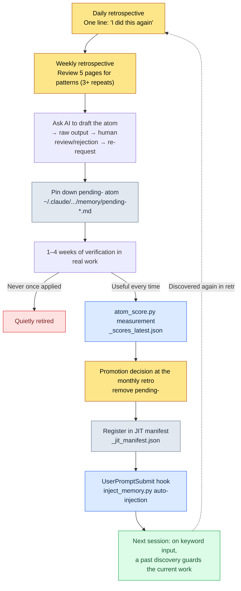

# Part 21 · Chapter 2. The Retrospective System and Atom Promotion — Turning Discoveries into Permanent Assets

Monday morning. I had pulled up last week's five daily retrospectives on one screen, about to start the week. Tuesday's entry said, "Forgot the integrity check before exporting the data sheets." Thursday's entry had almost the same sentence. And that very Monday morning, I was doing it again. I had pushed a sheet with broken FKs straight into the client/server build and had to pull it back out. It was the third time.

This moment is the heart of the retrospective system. The fact that you are doing something for the third time is never visible while you are doing it. Your hands move on habit and your head whispers, "this is just something I always do." Repetition becomes visible only when you gather the traces and look at them afterward. The retrospective is the device that gathers those traces, and atom promotion is the device that pins down the repetition you find there as a rule, so you never do it by hand again.

This chapter follows how those two devices interlock — how one actual daily retrospective file turns into one atom line in the JIT manifest, all the way to the end.

---

## 21.2.1 Discoveries Come Only from a Pile of Traces

There is a premise to establish first: repetition is not perceived in real time.

A game designer's day is a string of decisions. Which enum a data sheet column should use, whether a skill cooldown should be in seconds or in frames, where in the document to record a fuzzy agreement from a meeting. Each of these decisions is too small to stick in memory. But if I am making the same decision three times in one week, it is no longer a decision — it is a rule. And if it is a rule that I keep re-deciding from scratch every time, that is waste.

The problem is that this waste is invisible. So I leave traces. Five minutes a day: one line each for what I did today and for anything I did more than once today. After a week, five pages of traces have piled up, and only then does "huh, this is written down three times" become visible.

This is what separates a retrospective from a plain diary. A diary records impressions; a retrospective records traces in order to extract patterns. That is why the format must be fixed. If the format changes every time, you cannot lay five pages side by side and compare them, and if you cannot compare, you cannot see patterns.

---

## 21.2.2 The Three Cycles Are Units of Role, Not Units of Time

The reason retrospectives are split into daily, weekly, and monthly cycles is not the passage of time. It is that each cycle does fundamentally different work.

<svg viewBox="0 0 720 300" xmlns="http://www.w3.org/2000/svg" font-family="sans-serif">
  <rect x="0" y="0" width="720" height="300" fill="#fbfbfd"/>
  <!-- Daily -->
  <rect x="30" y="40" width="190" height="220" rx="10" fill="#eaf2fb" stroke="#3b6fb0" stroke-width="1.5"/>
  <text x="125" y="70" text-anchor="middle" font-size="17" font-weight="bold" fill="#1f3d63">Daily · 5–10 min</text>
  <text x="125" y="100" text-anchor="middle" font-size="13" fill="#33475b">Role: pin down traces</text>
  <line x1="50" y1="115" x2="200" y2="115" stroke="#c2d4e8" stroke-width="1"/>
  <text x="125" y="142" text-anchor="middle" font-size="12" fill="#4a5b6b">What I did today</text>
  <text x="125" y="166" text-anchor="middle" font-size="12" fill="#4a5b6b">Decisions made twice</text>
  <text x="125" y="190" text-anchor="middle" font-size="12" fill="#4a5b6b">Tools left unused</text>
  <text x="125" y="214" text-anchor="middle" font-size="12" fill="#4a5b6b">Handoff to next session</text>
  <text x="125" y="244" text-anchor="middle" font-size="11" font-style="italic" fill="#7a8a99">Output: 5 pages/week</text>
  <!-- arrow 1 -->
  <polygon points="225,150 255,135 255,165" fill="#9bb3cc"/>
  <!-- Weekly -->
  <rect x="265" y="40" width="190" height="220" rx="10" fill="#eef6ee" stroke="#3f8a4f" stroke-width="1.5"/>
  <text x="360" y="70" text-anchor="middle" font-size="17" font-weight="bold" fill="#1f4a2a">Weekly · 30–60 min</text>
  <text x="360" y="100" text-anchor="middle" font-size="13" fill="#33475b">Role: extract patterns</text>
  <line x1="285" y1="115" x2="435" y2="115" stroke="#c8e0c8" stroke-width="1"/>
  <text x="360" y="142" text-anchor="middle" font-size="12" fill="#4a5b6b">Review 5 daily pages</text>
  <text x="360" y="166" text-anchor="middle" font-size="12" fill="#4a5b6b">3+ repeats → candidate</text>
  <text x="360" y="190" text-anchor="middle" font-size="12" fill="#4a5b6b">Pin down pending- atom</text>
  <text x="360" y="244" text-anchor="middle" font-size="11" font-style="italic" fill="#7a8a99">Output: 1–3 candidates</text>
  <!-- arrow 2 -->
  <polygon points="460,150 490,135 490,165" fill="#9bb3cc"/>
  <!-- Monthly -->
  <rect x="500" y="40" width="190" height="220" rx="10" fill="#fbf2ea" stroke="#b07b3b" stroke-width="1.5"/>
  <text x="595" y="70" text-anchor="middle" font-size="17" font-weight="bold" fill="#634021">Monthly · 1.5–2h</text>
  <text x="595" y="100" text-anchor="middle" font-size="13" fill="#33475b">Role: economics · promotion</text>
  <line x1="520" y1="115" x2="670" y2="115" stroke="#e8d4c2" stroke-width="1"/>
  <text x="595" y="142" text-anchor="middle" font-size="12" fill="#4a5b6b">Tool economics review</text>
  <text x="595" y="166" text-anchor="middle" font-size="12" fill="#4a5b6b">Promote / retire decisions</text>
  <text x="595" y="190" text-anchor="middle" font-size="12" fill="#4a5b6b">Quarterly planning</text>
  <text x="595" y="244" text-anchor="middle" font-size="11" font-style="italic" fill="#7a8a99">Output: official atoms</text>
</svg>

The daily pins down traces. No judgment — just write. The weekly bundles the five pages of traces and looks for patterns. This is where the first judgment — "this is a repetition" — comes in. The monthly looks at the entire accumulated toolset and evaluates its economics. It decides what to keep alive and what to throw away.

Drop one cycle and the others collapse. Weekly without daily means you cannot remember what happened a week ago, so the traces come up empty. Monthly without weekly means facing a month's worth of dailies in one sitting — comparing 22 pages at once is close to impossible. No patterns appear; only fatigue accumulates.

The workshop analogy fits well. The daily is the five minutes of clearing your desk every evening. The weekly is the thirty minutes of reorganizing one drawer on the weekend. The monthly is the two hours each quarter spent reviewing the layout of the whole workshop. If you never clear the desk, you cannot reorganize the drawer on the weekend, and if the drawers are a mess, staring at the layout gets you nowhere.

---

## 21.2.3 The Daily Retrospective — Pinning Down in Five Minutes

The daily retrospective files I actually use pile up by date at paths like `retro/daily/2026-05-30.md`. The `/retro` slash command lays down the template automatically.

```markdown
# Daily Retrospective 2026-05-30

## What I Did Today (3–5 lines)
- Added 12 enum types to the new skill data sheet + reordered the cooldown columns
- Balance sim pass 1 (adjusted drop table weights)
- Refreshed the client/server data export builds together

## Repetition Spotted (if any)
- Forgot the integrity check before the data export build again → built with broken FKs → third time
- Ran the balance sim without pinning the seed — not reproducible (second time)

## Retirement Candidates
- Tools not used even once today: (recorded only for monthly accumulation)

## Handoff to the Next Session
- Fill the two broken FKs (skill→effect references) first, then rebuild
- Candidate: consider making the sim seed-pinning option the default
```

Five minutes is enough to fill it in. Because the format is fixed, I never have to wonder anew what to write. The slots are set; I only fill the slots.

The decisive slot here is "Repetition Spotted." It is allowed to stay empty. Most days it is empty. But when the awareness hits that I did the same thing twice today, I write one line. The example above — "Forgot the integrity check before the data export build again → third time" — is exactly that. That one line gets bundled into a pattern at the weekly retrospective a few days later, and a few weeks after that it gets pinned down as an atom or a skill.

Automatic capture reduces the manual work. When the git commit log, the atom change history, and the skill usage log are merged into the daily retrospective automatically, half of the "What I Did Today" slot is already filled. The human only adds what the git log cannot see — the awareness that "I did this again."

The last slot, "Handoff to the Next Session," is a note to tomorrow's me. With it, loading context at the start of a new session takes one or two minutes. Without it, I spend longer groping for "what was I in the middle of yesterday?" My own MEMORY.md actually maintains a separate "check first next session" section, which is the accumulated, higher-level version of this daily handoff.

---

## 21.2.4 The Weekly Retrospective — Where Patterns First Show Themselves

The weekly retrospective starts by putting the five daily pages on one screen. The files pile up at paths like `retro/weekly/2026-W21.md`.

```markdown
# Weekly Retrospective 2026-W22 (5/25–5/31)

## Summary of This Week's Work
- Updated skill/balance data sheets, ran the drop table sim twice
- 4 data export builds (2 of them built with broken FKs/enums)

## Patterns Spotted
- "Forgot the pre-export integrity check" repeated in 3 dailies → atom candidate
- "Balance sim seed not pinned" repeated in 2 dailies → review sim defaults

## Atom Candidates
- pending-data-check-before-export (a rule that enforces integrity verification before export builds)

## Skill Candidates
- (None — an atom is enough this week)

## Existing Tool Check
- Unused: relation-map-gen (0 uses this week)
- Most used: check (integrity cascade), excel-reader, /retro

## Next Week's Plan
- Run pending-data-check-before-export one more week, then decide on promotion
```

This is where judgment enters for the first time. "Forgot the pre-export check, repeated in 3 dailies" is an arithmetic fact, but "this is worth pinning down as an atom" is a judgment. The reason three repetitions is the baseline is simple. Once is chance, twice might be chance, three times is a pattern.

Once the judgment is made, I pin it down immediately — not as an official atom, but as a provisional atom carrying the `pending-` prefix. It lands in my project memory folder like this.

```
~/.claude/projects/<project>/memory/
  pending-data-check-before-export.md
```

The `pending-` prefix is a marker that says "this is still under verification." The marker matters because turning an unverified hunch straight into a team-wide rule breaks two things. One is trust — when unverified rules keep being wrong, people stop trusting the rules themselves. The other is accumulation — without a verification gate, hunches pile up as is and the memory becomes a garbage can.

So a `pending-` atom is run inside real work for a week, at most a month. If it genuinely proves useful every time, it survives; if it never once applies, it is quietly deleted.

---

## 21.2.5 The Monthly Retrospective — Measuring Tool Health and Choosing What to Keep

The monthly retrospective is where I spread out a month's accumulation and check the health of the entire toolset. The files pile up by month, like `retro/2026-05.md`.

```markdown
# Monthly Retrospective 2026-05

## This Month's Totals
- Daily retrospectives: 22, weekly retrospectives: 4
- New atoms: 4 (data-check-before-export, sim-seed-pinning, and others)
- New skills: 1 (relation-map-gen option upgrade)
- Retired atoms: 1

## Tool Economics Review
- Monthly use count per skill + felt savings (qualitative)
- Skills used less than once a month → retirement candidates
- Most valuable tools: check (integrity cascade), excel-reader, /retro

## Atom Distribution
- Totals by prefix (data: X, sim: Y, meeting: Z ...)
- Retirement candidates: atoms with 0 matches in a month

## Quarterly Plan
- To introduce next month: impact (impact tracking), automatic schema-doc refresh

## Book Material (when applicable)
- Cases this month worth citing in the book: 1 worked example of atom promotion
```

The heart of the monthly is the economics review. Every tool looks valuable when you build it, but a month later half of them go untouched. I use five yardsticks to sort them out.

The five criteria are usage frequency, time saved, cognitive load, maintenance cost, and replaceability. Usage frequency: once a month or more and it stays for now; less than that and it goes on the retirement list. Time saved: multiply the felt savings per use by the frequency — I do not commit to minute-level numbers here. "It feels like a few minutes per use, and I use it ten times a month, so the total is large" is the honest level of qualitative judgment. Cognitive load: when the slash commands I have to memorize exceed twelve, I treat it as a signal to clean up. There is a limit to how many commands a person can carry around in their head. Maintenance cost: is this a tool I have to touch every time the data sheets change? Replaceability: has a simpler method appeared?

Combining the five yardsticks, I decide whether to keep, drop, or fix each tool. An hour is enough to go through thirty to fifty tools. That said, in the first month or two there are so few tools that the review takes well under an hour. In that period it is better to spend the time creating new tools than evaluating them. The economics review is a safety device that only starts doing real work once tools have accumulated.

---

## 21.2.6 Worked Transcript: From One Daily Line to One Atom Line in the JIT Manifest

From here on is the spine of this chapter. I follow the process in which the pieces scattered above actually start from a single line and travel all the way to automatic injection in every session — from the retrospective moment to the very end. The moments where I rejected the output and where the AI answered ambiguously are left in as they happened.

**Step 1 — Awareness in the daily.** While writing the May 30 daily retrospective, I put one line in the "Repetition Spotted" slot.

```
- Forgot the integrity check before the data export build again → built with broken FKs → third time
```

I built no tool at this point. I only left a trace.

**Step 2 — Confirm the pattern in the weekly and ask the AI to turn it into an atom.** A few days later, when I spread the five daily pages at the weekly retrospective, the same line was there in three places. So the full prompt I threw at Claude was this.

> Three of this week's daily retrospectives repeat "I keep forgetting to run the integrity check by hand before the data export build." I want to turn this into a pending atom. Draft the atom body for me. Format it like the other atoms in our memory: frontmatter (name, status, trigger) plus a one-paragraph rule.

Claude's raw output was this (verbatim, no summarizing).

> ```markdown
> ---
> name: data-check-before-export
> status: pending
> trigger: ["data", "export", "pre-build", "integrity"]
> ---
> Before running a client/server export build of the game data sheets, always
> run the integrity check (check cascade) first, and export only after
> confirming zero FK, enum, and reference violations. If a violation is found,
> stop the export and notify the owner of the failure details via ClickUp.
> ```
>
> You can save this atom as `pending-data-check-before-export.md`. One caveat: among the trigger keywords, "data" is too broad and could also match situations unrelated to export (browsing data sheets, data meetings, and so on). I recommend removing it.

**Step 3 — Human verification and partial rejection.** The AI doubting one of its own triggers was a fair point. But I went one step further. I did not like that the rule body bundled both "integrity verification" and "ClickUp notification on failure." The failure notification is already a separate atom owned by `integrity_check_clickup_notify`. If one atom carries two responsibilities, then later, when I want to change only the notification rule, I end up touching the verification rule too. So I rejected it and asked again.

> Good — let's drop the "data" trigger. And the ClickUp notification on failure is already handled by integrity_check_clickup_notify, so take it out of this atom. Narrow this atom down so it is responsible only for pre-export integrity verification.

After the re-request, the body Claude narrowed down was this.

> ```markdown
> ---
> name: data-check-before-export
> status: pending
> trigger: ["data build", "export", "pre-build verification"]
> ---
> Before running a client/server export build of the game data sheets, run the
> integrity check (check cascade) first. Checks: FK referential integrity, enum
> value validity, cross-table reference consistency. Export only after zero
> violations are confirmed. Failure notification is the responsibility of integrity_check_clickup_notify; this rule does not get involved.
> ```

This is the version I accepted. It carries a single responsibility, and the triggers are narrowed to the export context. I saved this file as `pending-data-check-before-export.md`. The key point here is that I did not use the AI's first output as is. The AI supplied the format and doubted one trigger, but the design judgment — "narrow it to one responsibility" — was made by a human.

**Step 4 — One week of operational verification.** Over the next week, this pending atom came up every time I ran a data export build, and it actually caught broken enums right before a build twice. It never once misfired. It had earned the right to survive.

**Step 5 — Promotion decision and score measurement at the monthly.** At the monthly retrospective, I put this pending atom on the promotion list. Promotion is judged by measurement, not gut feeling. My environment has a script that scores each atom's match frequency and usefulness.

```bash
python ~/.claude/scripts/atom_score.py
# → refreshes ~/.claude/projects/<project>/memory/_scores_latest.json
```

The script tallies how many times each atom matched its triggers over the period and whether it was actually cited in the work, and drops the result into `_scores_latest.json`. Atoms whose score crosses a set threshold are wired to be auto-injected into CLAUDE.md. By actual measurement in May 2026, `pending-data-check-before-export` matched on every export build for a week, so the score was sufficient. Promotion confirmed.

**Step 6 — Remove `pending-`, register in the JIT manifest.** I stripped the prefix, made it an official atom, and added one line to the JIT manifest.

```
~/.claude/projects/<project>/memory/_jit_manifest.json
```

The UserPromptSubmit hook (`~/.claude/hooks/inject_memory.py`) reads this manifest on every input. If the input contains "data build" or "export", the atom body is automatically inserted into the context.

**Step 7 — The loop closes.** The moment I typed "run the data export build" for the next build, without my asking for anything, Claude spoke first.

> Shall I run the integrity check (check cascade) before the export? I will check FK references, enum values, and cross-table reference consistency, confirm zero violations, and then export.

The one line of "I did this again," written in a daily retrospective three weeks earlier, had come back as a rule that guards the current work on its own. The verification I used to do by hand, I never do by hand again. This scene is exactly what "the loop closed" means.

---

## 21.2.7 From Discovery to Auto-Injection: The Full Picture of the Promotion Loop

Compressed into a single flowchart, the worked transcript above looks like this. Discovery happens in the daily, verification is done by the operating period, promotion is decided by measurement, and the manifest finishes turning it into an asset.



The final dotted line is the whole point of this diagram. An auto-injected atom exposes yet another repetition, which goes back into the retrospective and gives birth to the next atom. Each turn of the loop removes one more thing done by hand. Let this loop accumulate for six months to a year, and the retrospective is no longer a diary — it is the brain of the work system.

---

## 21.2.8 Let the Retrospective Invite Atoms Naturally

The most fragile link in the promotion loop is step 1 — the moment of writing "I did this again." When busy, people leave the retrospective slot empty and move on. Then no trace remains; without traces, no pattern shows up at the weekly; without patterns, no atom is born. The entrance to the loop gets blocked.

That is why my environment has an atom called `retro_atom_natural_invitation`. The rule: when writing a retrospective, do not force atom creation as a duty — leave it as a natural invitation. That is, not "you must extract one atom candidate today," but: keep the "Repetition Spotted" slot in the template as a slot that may stay empty, while gently nudging you to drop in a line when there is something worth one line. Make it a duty and you end up squeezing out fake patterns; leave it as an invitation and only real repetitions get caught, naturally.

This hair's-breadth difference decides whether the loop is sustainable. A mandatory retrospective does not survive two weeks before it fills up with perfunctory lies. An invitation-style retrospective leaves the slot blank on days with nothing to write, so it carries no burden, and therefore it lasts. It has to last for traces to pile up, and traces have to pile up for patterns to show.

This atom itself was born from a retrospective. While running retrospectives as a duty, I noticed within days — in the dailies — that the slots were being filled with fakes; that discovery went through the weekly and was promoted into this rule. A rule that improves the retrospective came out of the retrospective.

---

## 21.2.9 Where Things Usually Break

Run the loop for a while and it keeps collapsing in the same places.

Skipping retrospectives is the most common. Skip three days because you are busy, and those three days of traces are gone forever. The countermeasure is simple — leave every other slot empty if you must, but write the one line of "What I Did Today." Even one minute instead of five still leaves a trace.

Re-inventing the format every time is also dangerous. Free-form entries cannot be laid side by side and compared across five pages. If comparison fails, the weekly's core job — pattern extraction — becomes impossible. That is why `/retro` forcibly lays down the template.

Not retiring tools is another trap. If atoms and skills only grow and never get dropped, cognitive load accumulates. The moment slash commands exceed twelve, your head can no longer hold all the tools. The monthly economics review is the only device that stops this accumulation.

Skipping the promotion gate is dangerous too. Turn hunches straight into official atoms and unverified rules pile up. The gate — passing through `pending-` and promoting by measurement — must sit between discovery and asset-making.

Finally, skipping retrospectives because you work alone and have no team to share with is a misunderstanding. The entire worked transcript above ran in a solo environment. Only the team-share merge step drops out; the discovery → pending → measurement → promotion → JIT injection loop runs exactly the same solo. If anything, in a solo environment this loop is the only external reviewer you have.

---

> **Beyond Games.** The promotion loop — one daily line passing through verification to become a permanent rule — is a procedure for making sure a lesson learned once never has to be done by hand again, whatever your line of work. The key is the gate: instead of fixing a discovery into a team rule right away, run it as `pending` for a week and formalize it only when it actually proved useful every time — because turning unverified hunches straight into rules makes people stop trusting the rules themselves. For example, if an operations team keeps "double-check that the totals add up before submitting the report" as a provisional checklist, runs it for a week, and elevates it to an official standard procedure only after it actually catches an error or two, the design judgment of narrowing each rule to a single responsibility (not bundling several checks into one line) follows naturally.

## Try It Yourself

**setup.** Lay down the retrospective folders and template.

```bash
mkdir -p ~/.claude/projects/<your-project>/memory/retro/daily
mkdir -p ~/.claude/projects/<your-project>/memory/retro/weekly
# Save one daily template file as retro/_template_daily.md
```

**prompt.** After a week of daily retrospectives has piled up, throw this at Claude in your weekly retrospective.

> I'm pasting this week's five daily retrospectives. Find the tasks and decisions repeated three or more times and organize them as atom candidates. Each candidate should have frontmatter (name, status: pending, an array of trigger keywords) and a one-paragraph rule. If a trigger is too broad, propose a narrower one; if an atom carries two responsibilities, propose splitting it.

**verify.** Do not use the candidates as is — verify three things. (1) Does each atom carry exactly one responsibility? If two, reject and ask for a split. (2) Do the trigger keywords match only that task's context? If too broad, reject. (3) Was it really repeated three times, or just twice by chance? If chance, do not even create the pending file. Save only the candidates that pass all three checks with the `pending-` prefix, and promote them officially only after a week of operation in which they proved useful every time.

---

## 21.2.10 Solo Scale-Down

If you have no team, no JIT hook, and no score script yet, you can imitate the entire loop with the following single file.

Create one file, `retro.md`, with just three slots.

```markdown
## Today (1 line)
- 

## Did It Again (1 line, if any)
- 

## Pin-Down Candidates (when "did it again" hits 3, move it here)
- [ ] (one-sentence rule) — verified: useful ___ times
```

Fill in only the top two slots every day. When the same line piles up three times under "Did It Again," move it to the third slot and write it as a one-sentence rule. Count how many times that rule actually proved useful over the next week, write the count in the slot, and if it reaches three or more, move the sentence officially into your project memory (CLAUDE.md). Even without a JIT hook, a rule placed in CLAUDE.md follows along in every next session, and that alone completes the minimal form of the loop where past discoveries help present work.

What matters is not how fancy the tools are but that the gate exists. With just the gate — "did it again ×3 → pin it down → useful ×3 → make it permanent" — the self-improving loop runs on a single file.

---

### Key Takeaways
- Repetition is invisible during the work; it shows only when you gather traces and look back at them
- Without the pending gate and measurement, retrospectives end at idea generation and never become assets
- When one daily line closes into one JIT manifest line, the past helps the present

### Next Chapter Preview
- Chapter 3. Closing the Self-Improving Loop — The Moment Retrospectives, Atoms, and JIT Merge into One System
