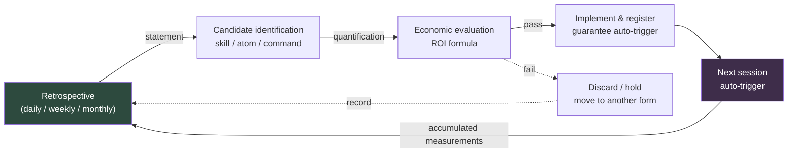

# Part 21 · Chapter 3. Closing the Self-Improving Loop

> Does the cycle that starts in a retrospective come back to the retrospective? If it doesn't close, it is a memo, not a system.

---

I open a retrospective from six months ago. "Terminology isn't consistent." "Documents are hard to find." "I keep getting the same questions." I open the retrospective I wrote this morning. "Terminology isn't consistent." "Documents are hard to find." "I keep getting the same questions."

Word for word, identical. It's not that we skipped retrospectives. We did them faithfully for six months straight. Notion pages piled up, and at the quarterly workshop sticky notes covered the whiteboard. Yet what gets written keeps circling in place. It's not that the retrospectives didn't work. The loop never closed.

This is the last chapter of the book, so it takes on the last question. All the tools built along the way — the city generator in Part 6, the mobile review atoms in Part 14, the cost standards in Part 22 — what more do they need to become systems that grow on their own, rather than disposable things built once and finished? There is one answer: a closed circuit in which a statement from a retrospective takes effect automatically from the next session on, and that effect is measured and fed back into the retrospective. The mechanism that closes this circuit is the self-improving loop.

---

## 21.3.1 The Anatomy of an Unclosed Loop

A retrospective produces a statement: "We have too many meetings." A good statement. But it ends up as one line on a Notion page. Next week there are still too many meetings, and the next retrospective records the same line again. Between the statement and the improvement sits human memory. People forget. So the chain breaks.

To deserve the name self-improving, a retrospective statement has to turn into automatic behavior in the next session without passing through human memory. Four conditions have to hold.

First, the statement must be converted into an immediately executable form — not an abstract resolution, but one of: a skill, an atom, a manifest entry, or a slash command. Second, it must fire automatically from the next session on, with no one having to remember it. Third, the next retrospective must measure what it actually changed. Fourth, that measurement must circulate back as input to the next improvement.

When all four connect automatically, the loop closes. Patch even one step with "I'll remember to apply it next week," and the loop reopens at that very spot. And the next retrospective records the same statement again.

In drawer terms, it looks like this. If the retrospective ends with a memo — "we never use this pen, let's take it out" — the pen is still there next week. The loop closes only when a hand actually removes it, not when the memo is written. And only a re-check next quarter keeps unused pens from piling up in that spot again. The memo is the statement, the hand reaching in is the auto-trigger, and next quarter's check is the measurement. Drop any one of the three and the drawer gets messy again.

---

## 21.3.2 The Closed Shape of the Loop

Drawn out, the whole flow forms a closed circuit. It starts at the retrospective and ends there too.



The arrows go full circle and come back into the retrospective. That closure is the point. Each step's output becomes the next step's input, and the final measurement becomes input to the next retrospective. Insert human memory anywhere in between and that arrow breaks, and the circuit breaks with it.

Note that the dotted arrow — candidates that fall short on ROI dropping into discard or hold — also leads back to the retrospective. The judgment "this wasn't worth building" itself becomes a record in the next retrospective, and grounds for filtering the same candidate quickly when it comes up again. Discarding lives inside the loop too.

Statements that lead from a retrospective into self-improvement follow five set patterns (covered in §21.1.4): a skill to build, a skill to improve, an atom to build, an atom to improve, and an economic re-evaluation. Build these five into the retrospective template as slots and no statement slips through.

```markdown
## Retrospective (Daily) — 2026-06-06

### 1. Today's Work
- (work summary)

### 2. Self-Improving Statements (5 Slots)
- Skill to build: <"none" if empty>
- Skill to improve: <>
- atom to build: <>
- atom to improve: <>
- Economic re-evaluation: <>

### 3. To Measure in the Next Retrospective
- <>
```

Empty slots are fine. The emptiness itself is a record that says "no new improvements today." But if all five slots stay empty for days in a row, that's not a lack of things to improve — it's a sign the retrospective is hardening into a ritual. That's when I throw in the trigger question: "What did I do by hand twice this week?"

Statements come out vague. "Meeting notes are too long." To grow one into a candidate, quantify it as a single deliverable. "Meeting notes are too long" converts into a `meeting_summary` skill — one tool that takes meeting notes and extracts only the decisions and action items. "The terminology confuses me" converts into a `glossary_lookup` atom holding 30 domain terms; "I get the same questions every time" into an `/onboarding` slash command that automates a new hire's first-day orientation. "Sync keeps getting missed" comes down to a manifest update plus a new JIT atom.

A candidate moves to the next step only once it is defined as "one specific deliverable." "Let's improve things overall" is not a candidate. A statement that can't be converted into a single deliverable can't be placed on the ROI scale, and what can't be placed there stops right there.

---

## 21.3.3 ROI Is a Question of Orders of Magnitude

Having a candidate doesn't mean building it. Before building, measure the return on investment. The formula is simple.

<svg viewBox="0 0 720 150" xmlns="http://www.w3.org/2000/svg" font-family="sans-serif">
  <rect x="0" y="0" width="720" height="150" fill="#1e1e28"/>
  <text x="360" y="38" fill="#9fe0b0" font-size="17" text-anchor="middle" font-weight="bold">ROI Formula</text>
  <line x1="180" y1="85" x2="540" y2="85" stroke="#666" stroke-width="2"/>
  <text x="360" y="72" fill="#e6e6e6" font-size="16" text-anchor="middle">Time saved × Trigger frequency × Operating period</text>
  <text x="360" y="115" fill="#e6e6e6" font-size="16" text-anchor="middle">Build time + Maintenance burden</text>
  <text x="150" y="92" fill="#c89bf0" font-size="22" text-anchor="middle">ROI =</text>
</svg>

Each term has a unit and a passing bar. Time saved is the human time eliminated per trigger, counted in minutes. Trigger frequency is the estimated count per week — once a week or more keeps a candidate alive. Operating period is the expected number of weeks until retirement — a tool that won't survive four weeks has a weak case for being built. Build time is the time for the first implementation and verification; maintenance is the monthly time spent on checks and fixes.

The numerator is cumulative savings; the denominator is cumulative cost. The resulting value drives the decision.

| ROI Value | Decision |
|---|---|
| 10 or higher | Build immediately |
| 3–10 | Build within a week |
| 1–3 | Hold as pending, re-evaluate in a month |
| Below 1 | Discard in this form; consider another approach |

ROI below 1 doesn't mean "this idea is useless" — it means "don't build it in this form." First check whether a single, lighter atom line could replace it, or whether a wrapper that only changes the entry point of an existing tool could solve it. Demoting what would have been a heavyweight skill to a one-line atom often cuts the denominator to a tenth and brings the ROI back to life.

Let me plug in real numbers. Take the JIT atom injection system I built on my personal PC on May 23, 2026 — infrastructure where a UserPromptSubmit hook reads the user's input and automatically injects the relevant memory fragments (atoms) — and run its ROI.

```
Time saved:        about 3–5 min per session (no more finding and invoking the relevant atom by hand)
Trigger frequency: 15–25 sessions per week (on my personal PC)
Operating period:  1+ year expected (it's infrastructure, so retirement is unlikely)
Build time:        4 hours (hook + manifest + atom verification)
Maintenance:       0.5 hours per month (adding and editing atoms)

ROI = (4 min × 20 times/week × 52 weeks) / (4 hours × 60 min + 0.5 hours × 12 months × 60 min)
    = 4,160 min / (240 min + 360 min)
    = 4,160 min / 600 min
    ≈ 6.9  →  "build immediately" band. The decision is backed by the formula
```

Here is where I owe you some honesty. The numbers above — 3–5 minutes per session, 15–25 sessions per week — are estimates based on my operating experience, not precise measurements. No stopwatch was involved. So the 6.9 isn't a value to trust down to the decimal point either.

And that's fine, because the ROI formula is a tool for reading orders of magnitude, not precision. If the result lands around 7, build it. Around 0.3, think again. Telling those two apart needs no decimal places. What matters is that even the decision not to build comes from the formula, not from gut feeling. "Not building it — the order of magnitude doesn't work out": once that one line is in the retrospective, the same candidate coming up again costs no further deliberation.

---

## 21.3.4 Building It Is Not the End — Registration and Trigger Verification

When a candidate passes, build it. But building is only half the job. The other half is registering it so it fires automatically from the next session on. Skip the registration and the tool exists, but it sits where no one's hands can reach it — and the loop breaks right there.

Each deliverable type registers in a different place. A global skill goes into `~/.claude/skills/`, together with a guide atom describing how to use it. A project skill goes into that project's `.claude/skills/`. A new atom goes into the right folder, gets one line added to the MEMORY.md index, and gets a trigger registered in the JIT manifest — all three, or auto-injection never comes alive. A slash command goes into `~/.claude/commands/`; a wrapper changes the entry point of an existing tool and gets a guide atom attached.

Miss the registration and the next retrospective produces another statement: "I built this — why isn't it being used?" That's not a new improvement statement; it's a bug report. You are rediscovering, in the retrospective, the registration you yourself skipped.

Even with registration done, one step remains: open a new session and confirm the thing actually fires on the intended trigger.

```
1. Start a new session
2. Type the trigger (e.g., "How is my family's health doing")
3. Check the JIT log → was the intended atom actually injected?
   (~/.claude/hooks/_injection_log.txt)
4. If it didn't fire → broaden the trigger regex in the manifest
   or add a manual invocation path
```

Skip this verification and you get repeat incidents of "I thought it was there, but it didn't come up when I actually needed it." Registration and triggering are different things. Registration is placing the file; triggering is the trigger actually catching. If the trigger regex is off by a single character, the tool is registered but never surfaces.

---

## 21.3.5 Measurement — The Arrow Back to the Retrospective

Run the new tool for a week to a month, then measure. This measurement is the loop's final arrow — the one that goes back into the retrospective.

Actual trigger counts come from the JIT log or the command invocation log. Actual time saved gets recorded in the retrospective in the form "a task that used to take N minutes finished in M." Side effects — false triggers, needless context pollution — get checked alongside. Then put the initially estimated ROI and the measured ROI side by side.

If the estimated ROI was 6 and the measured ROI is 0.8, discard without mercy. The system's cleanliness outranks the builder's pride. Unused tools piling up in the manifest become noise that eats away at the accuracy of the next retrospective.

But check once before pressing the discard button. The trigger regex may have been too narrow for it to fire at all, or it may simply have been forgotten for lack of a manual invocation path. First separate the genuinely worthless tool from the good tool whose trigger path was blocked. Throw away the former; unblock the latter.

Discarding, too, is decided in the retrospective. The decision "this tool is retired" is itself a self-improving deliverable. A cycle that only builds and never clears out is a cycle of monotonic growth, and a monotonically growing system is eventually crushed under its own weight.

---

## 21.3.6 The Marks of a Closed Loop

Four signals tell you the loop is closed.

First, the same statement doesn't repeat. If an item written once in a retrospective shows up a second time, something failed the first time around — candidate identification or implementation. The "terminology isn't consistent" from the top of this chapter, repeating for six months — that was the clearest evidence of an open loop.

Second, the counts of manifest entries and atoms don't only go up. Retirement happens. A healthy cycle clears out around 10–20% per quarter. A system that has never shrunk is a drawer that has never been cleaned.

Third, retrospectives get shorter. When the system runs well, the time spent groping for "what did I do yesterday" disappears, and five minutes becomes enough to fill the five statement slots.

Fourth, a new hire can take part in the retrospective within a week. That's possible when the retrospective format is standardized and the atoms and skills are visible.

The loop always breaks in the same places. Collect the failure modes, and the next time the same symptom appears, you can pick up the prescription on the spot.

| Break Point | Symptom | Prescription |
|---|---|---|
| No statements | All 5 slots empty every time | Add the trigger question: "What did I do by hand twice?" |
| Doesn't resolve into a candidate | Vague "improve things overall" talk | Force quantification into one deliverable |
| ROI evaluation skipped | Build first, ask later | Turn the ROI formula into a 5-minute template |
| Built but never surfaces | Registration missed | Enforce the registration checklist |
| Surfaces but goes unused | Trigger missing or misconfigured | Broaden the regex and provide a manual path at the same time |
| No measurement | No measurement slot in the retrospective | Add a "to measure in the next retrospective" slot |

Each failure mode gets stated in a retrospective, and that statement becomes input to self-improvement again. Even fixing the loop happens inside the loop. It's a meta-loop.

---

## 21.3.7 The Last Sentence of This Book

This book has been long. It started with information architecture, built a tool that generates cities, designed combat systems, automated mobile review, standardized costs, and drew atoms up out of retrospectives. This final chapter is the question that all those chapters' tools gather in one place to answer: does what you built grow on its own?

Self-improving comes down, in the end, to a single sentence.

> What was decided in a retrospective takes effect automatically from the next session on, and that effect is measured and returned to the retrospective.

Without automatic effect, a retrospective is a diary. A well-kept diary is consoling, but it doesn't change a system. With automatic effect, the retrospective becomes the system's brain. Each day's statements change each day's behavior, and the results of that behavior make the next statements more accurate.

Every field this book covered — information design, systems, combat, mobile, cost, and Layer decomposition as the precondition for procedural generation and automation — evolves on top of this self-improving loop. Tools age, models change, projects end. But as long as the loop stays closed, the system is a little better today than it was yesterday. That is the last thing this book leaves you: not how to build tools, but how to make tools grow on their own.

May your next retrospective be the first turn of that loop.

---

### Key Takeaways
- Entrust any one cell of statement → candidate → ROI → implementation → auto-trigger → measurement to human memory, and the loop reopens at that very spot
- ROI is a tool for reading orders of magnitude, not precision — even the decision not to build must come from the formula
- Retirement is also a self-improving deliverable — a cycle that never clears out is crushed under its own weight

---

> **Beyond Games.** If "terminology isn't consistent / documents are hard to find" has appeared in your retrospectives, word for word, for six months, it's not that you skipped retrospectives — the loop never closed, because human memory sits between the statement and the improvement. The conditions for a closed loop are the same in any department: the statement resolves into one immediately executable deliverable (a template, a checklist, an automation rule), it works from then on without anyone having to remember it, and its effect is measured and fed back. For example, the statement "meetings run too long" converts into "one tool that takes meeting notes and extracts only decisions and to-dos," and before building it you check only the order of magnitude — (time saved × trigger frequency × operating period) ÷ (build and maintenance time) — to decide whether to build now or hold. Even the decision not to build has to come from the formula rather than from intuition, so that when the same candidate comes up again, it costs no further deliberation.

## Try It Yourself

### setup
1. Add the five self-improving slots and a "to measure in the next retrospective" slot to your retrospective template.
2. Pin the one-line ROI formula and the decision band table (10 and up: immediate / 3–10: within a week / 1–3: hold / below 1: discard) at the top of your retrospective file.
3. Prepare a registration checklist (where each type registers: skill, atom, command, wrapper).

### prompt
```
Fill in the five self-improving slots for today's retrospective.
Quantify each statement as "one deliverable," and for each candidate estimate the ROI as
(minutes saved × triggers per week × operating weeks) / (build minutes + maintenance minutes),
then attach a decision band (immediate / within a week / hold / discard).
State the basis for each estimated number in one line, and mark it "estimate" if it is not a precise measurement.
```

### verify
1. After implementing a passing candidate, open a new session and type the intended trigger.
2. Check the trigger log — did the intended atom or command actually come up?
3. One week to one month later, compare the measured ROI against the estimate in your retrospective; if it's below 0.8, first rule out a blocked trigger path, then decide on retirement.

### Solo Scale-Down
You don't need a team. Alone, shrink it to this. One memo line at the end of the day — "What did I do by hand twice today?" Turn that one thing into one line of automation the next day (an atom, an alias, a snippet). A week later, check only whether that line was actually used. If it was, keep it; if not, delete it. One line of statement → one line of automation → one line of measurement. Those three lines are the loop's smallest unit.
