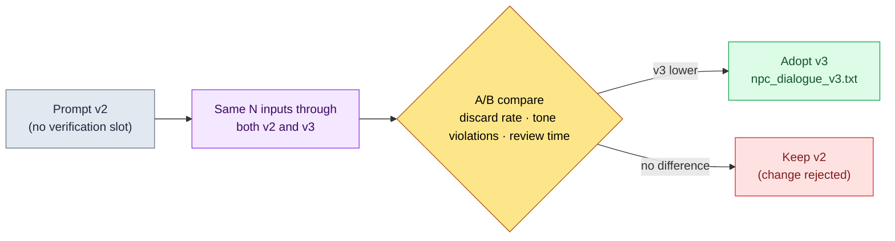

# 22.1 Prompt Engineering — The Game Designer's One-Page Work Order

> Primary readers: game designers pulling LLMs into production work (mid-size teams of 10–50)
> Scaled-down version for solo/hobbyist readers: §22.1.7, "If You're Solo, Just This Much"

Hoping to get three lines of NPC dialogue, I once typed "write five lines for this NPC." What came back were five lines that would have sat comfortably in any fantasy game — and therefore fit nowhere in ours. The tone was empty, the lines had no idea who this NPC was, and they did not connect to the dialogue around them. Each line, taken alone, was grammatically fine. The problem: reviewing those five lines took longer than writing them myself from scratch.

This chapter is about turning that one-line instruction into a **one-page work order**. General prompt-writing advice fills plenty of other books. Here I show the four things a game designer needs in hand when sitting down in front of an LLM — context, output format, hallucination guard, verification request — not as abstract fragments but as **one npc_dialogue prompt that actually ran**. We follow one full cycle: what went into that prompt, what came out, and what got rejected.

---

## 22.1.1 A Prompt Is a Work Order — All Four Principles Fit on One Page

A good work order is not short. Hand a new hire a task with "do your best" and you get a different result every time; hand an LLM "write some dialogue" and you get the generic-RPG average every time. The same model splits on the instruction sheet — that output quality differs by multiples is industry common sense, and this book does not promise that multiplier as a number. The direction, though, is clear: a prompt loaded with context and constraints produces output that is cheaper to review than a bare one-liner.

The four things a game designer's prompt must satisfy at once are these.

| Principle | One-Line Definition | If You Skip It |
|---|---|---|
| ① Context | Give it what to look at when answering (vision · voice · adjacent lines) | You get the generic-fantasy average |
| ② Output format | Nail down count, length, labels, and what is banned | Review sprawls into interpreting free-form prose |
| ③ Hallucination guard | State explicitly: "invent nothing beyond the given material" | It fabricates lore that does not exist |
| ④ Verification request | Make the output mark for itself which criteria it meets | No grounds to pass it through the gate |

Memorize these as four separate rules and one or two keep dropping out. So this chapter's approach is to **build the four principles into a single prompt page as slots**. When a slot sits empty, the missing principle is visible. The next section shows that one page whole.

---

## 22.1.2 [Worked Transcript] One Page of the npc_dialogue Prompt

This is `prompts/narrative/npc_dialogue_v3.txt`, actually in operation on my project (a mobile-first MMORPG, "Project A" hereafter), anonymized and carried over as is. City and NPC names and company-specific terms were swapped for the book, and the output is a reconstruction of the actual session. The input prompt is in a form you can copy and use directly.

### Step 1 — Context Input: Start with Who This NPC Is

First, fill the slots with the material the prompt will reference. None of the three is written fresh — all are pulled from existing assets.

```yaml
# Slot input (attached above the prompt body)
L0_vision:        # Cached — not resent on every call
  world_premise:  "A confederation of scholars' city-states where the mana seals are cooling"
  tone_manifesto: "Restrain sentiment. Characters reveal emotion through actions and objects, not by explaining it."
voice_profile:    # This NPC's identity (5 items)
  id: npc_doren_vale
  age_range: "50s"
  speech_pattern: "Speaks only in numbers. Almost never uses adjectives."
  world_knowledge: "Has recorded the seal vein's micro-tremors for 30 years. Knows nothing of affairs outside the scholars' guild."
  taboos:  "No mysticism vocabulary — prophecy, fate, gods (the city's tone is scholarly_strict)"
  relationship:  "Treats the player as an 'external variable outside the observation'; little wariness, little goodwill"
adjacent_lines:        # Immediate context — lines already spoken in this scene
  - (Player) "The bell tower's light stayed on all night — what's going on?"
```

The five `voice_profile` items here are the core of Principle ①. Age, speech pattern, scope of knowledge, taboos, relationship — these five are what make "Doren Vale" distinguishable from every other NPC. The **scope of world_knowledge** in particular (knows nothing outside the guild) is the advance work for Principle ③, the hallucination guard. Only by stating what he does not know do you keep the AI from stepping outside it.

### Step 2 — The Prompt Body: Pinning Down Format, Hallucination, and Verification on One Page

```
[L0 context] world_premise + tone_manifesto                    (cached)
[voice_profile] npc_doren_vale, 5 items (yaml above)
[adjacent lines] the player's previous question, 1 line

Looking at the material above, write doren_vale's reply to the player's question.

[Output format — Principle ②] Exactly 3 lines, one per line, each 40 characters or fewer. End each line with one emotion label from (detached|wary|cynical). No other commentary or quotation marks.

[Hallucination guard — Principle ③] Use only what is in the material above; do not invent new facts about the seals or the bell tower. If a line needs something not in the material, write it as '[NO SOURCE: what you need]'. No vocabulary like prophecy, fate, or gods.

[Verification request — Principle ④] Below the lines, write one line per voice_profile item marking met/violated, and flag any line you are not sure about with ★ plus one line of reasoning.
```

Note that all four principles are on this one page. The slots at the top are ①, the `[Output format]` block is ②, the `[Hallucination guard]` block is ③, and the `[Verification request]` block is ④. More than half the prompt is not "what to write" but constraints — how to write it, what not to write, how to verify itself. Given freedom, the model returns the average; the job is cutting the freedom down.

### Step 3 — Claude's Output (Reconstructed from the Actual Session, Raw)

```
The vein is cooling. 12.4. Yesterday, 12.1. (detached)
Not a good sign. But my work is the record, nothing more. (cynical)
Why you ask is not my object of observation. (wary)

[Verification — voice_profile, 5 items]
- age_range (50s): Met. The restrained diction of an aging scholar.
- speech_pattern (numbers only): Met. Two figures in line 1. But no figures in lines 2 and 3 ★
- world_knowledge (nothing outside the guild): Met. No mention of outside affairs.
- taboos (no mysticism): Met. Zero uses of prophecy, fate, or gods.
- relationship (external variable): Met. Line 3 pushes the player outside the scope of observation.

★ Caution: read speech_pattern strictly as "speaks only in numbers" and
   lines 2 and 3 may be violations. Human call needed on whether to force a figure into every line.
```

The most valuable part of this output is not the three lines of dialogue but the **single ★ line at the bottom**. The AI flagged the ambiguous spot in its own output and handed it to a human. A good prompt lets the AI say "this part I am not sure about" — the direct effect of putting Principle ④ in.

### Step 4 — Verification and Rejection (the Human's Seat)

The output is not accepted as is. A human rules on the ★ the AI raised. In this session, one line actually got caught.

In line 2, "Not a good sign," the adjective *"good"* collides with the voice_profile speech pattern ("almost never uses adjectives"). It is the exact spot the AI flagged with ★. Doren Vale is a character who speaks in figures instead of value-judgment adjectives, and "Not a good sign" slides into the diction of a stock old-man NPC. It is one line that blurs the tone.

So I re-request.

```
Line 2, "Not a good sign," uses an adjective ('good') and violates the voice_profile speech pattern.
Rewrite only that line in figures or observational vocabulary. Keep lines 1 and 3.
Format, hallucination, and verification rules apply unchanged.
```

The AI came back with line 2 as **"Three years ago it was 9.0. That is my answer. (detached)"** — the crisis shown through a change in figures, no adjectives, and the five voice_profile items passed again. One round trip closed it. Writing three tone-true lines by hand from scratch, versus one slot-filled prompt page + ★ review + one round trip — the latter carries the smaller review burden. That is this session's conclusion (based on my experience; absolute time varies with the difficulty of the NPC's tone, so read it as a direction).

---

## 22.1.3 The Four-Layer Structure — How to Stack a One-Page Prompt

Record on one page why the prompt above is stacked in that order, and every prompt after it becomes fill-in-the-blanks. Context stacks bottom to top, from heavy (rarely changes) to light (changes every time). The layers that do not change get cached to save cost (§22.1.5).

<svg viewBox="0 0 560 360" xmlns="http://www.w3.org/2000/svg" role="img" aria-label="Four-layer structure of a game designer's prompt">
  <rect x="0" y="0" width="560" height="360" fill="#0f1117"/>
  <!-- L0 -->
  <rect x="40" y="40" width="480" height="56" rx="6" fill="#1e3a5f" stroke="#3b82f6" stroke-width="1.5"/>
  <text x="56" y="64" fill="#bfdbfe" font-family="sans-serif" font-size="14" font-weight="bold">L0  Vision · Tone (world_premise · tone_manifesto)</text>
  <text x="56" y="84" fill="#93c5fd" font-family="sans-serif" font-size="11">Rarely changes → cached. The foundation of Principle ① context.</text>
  <!-- L1 -->
  <rect x="40" y="106" width="480" height="56" rx="6" fill="#14532d" stroke="#22c55e" stroke-width="1.5"/>
  <text x="56" y="130" fill="#bbf7d0" font-family="sans-serif" font-size="14" font-weight="bold">L1  voice_profile · naming rules · regional lore</text>
  <text x="56" y="150" fill="#86efac" font-family="sans-serif" font-size="11">The 5 items that set this NPC apart + stated limits of knowledge → Principle ③ groundwork.</text>
  <!-- L2 -->
  <rect x="40" y="172" width="480" height="56" rx="6" fill="#854d0e" stroke="#f59e0b" stroke-width="1.5"/>
  <text x="56" y="196" fill="#fde68a" font-family="sans-serif" font-size="14" font-weight="bold">L2  Adjacent lines · forbidden_names</text>
  <text x="56" y="216" fill="#fcd34d" font-family="sans-serif" font-size="11">The scene's preceding lines · duplicate-banned names → keeps lines connected to their neighbors.</text>
  <!-- L3 -->
  <rect x="40" y="238" width="480" height="82" rx="6" fill="#7f1d1d" stroke="#ef4444" stroke-width="1.5"/>
  <text x="56" y="262" fill="#fecaca" font-family="sans-serif" font-size="14" font-weight="bold">L3  Task instruction (changes every time)</text>
  <text x="56" y="282" fill="#fca5a5" font-family="sans-serif" font-size="11">[Output format]②  ·  [Hallucination guard]③  ·  [Verification request]④</text>
  <text x="56" y="302" fill="#fca5a5" font-family="sans-serif" font-size="11">"Exactly 3 · 40 chars · (emotion) label · nothing beyond the material · 5-item self-check"</text>
  <!-- arrow label -->
  <text x="280" y="350" fill="#9ca3af" font-family="sans-serif" font-size="11" text-anchor="middle">Stack from bottom (heavy · cached) to top (light · swapped every call)</text>
</svg>

The one page in §22.1.2 is this diagram, exactly. L0 and L1 are pulled from existing material and pasted into slots (the foundation of Principles ① and ③), and L3 carries the three blocks — format, hallucination, verification (Principles ②, ③, ④). For the next NPC's dialogue, the only things that change are L1's voice_profile and L2's adjacent lines. The L0 and L3 skeleton is reused — which is how a prompt becomes a "library."

---

## 22.1.4 Prompts as Assets — The Library and Version Control

The npc_dialogue prompt above is not written once and thrown away. Prompts live in files, by domain and by task, and get called instead of rewritten each time. Project A's prompt folder looks like this.

```
prompts/
├── narrative/
│   ├── npc_dialogue_v3.txt        # ← the file from §22.1.2
│   ├── quest_synopsis_v2.txt
│   └── consistency_check_v1.txt
├── balance/
│   ├── change_proposal_v2.txt
│   └── outlier_analysis_v1.txt
├── content/
│   ├── city_npc_batch_v2.txt
│   └── side_quest_v3.txt
└── meta/
    ├── meeting_summary_v2.txt
    └── decision_card_v1.txt
```

The `_v3` at the end of the filename is the point. A prompt is not finished once written — it is an **asset close to a decision**, so every change is measured for its effect on results before the version goes up. That is the path npc_dialogue took to v3.



The actual change that took v2 to v3 is the `[Verification request]` block of §22.1.2. v2 had no slot for the AI to self-check its output item by item and attach ★. Adding that one block, the AI began reporting ambiguous lines first — as in §22.1.2 Step 4 — and the burden of a human reading everything from the top shrank. The version does not go up on "it feels better." The same input batch runs through v2 and v3 side by side, and only after confirming that tone-violation counts and review time actually fell does v3 get adopted.

The library's biggest payoff is the new team member. Call npc_dialogue_v3.txt on day one, and you start with the four-layer slot structure a senior refined over dozens of round trips. Before learning "how to write good prompts" in your bones, you already hold a well-written page in your hand.

---

## 22.1.5 Handling Cost Honestly — Caching and Caps

Longer prompts carry token costs. This chapter does not print unverified multipliers like "standardization erased a ×2 in cost." It speaks only of what can actually be measured.

Two structural devices hold cost down. First, **caching is why §22.1.3 puts L0 and L1 at the bottom**. Cache the vision-and-tone layer that rarely changes, and each call stops retransmitting — and re-billing — that layer. Pull NPC dialogue 100 times, and the gap between resending L0 100 times and caching it once widens with every call. Second, a **per-call token cap** keeps any one prompt from being stuffed with too much work at once.

What matters here is that the place where cost gets measured actually exists. Project A's atom system carries `_economy_log/` (a token-and-time economy log) and `_roi_report.md` (ROI — return on investment — reporting) as operating metadata. The effect of prompt standardization is tracked in those logs as measurements, not asserted with plausible numbers in a table in this book. This book's principle is one of three:

- **Public standards are quoted as they are.** (Few apply in this chapter — prompt formats have few certified numbers.)
- **My estimates are labeled as estimates.** "Review burden went down" is a direction, an experience-based estimate; I promise no absolute multiplier.
- **Only the measurable becomes a KPI promise.** What prompt operations actually measure: tone-violation counts, discard rate, tokens per call (before and after caching), review time. These four come out as numbers in `_economy_log`.

---

## 22.1.6 Common Failures

| Pattern | Why It Fails | Prescription |
|---|---|---|
| The one-liner "write 5 lines of dialogue" | Zero context → generic-RPG average | The four-layer slot prompt of §22.1.2 |
| No "what they don't know" in voice_profile | The AI invents lore beyond the material | State the limits in the world_knowledge slot (Principle ③) |
| Output taken with no verification slot | A human must read everything from the top | Self-check + ★ via the `[Verification request]` block (Principle ④) |
| Prompts written fresh every time | The same know-how rebuilt from zero | The `prompts/` library + versions |
| Prompt changes adopted on feel | No way to confirm it got better | A/B-measure the same inputs, then bump the version |
| Long context resent on every call | Token cost stacks with the call count | Cache L0·L1 + a per-call cap |

The sixth is the last to be discovered. Cost does not hurt on a single call; it shows up in `_economy_log` after mass production has piled up.

---

> **Beyond Games.** A one-line instruction calling up an average result — "fits anywhere, so it fits my job nowhere" — is not a problem unique to game dialogue. A prompt is the work order you hand a new hire, so put the four things on one page — what to look at when answering (context); count, length, banned items (output format); "invent nothing beyond the material" (hallucination guard); "mark for yourself which criteria you meet" (verification request) — and the output comes back cheaper to review. For example, when an HR manager requests a job-posting draft, stating "use only items in the role-requirements material; do not invent benefits or salary that are not in the material — mark them [NEEDS CONFIRMATION]" stops plausibly fabricated terms from leaking into the posting. Leave the one-page work order for a task you run often as a file, and it becomes a colleague's starting line.

## 22.1.7 Try It Yourself — One Step You Can Take Today

> **If you're solo, just this much**: No library, no caching needed. Pick one NPC from your own game (or a game you love), write the five voice_profile items of §22.1.2 Step 1 by hand (age, speech pattern, scope of knowledge, taboos, relationship), paste in the Step 2 prompt body as is, and run it once. Out of the three lines you get, pick the one that clashes with the voice_profile and push back yourself — "this line violates the speech-pattern item; redo that line only" — and what each of the prompt's four slots does will sink in through your hands.

On a team, start with this one step. Pick one frequent task (say, NPC dialogue) and put a §22.1.2-style prompt page into `prompts/narrative/` as a file. Check first that all four blocks made it in — slots, format, hallucination, verification — and that one file becomes the starting line for every new member of the team. Version control and caching come after.

**Minimal web-chatbot path (no terminal)** — This chapter's four principles work as is, with no files, library, or caching, in the single input box of a web chatbot (ChatGPT or Claude on the web). Prompt engineering is not a question of tools but of what goes on the one page. The two steps below are the main road.
1. Pick one task of your own and write down the five items of §22.1.2 Step 1 by hand (age, speech pattern, scope of knowledge, taboos, relationship — outside games, read them as "audience, register, scope of evidence, bans, relationship"). No YAML, no files; writing them in the chatbot's input box is enough.
2. Below that, paste in the prompt body of §22.1.2 Step 2 as is, checking only that all four blocks are present — `[Output format]` (count, length, labels, bans), `[Hallucination guard]` ("invent nothing beyond the material; if needed, [NO SOURCE]"), `[Verification request]` ("mark met/violated per item; if unsure, ★"). Run it, have a human rule on only the ★-flagged lines, push back once, and one cycle closes. Library, versions, and caching come in only once you find yourself reusing the same prompt.

---

## 22.1.8 A Preview of the Next Chapter

22.2 covers hallucination and safety. If this chapter's Principle ③ (the hallucination-guard slot) is the first line of defense inside the single prompt page, 22.2 looks at the layered defenses that catch, at the operations level, the hallucinations that break through.

---

### Key Takeaways
- A prompt is a work order — the four principles go into the slots of one page.
- One npc_dialogue page: context, format, hallucination guard, and verification in four layers.
- Cost and effect come from `_economy_log` measurements; no fabricated multipliers.

### Next Chapter Preview
- 22.2 AI Safety and Hallucination — Layered Defenses for the Hallucinations That Slip Past the Prompt
