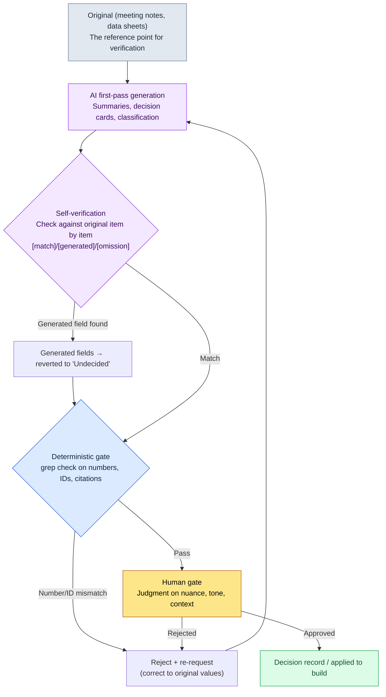

# 22.2 The Colleague Who Lies with Confidence — Stopping Hallucinations with a Verification Gate

> Primary audience: game designers producing documents, data, and decision records at volume with AI (mid-sized teams of 10–50)
> Scaled-down version for solo/hobbyist readers: §22.2.7 "If You're Solo, Just This Much"

It happened on a day I had AI summarize 17 sets of meeting notes into decision cards. The output was clean. Decision IDs, cited meeting dates, even a one-line rationale — the format was flawless. One of the cards read, "Cooldown policy finalized at the combat task force meeting on 2026-04-18." The problem: there was no combat task force meeting that day. The AI had blended the agenda and date of different meetings into one plausible card, and because the format was flawless, it very nearly went straight into the team's decision record.

This is hallucination. The less an LLM knows, the more confidently it answers. In human terms, it is the colleague who states flatly in a meeting, "Oh, that was already decided," when no such decision was ever made. When that one remark flows into a data sheet, a customer support reply, or an atom asset, it becomes an incident. This chapter is not about how to silence that colleague — that is impossible — but about how to build **a verification gate that everything he says must pass through before it is accepted** (think of it as a quality gate for AI output). General theory of hallucination fills other books, so this chapter focuses only on *the place where an AI workflow stops it*.

---

## 22.2.1 Hallucinations Never Hit Zero — So We Put Up a 'Gate'

No prompt makes hallucinations zero. Bigger models and better prompts lower the frequency, but never to 0. So the starting point of operations must be not "eliminate hallucinations" but "put a gate in place that catches them before they reach decisions and data."

The gate has one core principle. **Anything an LLM can fabricate (citations, numbers, IDs) gets verified somewhere that is not an LLM.** The source of verification is one of three: code (deterministic), the original document (grep), or human eyes. Asking the LLM again — "check whether this is right" — can serve as one stage of the gate, but it is an assist, not the final judge.

Let me first sort out the point game designers most often get confused about. The areas where hallucination comes easily and the areas where it does not are clearly different.

| Task | Hallucination Risk | Why | Gate |
|---|---|---|---|
| Numeric calculation (rewards, probabilities) | Very high | LLMs estimate arithmetic | Calculations go to code; ban them for the LLM |
| Citations (meetings, decision IDs) | High | Fabricates plausible nonexistent sources | grep check against the original |
| Classification (tags, categories) | Medium | Mixes up labels | Deterministic comparison possible |
| Summarization and inference | Medium | Adds or drops items | Self-verification + human gate |
| Creative writing (flavor text) | Low | No ground truth, so 'hallucination' barely applies | Tone review gate |

The first row is the simplest prescription. **Don't give numbers to the LLM.** Hand them to a deterministic tool, the way you hand multiplication to a calculator. The second row (citations) is the spine of this chapter. In tasks where *an original exists and the LLM is restating it* — meeting-note summaries, decision cards — hallucination is at its most dangerous and also at its most catchable, because the original gives you something to check against.

---

## 22.2.2 [Worked Transcript] Catching Hallucinations in a Meeting-Note Summary with Self-Verification

Writing "verify it" in the abstract says nothing about what to do or how. We will follow one full cycle — summarizing one set of meeting notes and catching the hallucination in that summary — from input all the way to the re-request. The prompts below can be copied as they are; the outputs are reconstructions of an actual session.

### Step 1 — Input: Feed in the Original Meeting Notes as They Are

First, there is an original to summarize. This becomes the reference point for verification. Let the LLM summarize from "memory" without an original, and there is nothing left to check against.

```markdown
# Meeting Notes — 2026-04-15 Combat Balance Review

Attendees: Minsoo Lee, Team Member A, Team Member B
Agenda:
1. AoE skill cooldown — opinion that the current 8s is too short. Reviewing a raise to 12s.
   Conclusion: tentatively decided at 12s; finalize after telemetry check in the next build.
2. Boss phase-transition HP — proposal to lower from 50% to 30%.
   Conclusion: on hold. Conflicts with the art presentation schedule; rediscuss next week.
3. Duration of new status effect 'Freeze' — discussed, but no value set.
```

### Step 2 — The First-Pass Summary Prompt

```
Summarize the attached meeting notes into decision cards.

Rules:
1) One card per agenda item. Format: [Agenda | Conclusion | Status (Final/Tentative/On hold) | Rationale]
2) Do not generate information that is not in the notes. Do not guess numbers, dates, or attendees.
3) For items with no conclusion, set the status to 'Undecided' and do not invent one.

Output format: table only. No commentary.
```

### Step 3 — Claude's First-Pass Output (Reconstructed, Excerpted)

```
| Agenda                | Conclusion        | Status    | Rationale                                |
|-----------------------|-------------------|-----------|------------------------------------------|
| AoE skill cooldown    | 8s → 12s          | Tentative | Finalize after telemetry check           |
| Boss phase transition | 50% → 30% on hold | On hold   | Conflict with art presentation schedule  |
| Freeze duration       | Set to 3s         | Final     | Standard status-effect duration applied  |
```

Look at the third card. The original says only that "Freeze duration was discussed, but no value set." The output, however, wrote **"set to 3s / Final / standard baseline applied."** All three fields are information that is not in the meeting notes. The LLM filled the blanks from general knowledge — "a status effect usually lasts a few seconds." The format is flawless, so a casual look catches nothing.

### Step 4 — The Self-Verification Re-Request (the Heart of the Gate)

Here, instead of accepting the output as is, **force a self-verification that checks it against the original, item by item.** This is the key move of the chapter.

```
Check the 3 decision cards you just made against the attached original meeting notes, one item at a time.

For every field of every card (conclusion, status, rationale, numbers):
- Is it written directly in the original? → [match]
- Is it something you added that is not in the original? → mark it [generated] and state that it has no source
- Is anything in the original missing from the card? → report it as [omission]

Revert every [generated] field with no basis in the original to 'Undecided'.
```

### Step 5 — Claude's Self-Verification Output (Reconstructed, Raw)

```
Comparison results:

Card 1 (AoE skill cooldown)
- Conclusion "8s → 12s": [match] agenda item 1, "raise to 12s"
- Status "Tentative": [match] "tentatively decided"
- Rationale "finalize after telemetry check": [match]

Card 2 (boss phase transition)
- Conclusion "50% → 30% on hold": [match]
- Status "On hold": [match] "on hold. Rediscuss next week"
- Rationale "conflict with art presentation schedule": [match]
- [omission] The original's "rediscuss next week" condition is missing from the card. Needs to be added to the rationale.

Card 3 (Freeze duration)
- Conclusion "set to 3s": [generated] — the original says "no value set". The 3s is a value I added.
- Status "Final": [generated] — the original reaches no conclusion.
- Rationale "standard status-effect duration applied": [generated] — no such baseline is mentioned in the original.
  → Per the rules, I am reverting card 3 as follows:
  | Freeze duration | (value not set) | Undecided | Discussed in the meeting, no conclusion |
```

This output is the most valuable part of the chapter. The AI checked its own output against the original, **confessed "the 3s is a value I added,"** and reverted card 3 to 'Undecided' per the rules. At the same time it caught an omission in card 2 (the "rediscuss next week" condition) that the human had missed too. Hallucination (adding what isn't there) and omission (dropping what is) are two sides of the same coin, and the same comparison catches both.

The caveat is just as clear. This self-verification is **not a cure-all.** If the LLM misreads the original, it can deliver a wrong comparison result with full confidence. So self-verification is the *first stage* of the gate, and when the original is short, a human backs it up once more with grep. Self-verification catches blatant generation like card 3 almost every time, but subtle paraphrase and nuance distortion ultimately fall to the human gate at the end.

---

## 22.2.3 The Verification Gate — One Flowchart

Generalizing the cycle above, the gates an AI output passes through before it reaches decisions and data look like this. Human hands touch only two places: the very front, where a clean original goes in, and the very end, where a person makes the judgments the automated gates cannot.



The gate is threefold because each stage catches something different. Self-verification has the LLM check itself for *whether it added what isn't there*; the deterministic gate uses code to check *whether numbers and IDs match the original character for character*; the human gate catches *what is technically right but contextually off*. Turn on only one stage, and incidents leak through where the other two used to stand. In §22.2.2, the "3s" on card 3 is caught at the first stage (self-verification), card 2's omission at the first stage, and if self-verification had misread "12s" as "21s", the second stage (grep) would catch it.

---

## 22.2.4 The Gate Can Fail, but It Never Blocks the Flow — Hook Safety Design

When you put a verification gate into an automated pipeline, there is one incident beginners cause most often: building it so that **when the gate itself crashes, all work stops.** If grep dies on an encoding error or the manifest file is corrupted, the code that was supposed to help with verification ends up blocking the user's work outright. Within a week or two the team says, "let's turn that verification off."

Let me quote, as is, how the JIT atom-injection hook actually in operation in this book (`inject_memory.py`) handles this problem. This hook cuts in every time the user types a prompt and injects relevant memory — an *always-on gate*, so to speak. One line is spelled out in its design-principles comment.

```python
Design principles:
- Always exit 0 (even on failure, never disrupt the user's flow)
- No match → empty response (normal)
```

And the principle is implemented consistently throughout the code. If stdin parsing fails, if the manifest JSON is corrupted, if reading an atom body fails — everything falls through to `emit_empty()` and `exit 0`.

```python
def emit_empty() -> None:
    sys.exit(0)

def main() -> None:
    try:
        ...
        payload = json.loads(raw)
    except Exception:
        emit_empty()        # even broken input passes through quietly
        return
    ...
    try:
        manifest = json.loads(MANIFEST_PATH.read_text(encoding="utf-8"))
    except Exception:
        emit_empty()        # a broken manifest never blocks the work
        return

if __name__ == "__main__":
    try:
        main()
    except Exception:
        emit_empty()        # the last net for any exception
```

The heart of the design is that it **separates gate failure from content failure.** When the hook fails to inject memory, the user just gets "an ordinary session with no memory attached" — not an incident that blocks work. A verification gate must work the same way. If the grep gate can't run because of an encoding problem, you don't *pass the card through* — you mark it "automated verification failed — to the human gate" and hand it to the human stage. A dead gate must not auto-approve unverified output, and at the same time a dead gate must not halt the whole pipeline. The safe default that satisfies both is "quietly hand it to a human." The `except: emit_empty()` in `inject_memory.py` is the minimal implementation of exactly that pattern.

---

## 22.2.5 Handling Hallucination Rates Honestly

The temptation to put a table like "we cut the hallucination rate from 89% to 3%" into this chapter is strong. Numbers like that, without a disclosed measurement method, erode the book's credibility. This book holds to one of three rules.

First, **state numbers only for what can be measured.** To promise a hallucination rate, you have to define the denominator and the numerator. The denominator is "the number of decision cards reviewed"; the numerator is "the number of cards where the comparison against the original caught at least one [generated]/[omission]." Without this definition, "a 5% hallucination rate" is hollow. This is exactly how I counted while reviewing meeting-note summaries in the early days of adoption, and that sample is small — a *directional value*, not a precise population parameter.

Second, **state model-to-model comparisons as direction only.** The direction "bigger models hallucinate less than smaller ones" is observed consistently. But absolute figures like "Opus 3%, an open 7B model 20%" swing widely with task, prompt, and domain, so this book claims no absolute values. We take only the direction (the bigger the model, the fewer — traded off against cost).

Third, **cite public standards as they are.** This chapter has almost no standard figures to make up, but settings like temperature are public facts in model API documentation. Verification and analysis tasks run with temperature low (closer to deterministic), creative tasks with it high — that is not an estimate but the definition of how the API behaves.

So the measurable indicators this chapter actually promises are three — the count of [generated] detections (hallucinations caught by self-verification), the count of grep-gate rejections (number/ID mismatches), and the count of human-gate rejections. All three can be counted from logs every quarter, and in meetings you can speak in numbers instead of "feel."

---

## 22.2.6 Common Failures

| Pattern | Why It Fails | Prescription |
|---|---|---|
| Accepting AI summaries on format alone | Hallucination is hardest to catch when the format is flawless | Self-verification against the original (§22.2.2, step 4) |
| Summarizing from LLM memory without the original | No reference point to check against, so unverifiable | Put the original into the input first |
| Leaving numeric calculation to the LLM | Arithmetic gets estimated, differently every time | Calculations go to deterministic tools (§22.2.1) |
| All work stops when the verification gate crashes | The team turns the gate off | exit 0 + hand off to the human stage (§22.2.4) |
| Auto-approving unverified output when the gate dies | Hallucinations pass straight through | Gate failure = mark as 'unverified' |
| Trusting self-verification as the final verdict | An LLM that misreads the original misjudges with confidence | For short originals, run human grep in parallel |

---

> **Beyond Games.** The "colleague who lies with confidence" — an AI that fabricates nonexistent meeting dates and decisions in flawless format — is just as dangerous in every document summary, not only in game decision cards. Hallucination is hardest to catch when the format is flawless, so for any task that has an original (meeting-note summaries, contract excerpts, report digests), the key is not to accept the output as is but to force self-verification: "check against the original item by item, and mark anything you added as [generated]." For example, have a legal assistant summarize a contract and then make the AI compare amounts, dates, and clause numbers against the original character for character — the AI confesses "this penalty figure is a value I added" and reverts the blank to 'undecided.' Don't hand numeric calculation to AI at all — give it to a calculator or a formula — and design automated verification tools so that even when they fail, they don't block the work but hand off as "unverified — human check."

## 22.2.7 Try It Yourself — One Step You Can Take Today

> **If You're Solo, Just This Much**: No code, no hooks needed. Have AI summarize one short document of your own (a meeting memo, patch notes, one page of a design doc), then paste in the step-4 self-verification prompt from §22.2.2 as it is. One line — "check against the original item by item, and mark anything you added as [generated]" — and the AI starts reporting its own hallucinations. Get even one [generated] confession, and you will feel, hands-on, why AI summaries must never be taken on faith.

If you're on a team, start with this one step. Pin the self-verification stage into the *default prompt* for the decision cards and summaries AI produces (§22.2.2). Next, pick only the fields that must match the original character for character — numbers, decision IDs, dates — and turn the grep comparison into code. That verification code must be designed, like `inject_memory.py`, **so that failure never blocks the work** (exit 0 + an 'unverified' mark) (§22.2.4). With just those two stages — self-verification and grep — you head off the most common incident first: flawlessly formatted hallucinations seeping into the decision record.

---

### Key Takeaways
- Hallucinations never hit zero, so stop them with a verification gate before they reach decisions.
- Check against the original item by item, and the AI reports its own hallucinations.
- Design verification code so that even its failure never blocks the flow (exit 0).

### Next Chapter Preview
- 22.3 AI Cost Management — Operating Per-Model Tokens, Caching, and Caps from Real Logs
