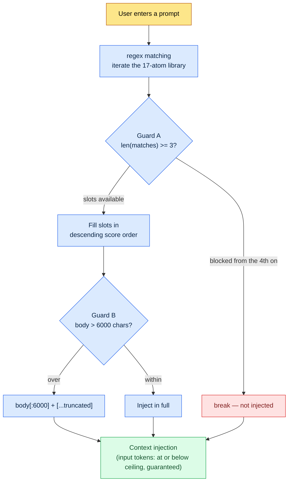

# 22.3 AI Cost Management — Enforcing the Token Budget in Code

> Primary audience: design leads who roll out AI tools to their team and own the cost (mid-size teams of 10–50)
> Scaled-down version for solo/hobbyist readers: §22.3.9, "If You're Solo, Just This Much"

If a cost chapter cites fake costs, it contradicts itself. So this chapter does not build a polished table of "how much my team saved per month." Instead it uses only two kinds of numbers. One is the **published token pricing** anyone can verify (per-1M-token rates by model); the other is the set of **constants pinned in the hook code** I actually run (`max_atom_body = 6000`, `max_matches = 3`). Neither is made up — both are quoted.

What makes AI cost scary is not the size of the bill. It's that **you can't see it**. In the first month of adoption, calls are few and the bill is small. Then contexts get longer and calls more frequent, and one quarter the bill gains a digit. Here is this chapter's conclusion up front — you control cost not with a resolution to "use it sparingly" but with **code that forcibly trims tokens on every call**. The wrapper and the truncate hold the line, not human willpower.

---

## 22.3.1 LLM Cost Is Effectively One Line Item: Input Tokens

There are four billing items — input, output, cache reads, and cache writes — but in practice the bill is dominated by **input tokens**. The reason is simple: almost every task where a game designer uses AI takes the form of "feed in a long context, get back a short answer." Cram in the L0 vision document, the atom library, adjacent city pages, and data sheet excerpts, and the input runs to tens of thousands of tokens — while the output is a single table, a few hundred tokens.

So the first priority of cost control is not "shrink the output" but **"where do we cut input tokens."** That one line drives the rest of this chapter.

Let me pin down the published per-model rates first. The table below shows the rates Anthropic publishes per 1M (one million) tokens — **a snapshot quoting the published pricing of the generation current as of this writing (the then-latest tier of Opus, Sonnet, and Haiku)** (quoted from the official published price list — rates change with model generation and over time, so check the current price sheet before applying any of this). As Appendix K lays out, what does not change here is **not the absolute rates but the ratio between the three tiers**. So read the table below not as "today's bill" but as a structure: each tier you step down drops the unit rate by close to an order of magnitude.

| Model | Input per 1M tokens | Output per 1M tokens | Notes |
|---|---|---|---|
| Claude Opus | $15 | $75 | Top-tier reasoning (published rate) |
| Claude Sonnet | $3 | $15 | Mid-tier — input rate 1/5 of Opus |
| Claude Haiku | $0.80 | $4 | Lightweight — input rate about 1/19 of Opus |
| Cache hit (read) | about 1/10 of the standard input rate | — | When cached input is reused (published caching policy) |

The last two rows are the point. **Run the same task on Haiku instead of Opus and the input-token rate is about 1/19**; **route the same context through the cache and that portion of the input bills at about 1/10**. The two big levers of cost reduction come from here — model right-sizing and caching. Neither is "use less"; both are "do the same work at a cheaper rate."

> Savings come from rate differences, not willpower. Dropping Opus to Haiku cuts about 19x; riding the cache cuts about 10x — automatically.

---

## 22.3.2 The Biggest Input Cost Is the Context Injected on Every Call

There is a cost that accumulates more quietly than per-task rates: **the context automatically attached to every call**. On my personal PC, a hook runs that inserts relevant memory (atoms) every time I type a prompt (the UserPromptSubmit hook, `inject_memory.py`). It's a convenience feature — and at the same time the **number-one suspect for cost leakage**. Long atom bodies enter the context with every input, so left uncontrolled, input tokens balloon call after call.

So this hook has three layers of cost-cutting safeguards pinned in place. Not abstractions — constants in the actual code.

```python
# inject_memory.py — UserPromptSubmit hook (actual production code, excerpt)
# Design principles (from the docstring):
#   - Always exit 0 (never block the user's flow, even on failure)
#   - Inject at most 3 atoms, in descending score order
#   - Truncate any atom body over 6000 characters

# (1) Read the budget constants from the manifest config
max_matches = cfg.get("max_matches", 3)      # max atoms per call
max_body    = cfg.get("max_atom_body", 6000) # body cap per atom (chars)

# (2) Sort by score, descending — fill the expensive slots by value
atoms_sorted = sorted(atoms, key=lambda a: a.get("score", 0), reverse=True)

matches = []
for atom in atoms_sorted:
    if len(matches) >= max_matches:   # (Guard A) cut off at 3
        break
    if re.search(atom["regex"], prompt, re.IGNORECASE):
        matches.append(atom)

# (3) Cut the body at 6000 characters on injection
for atom in matches:
    body = atom_path.read_text(encoding="utf-8")
    if len(body) > max_body:          # (Guard B) truncate
        body = body[:max_body] + "\n\n[...truncated]\n"
```

All three cost guards are right there.

- **Guard A — count cap (`max_matches = 3`)**: even if 10 atoms match the input, at most 3 get attached. The code prevents the accident where the entire 17-atom library rides along on every call.
- **Guard B — length cap (`max_atom_body = 6000`)**: even if an atom body runs 12,000 characters, it is cut at 6,000. A single long retrospective atom doubling the cost of a call is structurally impossible.
- **Guard C — score priority**: the 3 slots are filled in descending score order. Low-value atoms cannot occupy the expensive input tokens.

These three constants are exactly the **per-call ceiling on input tokens**. As a rough estimate, one 6,000-character atom is on the order of several thousand tokens in Korean (exact token counts vary by tokenizer and language, so read this as "a ceiling exists," not as an absolute value). 3 × 6,000 characters is the injection budget per call, and the code cuts everything above it. No human has to spot "too many atoms got attached" by eye.

---

## 22.3.3 [Worked Transcript] How One 6000-Character Truncate Line Holds Down Cost

Saying "the truncate holds down cost" in words is hollow. When I set this constant, I ran a full cycle with the AI from start to finish. Below is a faithful reproduction of that session. The input prompts can be copied verbatim; the outputs are reconstructed from the actual session.

### Step 1 — Input: Throw the Problem at It As Is

Right after the hook first went live, `_injection_log.txt` recorded a call where an atom body had been injected whole. If long atoms (retrospectives, health context, and so on) go in at full size on every call, input tokens accumulate fastest on the tasks you use most. I asked the AI where to cut.

### Step 2 — Prompt: Force Limits and Format

```
I have a hook (inject_memory.py) that auto-injects atoms into the context on
every call. I want a truncate cap to hold down input token cost — propose a
cap on body characters per atom and a cap on atoms injected per call. Too
short and the core gets cut; too long and tokens leak, so spell out that
trade-off too, and flag anything you're not sure about for a human to decide.
(Intent: the caps will be externalized to config.) As a table:
item | proposed value | rationale | confidence.
```

Note that half the prompt is "forcing limits and format." Give an AI free rein on a cost question and you get an evasive "it depends." The core of this prompt is to **force concrete numbers, make the trade-offs explicit, and leave an escape hatch: report what you're not sure of**.

### Step 3 — Claude's Output (Reconstructed, Excerpt)

```
| Item            | Proposed   | Rationale                                       | Confidence |
|-----------------|------------|-------------------------------------------------|------------|
| max_atom_body   | 6000 chars | The 'core + evidence' of one Korean atom mostly | Medium     |
|                 |            | fits in 4–6k chars. At 6000 the head (gist,     |            |
|                 |            | rules) is nearly intact; only the tail          |            |
|                 |            | (example lists) gets cut.                       |            |
| max_matches     | 3          | Topics that strongly match one input are        | High       |
|                 |            | usually 1–3. 4+ signals the regex is too broad. |            |
| Externalize to  | _jit_manifest.json > config | Tune live without redeploying code | High |
| Truncate marker | append [...truncated] tail  | Model and humans see it was cut    | Medium |
| Not confident   | whether 6000 is exact       | Char-to-token conversion varies by | ★Low |
|                 | (char→token mapping uncertain) | language and model — chars are approximate | |
```

The most valuable part of the output is not the table — it's the **★ row at the bottom**. The AI reported, on its own, that it doesn't know whether 6000 is the exact optimum, because char-to-token conversion is uncertain. A good prompt makes the AI say it doesn't know.

### Step 4 — Verify and Reject (the Human's Seat)

I did not accept this output as is. The AI presented 6000 characters as "the line where the core survives," but you have to see for yourself what actually gets cut at 6000. I picked the longest atoms (health context, accumulated retrospectives) and eyeballed the 6000-character mark.

One case got caught. **The 6000-character mark severed a table row in the middle of a body**, leaving a line like `| Vitamin D | 1000 IU |` chopped in half. The meaning survived, but a broken table row going to the model as malformed Markdown bothered me. So I asked again.

### Step 5 — Follow-Up Request

```
When cutting at 6000 characters, a Markdown table row sometimes gets severed
mid-row. Would snapping the cut to the previous newline boundary be better? The
fix must not outgrow the truncate itself — weigh cost vs. value and decide.
```

The AI answered: "Line-boundary snapping is one line — `body[:max_body].rsplit('\n', 1)[0]` — but **the purpose of the truncate is a token ceiling, not table integrity**, so one broken table row has negligible impact on cost or behavior. The `[...truncated]` marker already lets the model recognize 'it was cut here,' so I recommend **not** doing the line snap. If you must, the one-line fix is enough."

That answer was right. If cost-control code also chases table integrity, the guard code itself bloats. **The production code keeps the simple cut: `body[:max_body] + "[...truncated]"`.** The AI's first proposal (6000 characters) verified by a human, and the human's urge to over-engineer pushed back by the AI — a cycle closed in one round trip.

---

## 22.3.4 The Cost Guard Structure — At a Glance

Here is the full flow, recorded as a diagram: how the constants set in that session cut input tokens on a real call.



The point of this diagram: **whatever the user types, there is a ceiling on injected tokens per call**. The ceiling is `3 × 6000 chars` (plus the marker), and the code unconditionally cuts everything above it. Cost does not lean on the user's self-restraint. Guards A and B fire mechanically on every call.

The same philosophy repeats at the tool level. My company system has a policy that pins the number of wrapper skills exposed in the global slots to **exactly 12** (atom `skill_listing_budget_wrapper_only_policy`). If the global `*` wrapper count is not 12 at session start, a cleanup script runs automatically. Nominally it's "slot tidiness," but in essence it's **session-start token budget protection** — the cost of the skill list landing in context is bounded to 12 entries' worth. The 3-atom injection cap and the 12-skill exposure cap are the same idea in two applications.

---

## 22.3.5 Model Allocation by Task — 80% at a Cheaper Rate

Guards cap tokens per call; model choice sets the rate those tokens bill at. In the §22.3.1 table, input rates ran Opus:Sonnet:Haiku ≈ 19:4:1. Running every task on Opus therefore means paying a 19x rate even on simple jobs like classification and substitution.

Allocate rates by task complexity.

| Task type | Recommended model | Why |
|---|---|---|
| Verification, legal-adjacent work, decision analysis | Opus | Tasks where a mistake is a big incident — don't skimp on the rate |
| Reports, summaries, natural-language polishing | Sonnet | Quality matters, but top-tier reasoning is unnecessary |
| Classification, tagging, keyword extraction | Haiku | Simple patterns — about 1/19 of the Opus rate is plenty |
| Simple mapping and substitution | Haiku, or deterministic code | Often no LLM is needed at all |

In my experience, most tasks are fine on Sonnet or Haiku. **Expensive models are for tasks that are expensive to get wrong.** One trap, though — go too cheap and hallucinations rise, and the verification cost eats the savings (this ties directly into §22.2, the previous chapter on hallucination and safety). So model allocation is not "cheapest always"; it's a split — cheap where being wrong is cheap, expensive where being wrong is expensive.

The last row, "simple mapping/substitution → deterministic," is often the biggest saving. Work with a single fixed answer — name substitution, rule-based mapping — has no need to call an LLM. **Driving the call itself to zero is the cheapest call there is.**

---

## 22.3.6 Caching — The Same Input at 1/10 the Rate

Even with tokens capped per call (guards) and rates lowered (model allocation), cost still leaks if **the same context is re-sent fresh on every call**. Long inputs that barely change — the L0 vision document, the atom library, the per-discipline style guide — get cached. On a cache hit, that portion of the input bills at about 1/10 of the standard rate (§22.3.1 table).

```python
# Mark unchanging context with cache_control — about 1/10 the rate on cache hits
messages = [
    {"role": "system", "content": SYSTEM_PROMPT},
    {"role": "user", "content": [
        {"type": "text", "text": L0_VISION,    "cache_control": {"type": "ephemeral"}},
        {"type": "text", "text": ATOM_LIBRARY, "cache_control": {"type": "ephemeral"}},
        {"type": "text", "text": SPECIFIC_TASK},  # only the part that changes each time stays outside the cache
    ]},
]
```

The key is to **separate what changes from what doesn't**. The cache only hits when the front of the input is identical, so the fixed context (L0, atoms) goes first and the per-call task instruction goes last.

What to put on the cache is decided by change frequency.

| Context | Cache? | Why |
|---|---|---|
| L0 vision (nearly immutable) | Good fit | Changes only every few days to weeks |
| atom library | Good fit | Updated only at retrospectives |
| Discipline style guide | Good fit | Changes on a quarterly cadence |
| Recent meeting notes | Poor fit | Changes daily — low hit rate |
| User input | Poor fit | Unique to every call |

Cache TTLs can be as short as a few minutes, so the payoff is biggest for **work that hits the same context back to back** (like mass-producing 30 cities, reusing the same L0 thirty times). On one-off questions you pay the cache-write cost and never get a hit — it can be a net loss. So apply caching selectively, to work that uses the same context often and consecutively.

---

## 22.3.7 How to Handle Numbers Honestly

A cost chapter is where the temptation is strongest to drop in a table like "we cut $5,000 a month down to $1,000." Absolute savings vary wildly with team size and workload, and the moment you invent one, the cost chapter is lying about cost — a self-contradiction. This chapter used only three kinds of numbers.

First, **published rates are quoted as is.** The §22.3.1 figures — Opus $15 / Sonnet $3 / Haiku $0.80 (input, per 1M tokens) and the cache-hit rate of about 1/10 — are Anthropic's published pricing. The 19:4:1 input-rate ratio and the roughly 10x caching saving fall out of that published pricing by arithmetic — calculation, not estimation.

Second, **code constants quote the code.** `max_atom_body = 6000` and `max_matches = 3` are values recorded in the actual `inject_memory.py` and `_jit_manifest.json`. Not metaphors — real files.

Third, **what I don't know, I say I don't know.** "How many tokens is 6000 characters" varies by tokenizer, language, and model, so character counts are approximations. In §22.3.3, the AI flagged the same point with a ★. That is why nowhere in this chapter will you find a conversion table like "6000 chars = N tokens = $X saved." Instead of absolute savings, it speaks only in **direction and ratios** (19x, 10x).

> Every cost figure in this chapter is either published pricing (Anthropic's rate sheet), a constant pinned in code (`inject_memory.py`, `_jit_manifest.json`), or an approximation explicitly marked "unknown."

---

## 22.3.8 Common Failures

| Pattern | Why it fails | Fix |
|---|---|---|
| Top-tier model for every task | About 19x the rate even on classification and substitution | Model allocation by task (§22.3.5) |
| Re-sending the same context every call | Throws away the 1/10 cache-hit rate | Cache the fixed context (§22.3.6) |
| No cap on auto-injection | The whole atom library injected on every call | Count and length guards (§22.3.2) |
| Managing cost with a "use it sparingly" resolution | Human restraint can't stop a surge | Pin the ceiling as a code constant |
| Calling an LLM for deterministic work | The cheapest call is "no call" | Split mapping/substitution out into code |

The fourth row is the heart of it. Leave cost control to human willpower and it will leak — without fail. Willpower is the first thing to collapse when you're busy, and cost grows fastest when you're busy. That's why the control has to be a **code constant** like `max_matches = 3`.

---

> **Beyond Games.** What makes AI cost scary is not the size of the bill but its invisibility — and that's the same whether you're a game team or a marketing team. You contain cost with structure, not with a resolution to spend less. First, allocate model rates to task difficulty — running simple classification and tagging on the top model means paying several times the rate for the same work, and for simple mapping and substitution, not calling at all (handle it with rules and formulas) is the cheapest call. Second, cache long inputs that rarely change (company overviews, policy documents, glossaries) to cut re-transmission cost. For example, classifying customer inquiries is fine on a lightweight model, and only complex contract review goes to the top model — you protect quality while splitting the rates. If there's a spot where long context attaches automatically, set a cap on how many items and how much length can attach at once — that structurally prevents the day the bill gains a digit.

## 22.3.9 Try It Yourself — One Step You Can Take Today

> **If You're Solo, Just This Much**: you don't need a hook or a manifest. In the AI tool you use most, drop the model one tier for your next single task (the summary you ran on Opus → Sonnet; the Sonnet classification → Haiku). If the output quality holds, that task is permanently pinned at the cheaper rate. Just asking "does this task really need the top model?" once per task gets you half the savings.

If you're on a team, start with this one step. Find one place that injects context automatically (a hook, a system prompt, RAG) and put the two guards from §22.3.2 into its code — one cap on injection count, one cap on body length. Externalize the caps to config, the way `inject_memory.py` does, and you can tune the numbers in production without redeploying code. Two lines of guard structurally prevent the accident where "one day the bill gains a digit."

Summed up as setup → prompt → verify — **setup**: put count and length cap constants at the auto-injection point and pull them out into config. **prompt**: have the AI propose the cap values in the §22.3.3 format, forcing trade-offs and confidence levels. **verify**: pick your longest input and check with your own eyes what gets cut at the cap.

---

### Key Takeaways
- Input tokens are most of the cost — control priority one is "where do we cut input."
- Savings come from code constants (`max_matches=3`, the `6000-char truncate`), not willpower.
- Use the rate differences — about 19x from model allocation, about 10x from caching.

### Next Chapter Preview
- 22.4 Copyright, Licensing, and Ethics — Operating AI Tool Use Safely on the Legal and Consent Front
