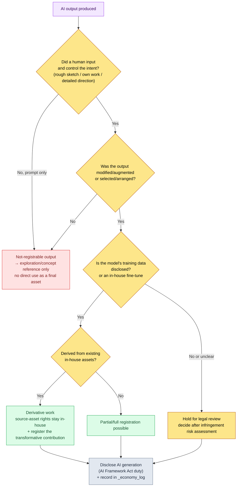

# 22.4 Copyright and Ethics — Closing an Output's Rights, Disclosure, and Agreement in One Procedure

> Primary readers: game directors and leads responsible for AI adoption (mid-size teams of 10–50)
> Scaled-down version for solo/hobbyist readers: §22.4.9 "If You're Solo, Just This Much"

Two months before launch, a meeting once ground to a halt over a single city illustration a concept artist had made. Someone asked, "This was generated with AI, right? So is the copyright ours — or can it not even be registered?" Nobody could answer. Three opinions came out of that room: "The AI made it, so it isn't ours." "We paid to run the model, so it's ours." "There's no law yet, so just use it." All three were wrong. And the question was never just a legal-affairs issue. What the role of the artist who made that illustration actually was, and how the team had agreed on AI use, were all hanging on it at once.

This chapter does not treat copyright and ethics separately, because in practice they are the front and back of the same question. "Who owns the rights to this output" (copyright) reduces directly to "how much did a human intervene in this output" (ethics and roles). The registration requirement the Korea Copyright Commission nailed down in 2025 sits exactly at that point. So the spine of this chapter is a single worked transcript — it actually judges the copyright registrability of one piece of AI concept art and follows, from input to decision, how that judgment leads into the team's role agreement.

> **Author's Actual Operations Note**
> The `design_intent_vs_automation_boundary` atom and the `_economy_log` / `_roi_report.md` cited in this chapter are anonymized versions of governance assets I actually operate at work. The atom names and log file names are the real operating names (only company- and project-specific identifiers were replaced for IP protection). The worked transcript's output is a reconstruction of an actual judgment session.

---

## 22.4.1 Authority Comes from Public Guidelines, Not from "Feel"

Many books simply write that AI copyright is "still murky because the law isn't there yet." That's only half right. In June 2025, when the Ministry of Culture, Sports and Tourism and the Korea Copyright Commission published the "Guide to Copyright Registration for Works Made Using Generative AI," the line for registrability became clear — at least in Korea. There is no need to make anything up.

The guide's core compresses into one sentence: **the requirement for copyright registration is "human creative contribution."** From there, two categories split.

| Category | Definition | Registration |
|---|---|---|
| GAI output | A result the AI produced with no human creative contribution | Not possible |
| GAI-assisted work | The parts of a result made using AI as a tool where creative contribution is recognized | Possible |

The guide then lays out three paths to recognition as an "assisted work": ① the user fed their own copyrighted work in as a prompt and its creativity shows in the output; ② the additional work of modifying or augmenting the output is creative; ③ the selection, arrangement, or composition of outputs is creative. The two axes of judgment are **"controllability" and "predictability."** Creativity is recognized when the creator clearly decides what they want to express and can pull the result toward that intent.

This part is decisive. What the guide says in legal language — "controllability and predictability" — is the same thing this book has repeated since §1.1: **"the designer provides intent"** (the `planner_provides_intent_not_recommendation` atom). An output handed wholesale to the AI has no control and no prediction, so it has no copyright either; an output where a person input the intent, then reviewed and reconstructed the result, carries rights with it. Copyright registrability and the conditions of a good AI workflow sit on the same line.

There is one more public standard. The AI Framework Act — Korea's basic law on AI, taking effect in 2026 — imposes a **transparency duty (disclosure of the fact of AI generation)** on generative AI outputs. Registration (the side that claims rights) and disclosure (the side that states the fact of use) are separate duties. Whether rights arise or not, the fact that you used AI must be disclosed. These two public standards become the **primary input for the rulebook** we hand the AI in this chapter.

---

## 22.4.2 [Worked Transcript] Judging the Registrability of One Piece of AI Concept Art

Back to the illustration from the opening. Instead of judging it by "feel," I feed the §22.4.1 guide's criteria to the AI as a rulebook and have it do the first-pass classification. The human makes only the final call. The input prompt below can be copied and used as is; the output is a reconstruction of an actual judgment session.

### Step 1 — Input: Hand Over the Output's Generation History as Is

The input for the judgment is not the illustration but the log of how that illustration was made. This already lives in the asset metadata, so all you do is extract it.

```yaml
# asset_concept_city021_v4.meta.yaml — generation history of the output under judgment
asset_id: concept_city021_v4
asset_type: concept_illustration
created_by: Team member A (concept artist)
generation_log:
  - step: 1
    actor: Team member A
    action: "Attached a hand-drawn rough sketch of the city layout as the input image"
  - step: 2
    actor: AI (image_model)
    action: "Generated 4 variations from the rough plus a prompt"
    prompt: "stone observatory tower over sealed magic core, cold arid, scholar guild, muted palette"
  - step: 3
    actor: Team member A
    action: "Picked 1 of the 4; retouched the bell tower silhouette, saturation, and composition by hand (about 40% of the area reworked)"
  - step: 4
    actor: Team member A
    action: "Designed the background sealing-array sigil by hand and composited it in"
ai_generated_disclosure: true   # satisfies the AI Framework Act disclosure duty
```

### Step 2 — Prompt: Classify by the Guide's Criteria, but Force the Reasoning

```
The attached meta.yaml is the generation history of one concept illustration. Using the Korea
Copyright Commission's "Guide to Copyright Registration for Works Made Using Generative AI" (2025),
classify its registrability as one of: registrable / partially registrable / not registrable.
Give one line of reasoning for each of the guide's two axes (controllability, predictability), and
point out by number which steps in generation_log count as 'creative contribution'. Anything you
cannot settle legally, mark as 'legal review needed' and hand it to a human. As a table: classification | basis (control) | basis (predictability) | contribution step | legal review.
```

Note that half the prompt is "forced reasoning" and a "legal escape hatch." Hand the AI a legal judgment wholesale and it will spit out a plausible-sounding verdict. The core of this prompt is the classification scheme (the guide's three categories), the reasoning requirement (the two axes), pointing at the contribution steps, and the escape hatch: "if you can't settle it, hand it to legal."

### Step 3 — Claude's Output (Reconstructed from the Actual Session)

> ```
> | Classification | Basis (controllability)              | Basis (predictability)            | Contribution step | Legal review |
> |----------------|--------------------------------------|-----------------------------------|-------------------|--------------|
> | Partial        | Rough sketch (step1) and 40% retouch | Picking 1 of 4 was predictable;   | 1,3,4             | ★            |
> |                | (step3) directly control the expressive intent | the AI's 4 variations themselves were not |   |              |
>
> Analysis:
> - step1 (own rough sketch as input): falls under guide path ① 'creativity reflected by inputting one's own work'.
> - step3 (40% retouch): falls under guide path ② 'creative modification/augmentation work'. The strongest contribution.
> - step4 (hand-designed sealing-array sigil): an independent work composited in — clearly human creation.
> - step2 (AI's 4 variations): pure output with no human creative contribution → not registrable on its own.
>
> ★ Legal review needed: there is no quantitative standard for whether a "40% retouch" reaches
>   'substantial transformation'. Attorney review is recommended on whether the retouch ratio
>   crosses the registrability line. (The AI cannot determine the legal sufficiency of the ratio.)
> ```

The most valuable part of the output is not the table but the **★ legal review** line at the bottom. The AI reported its own limit — "I cannot determine whether a 40% retouch is legally sufficient" — and handed it to a human. A good prompt makes it possible for the AI to say it doesn't know. Not auto-reject — auto-report.

### Step 4 — Verification and Rejection (the Human's Seat)

You don't accept this output as is. The director runs it against the rulebook once. The AI classified step4 (the sealing-array sigil) as an "independent work," but rereading the generation history, that sigil derived from the city lore that §6.2's `city_hunting_generator` produced. So step4 may not be pure creation but **secondary work layered on top of an internal company asset**. Since it is a company asset, ownership of the rights is clear — but the AI's phrase "independent work," written verbatim into the registration application, invites misunderstanding.

So I re-request.

```
The sealing-array sigil in step4 is secondary work derived from in-house city lore assets (not independent new creation).
Reclassify the nature of step4's contribution to reflect this fact.
Also propose, in one line, how the registration application should state that it is 'based on existing in-house assets'.
```

One round trip closes it. The AI reclassified step4 from "independent work" to "derivative work of in-house lore assets — rights to the source asset stay with the company; the transformative contribution is registrable," and that judgment went to legal review. The conclusion was confirmed: **partial registration plus AI-generation disclosure**. Done entirely by hand, legal would have to interrogate the generation history of every single asset; with an AI draft, a rulebook review, and one round trip, legal spends its time only on the borderline cases marked ★.

This full loop is this chapter's bar for Show. The sentence "AI copyright is murky" stays hollow until you have classified one output's generation history all the way through against the guide's criteria.

---

## 22.4.3 Decision Tree — Can This Output Be Used?

To avoid redoing the session's judgment from scratch every time, record the guide's criteria as a flowchart. When an asset comes in, you walk down this tree. Every branch point is a public criterion from §22.4.1.



The key point is that the tree's end (J) is the same on every path. Registrable or not, company asset or derivative work, **the disclosure that AI was used and the generation-history log are recorded without exception.** Disclosure is a duty separate from rights, and the log is the only basis for tracing responsibility when something goes wrong. The opening meeting stalled precisely because this log didn't exist — nobody could reconstruct who did what at which step.

The red path (C, not registrable) isn't simply thrown away either. "Pure AI output from a prompt alone" is perfectly usable as reference in the exploration and concept stage. You just don't put it into the game as a final asset. Shipping raw AI output unchanged is the single biggest opening for a post-release copyright incident.

---

## 22.4.4 The Copyright Rulebook as an Operating Log — `design_intent_vs_automation_boundary`

The tree (§22.4.3) is the flow of judgment; what makes that flow draw the same line every time is a single atom. Among the company's governance assets, `design_intent_vs_automation_boundary` is the spine of this entire chapter.

The atom's one-line definition is: "design intent belongs to people, automation to tools — make that boundary explicit per asset." It is not an abstract slogan. This atom is registered in the JIT hook (`inject_memory.py`), so whenever a prompt contains keywords like "copyright," "AI-generated," or "asset registration," it is automatically injected into the session. The hook's design principles directly support how this atom operates.

```python
# inject_memory.py — always exit 0; even on failure, never block the user's flow (excerpt)
def main() -> None:
    ...
    # sort by score descending, then match — inject at most 3 atoms
    atoms_sorted = sorted(atoms, key=lambda a: a.get("score", 0), reverse=True)
    matches = []
    for atom in atoms_sorted:
        if len(matches) >= max_matches:   # prevent over-injection
            break
        try:
            if re.search(atom["regex"], prompt, re.IGNORECASE):
                matches.append(atom)
        except re.error:
            continue
    if not matches:
        emit_empty()   # no matches → empty response (normal)
        return
```

Two design decisions matter here for governance. First, the hook **always exits 0** (stated in the script's docstring). Even if injecting the copyright rules fails, it never blocks the user's work. When a safety device holds work hostage, the team switches that device off within a quarter or two. Second, **at most three atoms are injected**. Push every governance rule into every session and the context blows up and nobody reads any of it. Only the highest-scoring rules surface.

This is the same philosophy as §6.2's lint, which did not auto-discard violations but only raised alerts to the writer gate. **The machine picks the suspects; a human decides whether they live or die.** The same holds in copyright: the atom automatically raises "did you check this asset's copyright?" — but the final judgment on registrability belongs to a human and to legal.

---

## 22.4.5 After Rights Come People — Closing Role Evolution with Agreement

The opening illustration's judgment did not end with copyright. It also meant that team member A's job had shifted from "drawing it" to "choosing among 4 AI variations and retouching 40%." The moment copyright demands "human creative contribution," the role definition of the person making that contribution changes with it. The two are the front and back of the same event.

The most common accident here is handling this change as an announcement. When a good tool sits unused six months later, it's usually not that the tool was bad — there was no agreement. The essence of adoption is roles shifting from mass production to selection, review, and reconstruction; if you don't state that explicitly and back it with training, team members hear it as "my seat is disappearing."

| Role | Before AI | After AI (role evolution) | Copyright meaning |
|---|---|---|---|
| Concept artist | Draws everything by hand | Inputs intent, selects, retouches | The retouch is the 'creative contribution' |
| Balance designer | Manual simulation | Interprets sims, decides | The decision log is the basis of accountability |
| Game designer | Writes every spec | Provides intent, reviews | Intent input is controllability |

The table says one thing: **the "human contribution" that makes copyright registration possible is exactly what the person does after role evolution.** When the control and prediction the guide demands disappear, the copyright disappears and so does the person's seat. So role evolution has to be explained not as a change that takes jobs away but as a change that keeps rights and responsibility in human hands — that's when agreement happens.

Agreement is not an endless meeting. You close it with a procedure: adoption proposal (director) → advance sharing with the whole team (purpose, affected roles, metrics, risks) → an agreement meeting (open floor, collect concerns) → 1:1s with members who need them → announce the adjusted plan → agree or hold. You don't need every member's consent to start, but you hear the concerns through a procedure, adjust, and then the director decides. Without the procedure, agreement restarts from zero every time, and that cost delays adoption.

---

## 22.4.6 Cost and ROI Are Part of Ethics — Honest Measurement with `_roi_report.md`

Narrow ethics down to jobs and agreement and you miss one axis. Honestly measuring and publishing the cost and effect of AI operations is itself governance. Say only "AI improved our efficiency" with no measurement, and team members will suspect the claim is a pretext for shrinking their seats.

The company's governance infrastructure has two real assets for this: the atom system's `_economy_log/` (the token-and-time economics log) and `_roi_report.md` (the ROI report). The former has the machine record each session's tokens and time; the latter aggregates them on a cycle for humans to read. The point is that these logs track not "how much AI replaced people" but "where it freed people's time to go."

This book's rule for numbers is one of three. First, public standards are quoted as is (the guide's registration requirements, the AI Framework Act's disclosure duty). Second, author estimates are labeled as estimates. Third, only what's measurable is promised as a KPI. In copyright and ethics, what's measurable is not outcome metrics but procedural metrics.

| Metric | How measured | Can it be promised? |
|---|---|---|
| Missing AI-generation disclosures | grep asset meta for `ai_generated_disclosure` | Measurable (target 0) |
| Generation-history log coverage | Share of assets with a `generation_log` | Measurable |
| AI assets shipped without legal review | Release build vs. legal-cleared list | Measurable (target 0) |
| "Revenue went up because of AI" | — | Not measurable; not promised |

The last row is the heart of honesty. AI adoption's revenue effect cannot be isolated as a single variable, so I do not claim causation. What can actually be counted, via `_economy_log` and the asset metadata, is "the share of AI-generated assets that passed disclosure, logging, and legal review." What governance promises is not outcomes but the integrity of the procedure.

---

## 22.4.7 User-Generated Content (UGC) and Data Protection

Settle asset rights, roles, and cost, and one area remains: the path where users put AI-made content into the game. Company-made assets close through internal procedure, but UGC pours in from outside your control.

The end of the §22.4.3 tree (disclosure and logging) applies here unchanged. User-uploaded costumes and guild emblems are required to carry an AI-generation disclosure, and moderation combines automated review with a human gate. Run only one of the two axes and the next quarter's incidents accumulate. And user data is never sent to an LLM carelessly: personal and payment data must not be transmitted at all, and behavioral logs go out only after anonymization (compliant with GDPR and Korea's Personal Information Protection Act).

Jurisdiction doesn't end with Korea. The moment you accept overseas users, the data regulations of each user's region attach as well. For EU users, GDPR sets separate requirements on cross-border transfer, consent, and the right to erasure; other service countries have their own privacy and data-localization rules. That's why the table's third row, "no personal or payment data to the LLM," is the safest default in any jurisdiction, and the strength of anonymization and pseudonymization when sending behavioral logs to an external model has to be checked separately for each region you serve. That said, this section is procedural design guidance, not legal advice. If a global launch or cross-border transfer is involved, get separate legal review in the relevant jurisdiction without fail.

| UGC/data | Policy | Basis |
|---|---|---|
| User-uploaded costumes and emblems | AI disclosure + automated review + human gate | AI Framework Act disclosure duty |
| Character nicknames and posts | Standard terms of service + user responsibility | — |
| Personal and payment data | No LLM transmission | Personal Information Protection Act |
| Game behavior logs | Transmit after anonymization | Anonymization/pseudonymization |

The more UGC grows, the heavier the moderation burden gets. Automated review filters first; only the borderline cases reach a human. This is §22.4.4's atom philosophy (the machine picks the candidates, the human decides) carried over to the user-content level.

---

## 22.4.8 Common Failures

| Pattern | Why it fails | Remedy |
|---|---|---|
| Using AI output unchanged as the final asset | Zero human contribution → not registrable + infringement risk | §22.4.3 tree; exploration/concept only |
| No generation-history log | No way to reconstruct per-step responsibility after an incident | Make `generation_log` mandatory in asset meta |
| No AI-generation disclosure | Violates the AI Framework Act's transparency duty | The disclosure step at the tree's end has no exceptions |
| Handling role evolution as an announcement | Tool rejected six months after adoption | Agreement procedure (§22.4.5) |
| Only shouting "AI raised efficiency" | Team members suspect a threat to their seats | Publish measurements via `_economy_log` and `_roi_report` |
| Uncritically using models with unclear training data | Infringement risk assessment skipped | Prefer disclosed models and in-house fine-tunes (tree branch E) |

The fifth is the one most often missed. As the opening illustration's judgment showed, the "human contribution" that makes copyright registration possible is that person's new role. Measure only efficiency and not where that person's time was freed to go, and governance succeeds on the KPIs while the people leave.

---

> **Beyond Games.** A meeting freezing over "we made this with AI — is the copyright ours?" happens not only with game illustrations but with AI-made reports, ad copy, and proposals anywhere. The standard the Korea Copyright Commission's 2025 guide nailed down is simple: registrability hinges on "human creative contribution (controllability and predictability)," and pure AI output from a prompt alone carries no rights. So in any department, the habit of leaving one generation-history sheet per AI output — which steps were human, which were AI — becomes a safety net. If a marketer, for example, takes an AI copy draft and personally revises and reconstructs it, recording that contribution becomes the basis for claiming rights; and whether or not it gets registered, the disclosure that AI was used (a duty under the 2026 AI Framework Act) is recorded without exception. After rights come people: the role change for the employee making that contribution should be closed by agreement, not by announcement.

## 22.4.9 Try It Yourself — One Step You Can Take Today

> **If you're solo, just this much**: You don't need a legal team. Pick one image or text output you made with AI and write out a `generation_log` in the §22.4.2 format by hand (split it into steps: which were human, which were AI). Then walk the §22.4.3 tree and judge for yourself whether it's registrable — the Korea Copyright Commission guide's "control and prediction" criteria will sink in as a concrete bundle of judgments. Even on a personal or hobby project, it's worth leaving the one-line AI-generation disclosure (`ai_generated: true`).

If you're on a team, start with this one step. Make the two slots `generation_log` and `ai_generated_disclosure` mandatory in every AI asset's metadata (a one-line grep catches omissions), and pin the §22.4.3 decision tree to your wiki as a single page. Automating registrability judgments or running `_economy_log` comes later. With just the generation-history log and one tree page, you can prevent the kind of meeting that froze at the opening.

---

## 22.4.10 Wrapping Up Part 22

Part 22 covered the four axes of governance.

| Chapter | Core |
|---|---|
| 22.1 | Prompt engineering — forcing format, reasoning, and escape hatches |
| 22.2 | Hallucinations and safety — review gates, report-style verification |
| 22.3 | Cost management — caching, caps, `_economy_log` |
| 22.4 | Copyright and ethics — registration requirements, disclosure, role agreement |

One sentence runs through all four chapters: **governance is not a device that blocks AI; it is the procedure that leaves human intent and responsibility on the output.** The `design_intent_vs_automation_boundary` atom is that procedure's name. The "control and prediction" that copyright registration demands, the "roles and agreement" that ethics demands, and the "honest measurement" that cost demands all point to one place — whatever the AI does, the last seat of decision and responsibility belongs to a human.

---

### Key Takeaways
- The requirement for copyright registration is "human creative contribution" (Korea Copyright Commission, 2025 guide).
- Registered or not, the AI-generation disclosure and the generation-history log are recorded without exception.
- The "human contribution" copyright demands is exactly the person's work after role evolution.

### Next Chapter Preview
- Part 23, Scaling Out — applying the same workflow at reduced scale to solo and hobby development

---


---

> **Sources**
> - Korea Copyright Commission and Ministry of Culture, Sports and Tourism, "Guide to Copyright Registration for Works Made Using Generative AI" (2025) — https://www.copyright.or.kr/information-materials/publication/research-report/view.do?brdctsno=54253
> - Korea Copyright Commission and Ministry of Culture, Sports and Tourism, "Generative AI Copyright Guide" (Dec. 2023) — https://www.copyright.or.kr/information-materials/publication/research-report/view.do?brdctsno=52591
> - The AI Framework Act (Korea's basic law on AI): transparency and disclosure duties for generative AI outputs (effective 2026) — https://www.shinkim.com/kor/media/newsletter/3142
