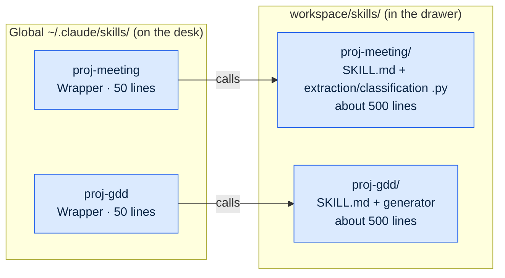
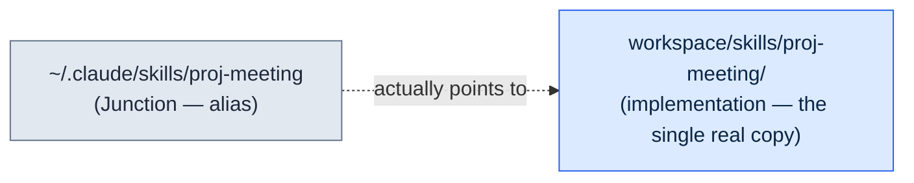
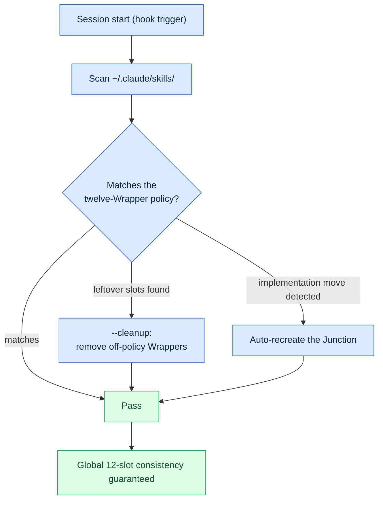
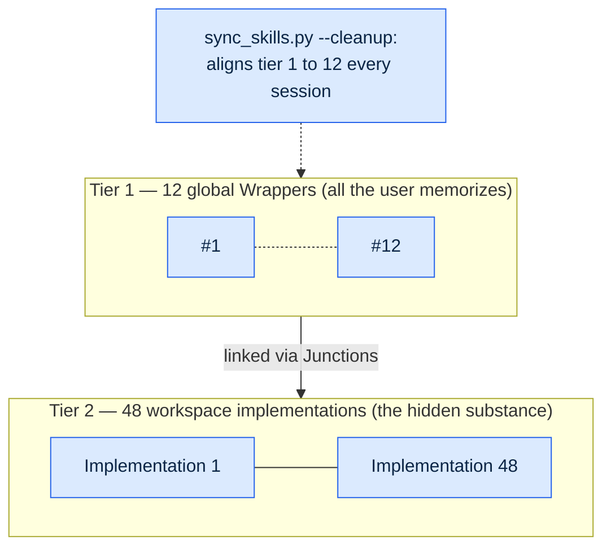
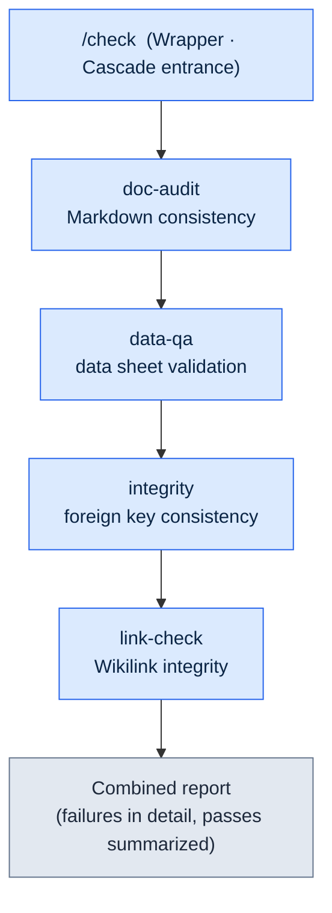
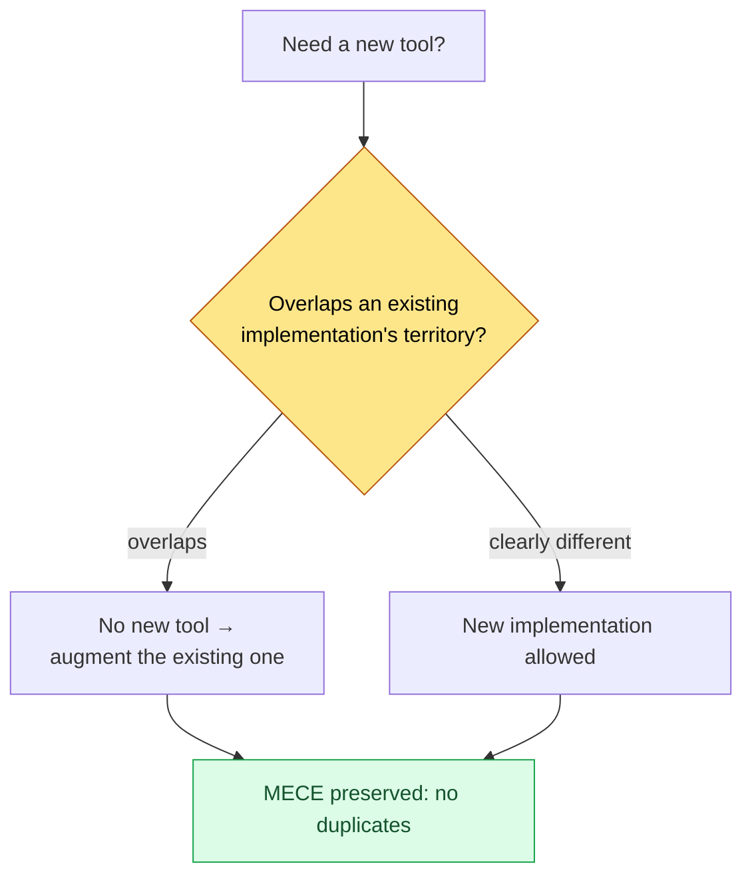

# Part 23 · Chapter 1. The Wrapper, Cascade, and Junction Patterns

> Don't add more tools — build tools for your tools. This is the story of a two-tier structure that hides 48 implementations behind 12 global entry points, and the automation that keeps the two consistent without human hands.

---

One evening, while running my monthly retrospective, I was counting my slash commands and my hand stopped. Forty. I clearly started with seven or eight half a year earlier, but I built a meeting-notes tool here, attached a data-validation tool there, added a game design document (GDD) generator — one or two a week — and somewhere along the way the list had grown to forty. And nearly half of them I hadn't called even once in the past month.

The problem was that unused tools don't just sit there quietly. Every time a session started, all forty slash command specs were loaded. They ate into the token budget, similarly named commands (`skill-design`, `skill-design-new`, `skill-design-template`) blurred together, and recalling the tool I actually needed took time. The tools weren't helping the work anymore — managing the tools was becoming the work.

This chapter covers how I cut those forty down to twelve global commands without throwing away a single implementation. Three patterns carry the work: **Wrapper**, which creates lightweight entry points; **Cascade**, which bundles multiple tools behind one entrance; and **Junction**, which physically links entry points to their implementations. Plus `sync_skills.py`, which guards the consistency of all three so a human doesn't have to.

---

## 23.1.1 The Quantitative Signal Found in the Retrospective

Everyone has the impression of having too many tools. But an impression alone can't decide what to cut. What made the decision possible was the tool-economy measurement in the monthly retrospective.

This project runs retrospectives as a self-improvement mechanism. Daily retrospectives accumulate into weeklies, weeklies merge into monthlies, and along the way the monthly retrospective back-calculates "which tools did I use, and how often, over the past month" from the SVN commit log. The score used for this measurement is `skill_audit_score`. It tracks how often each slash command appears in actual work artifacts through commit history and assigns a usage frequency.

The distribution that month's measurement revealed looked like this. (The usage percentages are measured from the SVN commit log; they are per-tool shares of appearances, not absolute call counts.)

<svg viewBox="0 0 640 220" xmlns="http://www.w3.org/2000/svg" font-family="sans-serif" font-size="13">
  <rect x="0" y="0" width="640" height="220" fill="#fafafa" stroke="#ddd"/>
  <text x="20" y="30" font-weight="bold" font-size="15">40 slash commands — usage frequency distribution</text>

  <!-- TOP 12 bar -->
  <rect x="20" y="55" width="500" height="40" fill="#2c7be5"/>
  <text x="30" y="80" fill="#fff" font-weight="bold">Top 12 commands</text>
  <text x="530" y="80" fill="#2c7be5" font-weight="bold">92% of usage</text>

  <!-- middle group -->
  <rect x="20" y="105" width="55" height="40" fill="#a6c8f0"/>
  <text x="85" y="130" fill="#555">10 mid-usage commands — about 8%</text>

  <!-- tail group -->
  <rect x="20" y="155" width="18" height="40" fill="#e0e0e0" stroke="#bbb"/>
  <text x="85" y="180" fill="#999">18 used less than once a month (45% of the total) — nearly 0%</text>

  <text x="20" y="212" fill="#888" font-size="11">Source: monthly retrospective skill_audit_score, back-calculated from the SVN commit log / percentages are measured shares of appearances</text>
</svg>

The top twelve accounted for 92% of all usage, and eighteen commands — 45% of the total — weren't used even once a month. Half the answer was already decided: expose only the twelve frequently used commands globally and clean up the rest.

The catch was that "clean up" didn't mean "delete." Even the twenty-eight unused commands were needed once or twice a quarter — when writing a half-year report, building a new data schema, or running a specific validation. If the tool isn't there at that moment, the work stops on the spot. So the real question was this: **how do I show only twelve while keeping all twenty-eight alive?**

A desk metaphor runs through this entire chapter. Nobody lays out forty pens on their desk and uses them all every day. You keep the twelve you use most on the desk and put the rest in a drawer. Inside the drawer, pens of the same kind go into one cup. Wrapper is the lightweight entry point you keep on the desk, Junction is the passage connecting the drawer to the desk, and Cascade is the bundle of pens gathered in one cup.

---

## 23.1.2 The Wrapper Pattern — Lightweight Entry Point, Heavy Implementation

A Wrapper is a thin shell around a slash command. Only the entry point lives in global; the actual logic lives in the implementation under workspace. The global directory holds a 50-line guide; the implementation holds a 500-line build-out.



This separation pays off in five ways. Only 50 lines load globally at session start, saving tokens; the implementation can be edited daily without touching the global slot; the implementation can live anywhere — SVN, Git, wherever; sharing is easy because the implementation sits in a shared team folder while only the Wrapper lives in your personal global directory; and a unified Wrapper format keeps the user experience consistent.

The standard Wrapper format looks like this. Every Wrapper shares this skeleton.

```markdown
---
name: proj-meeting
description: Meeting-notes analysis and decision extraction (implementation: workspace/skills/proj-meeting/)
---

# /proj-meeting — Wrapper

Implementation location: workspace/skills/proj-meeting/SKILL.md

## Behavior
This Wrapper calls the implementation's entry script. Detailed logic is defined in the implementation.
When the implementation changes, only this Wrapper's description needs updating (automatic sync recommended).
```

The point is that there's nothing but a one-line description and a pointer to the implementation. The moment logic creeps in, the Wrapper gets heavy and synchronization with the implementation starts to break. So I enforce a rule: a Wrapper stays under 100 lines.

This project caps its global slash command slots at twelve. All frequently used tools must fit within those twelve, and the monthly retrospective owns the selection criteria: used five or more times a month, balanced across domains (no single domain exceeds six tools), and consistent entry (a unified naming convention). When the count exceeds twelve, the least used one is retired or merged into another command.

Twelve is not an absolute number. What matters is that a number is fixed at all. A small team (up to about 10 people) might do fine with ten; a team spanning many domains might be right at fifteen. Only a fixed ceiling keeps the cognitive load at a constant level.

---

## 23.1.3 The Junction Pattern — Physically Linking the Implementation and the Entry Point

If Wrapper is the rule — "only lightweight entry points go global" — Junction is the means of implementing that rule at the operating-system level. A Junction is a directory symbolic link: an alias provided by the OS.



When the user looks into the global location, the implementation appears to be sitting right there. But the actual files exist in exactly one copy, at the implementation's location. The global side is merely a signpost pointing there.

The gains from this structure are clear. Edit the implementation and the change shows up globally at once (there is no copy step). Files exist in one copy, saving disk space, and the global side holds only Junctions, so there are no Git conflicts (the implementation is managed separately in SVN or Git). Move the implementation, re-point the Junction, and the user notices nothing.

How you create one differs by OS. On Windows, `mklink /J <link> <target>` creates a directory junction, and no administrator rights are required. Linux and macOS use `ln -s <target> <link>`, and WSL uses the Linux command as is. The `sync_skills.py` script covered below handles this platform difference automatically, so the operator never has to memorize per-OS commands.

Run on copies instead of Junctions, and a synchronization accident happens the moment the implementation and the global copy diverge: you fix a bug in the implementation, but the global copy is an old version and keeps the old behavior. A Junction eliminates the very possibility of that accident. A signpost can't become a second copy, and the substance is always one.

---

## 23.1.4 sync_skills.py — Keeping Consistency So a Human Doesn't Have To

Manage Wrappers and Junctions by hand and you eventually drift back to forty. People postpone cleanup, forget policies, and make exceptions. So consistency maintenance is automated. That tool is `sync_skills.py`.

A hook triggers this script every time a session starts. What the script does flows like this.



It has three core functions. First, it scans the global directory and checks compliance with the twelve-Wrapper policy. Second, with the `--cleanup` flag it removes leftover Wrappers that aren't in the policy. If a tool someone added temporarily lingers in a slot, it gets cleaned up at the next session start, so the slots never balloon again. Third, if an implementation's location has changed, it re-creates the Junction automatically — detecting the OS and calling `mklink /J` on Windows, `ln -s` everywhere else.
What matters is that all three functions are designed to be **idempotent**. Since the tool runs automatically at every session start, running it any number of times on the same state must produce the same result as running it once. Wrappers that already match the policy are left alone, Junctions that are already set correctly are not re-created, and when there are no leftover slots to clean, nothing is deleted. Without idempotence, the same cleanup would pile up session after session, re-creating healthy Junctions or touching implementations it shouldn't — and for a tool that runs unattended every session, that leads straight to synchronization accidents. So `sync_skills.py` holds one invariant: touch only what changed; if nothing changed, touch nothing.

The effect of `--cleanup` translates directly into token-budget protection. Pin the slash specs loaded globally each session at twelve, and even as the implementations grow to forty-eight, the session-start cost stays constant. Because no human manages it by hand, the policy never drifts.

This automatic consistency is the safety pin of the two-tier structure. Wrapper and Junction build the structure, and `sync_skills.py` keeps that structure standing as time passes.

---

## 23.1.5 The Two-Tier Structure — 12 Global Wrappers → 48 Workspace Implementations

Put the three patterns and automatic consistency together and the following two tiers are complete. On the upper tier sit the twelve entry points the user memorizes; on the lower tier sit the forty-eight implementations.



The user remembers only the twelve global commands. Even with forty-eight implementations hidden behind them, the cognitive load stays at twelve. Wrapper keeps the entry points light, Junction links entry points to implementations, and `sync_skills.py` guards the consistency of those twelve every session.

As a ratio, entry points to implementations is 1 to 4 (12 to 48). Adding tools doesn't add to what the user must memorize. Grow the implementations to sixty or eighty, and tier 1 is still twelve. This is the actual implementation of the sentence "don't add more tools — build tools for your tools." What grows is tier 2 (the implementations); tier 1 (the entry points), the part the user faces, stays constant.

---

## 23.1.6 The Cascade Pattern — Chained Calls Behind One Entrance

If the two-tier structure is the pattern that "reduces many tools to few entry points," Cascade is the pattern that "bundles tools often used together into a single call." One slash command calls multiple sub-tools in sequence and produces one combined report.

This project's flagship Cascade is `check`. It consolidated into one the four tools that used to inspect the integrity of design data every morning.



I used to call the four tools separately every morning: one document check, one data check, one foreign key check, one link check. Each work cycle cost three or four manual calls. `check` bundles the four into one command — call it once and the four steps run in order, with the results merged into one.

Cascade design follows principles. Each step must be callable on its own (you have to be able to call just `data-qa` by itself). Whether to stop or continue on failure is set per step: validation work keeps running the remaining steps after a failure to see the whole picture, while modification work stops immediately when a step fails. Results accumulate and become the next step's input, and the combined report uses the same format across every Cascade.

Here is the actual definition of `check`. (It consolidates four kinds of validation into one.)

```yaml
cascade:
  - step: doc-audit
    purpose: Markdown consistency (YAML frontmatter, links, atom references)
    fail_action: continue
  - step: data-qa
    purpose: Excel data sheet validation (schema, ranges, required columns)
    fail_action: continue
  - step: integrity
    purpose: foreign key consistency (cross-sheet references)
    fail_action: continue
  - step: link-check
    purpose: Wikilink and external link integrity
    fail_action: continue

report:
  format: markdown
  include_pass: false   # passes summarized only; failures in detail
  group_by: severity
```

`fail_action: continue` is set on all four steps because this is a validation Cascade. Even if one check fails, the other three still run, so I see that day's full defect list in one pass. The report folds passing items into a summary and expands only the failures, gathering the morning's attention on what needs to be seen.

Cascade has its own trap. Add steps without limit and complexity explodes. So, like the 12-slot policy, Cascades get a step ceiling. Past roughly five to seven steps, split it in two or move some steps into a separate Cascade.

---

## 23.1.7 Tool Curation — The MECE Wrapper Policy

Once the two-tier structure and Cascade settle in, growing the implementations becomes easy — just add one to workspace without touching the global slots. And right there a new trap appears: when adding is easy, similar tools pile up as duplicates.

So one policy is enforced when growing the implementations: the **MECE Wrapper policy**. When a new tool is about to be added, the judgment forks two ways. If its territory overlaps an existing tool, don't create a new one — augment the existing tool. Only when the territory is clearly different is a new one created. It means keeping the implementation list Mutually Exclusive (no duplicates) and Collectively Exhaustive (no gaps).



The retrospective backs up this judgment. Because `skill_audit_score` measures per-tool usage frequency from the SVN log, signals like "this tool does nearly the same thing as that one, and neither gets used much" get caught. Then the two are merged into one, or the less used one is retired from the implementations. In curation, removal matters as much as addition.

Without the MECE policy, the "freedom to add implementations" that the two-tier structure created turns into poison instead. Even if implementations never eat into the tier-1 slots, once the implementations themselves bloat with duplicates, you start getting confused again about which implementation to use. The policy blocks that bloat.

---

## 23.1.8 Why the Retrospective Ignited All of This

Let's go back to the beginning. Not one of these — Wrapper, Junction, Cascade, the MECE policy — was designed up front at a desk. Every one of them arose as an answer to a problem found in a retrospective.

When the monthly retrospective's `skill_audit_score` exposed, in numbers, the forty slots and the 92% usage concentration, "cap it at twelve" was decided. That decision dragged along the question "then how do we keep the twenty-eight alive," and the answer was Wrapper and Junction. The next retrospective surfaced the finding "calling four similar validation tools separately every morning is a chore," and the answer was the `check` Cascade. Yet another retrospective caught the signal "now that adding implementations is easy, duplicates are piling up," and the answer was the MECE policy.

Without retrospectives, these patterns would not have been built. Or if built, they would have become over-engineering detached from real problems. Finding the problem through measurement first, then introducing the pattern — that order is what makes tools actually get used. Part 21's message that the retrospective is the starting point of self-improvement takes concrete form here, at the level of tools.

---

## 23.1.9 Operating Record — Six Months Accumulated

Here are six months of measurements compared before and after adoption. The focus is the change in operating burden, not absolute call counts.

| Item | Before | After (Wrapper+Cascade+Junction) |
|---|---|---|
| Global slot count | 40 (ballooning) | 12 (policy-enforced) |
| Implementation count | scattered, many duplicates | 48 (MECE-curated) |
| Global slot share at session start | large (40 specs loaded) | small (only 12 specs loaded) |
| Global propagation after editing an implementation | manual copy step required | immediate (Junction, no copying) |
| Calls to similar validation tools | 3–4 manual calls per task | 1 (check Cascade) |

The first month's measurements were uneven. There were a couple of synchronization accidents before the Wrapper format settled, and the slots hovered between fifteen and eighteen before the twelve-cap policy was enforced. Stabilization came in month two. Once `sync_skills.py --cleanup` started aligning the slots every session, the slot count never ballooned again.

The directional wording in the table — "share," "required," "immediate" — is deliberate. Token costs and time differ by environment, so I recorded only the direction of change. What is certain is that tier 1 went from forty to a fixed twelve, and the manual copy step disappeared from implementation propagation.

---

## 23.1.10 Common Mistakes and How to Avoid Them

Here, gathered in one place, are the traps flagged in the preceding sections. All five point to the same lesson: keeping a structure alive over time is harder than building it.

- **Logic seeps into the Wrapper.** The moment the lightweight entry point absorbs part of the implementation, synchronization breaks → enforce the under-100-lines rule (§23.1.2).
- **Running on copies instead of Junctions.** Once the implementation and its copy diverge, the old version keeps the old behavior → a Junction is mandatory, not optional (§23.1.3).
- **Adding Cascade steps without limit.** Past five to seven, complexity explodes → set a step ceiling (§23.1.6).
- **Managing the 12 slots by hand.** Without an enforcement mechanism, they will balloon again — guaranteed → `sync_skills.py --cleanup` aligns them every session (§23.1.4).
- **Adopting patterns before retrospectives.** Build structure before measuring and you're left with an unused skeleton → measure → discover → pattern, in that order (§23.1.8).

---

## Try It Yourself (setup → prompt → verify)

**setup.** Create one implementation directory under workspace (e.g., `workspace/skills/proj-meeting/`). Put `SKILL.md` and the actual scripts inside it. In the global `~/.claude/skills/`, place only a 50-line Wrapper.

**prompt.** Ask Claude the following.

```
Scan the list of slash commands in ~/.claude/skills/.
Classify each command as (a) a lightweight Wrapper holding
only a pointer to its implementation, or (b) a heavy command
with logic inside; for each (b), propose a change that moves
the implementation into workspace and leaves only a 50-line Wrapper globally.
Then print the command that creates the Junction pointing to the
implementation, matched to the OS (mklink /J on Windows, ln -s otherwise).
```

**verify.** Check three things. First, is each item in the global directory under 100 lines? Second, when you open a global item, do you see only one line with the implementation's location plus a description? Third, edit one line in the implementation and call it from global — does the edit show up immediately? (If the Junction is set correctly, it propagates with no copying.)

## Solo Scale-Down

If you're a solo operator with no team and no SVN, scale it down like this. You don't need a workspace — one personal Git repository is enough. Keep the implementations in that repository and only Wrappers in global. Even without a measurement tool like `skill_audit_score`, simply writing down by hand at month's end "the commands I actually called this month" reveals the concentration. Keep only the top five to seven in global and move the rest down to implementations. For Cascade, bundling into one command once two or more tools are routinely called together is enough. If an automatic consistency script feels like too much, replace it with the habit of glancing over the global directory once at the start of each new session. At a smaller scale, habit does the same job automation does.

---

### Key Takeaways
- Don't add more tools — build tools for your tools: 12 global entry points, 48 implementations of substance.
- Wrapper, Junction, and sync_skills keep the two-tier consistency without human hands.
- Every pattern ignites from the retrospective's quantitative measurement — measure first, structure second.

### Next Chapter Preview
- Part 23 · Chapter 2. Adopting Hermes Agent
