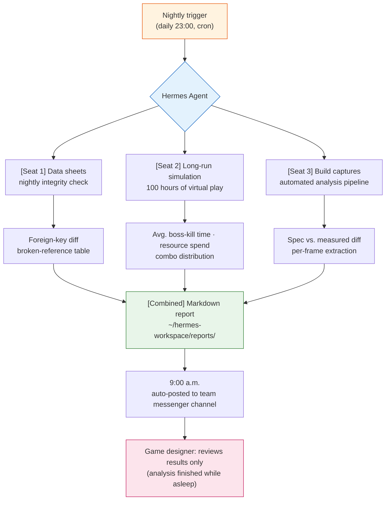

# Part 23 · Chapter 2. Adopting Hermes Agent

11:47 p.m. I saved the data sheets one last time and closed the laptop. At 9:10 the next morning, while the coffee brewed, I opened the team messenger and found a report sitting at the top of the channel. A markdown file that had cross-checked the three balance data sheets updated overnight against their foreign keys, with two broken references flagged in red. I did not write it. It was made while I slept.

This chapter is the record of the tool that produced that report — putting Hermes Agent on my personal PC and layering it on top of the Wrapper, Cascade, and Junction operations covered in §23.1. When I first brought it in, Hermes was Linux-based, so using it on Windows meant going through WSL2; in 2026 a native Windows build arrived and that detour disappeared. The conclusion first: the agent did not push Claude Code aside. It took the seat next to it.

---

## 23.2.1 Two Tools at the Same Desk

Everything up through §23.1 was centered on Claude Code. I typed one sentence, the tool responded once, I reviewed the response, then typed the next sentence. This short cycle is unbeatable for precision work. If fixing a single balance number is a task that needs confirmation at every step, then a human stepping in every time is exactly right.

The problem was long-running work. A request like "read all 30 of last month's meeting notes and extract just the decisions as atom candidates" takes 30 round trips if handled inside a conversation flow. For those 30 round trips, I can do nothing else. For this kind of work, the strength of a tool whose inputs and outputs sit close together becomes a weakness.

The agent fills the opposite seat. Throw it only a goal — "pull the decisions out of 30 meeting notes as atom candidates and write a report" — and it picks its own tools, walks the intermediate steps on its own, and brings back only the result when it is done. The cycle is long and autonomous. The trade-off that comes with it: a human cannot watch every step.

<svg viewBox="0 0 640 280" xmlns="http://www.w3.org/2000/svg" font-family="sans-serif" font-size="13">
  <rect x="0" y="0" width="640" height="280" fill="#fafafa" stroke="#ddd"/>
  <text x="320" y="28" text-anchor="middle" font-size="15" font-weight="bold">Work Cycles of the Two Tools</text>

  <!-- Claude Code lane -->
  <text x="20" y="70" font-weight="bold" fill="#1565c0">Claude Code</text>
  <text x="20" y="88" font-size="11" fill="#666">Precise · short · verified each step</text>
  <g fill="#bbdefb" stroke="#1565c0">
    <rect x="160" y="58" width="60" height="26"/>
    <rect x="260" y="58" width="60" height="26"/>
    <rect x="360" y="58" width="60" height="26"/>
    <rect x="460" y="58" width="60" height="26"/>
  </g>
  <g fill="#1565c0" font-size="10" text-anchor="middle">
    <text x="190" y="75">in→out</text>
    <text x="290" y="75">in→out</text>
    <text x="390" y="75">in→out</text>
    <text x="490" y="75">in→out</text>
  </g>
  <g stroke="#90caf9" stroke-width="2">
    <line x1="220" y1="71" x2="260" y2="71"/>
    <line x1="320" y1="71" x2="360" y2="71"/>
    <line x1="420" y1="71" x2="460" y2="71"/>
  </g>
  <text x="160" y="112" font-size="10" fill="#1565c0">↑ a human reviews at every arrow</text>

  <!-- divider -->
  <line x1="20" y1="140" x2="620" y2="140" stroke="#ddd" stroke-dasharray="4"/>

  <!-- Agent lane -->
  <text x="20" y="180" font-weight="bold" fill="#c62828">Hermes Agent</text>
  <text x="20" y="206" font-size="11" fill="#666">Long-running · autonomous · checkpoints only</text>
  <rect x="160" y="168" width="360" height="26" fill="#ffcdd2" stroke="#c62828"/>
  <text x="340" y="185" text-anchor="middle" font-size="10" fill="#c62828">1 goal in → (autonomous run: tool choice · loops · checks) → 1 result out</text>
  <g fill="#c62828">
    <circle cx="250" cy="168" r="4"/>
    <circle cx="340" cy="168" r="4"/>
    <circle cx="430" cy="168" r="4"/>
  </g>
  <text x="160" y="222" font-size="10" fill="#c62828">● checkpoints (where a human can review) — not every step</text>

  <text x="320" y="262" text-anchor="middle" font-size="12" fill="#555">Precise decisions on the top lane, long repetitive work on the bottom. Same desk.</text>
</svg>

An office analogy makes it easier. Claude Code is the desk mate who reads every sentence alongside me; the agent is the assistant who volunteers for the night shift and leaves a report on my desk before I arrive. Neither one fires the other. The two share the same desk.

---

## 23.2.2 Why Bring In Yet Another Tool

In §23.1 I built an operation that bundles the global slash command slots into 12 and hides the 48 actual commands behind them with Junction. The conclusion there was to build tools for the tools instead of adding more tools. Bringing in yet another new tool here sounds like a contradiction of that conclusion.

It is not. The 12-slot policy of §23.1 dealt with the cognitive load of "tools a human invokes directly." The seat Hermes wants to fill is the hours when no human is invoking anything — the hours I am asleep, in meetings, or with my hands tied up elsewhere. It does not compete with the 12 slots; it fills the hours the 12 slots cannot reach.

The basis for the adoption decision was one retrospective measurement. Running a month of data through `skill_audit_score`, which back-calculates global tool usage frequency from SVN commit logs, showed that most of the top tools were the kind used "while a human is awake, briefly, and often." Meanwhile, the tasks with low usage frequency but long runtimes once started — batch-classifying meeting notes, nightly data sheet integrity, build capture analysis — kept getting postponed with "I'll do it tomorrow morning." The reason for the postponement was clear. They eat up long stretches of waking hours.

This postponed group of tasks is the agent's exact target.

---

## 23.2.3 Installation — The Native Windows Build

When I first set up Hermes, it was Linux-based, so using it on a personal Windows PC meant installing WSL2 (Windows Subsystem for Linux 2) first and seating Hermes inside it. There is now a native Windows build, so that detour is no longer needed. Installation works like any ordinary Windows application — download the installer, run it, and set the initial workspace path and permission allowlist on first launch.

If you already use WSL2 or prefer a Linux environment, that build is still fully supported. But if you are starting fresh, native is simpler. The exact installer and version change quickly as the tool evolves, so follow the official docs.

One trap remains regardless of where you install. The Hermes workspace must live on a **fast local disk**. Wire a network drive or an SVN working folder directly in as the workspace, and a nightly integrity check that should take a few minutes stretches into tens of minutes. The standard practice is to keep data sheets outside the workspace and copy them in only when a task starts. If you use WSL2, for the same reason, keep the workspace inside the Linux filesystem and do not hop across Windows paths like `/mnt/c`.

---

## 23.2.4 Installing Hermes and the First Connection — A Worked Transcript

This is where the hands-on part begins. What you have the tool do after installation matters more than the installation itself, so I follow one first task all the way through — full prompt, raw output, human verification, re-request. For this task I picked the simplest of the postponed group from §23.2.2: the nightly data sheet integrity check.

> Note: some of the commands below are illustrative, shown to convey Hermes's surface shape. Installer URLs and subcommands change between versions — check the official docs. The structure of the workflow (goal → autonomous run → verification → re-request) holds even as the tool changes.

On native Windows, you fetch the official `install.ps1` in PowerShell and run it. But before executing the one-line `iex (irm ...)` one-liner as is, the safer path is to download the script (about 2,800 lines) once and skim it for dangerous patterns with your own eyes — that is the minimum procedure for trusting a source — then split off the key setup: install just the body first with `-SkipSetup` and run `hermes setup` separately. On WSL2 or Linux, follow the corresponding installation section of the official docs.

```powershell
# Native Windows — official install.ps1 (download and review first, then run)
irm https://hermes-agent.nousresearch.com/install.ps1 -OutFile install.ps1
# (after reviewing the contents of install.ps1)
.\install.ps1 -SkipSetup
# Pulls in Python 3.11 · Node · Git · Playwright · bundled skills along the way
# Install location: %LOCALAPPDATA%\hermes\  (registers the hermes command on PATH — picked up from a new terminal)
# When it finishes: hermes setup
```

The installer brings the dependencies (Python 3.11 · Node 22 · Git) along, installs the body into `%LOCALAPPDATA%\hermes\`, and registers the `hermes` command on PATH (recognized from a new terminal onward). Operational data — settings, logs, schedules (cron), checkpoints — also stays under the same `%LOCALAPPDATA%\hermes\` and survives reinstalls (here is the trap — `~/.hermes\` contains only helper scripts, which makes it easy to get confused. The actual `config.yaml` and `logs\` all live on the `%LOCALAPPDATA%\hermes\` side). Run `hermes setup` as the first launch and it asks for your model API key and sets the initial workspace path and permission allowlist.

```powershell
hermes --version
hermes setup
```

Now I hand it the first task. The goal you throw at an agent is one level more abstract than a Claude Code prompt. Less "do this, like this" and closer to "have this result ready." The exact goal I entered was the following.

**[Full Prompt]**

```
Goal: nightly data sheet integrity check.

Read the three xlsx files item_master·drop_table·npc_shop in ~/hermes-workspace/sheets/,
and check the foreign keys: do the item_id values referenced by drop_table·npc_shop
actually exist in item_master? Find every broken reference (rows pointing to an
item_id that doesn't exist) and save the result as a date-named markdown file in
reports/. (Intent: passes as counts only; failures as a table of sheet name · row
number · item_id)

Constraints:
- sheets/ is read-only. Never modify it.
- If you can't read a sheet, or a column name differs from what's expected, stop and
  report what was different. No guessing.
```

The last two lines matter. Agents are autonomous, and when they hit a wall they tend to want to fill the gap "on their own." If a column name differs, they pick a similar-looking one and push on. So I explicitly write in: "if you get stuck, stop and report — do not guess." This is the same lesson, in the same grain, that I learned building the data sheet verification Cascade in §23.1.

**[Hermes Raw Output — First Pass]**

Carried over verbatim, no summarizing. The first attempt did not end cleanly.

```
[hermes] goal accepted: nightly data sheet integrity check
[hermes] step 1/4  reading sheets...
         item_master.xlsx   loaded (4,210 rows)
         drop_table.xlsx    loaded (1,880 rows)
         npc_shop.xlsx      ERROR

[hermes] npc_shop.xlsx: expected column 'item_id', found columns:
         ['shop_id', 'sell_item', 'price', 'stock']
[hermes] this conflicts with the constraint: "if a column name differs from what's
         expected, stop and report".
[hermes] HALTING. reporting instead of guessing.

[hermes] partial result:
  - item_master ↔ drop_table check is feasible (item_id column present on both sides)
  - npc_shop: the item_id column is presumably 'sell_item', but unconfirmed — not run
[hermes] awaiting clarification on npc_shop column mapping.
```

This is the point where first-time agent users are most surprised. The tool stopped. And it stated exactly why it stopped. The item reference column in `npc_shop.xlsx` was not the `item_id` I expected but `sell_item`. Had I not written the constraint in, the agent would have decided on its own to treat `sell_item` as `item_id` and pushed on, and all I would have received in the morning is a report saying "all clear." The halt is the safety.

**[Human Verification and Rejection]**

Looking at the output, I made two judgments.

First, the part reporting that the item_master ↔ drop_table check was already feasible is trustworthy. Second, the `sell_item` guess for npc_shop is correct — it really is that sheet's sale-item column name. But the call not to proceed on a "guess" was the right one. So I did not accept the first output as is (rejection) and submitted a re-request with the column mapping made explicit.

**[Re-Request Prompt]**

```
Confirmed. Here is the explicit column mapping:
- The item reference column in npc_shop.xlsx is 'sell_item'. Treat it as item_id and run the check.
- All other constraints unchanged. Do not guess any additional columns beyond 'sell_item'.
Run again.
```

**[Hermes Raw Output — Second Pass]**

```
[hermes] resuming with column map: npc_shop.sell_item -> item_id
[hermes] step 2/4  foreign-key check...
         drop_table → item_master   : 1,880 refs, 2 broken
         npc_shop   → item_master   : 642 refs, 0 broken
[hermes] step 3/4  collecting broken refs...
[hermes] step 4/4  writing report...
         ~/hermes-workspace/reports/2026-05-25_sheet_integrity.md  written
[hermes] done. 2 broken references found. summary:
  | sheet      | row  | bad item_id |
  |------------|------|-------------|
  | drop_table | 417  | ITM_90412   |
  | drop_table | 1356 | ITM_90727   |
```

Two broken references were caught. Rows 417 and 1356 of `drop_table` were pointing at an `item_id` that did not exist in `item_master`. The red table I saw that morning was exactly this.

Nearly the whole message of this chapter shows up in this one round trip. The agent was autonomous yet stopped at the constraint, and once a human filled the spot where it stopped, it went all the way. Autonomy and control do not collide — they interlock. And if you schedule this entire cycle to run once more while you sleep, that becomes the nightly automation of §23.2.5.

---

## 23.2.5 Three Seats Added to the Game Design Workflow

Once the first task sits comfortably in your hands, you move the postponed tasks to the night shift one by one. I actually added three seats. What the three have in common is plain — every one of them turns hours when no human needs to be awake into working hours.



**Seat 1 — nightly data sheet integrity.** The task we followed end to end in 2.4, scheduled for 23:00 every night. Whoever touched whichever sheet overnight, by morning the broken foreign keys are sitting there as a table. On the surface this resembles what the `/check` Cascade of §23.1 did (the four-in-one bundle of doc-audit → data-qa → integrity → link-check), but there is one decisive difference. `/check` only runs when I am awake to invoke it. The nightly agent runs without me. The two do not compete — the daytime Cascade is immediate verification, the nighttime agent is unattended verification, and the roles split there.

**Seat 2 — long-run simulation.** The combat simulation from §4.4, stretched deep along the time axis. Run 100 hours of virtual play and measure average boss-kill time, resource consumption curves, and combo distribution. This fundamentally does not fit the Claude Code conversation flow — one run takes hours, and you cannot hold the chat window hostage for that long. The agent runs it in the background and brings back only the curve charts and summary numbers when it finishes.

**Seat 3 — automated build capture analysis.** When a build video captured by QA lands in the folder, the agent extracts data frame by frame and produces a diff between the spec numbers and the measured numbers. The designer does not need to watch the video end to end — just diff lines like "spec says damage 120, build measures 108." The entire tedious part of the analysis belongs to the agent.

In all three seats, the time spent by the person reading the results does not shrink. What shrinks is the human time spent on analysis. The judgment still belongs to the human.

---

## 23.2.6 The Price of Autonomy — Five Safeguards

The agent's autonomy is, in equal measure, risk. A tool that reads files and runs commands without a human confirming each step means that when things go wrong, the human is not there. It is no accident that "no guessing" was written explicitly into §23.2.4. The five safeguards are not optional — they are a bundle that must be switched on together on day one.

| Safeguard | What It Does (Actual Hermes Config Keys) | What Happens Without It |
|---|---|---|
| Permission allowlist | Destructive commands go through human approval (`approvals.mode: manual`), only allowlisted commands run free (`command_allowlist`), secrets are redacted from logs (`security.redact_secrets`) | The agent autonomously modifies the original data sheets |
| Checkpoints | Snapshots before file operations so you can roll back (`checkpoints.enabled`, restore with `/rollback`) | A wrong assumption rolls all the way through and contaminates the entire result |
| Automatic logging | Writes gateway, agent, and error logs to `%LOCALAPPDATA%\hermes\logs\` | After an incident, no way to trace why it happened |
| Cost limits | Per-task turn cap (`agent.max_turns`), terminal timeout (`terminal.timeout`), infinite-loop auto-detection (`tool_loop_guardrails`), automatic context compression (`compression`) | A task stuck in an infinite loop inflates the API bill |
| Disposability | Stop anytime (`/stop`), pause/delete schedules (cron pause), sub-task timeouts (`delegation.child_timeout_seconds`), auto-archive of unused skills (`curator`) | A nightly task that starts running wrong cannot be stopped |

These five are not independent devices; they work as one bundle. Lock down permissions but skip the cost limit, and an infinite loop spins inside the permitted zone while the bill grows. Turn on logs but have no disposal path, and you watch the incident happen without being able to stop it. Drop any single one and the incident probability of unattended nightly operation jumps.

Actually turning the tool on, I found several places where it implements these five concepts one notch more finely than the book sketched them. On the permission side there is an extra layer, a dedicated policy engine (`security.tirith_enabled`), that filters commands by rule. On the cost side, infinite-loop detection is not a single cap but separate thresholds for signals like "same failure repeating" and "repetition with no progress." And unattended nightly scheduling (cron) has its own switch (`approvals.cron_mode: deny`): when a destructive command comes up during hours when no human is present, it is denied outright instead of waiting for approval — effectively the book's "permissions + checkpoints" folded into one setting. On the disposal side, `curator` is where §21's "retire the tools you don't use" ships as an actual feature. Keep the skeleton of the five-piece bundle as is, and where the tool is more refined, just turn those keys on.

Entering this bundle into `config.yaml` looks roughly like this.

```yaml
# %LOCALAPPDATA%\hermes\config.yaml (excerpt)
approvals:
  mode: manual              # ① Permissions — destructive commands need human approval
  command_allowlist:        #    list only the commands allowed without approval
    - "python *"
    - "rg *"
  cron_mode: deny           #    unattended nightly cron auto-denies destructive commands
security:
  redact_secrets: true      #    redact secrets from logs
  tirith_enabled: true      #    one more layer: policy engine (rule-based command filter)
checkpoints:
  enabled: true             # ② Checkpoints — snapshot before file ops (/rollback to restore)
  max_snapshots: 20
  retention: 7d
logs:
  path: "%LOCALAPPDATA%\\hermes\\logs"   # ③ Logs — gateway/agent/errors
agent:
  max_turns: 60             # ④ Cost — turn cap per task
terminal:
  timeout: 180              #    terminal command timeout (seconds)
tool_loop_guardrails:       #    infinite-loop auto-detection (same failure · no progress)
  enabled: true
compression:
  enabled: true             #    automatic context compression (token savings)
delegation:
  child_timeout_seconds: 600  # ⑤ Disposal — sub-task timeout (alongside /stop · cron pause)
curator:
  enabled: true             #    auto-archive unused skills
```

Delegation is not handed over all at once either. At first, entrust only the narrowest, most easily reversible tasks (read-only work like the integrity check), watch the results for a few days, then widen to the next seat. Choosing the nightly integrity check as the first task in §23.2.4 was for the same reason — it only reads, so the worst case is a single wrong report, and the originals are untouched.

---

## 23.2.7 Adoption Progress and Incremental Stages (as of June 2026)

As of this chapter's revision, adoption has entered the settling-in phase. The native Windows build (v0.16.0) is installed, and model API key registration via `hermes setup` is done. I brought the first seat online and checked the five safeguards one by one against their actual config keys, and I am now running real autonomous tasks to get them into muscle memory. To be honest about it: I am validating on my personal PC first, not the company PC — company adoption is deferred until the safeguards are thoroughly worn in at home. This is less caution than the PC separation principle. You do not unleash an unvalidated autonomous tool on team data.

| Period | Activity | Gate |
|---|---|---|
| Month 1 | Install Hermes (native Windows v0.16.0) + `hermes setup` + first task | Are all five safeguards on? |
| Months 2–3 | Expand to two or three seats (meeting-note classification, build capture analysis) | Log check at each widening of delegation |
| Months 3–6 | Company review — decide based on personal-PC validation results | Zero unattended-operation incidents confirmed |
| Months 6–12 | Team-level adoption | Safeguards settled in as team rules |

The temptation to skip stages is the most dangerous part. Jump straight from month 1 to month 6 (team adoption), and the safeguards get released while they are still one person's habit, not yet learned as team rules. The answer is to stop once at the end of each stage and check the five safeguards. Going in a way that stays reversible matters more than going fast.

---

## 23.2.8 Five Common Misconceptions

"The agent replaces the human" is the most common misconception. The worked transcript in §23.2.4 shows the opposite — the agent stopped at a single column mapping, and a human filled in that judgment. The core decisions of game design still belong to the human; what the agent takes is the tedious part of repetition and analysis.

The expectation that "one install and everything is automatic" is dangerous too. The first month or two actually demand more of your hands, not less. Column-name mappings, permission scopes, and cost limits have to be tuned per task, and until that tuning settles, a human reviews every output.

The verdict that "Claude Code is now obsolete" is wrong. The two occupy different hours. Daytime precision decisions go to Claude Code; nighttime unattended repetition goes to the agent. The `/check` Cascade of §23.1 did not disappear — a night lane was added beside it.

The notion that "it's open source, so it's free" is half right. The body may be free, but model API call costs accrue all the same. That is why the cost limits in `config.yaml` — `agent.max_turns`, `compression`, and the like — are both a safeguard and a household ledger.

Finally, the expectation that "the agent will handle even the complex, risky work" is the most dangerous of all. The higher the risk of a task, the more firmly it stays under human control. What you hand to the agent starts with the simple and the easily reversible. Delegation widens only as far as trust has accumulated.

---

## 23.2.9 Into the Next Chapter

If the Wrapper, Cascade, and Junction of §23.1 are the summit of Claude Code operations, this chapter's Hermes lays one more lane — a night lane — on top of that operation. The picture of a daytime tool and a nighttime tool sharing the same desk: that is both the present as of 2026 and the skeleton of the near future.

The next chapter is tool curation for game designers. What goes into the 12 slots, what gets culled by `skill_audit_score` — the curation criteria this chapter only brushed past get unpacked into concrete tool recommendations.

---

### Key Takeaways
- The agent does not replace Claude Code; it fills the hours Claude Code could not reach
- The five safeguards (permissions, checkpoints, logs, cost, disposability) must be switched on as one bundle
- Delegate narrow, read-only tasks first, and widen only as far as trust has accumulated

### Next Chapter Preview
- Part 23 · Chapter 3. Tool Curation for Game Designers

---

## Try It Yourself

**setup**
1. Download and install the Hermes native Windows installer (if you prefer Linux, the path of `wsl --install` followed by installing inside it is still there).
2. Create a working folder on a fast local disk and copy the data sheets you want to check into it (do not wire a network drive or an SVN working folder directly in as the workspace).
3. `hermes setup` → enter your model API key → confirm the workspace path and initial permission values.
4. Turn on the five safeguards in `%LOCALAPPDATA%\hermes\config.yaml`: permission approval (`approvals.mode: manual` · `command_allowlist` · `cron_mode: deny`), cost limits (`agent.max_turns` · `terminal.timeout` · `tool_loop_guardrails`), checkpoints (`checkpoints.enabled`), the log path (`logs.path`), and learn the stop procedures (`/stop` · `/rollback`).

**prompt**
- Throw the goal one level more abstract: not "do this for me" but "have this result ready."
- Spell out the target, the work, and the save location as numbered items, and always end with one line: "If you get stuck, or a column/format differs from what's expected, stop and report. No guessing."
- Pick something easily reversible for the first task, like a read-only integrity check.

**verify**
- Do not trust the first output as is; check the spot where the agent stopped (column mapping, format mismatch) yourself.
- If the halt was right, re-request with the mapping made explicit; if it was wrong, restate the constraints.
- Cross-check one or two failure entries in the generated report against the original sheet to confirm the agent's judgment, and only then move it to the nightly schedule (cron 23:00).

## Solo Scale-Down

If you want to get a feel for the agent before installing Hermes, you can run a scaled-down version inside Claude Code using background execution.

- Prepare one data sheet to check, plus one paragraph: "pull the rows with broken foreign keys into a table / if a column name differs, stop and report / save the result in a reports folder."
- Kick it off once as a background task and do other work in the meantime. When it finishes, review only the result.
- The point is the cycle, not the tool — throw the goal, trust the halt, fill the spot where it halted, review only the result. Once this four-beat rhythm is in your hands, you will move to the full Hermes with the same rhythm.
