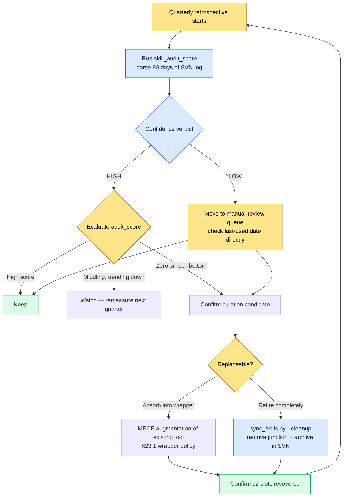

# Part 23 · Chapter 3. Tool Curation — Cutting Unused Tools with Data

During a quarterly retrospective, I opened my global skills folder. Counting line by line, there were 19 wrappers. I had clearly decided to run with 12, and had run it that way for a year — yet somewhere along the way seven more had attached themselves. What made it more absurd: for half of them, I couldn't tell from the name alone what the tool even did. `migrate-legacy-enum`. What was this again? When did I last use it?

I couldn't remember. And as long as I rely on memory, that question can never be answered. So I decided to look at logs instead of memory. Tool curation should not be cutting by taste — it should be cutting by a number: "how many times did I call this tool last quarter?"

This chapter is a record of how I pull that number out automatically, how I use it to cut tools, and how I keep tools from proliferating in the first place.

---

## 23.3.1 Tools Multiplying Is a Natural Phenomenon

Before talking about curation, one thing has to be acknowledged: unless you stop them, tools will multiply. It is not weak willpower. On every task, making one small script "just to handle this one quickly" is the rational choice. Stack that rational choice up a few dozen times and you get an irrational pile.

The structure I run on Project A is 12 global wrappers pointing, via junctions, to the 48 actual tool bodies in the workspace. The global side stays light; the heavy bodies live in the SVN-managed workspace. The structure itself was covered in §23.1. The problem is that this number 12 refuses to sit still.

Look at what grows alongside each new tool, and it becomes clear why this has to be stopped.

<svg viewBox="0 0 640 250" xmlns="http://www.w3.org/2000/svg" font-family="sans-serif" font-size="13">
  <rect x="0" y="0" width="640" height="250" fill="#fbfbfb"/>
  <text x="20" y="28" font-size="15" font-weight="bold" fill="#222">Adding 1 tool → 4 costs that grow with it</text>
  <!-- center node -->
  <rect x="270" y="100" width="100" height="46" rx="8" fill="#2b6cb0"/>
  <text x="320" y="128" fill="#fff" text-anchor="middle" font-weight="bold">New tool +1</text>
  <!-- four cost nodes -->
  <rect x="40" y="55" width="160" height="40" rx="6" fill="#fff" stroke="#c53030"/>
  <text x="120" y="80" text-anchor="middle" fill="#c53030">Context token usage ↑</text>
  <rect x="440" y="55" width="160" height="40" rx="6" fill="#fff" stroke="#c53030"/>
  <text x="520" y="80" text-anchor="middle" fill="#c53030">Choice fatigue ↑</text>
  <rect x="40" y="155" width="160" height="40" rx="6" fill="#fff" stroke="#c53030"/>
  <text x="120" y="180" text-anchor="middle" fill="#c53030">Maintenance surface ↑</text>
  <rect x="440" y="155" width="160" height="40" rx="6" fill="#fff" stroke="#c53030"/>
  <text x="520" y="180" text-anchor="middle" fill="#c53030">Feature overlap risk ↑</text>
  <!-- lines -->
  <line x1="270" y1="115" x2="200" y2="75" stroke="#a0a0a0"/>
  <line x1="370" y1="115" x2="440" y2="75" stroke="#a0a0a0"/>
  <line x1="270" y1="131" x2="200" y2="175" stroke="#a0a0a0"/>
  <line x1="370" y1="131" x2="440" y2="175" stroke="#a0a0a0"/>
  <text x="320" y="232" text-anchor="middle" fill="#555" font-size="12">The tool is +1, but the cost is +4. This is why curation is a subtraction job.</text>
</svg>

The first cost in particular — context token usage — has become a sharper cost in the era of AI tools. As global wrappers multiply, so do the tokens the AI spends every session reading "the list of tools I can use." Reading the descriptions of 19 tools eats into the context that should go to the actual work. That is why Project A's `sync_skills.py` has a `--cleanup` option that automatically clears out wrappers whose junctions are broken or whose bodies have disappeared. It is closer to hygiene work for protecting the token budget.

But `--cleanup` only catches "broken" tools. A tool that is perfectly alive but that nobody uses slips through. To catch those, you need usage-frequency data.

---

## 23.3.2 skill_audit_score — Measuring Usage Frequency from SVN Logs

The core idea is simple. Every skill and tool in the workspace lives in SVN. And every time a tool is used, the artifacts it produces (sheets, documents, relation-map HTML, and so on) get committed to SVN. In other words, **the SVN log carries the traces of which tools actually did work.**

So I built a small measurement script called `skill_audit_score`. As the name says, it assigns each skill an "audit score." When I built it, I didn't write all the code from scratch — I explained the measurement logic to the AI and got a draft. I'm leaving that worked transcript as is: not summarized, and including the part where it stepped wrong.

### The Prompt (in Full)

> My global skill wrappers are fixed at 12, but they have swollen to 19 at some point. For the quarterly retrospective I want to pick out the "unused tools" with data. Build a measurement script on the following assumptions.
>
> - Each skill tool exists as a subfolder inside the workspace folder (e.g., `tools/relation-map-gen/`).
> - The artifacts these tools produce are committed to SVN. Commit messages usually contain the tool name or the artifact type (e.g., "relation-map regen", "schema-doc update").
> - I want to parse the SVN log and count, for the last 90 days, the number of commits each tool was involved in.
> - A raw commit count is not enough. Combine two things into a 0–100 audit_score: (a) weight recent commits higher, (b) penalize tools whose last use is long past.
> - Output is a table in descending score order. Low-scoring tools are the "curation candidates."
> - Assume the SVN command comes in as `svn log --xml -l 2000`. Use only the Python standard library. Take absolute paths as arguments.

### Claude's Raw Output (Verbatim)

> Sounds good. One thing to flag before we proceed, though. **There is no guarantee that commit messages always contain the tool name.** When people write commit messages freely, a message like "edited sheets" tells us nothing about which tool was involved. So I will run two kinds of matching in parallel.
>
> 1. Keyword matching on tool names and aliases in the commit message (loose)
> 2. Matching whether a changed **file path** falls inside that tool's folder or matches the tool's artifact pattern (e.g., `*_relation.html`) (strict)
>
> Since #2 is more trustworthy, I'll give it a higher weight. Here is the draft.

```python
# skill_audit_score.py  (Claude draft — pre-verification)
import subprocess, sys, datetime, xml.etree.ElementTree as ET
from collections import defaultdict

def svn_log_xml(repo_path, limit=2000):
    out = subprocess.run(
        ["svn", "log", "--xml", "-v", "-l", str(limit), repo_path],
        capture_output=True, text=True, check=True)
    return ET.fromstring(out.stdout)

def score_skills(repo_path, skills, window_days=90):
    root = svn_log_xml(repo_path)
    now = datetime.datetime.now(datetime.timezone.utc)
    hits = defaultdict(list)   # skill -> [days_ago, ...]
    for entry in root.findall("logentry"):
        date = datetime.datetime.fromisoformat(
            entry.find("date").text.replace("Z", "+00:00"))
        days_ago = (now - date).days
        if days_ago > window_days:
            continue
        msg = (entry.find("msg").text or "").lower()
        paths = [p.text for p in entry.findall("paths/path")]
        for sk in skills:
            name = sk["name"].lower()
            in_msg = name in msg or any(a in msg for a in sk.get("alias", []))
            in_path = any(name in (pp or "").lower() for pp in paths) \
                      or any(pat in (pp or "") for pp in paths
                             for pat in sk.get("artifact", []))
            if in_path:
                hits[sk["name"]].append((days_ago, 2.0))   # strict match, weighted
            elif in_msg:
                hits[sk["name"]].append((days_ago, 1.0))   # loose match

    rows = []
    for sk in skills:
        h = hits[sk["name"]]
        if not h:
            rows.append((sk["name"], 0, None, len(h)))
            continue
        # recency weight: 1.0 when recent, down to 0.1 at 90 days out
        recency = sum(w * (1 - 0.9 * (d / window_days)) for d, w in h)
        last_used = min(d for d, _ in h)
        # last-used penalty
        stale_penalty = max(0, (last_used - 14)) * 0.5
        score = max(0, min(100, recency * 8 - stale_penalty))
        rows.append((sk["name"], round(score, 1), last_used, len(h)))

    rows.sort(key=lambda r: r[1])   # ascending score = candidates first
    return rows

if __name__ == "__main__":
    REPO = sys.argv[1]
    SKILLS = [
        {"name": "relation-map-gen", "alias": ["relation", "관계도"],
         "artifact": ["_relation.html"]},
        {"name": "schema-doc", "alias": ["schema", "명세서"],
         "artifact": ["_schema.md"]},
        {"name": "gdd-gen", "alias": ["gdd"], "artifact": ["_gdd.md"]},
        {"name": "table-creator", "alias": ["table", "테이블"], "artifact": []},
        {"name": "excel-reader", "alias": ["xlsm", "vba"], "artifact": []},
        {"name": "migrate-legacy-enum", "alias": ["enum", "migrate"],
         "artifact": []},
    ]
    print(f"{'skill':22}{'score':>7}{'last_used(d)':>14}{'hits':>6}")
    for name, score, last, hits_n in score_skills(REPO, SKILLS):
        print(f"{name:22}{score:>7}{str(last):>14}{hits_n:>6}")
```

### Human Verification — What I Ran and Rejected

I ran the script against my actual SVN working copy. The first output looked wrong. `table-creator` and `excel-reader` both had empty `artifact` patterns, so they were only caught when the words "table" / "xlsm" happened to appear in a commit message. But these two tools produce plain `.xlsm` files as their artifacts, which no pattern can distinguish. As a result, both came out with abnormally low scores — even though they are tools I use every day.

This is where I made an important call. **A low score must not mean an automatic cut.** A human has to separate whether the score is low because the tool genuinely goes unused, or because the measurement fails to catch it. The numbers the AI produces only narrow the candidates; the final decision belongs to a human.

So I went back to the AI.

### The Follow-Up Prompt

> Tools with an empty artifact pattern have scores we can't trust, so add a `confidence` column to the output. Mark tools that never had a single artifact match as `confidence=LOW` and exclude them from the automatic curation candidates. Group the LOW tools separately under "unmeasurable — manual review."

This follow-up split the output into two buckets: tools that can be cut on a trustworthy score, and tools whose measurement is too weak and that a human has to inspect directly. The shape of the actual run came out roughly like this (scores are real measurements from my working copy; some tool names are anonymized).

| skill | audit_score | last_used (days ago) | confidence | Verdict |
|---|---|---|---|---|
| relation-map-gen | 71.4 | 2 | HIGH | Keep |
| schema-doc | 58.9 | 5 | HIGH | Keep |
| gdd-gen | 22.1 | 31 | HIGH | Watch |
| migrate-legacy-enum | 0.0 | not measured | HIGH | **Curation candidate** |
| table-creator | 4.2 | 1 | LOW | Manual review → keep |
| excel-reader | 6.0 | 1 | LOW | Manual review → keep |

`migrate-legacy-enum` scored 0 with HIGH confidence. That means in 90 days, neither the tool's folder nor its artifacts appeared in a single commit. Digging through my memory: it was a job that should have stayed one-off — migrating a legacy enum once last year, done — that I had codified into a skill. This is exactly the tool to cut. Conversely, `table-creator` and `excel-reader` scored low but with LOW confidence, and their last use was one day earlier. The measurement simply couldn't see them; in reality they are used daily. They must not be cut.

> Note: the scoring formula in the table above (recency weight × 8, stale penalty) is a set of values I tuned to my own working copy. With different SVN commit habits and artifact patterns, the coefficients change too. The essence of this tool is not the absolute score but the "relative ranking among tools" and the "confidence split."

---

## 23.3.3 The Curation Cycle — From Measurement to Retirement

`skill_audit_score` is only a measurement tool. Tools actually get cleaned up only when the measurements are slotted into the quarterly retrospective and run through a full cycle. That cycle is the following.



What matters is distinguishing the cycle's two exits. A tool that scores 0 does not get deleted unconditionally. If the work itself has disappeared, it goes to full retirement (`--cleanup`); if the work is still needed but not often enough to justify a separate tool, it gets absorbed into an existing tool. The latter is the MECE augmentation of §23.3.4.

Even on retirement, the code remains in SVN history. Only the junction and the global exposure are withdrawn — the code itself is not erased forever. If that job comes back six months later, you restore it from SVN. It is this "reversible" safety net that lets a human cut boldly.

---

## 23.3.4 Curbing MECE Sprawl — Ask Before You Build

Better than measuring and cutting is not building in the first place. If `skill_audit_score` is after-the-fact cleanup, the MECE wrapper policy is up-front restraint.

MECE stands for Mutually Exclusive, Collectively Exhaustive — no overlaps, no gaps. Every time I want to build a new tool, I throw those four letters at it. **Does the new tool overlap an existing tool (an ME violation)? Or does it genuinely fill an empty area (a CE contribution)?** Project A's wrapper policy forks two ways from here.

| Situation | Policy | Result |
|---|---|---|
| The new job overlaps an existing tool's area | **Augment the existing tool first** | Add the feature to the existing wrapper's body; no new slot used |
| The new job is clearly a different area | **Allow a new wrapper** | Assign one of the 12 slots to the new tool (paired with a candidate to remove) |

The key is that the default is augmentation. Building a new tool is the exception. To justify that exception, you have to prove that "no existing tool can do this job." This one default is the real reason the tools that had swollen to 19 came back down to 12.

This also connects to the cascade in §23.1. A cascade like check is the result of bundling what used to be four separate checking tools into a single call. Instead of keeping four separate wrappers, the MECE view said "this is all one area called checking" and absorbed them into one. The tool count went down; the functionality stayed the same. That is the model case for augmentation.

The AI assistant is both the hazard and the remedy here. It is a hazard because asking the AI to "make me a script that handles this" produces a new tool far too easily. In an environment where one click births one tool, without MECE discipline a tool graveyard forms in no time. It is a remedy because if you hand the AI the policy first, the AI will itself suggest "this would be better as an option added to the existing `relation-map-gen`." The AI that builds your tools must be handed the curation discipline along with them.

---

## 23.3.5 How Not to Be Fooled by the Score — Limits of Measurement

What I learned most while running this chapter's tool is that you must not put blind faith in the measurements. `skill_audit_score` looks at exactly one signal: the SVN log. So there are things it structurally misses.

- **It cannot catch read-only tools.** A tool like `excel-reader` that only reads sheets and produces no artifacts leaves no commits. That is why the mechanism that drops its confidence to LOW and routes it to manual review was essential.
- **It undervalues low-frequency, high-value tools.** There are tools used twice a year that save half a day every time they run. By frequency alone they are curation candidates; by value they are keepers. That is why the final verdict in the cycle always belongs to a human.
- **It is swayed by commit habits.** Someone who crams a batch of work into one commit and someone who splits it finely will get different scores. So read it not as an absolute score but as a relative ranking among one person's own tools.

In short, this tool is not a "deciding tool" but a "candidate-narrowing tool." It looks across all 19 at a glance and tells you, in one second, which ones to suspect. Verifying that suspicion and making the cut stays the human's job. Measurement does not replace the human — it only points at where the human should look.

---

## Try It Yourself — One Cycle of skill_audit_score

This is the procedure for turning the tool curation cycle through one full lap yourself.

**setup**
1. Confirm that your workspace's skills and tools are under version control (SVN/Git). Their artifacts must be getting committed to the same repository.
2. Make a list of the tools to measure. For each tool, record `name`, `alias` (aliases that appear in commit messages), and `artifact` (artifact file patterns, if any). Leave artifact empty for read-only tools that have none.

**prompt** (to the AI)
> Build a tool-usage-frequency measurement script on the following assumptions. (1) Each tool leaves traces in the [version control system] log as artifact commits. (2) Parse the last 90 days of the log and count the commits each tool was involved in. (3) Produce a 0–100 score from recency weighting plus a last-used-date penalty. (4) Mark tools with zero artifact-pattern (artifact) matches as confidence=LOW, exclude them from the automatic candidates, and split them out for manual review. (5) Output is a table in ascending score order — low scores are the curation candidates. Use only the standard library; take the repository path as an argument.

**verify**
1. If a tool you use every day lands at the top of the table (low score), the measurement is wrong. Check that tool's confidence — LOW is normal (unmeasurable); if it is HIGH yet scoring low, inspect the alias and artifact settings.
2. Confirm only tools with score 0 + confidence HIGH as curation candidates. Cross-check the last-used date against your memory, and let a human judge whether the tool is truly dead.
3. Send each candidate down one of two paths: "full retirement" or "absorption into an existing tool." Retirement withdraws only the junction; the code stays in the repository.
4. Finally, count whether your 12 slots (or whatever cap you set) have been recovered.

### Solo Scale-Down

If you are a solo developer with only 6–8 tools and no SVN, scale it down like this. Git is plenty for version control. Pull the changed file paths with `git log --since="90 days ago" --name-only`, grep once for your tool folder names, and out comes "which tools worked recently." You don't even need to build the scoring script. The point is not numeric precision — it is the single habit of **looking at logs instead of memory**. Once a quarter, pull "the tools untouched in the last 90 days" from the git log and stare them down. Those five minutes prevent the tool graveyard.

---

### Key Takeaways
- Tools multiply unless you stop them, and curation is the work of subtracting, not adding.
- skill_audit_score measures usage frequency from the SVN log and points at the candidates to cut.
- Measurement only narrows the candidates; whether to cut is decided by a human reading the confidence.

### Next Chapter Preview
- Part 23 · Chapter 4. The Puzzle Game I Built Alone — a field report on applying the same tool and retrospective discipline to solo game development (Critter Sort).
