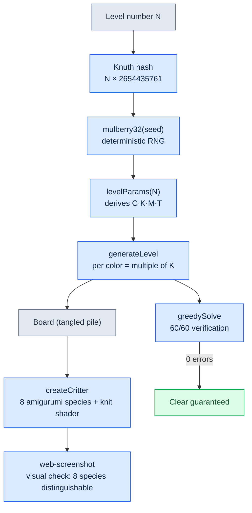

# Part 23 · Chapter 4. The Puzzle Game I Built Alone — A Critter Sort Field Report

One Saturday afternoon, my wife was playing a color-matching puzzle on her phone. It was a game called *Yarn Fever*, where you sort tangled skeins of yarn into baskets of the same color. Every time a round ended she would say, "Same thing again," and close it. With nothing new coming, she got bored fast.

The thought that hit me at that moment was simple. That loop has proven addictiveness, and the mechanic itself is not subject to copyright. Swap in an animal theme, stamp out levels procedurally without end, and the "same thing again" problem disappears. Build it alone, as HTML 3D that runs right in the browser, and my wife doesn't even need to install anything on her phone.

The problem is that I am not a graphics engineer. Twenty-four years as a game designer, but I had never written a shader with Three.js. So this chapter is the actual record of getting one game running in a few days, alone, with AI. It is also a record of separation: I used the same tools as my company MMORPG (Project A hereafter) while mixing in not a single line of its domain content.

The actual game lives in the `critter-sort/` repository, and git tags v0.1–v0.3 preserve three days of decisions. This is not a polished-up case study; I quote that repository as is.

---

## 23.4.1 Reverse Engineering by Prompt — And Losing the Signature

The first thing I did was break the original down into words and throw it at the AI. The first prompt went like this.

> **Prompt (v0.1 kickoff):**
> "I want to adapt the core loop of a casual puzzle called Yarn Fever to an animal theme, built with Three.js + Vite. The loop goes like this: you sort tangled color-clumps into bins of the same color, and if you overflow the temporary slots, it's game over. Let's make animals the things being sorted — tap a tangled pile of animals and they go to a nest of the same color. Write the logic as a pure JS state machine independent of Three.js so it can be tested headless. Also add procedural infinite levels (seed-based)."

The AI followed faithfully. It split the folder structure into `game/` (pure logic) and `render/` (Three.js), wrote `state.js`, `rules.js`, and `generator.js` first, then put the board on screen with colored-box placeholders. v0.1 was running not in days but in a single session.

But the moment I played it myself to show my wife, something felt off. It had become a generic match puzzle where animals hop across the screen into baskets. The feel of the original was gone. *Yarn Fever*'s identity was not "sorting" — it was **the tactile sensation of untangling skeins by hand** and **the act of rotating the screen to check colors hidden from view**. In my prompt I had flattened that into a generic sort — "tap an animal and it goes to a nest" — and the AI had simply been faithful to the definition I gave it.

This is the first trap of reverse engineering. Summarize the original and the signature evaporates, because a summary preserves the surface, not the essence.

Let me make one thing clear here. The AI did not give a wrong answer. My prompt was wrong. So the next cycle was not a code fix but **a correction of the definition**.

---

## 23.4.2 The Spine — The Correction Cycles That Revived Rotation and Unraveling

Right after seeing v0.1, I respecified the core in two passes. The first correction targeted the action; the second targeted the feel.

> **Prompt (correction 1 — the action):**
> "This has turned into a plain match puzzle. Yarn Fever's identity is 'rotating the 3D view to check hidden colors and deciding the order to unravel.' Don't scatter the board flat — pile it into a tall mound in the center so you have to rotate to see the colors hidden behind. Add rotation with OrbitControls. But rotation and tap are going to conflict — how will you separate them?"

> **Claude's output (raw, no summarizing):**
> "You're right. The rotation gesture and the tap are the same pointer events, so they conflict. I propose splitting them by distance and time thresholds. Record the coordinates and timestamp on `pointerdown`; on `pointerup`, if the travel distance exceeds 9px or the press duration exceeds 400ms, treat it as a rotation gesture and ignore the tap. Only below that do we pick an animal with the raycaster and call `state.tap()`. I'll clamp OrbitControls' azimuth to about ±54° so the pile doesn't drift off screen. One caveat: 9px may be too sensitive on mobile, so it needs checking on a real device."

That 9px/400ms threshold still lives in `src/main.js` today. No-frills code you can verify directly.

```javascript
// src/main.js — drag = rotate (OrbitControls) / short tap = unravel yarn
canvas.addEventListener('pointerup', (ev) => {
  if (!down || state.status !== 'playing') { down = null; return }
  const dist = Math.hypot(ev.clientX - down.x, ev.clientY - down.y)
  const dt = performance.now() - down.t
  down = null
  if (dist > 9 || dt > 400) return // treated as a rotation gesture
  const rect = canvas.getBoundingClientRect()
  const x = ((ev.clientX - rect.left) / rect.width) * 2 - 1
  const y = -((ev.clientY - rect.top) / rect.height) * 2 + 1
  const id = view.pick(x, y, camera)
  if (id !== null) state.tap(id)
})
```

The action was back. But on a second playthrough it still didn't feel like "unraveling a skein." Animals simply moved to nests; there was no tactile sense of something coming undone. Second correction.

> **Prompt (correction 2 — the feel):**
> "The rotation is better. But there's still no feeling of 'unraveling yarn.' On tap, I want the tangled strands wound around the animal's body to come undone and disappear, and that yarn to wind its way into the basket. For the animal look, not sleek GLB birds — chubby knitted plushies (amigurumi). Cozy details like sleepy eyes and blushed cheeks. If external assets don't fit, drop them and generate procedurally."

> **Claude's output (raw):**
> "I'll implement this as two separate pieces. (1) Tangled yarn: wrap two strands of slightly darkened same-color `TorusGeometry` around each animal's body, and on tap shrink their scale to 0.01 so they unravel and vanish. (2) Yarn wind-up: draw the yarn along the animal-to-basket path with `TubeGeometry` and tween it winding into the basket. The plushie look goes procedural — I'll procedurally generate a knit bump texture on `MeshStandardMaterial` for the knit feel, flat boxes for the sleepy eyes, translucent pink spheres for the cheek blush. The existing GLB starters (three birds) clash with the knit tone, so I'll remove them but keep the animal-pack load pipeline alive as a fallback. One thing to flag: procedural animals can't match GLB for species variety — it's safer to validate with one species first and then add more."

That final warning ("can't match GLB for species variety" — GLB is glTF Binary, the off-the-shelf 3D model file format you download and use) was the seed that led straight to v0.3. The AI named the next limitation first, and I took it as the next milestone.

Verification was two-stage every time: headless, to confirm the logic hadn't broken (0 errors), then hands-on in the browser, rotating and tapping to check the feel. The v0.2 commit message pins that verification down: "headless verification: rotation, yarn unraveling, auto-clear all normal, 0 errors."

The two tangled strands remain in `src/render/pieces.js` like this.

```javascript
// src/render/pieces.js — two loose yarn strands wrapped around the body (same color, slightly darkened)
const strandMat = new THREE.MeshStandardMaterial({ color: darken(hex, 0.7), roughness: 1 })
const strands = []
const orient = [[0.5, 0.2, 0.0], [1.25, 0.0, 0.6]]
for (let i = 0; i < 2; i++) {
  const s = addMesh(g, G.torus, strandMat, [0, byo + 0.02, 0], Math.max(bx, bz) + 0.02, orient[i])
  strands.push(s)
}
g.userData.strands = strands  // on tap, view.js unravels these strands and fades them out
```

The lessons from this, one line each:

- Reverse engineering kills the signature if you summarize.
- When the definition is wrong, fix the definition, not the code.
- The next limitation the AI names is your next milestone.

---

## 23.4.3 Three Days of Decision History — Reading the Corrections Through Git Tags

In words it's just "I fixed it twice," but the git history recorded when and in what form each correction landed, with exact timestamps. In solo development this stands in for a retrospective. Even with no teammates, the commits testify to "why it ended up this way."

| Commit | Time (2026-05-30) | What Changed | Signature Status |
|---|---|---|---|
| `2b2e3bc` v0.1 | 14:43 | Yarn Fever reverse engineering, pure logic + placeholders, 60/60 solver pass | Missing (flattened into a generic sort) |
| `70a0117` v0.2 | 15:11 | Rotation (OrbitControls ±54°) + tap/drag separation + yarn unraveling + amigurumi | Restored (core redefined) |
| `160663c` snapshot | 15:31 | 5 v0.2 gallery snapshots + README gallery | — |
| `59b0baf` v0.3 | 15:55 | 8 procedural amigurumi species + vivid candy palette | Reinforced (species variety secured) |
| `c5b9a1b` handoff | 16:20 | NEXT_SESSION session handoff pointer | — |

The body of the v0.2 commit message pinned down the decision itself: "Corrected the game's identity from 'animals hopping' to 'rotate the view, unravel cute skeins (knitted plushies), and sort them into same-color baskets.'" It is the record of a game's identity dying once and coming back to life inside an hour and a half.

One detail worth noting. Look at v0.2's `git show --stat` and the three starter GLB birds (Flamingo, Parrot, Stork) were deleted wholesale — "because the art clashed with the knit tone." Free external assets don't get used just because they're free; if the tone doesn't fit, they go. That is an aesthetic gate a human applied, not the AI.

```
public/assets/animals/pack_starter/Flamingo.glb  | Bin 77428 -> 0 bytes
public/assets/animals/pack_starter/Parrot.glb    | Bin 97024 -> 0 bytes
public/assets/animals/pack_starter/Stork.glb     | Bin 76852 -> 0 bytes
```

---

## 23.4.4 Procedural Generation in Practice — Eight Amigurumi Species and Infinite Levels

The homework v0.2 left behind was "procedural animals can't match GLB for species variety." v0.3 solved it. Without adding a single external asset, I stamped out eight animal species in code.

The core is the `SPECIES` table in `src/render/pieces.js`. Each species defines its body proportions, head, ear type, snout, and eye shape as parameters, and one function reads those parameters and assembles the mesh.

```javascript
// src/render/pieces.js — per-species silhouette parameters
const SPECIES = {
  cat:      { body: [0.5,0.46,0.48,0.04], ears: 'cat',   snout: 0.13, tail: 'cat',  eyes: 'sleepy' },
  bear:     { body: [0.52,0.5,0.5,0.03],  ears: 'bear',  snout: 0.16, tail: 'none', eyes: 'round' },
  bunny:    { body: [0.46,0.5,0.46,0.02], ears: 'bunny', snout: 0.12, tail: 'puff', eyes: 'round' },
  fox:      { body: [0.5,0.44,0.48,0.04], ears: 'fox',   snout: 0.2,  tail: 'fox',  eyes: 'sleepy' },
  capybara: { body: [0.58,0.5,0.56,0.02], ears: 'tiny',  snout: 0.22, tail: 'none', eyes: 'sleepy' },
  pig:      { body: [0.54,0.5,0.52,0.03], ears: 'pig',   snout: 0.1,  nose: true,   eyes: 'round' },
  frog:     { body: [0.56,0.4,0.54,0.05], ears: 'none',  snout: 0.1,  topEyes: true, eyes: 'none' },
  chick:    { body: [0.42,0.44,0.42,0.05], ears: 'none', beak: true,  tail: 'none', eyes: 'round' },
}
export const SPECIES_IDS = Object.keys(SPECIES)  // 8 species
```

Ear shape alone splits the silhouettes. Cats and foxes get pointed cones, bears get round spheres, bunnies get elongated spheres, pigs get cones folded forward. Frogs get eyes that pop out above the head (`topEyes`); chicks get a beak (`beak`). These small branches create the distinguishability of all eight species. Zero external assets, one file of code.

But procedural generation has a trap. Whether plausible-looking code actually produces eight identifiable species is something you cannot tell from the code alone. So verification was two-stage again: headless, to confirm all eight species generate without errors, then the web-screenshot skill (headless Chrome) to capture actual renders and confirm by eye that the eight are distinguishable. The result is in DEVLOG v0.3: "silhouettes distinguished by ears/snout/nose/beak/tail/eyes. Zero external assets, knit tone fully unified."

### One Seed Determines the Entire Board

The infinity of levels is the seeded RNG's responsibility. `generator.js` turns the level number into a seed with a Knuth multiplicative hash, then draws deterministic random numbers with `mulberry32`. The same level number always yields the same board.

```javascript
// src/game/generator.js
export function generateLevel(level, animalPool = null) {
  const seed = (level * 2654435761) >>> 0  // Knuth multiplicative hash
  const rng = makeRng(seed)
  const { C, K, groupsPerColor, M, T } = levelParams(level)
  const colors = rng.shuffle(COLORS).slice(0, C)
  // ...
  for (const color of colors) {
    const count = K * groupsPerColor  // always a multiple of K → divides exactly into nests (solvability guaranteed)
    // ...
  }
}
```

One line here guarantees the game's fairness. Because the animal count per color is forced to be **always a multiple of K (the number of animals that completes a nest, 3)**, every board divides exactly into nests. An unsolvable level cannot occur in the first place.

### Do All 60 Levels Actually Clear? — greedySolve

"Solvable by design" is not a proof. I put a greedy solver for verification into `rules.js`, and `test-logic.mjs` auto-plays all 60 levels to confirm, every time, that they all actually clear. Here is the measured output from rerunning it just now, while writing this chapter.

```
$ node scripts/test-logic.mjs
[solver] 60/60 levels cleared

[difficulty curve] (C=colors, K=to complete, groups, M=nests, T=tray, total animals)
  Lv 1: C=3 K=3 grp=2 M=3 T=7 total=18
  Lv 8: C=4 K=3 grp=3 M=4 T=6 total=36
  Lv12: C=5 K=3 grp=3 M=4 T=5 total=45
  Lv20: C=5 K=3 grp=3 M=4 T=4 total=45

[button-mashing play] loss rate on random taps (checking that difficulty exists)
  Lv 1: random loss rate 0%
  Lv12: random loss rate 1%
  Lv20: random loss rate 3%
```

This test proves two things at once. The greedy solver clearing 60/60 means **every level is solvable** (the difficulty is not impossible), and the random-tap loss rate climbing from 0% to 3% as levels rise means **the difficulty is real** (if mashing at random clears everything, it isn't a game). The difficulty curve of the tray narrowing from 7 slots to 4 is measured as a loss rate.

Let me be honest here. The 3% random loss rate is the loss rate of a button-mashing bot, not a human's perceived difficulty. A human checks colors in advance by rotating, so their loss rate is lower. This number is a directional proof that "the difficulty is not zero," not a claim that my wife loses 3% of the time. Human-perceived difficulty was still unmeasured as of v0.3, and I left it in NEXT_SESSION as "collect wife's play feedback (top priority)."

### The Procedural Generation Pipeline



This flow — starting from a seed and branching into parameters, board, meshes, and verification — is the structural answer to the original problem: "nothing new, so it gets boring."

---

## 23.4.5 What If a GLB Comes In? — Auto Scale and Fallback

The eight procedural animals are the fallback for when there is no GLB. I kept the animal-pack pipeline alive so that if I get real amigurumi GLBs later, those take priority. Drop the GLBs into the folder, run `npm run scan`, and that's it.

The problem is that every GLB comes in a different size. One model is 0.5 units, another 200. Match the scale by hand and adding an animal pack becomes labor. So `scan-packs.mjs` reads the GLB's bounding box and automatically computes the scale for the target height (0.95 units).

```javascript
// scripts/scan-packs.mjs — auto-derive scale/yOffset from the GLB bounding box
const maxDim = Math.max(max[0]-min[0], max[1]-min[1], max[2]-min[2])
const scale = +(TARGET_H / maxDim).toPrecision(3)        // TARGET_H = 0.95
const yOffset = +(-((min[1] + max[1]) / 2) * scale).toPrecision(3)
```

And `assets.js` quietly falls back to the procedural animals if packs.json is missing or fails to load.

```javascript
// src/render/assets.js
createAnimal(species, hex) {
  const entry = this.models.get(species)
  if (!entry) return createCritter(hex, species)  // procedural amigurumi fallback
  // ... GLB clone + color tinting
}
```

These two lines guarantee "GLB if available, code animals if not" with zero downtime. I can drop a new GLB pack in while my wife is playing and the game never stops.

---

## 23.4.6 Alone but Working Like a Team — How I Used AI

On this project I was one game designer, but the work ran across multiple roles. AI filled those roles. The point was not "it writes the code for me" but **it fills in where I am weak**.

| Where I Am Weak | What the AI Did | The Gate the Human (Me) Kept |
|---|---|---|
| Three.js shaders | Procedural knit bump texture, TubeGeometry yarn effects | Does the tone fit? (the decision to delete the three GLB birds) |
| Resolving input conflicts | Proposed the 9px/400ms thresholds | Confirming the feel on a real mobile device |
| Regression safety | Automatic 60/60 verification with greedySolve | "Difficulty is real" is defined by a human |
| Predicting the next limitation | Warned that "procedural animals are weak on species variety" | Adopting it as the v0.3 milestone |

Visual verification in particular was the weak link of solo development. Code that runs and "eight species distinguishable by eye" are different problems. So I borrowed the web-screenshot skill (spin up the dev server in headless Chrome, capture screenshots, and report console errors) straight from my company workflow. Even without the claude-in-chrome extension, I could check the mobile-viewport render (iPhone 15 Pro portrait, 393×852) with my own eyes.

Here the most important principle is at work: **borrow tools from the company, borrow zero domain content.**

- Borrowed: the web-screenshot verification pattern, git commit message discipline, the headless logic-test habit, the JIT atom injection hook.
- Not borrowed: Project A's combat, skills, worldbuilding, data sheets — not a single line.

This separation is verified with grep. My memory log records "company project domain content borrowed: 0 instances (verification grep PASS)." Critter Sort's colors are pink, mint, and yellow; its animals are cats, bears, and bunnies. The domain vocabulary of Project A (the company MMORPG) appears nowhere in this repository.

Why separate this thoroughly? To block two accidents at once: the legal accident of company IP leaking into a personal hobby, and the context contamination of MMORPG domain atoms being wrongly injected into puzzle work as noise. Tools flow, content is blocked — that line is what healthy separation looks like.

---

## 23.4.7 Wrap-Up — The System Works Even Solo

Critter Sort is a small game. Three days, 5 commits, 8 animal species, 60 levels. And yet the methods I used at the company worked unchanged at 1/1000th the scale.

- Reverse engineering must preserve the signature.
- When the definition is wrong, fix the definition.
- Verify in two stages: headless, then eyes.

The biggest lesson was the failure in the first section. In v0.1 I killed the game's identity once, then revived it with two corrections. In solo development with no teammates, what testified to that death and resurrection was the git commits. Without that retrospective record, a month later I would have forgotten "why did v0.2 rip everything out?"

Part 24, next, covers how to harden this kind of decision history into governance for large teams and long-term live ops.

This chapter has been the record of a journey that started with a puzzle my wife closed out of boredom and ended with a game built alone landing back in her hands. It confirmed that a system is a matter of discipline, not scale.

---

## Try It Yourself — One Step You Can Take Today

This step is about getting the core loop of a casual game you love running with AI — without losing the signature.

**setup** — On a machine with Node installed, create an empty folder: `mkdir my-puzzle && cd my-puzzle`.

**prompt** — Throw this at the AI. The key is to "spell out the signature instead of summarizing."

> "I want to adapt the core loop of [game name] to [theme]. This game's signature is [write the feel in one line — e.g., 'the tactile loop of rotating the view to reveal what's hidden and untangling it']. Do not flatten this into a generic match puzzle. Write the logic separate from the render so it can be tested headless."

**verify** — Play the first result yourself. Ask: "Is the signature I wrote down still alive?" If it isn't, rewrite **the definition** — not the code — and ask again. That is what I did going from v0.1 to v0.2.

### Scaled-Down Version for Solo and Hobbyist Readers

You don't need an engine or procedural generation. Write "this game's signature in one line" on a piece of paper, have the AI build a prototype, then play it yourself and check just one thing: did that line survive? If it died, rewrite the line more concretely. The habit of guarding a one-line signature — that alone is enough to avoid the first trap of reverse engineering.
