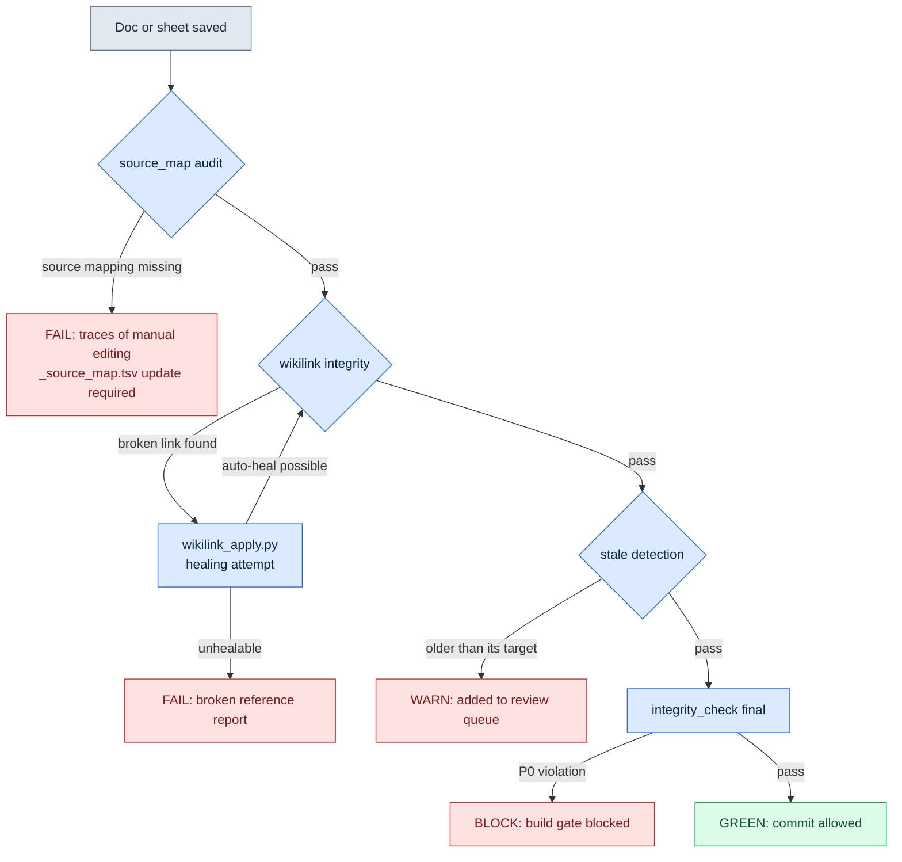

# 24.1 The Verification System — Catching Consistency, Links, and Staleness in Code

Right after Monday morning standup, team member A from the data team sent me a screenshot over the team messenger. It was a QA report: the description of a material item was showing up empty in the in-game shop. Thirty minutes of tracing later, the culprit surfaced. Two weeks earlier, someone had renamed the item to `재료_목재_상` ("material_wood_high") in a design document, but the reference in the data sheet still pointed to the old name, `재료_목재_A` ("material_wood_A"). The document was updated, the sheet was not, and the link between them had quietly snapped. Nobody lied, yet the game was printing a lie.

Incidents like this multiply exponentially as documents pile up. Human eyes cannot track the cross-references of 50 documents at once. So I delegate verification to code. This chapter covers a system where scripts, not people, check the consistency of documents, data, and links. The core is three things — source consistency (the `_source_map.tsv` audit), link integrity (wikilinks), and stale detection (catching references that have gone rotten with age).

---

## 24.1.1 Why Broken Links Are Silent

Documents and data live by pointing at each other. A design doc references an enum, the enum references a data sheet, and the sheet references a decision in yet another design doc. Manage this web by hand, and every time one node changes, a human has to remember every reference pointing at that node and chase them all down. Memory fails.

Broken links are dangerous because they **throw no errors**. In code, the compiler stops you when you reference a variable that doesn't exist. But a wikilink written as `[[재료_목재_A]]` in a document just stays there as ordinary text after its target disappears. It doesn't turn red. The game builds, ships, and only after a player sees the empty description does anyone notice.

So the verification system's first job is **making visible what human eyes cannot see**. Pull consistency violations out into text output, tie that output to a build gate (a quality gate that can block the build), and even when people forget, the script does not.

---

## 24.1.2 The Cascade of Three Checks

Verification is not one lump; it is stages. Run the cheapest check first to filter out the obvious violations, and pass only what survives to the next stage. Run the expensive checks on every input and the whole thing gets so slow that nobody runs it. Below is the verification flow I operate.



The point of this cascade is that **the earlier the failure, the cheaper it is**. The `source_map audit` is a TSV line comparison and finishes in milliseconds. The final `integrity_check`, by contrast, loads the entire data sheet and checks foreign-key (FK) relationships, which takes several seconds. Put the cheap checks up front and the obvious mistakes get cut there; the expensive check runs only on the few inputs that made it through.

It also matters that each stage outputs differently. The `audit` emits FAIL (evidence that an editor touched something by hand); `wikilink` emits FAIL after attempting auto-healing; `stale` emits WARN (not blocking, but flagged for re-review); `integrity_check` emits BLOCK (stops the build itself). The same "problem" has to trigger a different response depending on severity, or people can't tell signal from noise.

---

## 24.1.3 Stage One — The `_source_map.tsv` Audit

The first check to run is source consistency. My document generation pipeline records, in `_source_map.tsv`, which synthesized document (say, the body of a game design document, GDD) came from which source files. Each line nails down the lineage: this output section = a synthesis of these source files.

This becomes a verification tool because **hand-editing the output breaks the mapping**. If someone directly edits an auto-generated GDD section, that section is no longer a faithful synthesis of its source files. The audit script compares the hash of each output section against a hash re-synthesized from the sources, and emits FAIL on a mismatch. That is where the rule "manual edits fail the audit" comes from.

This is not about preventing human edits — it is about **making edits explicit**. If an output needs fixing, the signal says: either fix the source and regenerate, or formally detach that section from the mapping (declare the separation) — one or the other. Making quiet edits loud is the audit's job.

---

## 24.1.4 Stage Two — Wikilink Integrity and Self-Healing

Pass the audit and you move on to the link check. My documents connect nodes with Obsidian-style wikilinks: `[[target]]`. `wikilink_apply.py` does two jobs — it resolves wikilinks to actual paths and applies them, and it heals broken links where it can.

The healable case is clear-cut: the target node **was only renamed and still exists in the same place**. A rename like the earlier `재료_목재_A` → `재료_목재_상`, as long as the alias map has been updated, gets auto-corrected from the old name to the new one by the script. If the target was deleted outright or can't be traced to wherever it went, the script gives up on healing and reports a broken reference.

There is one design judgment here. **Overly aggressive auto-healing is dangerous.** If the script hunts for a "similar name" and stitches links together on its own, links get attached to nodes with different meanings — a worse accident than the one you started with. So the healing in `wikilink_apply.py` is conservative — it auto-corrects only renames with an explicit alias mapping, and hands anything that requires guesswork over to a human. The virtue of automation lies in restraint: automate only what is certain, and honestly punt the ambiguous to people.

---

## 24.1.5 Stage Three — Stale Detection

Even when a link is alive, **the reference can be stale.** Document A references data sheet B; if B was updated later than A, then A's description may now disagree with the current B. The link itself is fine — the target it points at exists. But the content has rotted.

Stale detection compares the modification times (or content-hash versions) on both sides of a reference. If the referencing side is older than its target, it raises a WARN and puts that node in the review queue. It is WARN rather than BLOCK because an update doesn't always mean a content conflict. If the update fixed a single typo, the reference is fine. So stale is not a "blocker" — it is a "look at this" marker.

Here is how this stage would catch the broken-link incident from the opening. If the `재료_목재` sheet had been updated later than the document, a stale WARN would have fired before any auto-healing. In other words, the three checks are **overlapping safety nets**. What one net misses, the next net catches. That is why the cascade catches accidents no single check can.

---

## 24.1.6 Worked Transcript — Having Claude Build the Check Script

Writing all the verification logic from scratch wears you out. I describe the check rules in natural language and have the AI draft the executable script. Below is the actual session that produced the stale detection script. The output is not polished; the failures and rejections are left as they happened.

**[Full Prompt]**

> The markdown files in my docs folder are connected to each other with wikilinks `[[target]]`. Write me a Python script that checks whether each document was updated longer ago than the target files it references (= stale). Conditions:
> - File modification time is based on the last git commit time (filesystem mtime can't be trusted — it gets refreshed on checkout)
> - Broken links (target missing) are excluded from the stale check and reported separately
> - Output is TSV: `source<TAB>target<TAB>status` (status = OK / STALE / BROKEN)
> - WARN is non-blocking; keep the exit code at 0 (must not block the build)

**[Claude's Raw Output — First Pass]**

> The script below gets each file's last commit time with `git log -1 --format=%ct <file>`, extracts wikilinks with the regex `\[\[([^\]]+)\]\]`, and compares.
>
> ```python
> import subprocess, re, sys, pathlib
>
> def git_mtime(path):
>     out = subprocess.run(
>         ["git", "log", "-1", "--format=%ct", str(path)],
>         capture_output=True, text=True)
>     return int(out.stdout.strip())
>
> def resolve(link, root):
>     # [[target]] -> root/target.md
>     return root / f"{link}.md"
>
> root = pathlib.Path(sys.argv[1])
> for md in root.glob("*.md"):
>     src_t = git_mtime(md)
>     for link in re.findall(r"\[\[([^\]]+)\]\]", md.read_text(encoding="utf-8")):
>         tgt = resolve(link, root)
>         if not tgt.exists():
>             print(f"{md.name}\t{link}\tBROKEN")
>             continue
>         tgt_t = git_mtime(tgt)
>         status = "STALE" if src_t < tgt_t else "OK"
>         print(f"{md.name}\t{link}\t{status}")
> ```
>
> This prints in the TSV format you requested.

**[Human Verification / Rejection]**

I stopped here. Three defects stood out.

First, if `git_mtime` returns an empty string, `int("")` blows up. That is exactly what happens with a new file that has never been committed. Second, `glob("*.md")` can't see subfolders. My documents are scattered under `part*/`. Third — and most important — wikilinks sometimes carry a pipe alias, as in `[[target|display name]]`, and the first-pass code mistakes the whole `target|display name` for a filename. That flags every healthy link as BROKEN. Used as is, it is a false-alarm bomb.

I pointed out these three and re-requested.

**[Re-request]**

> Fix three things: (1) for uncommitted files git_mtime is None — in that case withhold the STALE verdict and set status=UNTRACKED. (2) Use rglob instead of glob to include subfolders. (3) Handle the `[[target|alias]]` pipe — use only the part before `|` as the target. And keep the exit code at 0 even when there are BROKEN entries (the WARN non-blocking principle).

**[Claude's Raw Output — Second Pass]**

> ```python
> import subprocess, re, sys, pathlib
>
> def git_mtime(path):
>     out = subprocess.run(
>         ["git", "log", "-1", "--format=%ct", str(path)],
>         capture_output=True, text=True)
>     s = out.stdout.strip()
>     return int(s) if s else None   # None if no commit history
>
> def target_name(link):
>     return link.split("|", 1)[0].strip()   # [[target|alias]] -> target
>
> root = pathlib.Path(sys.argv[1])
> for md in root.rglob("*.md"):
>     src_t = git_mtime(md)
>     text = md.read_text(encoding="utf-8")
>     for raw in re.findall(r"\[\[([^\]]+)\]\]", text):
>         name = target_name(raw)
>         hits = list(root.rglob(f"{name}.md"))
>         if not hits:
>             print(f"{md.name}\t{name}\tBROKEN")
>             continue
>         tgt_t = git_mtime(hits[0])
>         if src_t is None or tgt_t is None:
>             status = "UNTRACKED"
>         elif src_t < tgt_t:
>             status = "STALE"
>         else:
>             status = "OK"
>         print(f"{md.name}\t{name}\t{status}")
>
> sys.exit(0)   # WARN non-blocking: always 0
> ```

I accepted this second pass. One decision, though, remained with the human — when `rglob(f"{name}.md")` finds files with the same name in multiple folders, only `hits[0]` is used. That is a latent ambiguity, but under my document naming rules filenames are globally unique, so there are no collisions in practice. The AI never raised this assumption; a human consciously accepted it and left it in a comment. **Even when automation wrote the code, the assumptions that code leans on are a human's responsibility.**

---

## 24.1.7 Tying Check Results to the Build Gate

A script nobody runs is useless. The last piece of verification design is **making it impossible not to run**. I tie the three stages to a pre-commit hook or the build pipeline. An audit FAIL and an integrity_check P0 violation are BLOCK, stopping the commit or build; wikilink BROKEN and stale are WARN, allowed through but leaving a report.

This BLOCK/WARN split decides whether the system survives. Make everything BLOCK, and a single trivial stale blocks a commit — and people start routing around the verification itself. A verification that gets bypassed is a verification that doesn't exist. Leave everything at WARN, and the data integrity violations that genuinely must be stopped sail right through. **The boundary between what you block and what you merely flag is the real design point of a verification system.**

---

## 24.1.8 Measurement — Before and After Turning On Code Verification

These are directions observed on Project A at MMORPG studio A, where I run this system, at a scale of roughly 90 documents. Some of the absolute figures are the author's estimates (unverified); what carries meaning is the trend.

| Item | Manual-Review Era | Code Verification Cascade |
|---|---|---|
| When broken references are found | After player/QA reports | Before commit (direction: post-incident → pre-incident) |
| Time for one consistency pass | Several hours (author's estimate) | Tens of seconds (measured from the script) |
| Stale dormancy | Lurks for weeks | WARN at the next commit |
| Bad auto-healing incidents | N/A | Held at 0 by conservative healing |

Rather than taking the numbers at face value, I recommend trusting only the direction: the moment of discovery moved from after the fact to before it. The real value of a verification system lies less in the time saved than in **the positional shift — accidents get caught before they reach players**.

---

## 24.1.9 Common Failures

| Pattern | Prescription |
|---|---|
| Making every violation BLOCK, so people bypass verification | Split BLOCK/WARN; block only data integrity P0 |
| Auto-healing aggressively, all the way into guesswork | Automate only explicit alias renames; ambiguity goes to a human |
| Watching only broken links and ignoring stale | Detect aged references separately by comparing modification times |
| Quietly allowing manual edits to outputs | Make edits visible as FAIL with the source_map audit |
| Having the scripts but not tying them to hooks | Wire up pre-commit and the build gate, so they can't not run |

---

## Try It Yourself — A Minimal Verification Cascade

**setup.** Put your docs folder under git (the basis for commit-time comparison). Standardize wikilinks to the `[[target]]` or `[[target|alias]]` notation.

**prompt.** Give the AI the full prompt from the transcript above as is, but never use the first output as is. Without fail, verify these three — (1) handling of uncommitted files, (2) subfolder traversal, (3) pipe alias parsing — then reject and re-request. These are the spots the AI almost always misses on the first pass.

**verify.** Run the script and collect the TSV. Hand-check a sample of 5 `BROKEN` rows to confirm they are genuinely broken links. If false BROKENs show up, the alias or subfolder parsing is incomplete. Once it checks out, tie it to a pre-commit hook and branch the exit code: WARN (STALE/BROKEN) passes, BLOCK (data integrity P0) blocks.

**Solo Scale-Down.** If you are writing a small GDD alone, the full cascade is overkill. Take **just the stale detection stage**. Even comparing only whether a document is older than its data sheet by git time catches most of the "I thought I fixed it, but I didn't" accidents. Add auto-healing and the source_map audit once your documents pass 30 and you can no longer chase them by hand.

---

### Key Takeaways
- Broken links throw no errors, so move verification into code and pull the violations human eyes can't see out as output.
- A cascade that runs the cheap checks first cuts off the obvious mistakes early and runs the expensive checks on only a few inputs.
- The boundary between BLOCK and WARN is the real design point of a verification system; block everything and you get bypassed.
