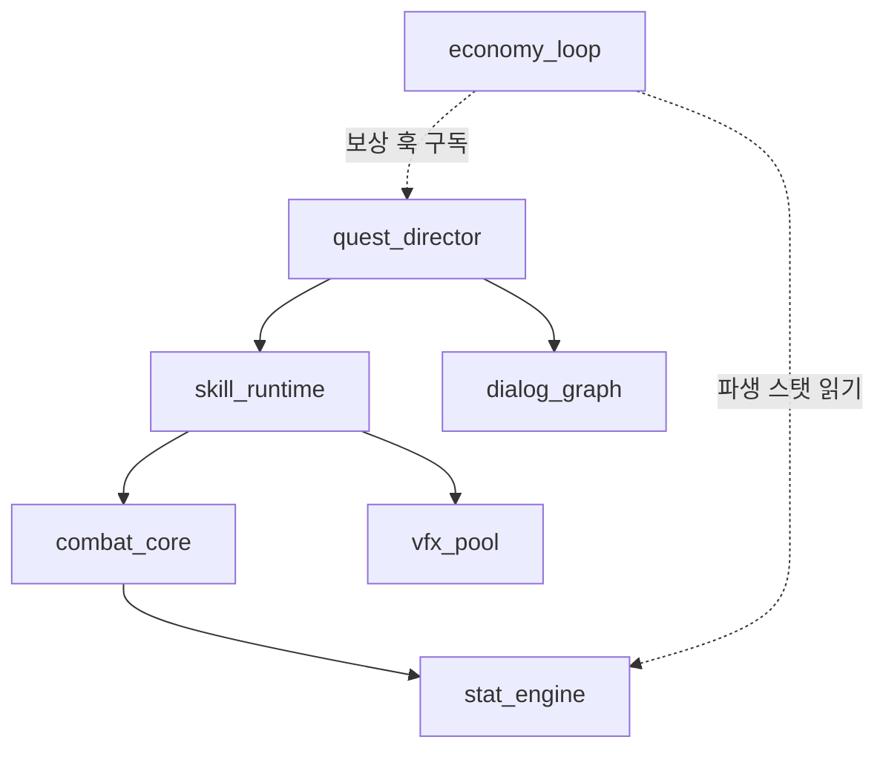
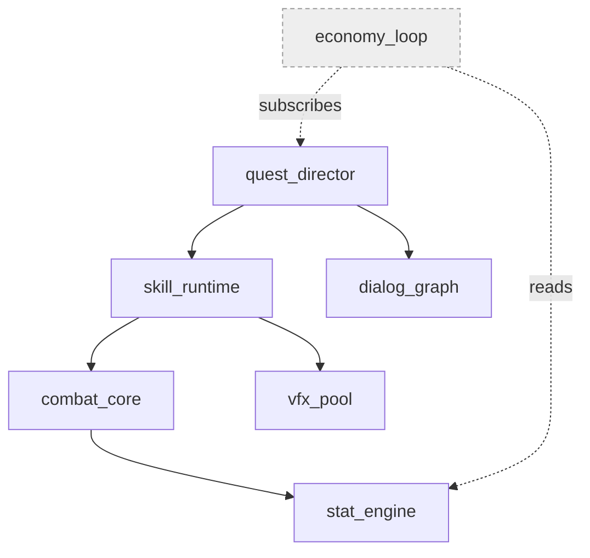
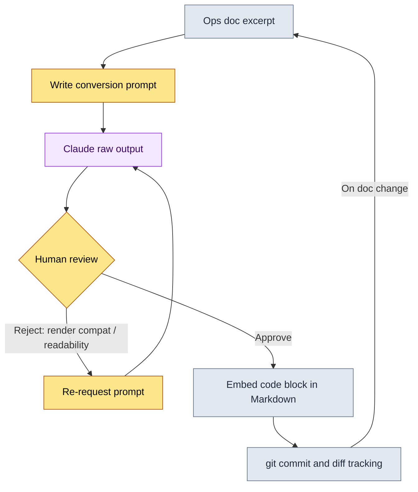
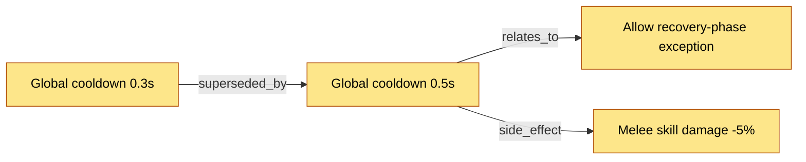

# 24.2 Mermaid Diagram Automation — Letting Documents Draw Their Own Diagrams

Three days into the job, a new designer asked me, "Is there a diagram somewhere that shows what order these systems affect each other in?" I hesitated. There was a diagram. A photo of something someone had drawn on a whiteboard six months earlier sat somewhere on the wiki. But in that picture, two systems that no longer exist were still alive, and three core loops added since were missing. In the end I answered, "Don't trust the diagram — read the docs." It was an embarrassing answer. The moment a diagram disagrees with the documents, it stops being information and becomes misinformation.

Let me state this chapter's conclusion up front. A diagram drawn by a human always rots within a month or two. So take the act of drawing diagrams out of human hands, and make the document structure itself spit out its own pictures. This chapter shows that process as one record of real work. I include, in full, a worked transcript that takes a document as input and generates Mermaid code, and the diagrams it produced are actually rendered on this very page. A chapter explaining a technique proves itself with that technique's own output.

---

## 24.2.1 Why Mermaid, of All Things

There are plenty of diagram tools: draw.io, Figma, Visio, even whiteboard photos. They all share one trap: the deliverable is an image file. An image can't be tracked line by line in git, can't be generated or edited directly by an LLM that works on text, and can't sit inside a Markdown document as code. From an operations standpoint, the first one is the most fatal. A picture where nobody can trace who changed what, when, and why becomes, over time, a relic nobody takes responsibility for.

Mermaid solves all three at once. You write the diagram as text, and the viewer handles the rendering. Because it's text, `git diff` catches even a single added node. Because it's text, an LLM can read and write it. Because it's text, it drops straight into a Markdown code block. The body of this very chapter is the proof. The diagrams coming up below this sentence are all text blocks inside Markdown, rendered into pictures during the book's build.

One misunderstanding needs heading off, though. There is no need at all to turn every operational artifact into a diagram. Listing items is faster with bullets; comparing numbers is faster with a table. Mermaid wins in exactly three places: relationships (what connects to what), flow (what comes after what), and sequence (who sends what to whom, and when). Force a diagram anywhere else and you only add cognitive load.

---

## 24.2.2 The Spine: One Session That Pulled a Diagram from Document Structure

This is where the chapter's backbone begins. Instead of abstract explanation, I show the entire process of turning one real chunk of a document into Mermaid, start to finish. The input is a Markdown fragment from Project A's ops documents that records the system dependency structure (below is a real excerpt, anonymized).

````text
# System dependency memo (ops doc excerpt, anonymized)

- combat_core depends on stat_engine
- skill_runtime depends on combat_core
- skill_runtime depends on vfx_pool
- quest_director depends on skill_runtime
- quest_director depends on dialog_graph
- economy_loop subscribes to quest_director's reward hook
- economy_loop reads stat_engine's derived stats
````

Transcribing this into a diagram by hand means seven nodes and seven arrows. You can draw it once. The problem comes next week, when a `mail_box` system gets added and `dialog_graph` splits in two. From that moment on, the hand-drawn picture starts lying. So I hand this conversion to an LLM, not a person.

### Step 1 — The Full Prompt

Below is the prompt I actually sent, included as is without polishing a single character.

````text
Convert the system dependency memo below into a Mermaid graph (top to bottom, graph TB). Rules:
1. Only the systems in the memo become nodes; no adding new systems.
2. "A depends on B" becomes A --> B.
3. For weak couplings like "subscribes" and "reads", use a dotted -.-> with a relation name attached.
4. Use the English names in the memo as node ids, verbatim; do not attach Korean labels.
Code block only; no explanations or comments.

[Memo]
- combat_core depends on stat_engine
- skill_runtime depends on combat_core
- skill_runtime depends on vfx_pool
- quest_director depends on skill_runtime
- quest_director depends on dialog_graph
- economy_loop subscribes to quest_director's reward hook
- economy_loop reads stat_engine's derived stats
````

Rules 1 and 4 are the heart of it. The most common accident when you hand diagramming to an LLM is the "helpful hallucination": it adds nodes you never asked for ("most games have a login system, so I included one") and attaches Korean labels on its own, breaking the match between IDs and full-text search. The rules shut that helpfulness down.

### Step 2 — Claude's Raw Output (No Summary)

What follows is the model's first response, reproduced as is, unrefined. There was one small problem mixed into it, and I include it, problem and all.

````text

````

The syntax is fine and there are exactly seven nodes. It didn't invent any new systems. Rules 1 and 4 held. But one thing bothered me. The dotted-edge labels came back in Korean (`보상 훅 구독`, "subscribes to the reward hook," and `파생 스탯 읽기`, "reads the derived stats"). This isn't a rule violation. Rule 3 said to attach relation names, and the model complied faithfully. But I knew from experience that in Mermaid, a Korean label with spaces in it breaks some older renderers. The model had no way of knowing that.

### Step 3 — Human Review and Rejection

This is the step most often skipped in automation, and the most important one. I didn't accept the output as is — I rejected it. Two reasons.

First, the Korean-with-spaces dotted-edge labels had to become English tokens to secure render compatibility. Second, weak couplings (dotted) and strong couplings (solid) were mixed in one picture with no color or style distinction, so it didn't read at a glance. I went back with these two points.

### Step 4 — The Re-Request Prompt

````text
Almost good. Fix only two things.

1. Change the dotted-arrow labels to a single English word each (no spaces). 
   "보상 훅 구독" -> subscribes, "파생 스탯 읽기" -> reads
   Reason: some renderers break on Korean-plus-space edge labels.
2. To visually distinguish dotted (weakly coupled) nodes from solid (strongly coupled) nodes,
   give nodes that have only weak couplings, like economy_loop, a pale gray style with classDef.
3. Leave everything else as is.
````

### Step 5 — Raw Output for the Re-Request

````text

````

This time I accepted it. The labels became single English tokens, and `economy_loop` alone drops into gray, so the information "this system is an edge system, tied in only by subscribing and reading rather than direct dependency" is carried by color. Had I drawn this by hand without ever touching a prompt, odds are I would never have thought of this classDef at all.

### The Spine's Deliverable — Actually Rendered Right Here

The final output of the transcript above goes onto this book's page as the code block itself, not copied over by hand. The book's build draws it into a picture. This is "proving itself with its own technique," in the flesh.


One chunk of document excerpt, after five exchanges, became an operational asset that lives in git, that an LLM can update, and that renders on this page. When `mail_box` gets added next week, you write one line in the memo and throw the same prompt again. Nobody has to pick up a pen.

---

## 24.2.3 The Second Diagram: Drawing the Automation Pipeline Itself

If the previous diagram is "the result of the conversion," this one is "the process of the conversion." I turned the five-step worked procedure we just walked through into a flowchart. This diagram, too, was produced by tasking the LLM the same way, and it went through the same review. I include the result as is.



This flowchart says one thing. What I want to emphasize — with a bold arrow, not a dotted one — is the diamond in the middle: `Human review`. Get drunk on the word "automation" and drop that node, and the helpful hallucination from Step 1 goes straight into your ops documents. Automation frees people from drawing; it does not free them from judgment. The loop's final arrow (`On doc change` → `Ops doc excerpt`) is the key. Only with that feedback loop in place does the diagram stop being a one-off artifact and become an asset that grows with the document instead of aging apart from it.

---

## 24.2.4 The Conversion Script: A Deterministic Path That Runs Without an LLM

LLM conversion is flexible, but when the relationships already exist as structured data, there's no reason to call a model at all. For fixed-field data like Project A's decision cards, a small Python script is faster and more honest (hallucination is impossible by construction). Below is the core of the actual script that turns a list of decision cards into a decision-graph Mermaid.

````python
# decision_graph_to_mermaid.py
# Decision cards (structured data) -> Mermaid graph. No LLM needed; deterministic.

def to_mermaid(decisions):
    lines = ["graph LR"]
    # 1) Declare nodes: id and title as is. Nothing gets invented.
    for d in decisions:
        safe_title = d.title.replace('"', "'")   # escape only the quotes
        lines.append(f'    {d.id}["{safe_title}"]')
    # 2) Edges: relation type becomes the arrow label.
    for d in decisions:
        for rel in d.relations:
            lines.append(f'    {d.id} -->|{rel.type}| {rel.target}')
    return "\n".join(lines)
````

The point is that it finishes in just two steps. Declare the nodes, connect the edges. A node absent from the input never appears in the output. Feed this script three decision cards and you get a graph like the one below.



One decision gets superseded by another (superseded_by), and even the side effect that branched off it (side_effect) shows up as a single arrow. Without reading dozens of lines of a text decision log, this one graph gets you the history of "why is the cooldown 0.5 seconds now" in under five minutes.

When to use the LLM and when to use a script? The criterion is simple. If the input is structured data (cards or sheets with fixed fields), use a script; if the input is free text (meeting notes, memos, conversations), use an LLM. Use an LLM on structured data and you take on hallucination risk for nothing; use a script on free text and the parsing rules grow without end.

---

## 24.2.5 Four Pitfalls and Their Remedies

These are mines I actually stepped on while running diagram automation.

First, the trap of growing too complex. Past fifty nodes, a picture no longer aids cognition — it obstructs it. The remedy is to cap a single view at twenty to thirty nodes, and once it grows beyond that, group regions with subgraph or split the diagram in two outright.

Second, the trap of updates going dead. It's tempting to think this only happens to hand-drawn pictures, but if you set up automation and then stop fixing the input document, it rots just the same. The remedy is the feedback loop from the earlier flowchart. Make the input document the single source of truth, and always regenerate the diagram from it.

Third, the trap of being too abstract. A picture at the level of "the systems are roughly tangled together like this" is pretty but useless. The remedy is to put real IDs (`skill_runtime`, `D_B`) on the nodes instead of abstract nouns. Full-text search and the diagram have to share the same identifiers before you can jump straight from picture to code.

Fourth, the trap of using LLM output as is, without review. As Step 3 of the spine showed, a model can follow every rule and still produce a label that breaks the renderer. The remedy is to never remove the human review node from the pipeline.

---

## 24.2.6 The Payoff — An Honest Account of the Change

The temptation to bring out numbers is real, but here I'll state direction only. The comparison below is the change I felt on the team I ran — an author's estimate (unverified), not a precise measurement.

The clearest change was how fast new hires came to understand the systems. Grasping "how these systems are tied together," which used to take the first several days on the job, shrank to about an hour in front of one auto-generated dependency graph. Meeting prep got lighter too. Someone used to redraw the picture by hand the night before a meeting; now converting the document once is the end of it. Above all, the question "can I trust this diagram?" — the one that surfaced whenever a diagram drifted from reality — has all but disappeared. The input document is the picture, so if the document is right, the picture is right.

In the other direction, to be honest: automation is not a cure-all. For early-stage idea sketches that haven't firmed up yet, a whiteboard is still faster. Automation shines after the structure has hardened to a degree.

---

## Key Takeaways

- Diagrams drawn by humans always rot, so push the drawing off onto the document structure.
- Convert free text with an LLM and structured data with a script, but a human does the verification.
- Diagram and body text must share the same IDs for you to jump from picture to code.

---

## Try It Yourself

**setup.** One Markdown repository holding your documents, plus a viewer that renders Mermaid (built into most Markdown viewers and git hosting), is enough. From the document you want to convert, pick one fragment that qualifies as "relationship, flow, or sequence" (for example, a system dependency memo).

**prompt.** Drop that fragment into the Step 1 prompt template from this chapter's spine and send it to the LLM. Always include the two rules: "do not add nodes that are not in the memo" and "use the original English names as IDs, verbatim." If the data is structured, convert it with a deterministic script like `decision_graph_to_mermaid.py` instead of an LLM.

**verify.** Paste the output code block into Markdown and actually render it. Check three things: (1) no nodes appeared that aren't in the input, (2) the edge labels draw without breaking, (3) the IDs used in your text and the diagram IDs match. If any one fails, reject with a re-request prompt and get a new version. Once it passes, commit to git — from now on, changes are tracked as diffs.

### Solo Scale-Down

If you're a solo worker with no team and no scripts, shrink it down like this. In your note app, write the relationships between systems, tasks, and ideas as bullets in the form "A depends on B." Once a week, copy that whole list and throw a one-liner: "Convert this to a Mermaid graph TB; do not add nodes that are not in the list." Paste the returned code block at the top of the note. That's it. You never draw by hand, so there's no update burden, and as long as the input list stays alive, the picture is always current.
