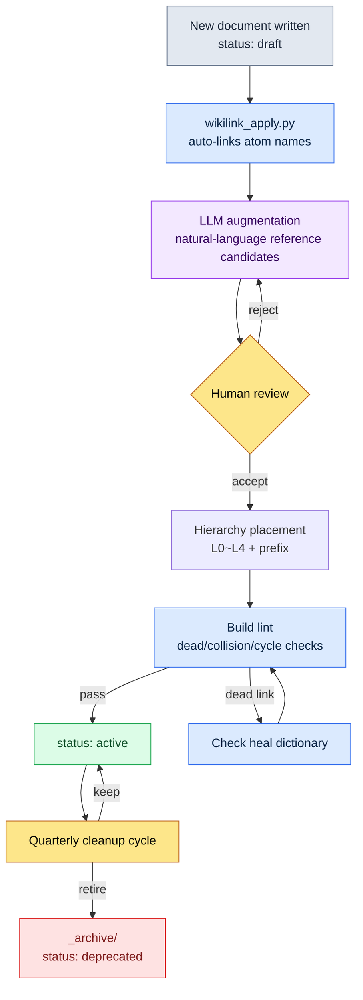

# 24.3 Wikilinks and Document Hierarchy — Links and Classification, the Two Entrances to Search

> Links (wikilinks) and classification (hierarchy) are two entrances to the same problem. One answers "where does this decision lead"; the other answers "where does this document live."

On the morning of their second day, a newly joined designer asked me: "Is 0.5 seconds the right value for the combat global cooldown? Which document has the rationale?" I couldn't answer. I knew the decision was recorded somewhere, but I couldn't remember whether it was in the combat rulebook, the meeting notes, or a quarterly report. Three of us dug through the entire folder with grep. The same number turned up in six places, and we couldn't tell which was the "original decision" and which were "reference copies." We spent 40 minutes. What we finally found was a single line buried in meeting notes.

That evening I realized two things had been missing. First, there were no **explicit links** between documents. The same number lived in six places, but nowhere was there a thread saying "this one is quoted from over there." Second, the documents had no **hierarchy** to live in. Decision records were scattered across rulebooks, meeting notes, and reports, with no agreement that "decisions live here."

Those two things are the subject of this chapter. Wikilinks write the connections down as text; hierarchy promises the classification as folders. They look like separate techniques, but they are really two sides of one problem: search.

---

## 24.3.1 What Breaks When There Are No Links

With 30 documents, you keep it all in your head. Past 100, human memory stops working as the index. At that point you can rely on one of two things: sweep everything with grep (slow and imprecise), or follow the explicit links written inside the documents (fast and precise).

Why grep is imprecise is simple. Search for the string `combat_global_cooldown_constant`, and the document that **decided** the value and the documents that merely **mention** it come back looking identical. grep doesn't know which one is the original. But once we agree on the double-bracket notation `[[combat_global_cooldown_constant]]` inside documents, the signal "this intentionally references that atom" lives in the string itself. Narrow the search to the pattern `\[\[combat_global_cooldown` and accidental mentions drop out, leaving only intended references.

This one-line notation convention becomes an edge of a graph. When document A writes `[[atom_X]]`, an A→X edge is created. With 200 documents each writing a few, the graph accumulates inside the text without anyone drawing it.

Below is a small piece of how our project's atoms, decisions, and documents are tied together by wikilinks. Node color indicates the kind; arrows indicate the direction of reference.

<svg viewBox="0 0 720 360" xmlns="http://www.w3.org/2000/svg" font-family="sans-serif" font-size="12">
  <defs>
    <marker id="arrow" markerWidth="9" markerHeight="9" refX="8" refY="3" orient="auto" markerUnits="strokeWidth">
      <path d="M0,0 L8,3 L0,6 Z" fill="#555"/>
    </marker>
  </defs>
  <!-- edges -->
  <g stroke="#888" stroke-width="1.4" marker-end="url(#arrow)" fill="none">
    <line x1="180" y1="80" x2="350" y2="150"/>
    <line x1="180" y1="240" x2="350" y2="160"/>
    <line x1="430" y1="150" x2="560" y2="90"/>
    <line x1="430" y1="170" x2="560" y2="240"/>
    <line x1="180" y1="80" x2="180" y2="220"/>
  </g>
  <!-- doc nodes (blue) -->
  <g>
    <rect x="90" y="58" width="180" height="44" rx="6" fill="#dbeafe" stroke="#2563eb"/>
    <text x="180" y="84" text-anchor="middle" fill="#1e3a8a">[[CombatFormula_v3]]</text>
    <rect x="90" y="218" width="180" height="44" rx="6" fill="#dbeafe" stroke="#2563eb"/>
    <text x="180" y="244" text-anchor="middle" fill="#1e3a8a">[[Meeting_W21]]</text>
  </g>
  <!-- atom node (green) -->
  <g>
    <rect x="350" y="134" width="180" height="48" rx="6" fill="#dcfce7" stroke="#16a34a"/>
    <text x="440" y="155" text-anchor="middle" fill="#14532d">[[combat_global_</text>
    <text x="440" y="171" text-anchor="middle" fill="#14532d">cooldown_constant]]</text>
  </g>
  <!-- decision nodes (amber) -->
  <g>
    <rect x="560" y="68" width="150" height="44" rx="6" fill="#fef3c7" stroke="#d97706"/>
    <text x="635" y="94" text-anchor="middle" fill="#92400e">[[D2026_Q2_017]]</text>
    <rect x="560" y="218" width="150" height="44" rx="6" fill="#fef3c7" stroke="#d97706"/>
    <text x="635" y="244" text-anchor="middle" fill="#92400e">[[D2026_Q2_018]]</text>
  </g>
  <!-- legend -->
  <g font-size="11">
    <rect x="90" y="312" width="14" height="14" fill="#dbeafe" stroke="#2563eb"/>
    <text x="110" y="324" fill="#333">Document</text>
    <rect x="170" y="312" width="14" height="14" fill="#dcfce7" stroke="#16a34a"/>
    <text x="190" y="324" fill="#333">atom</text>
    <rect x="250" y="312" width="14" height="14" fill="#fef3c7" stroke="#d97706"/>
    <text x="270" y="324" fill="#333">Decision</text>
  </g>
</svg>

What this small piece shows is that the answer to the new designer's question was already in the graph. Follow the arrows coming into the `combat_global_cooldown_constant` atom backwards and you reach decision `D2026_Q2_017`. Not 40 minutes — one reverse reference.

---

## 24.3.2 The Notation Convention — Four Kinds, One Format

We limited what wikilinks can point to — exactly four kinds. Add more kinds and the format wobbles; when the format wobbles, grep becomes imprecise again.

- **Atom reference** — `[[combat_global_cooldown_constant]]`. Points to an atom, the one-decision-per-document unit.
- **Decision reference** — `[[D2026_Q2_017]]`. A decision record identified by quarter and number.
- **Document reference** — `[[CombatFormula_v3]]`. Large documents such as rulebooks and specs.
- **Person reference** — `[[Teammate A]]`. Owners and decision-makers.

All four kinds share the single format `[[name]]`. The name must be globally unique. If an atom name collides across two places, they merge into the same node of the graph — the accident where "combat's cooldown" and "the UI's cooldown" become one node. That is why the atom naming rules force a domain prefix (`combat_`, `ui_`).

---

## 24.3.3 wikilink_apply.py — Apply and Heal

The notation convention alone isn't enough. Hand-bracketing 200 documents is unrealistic, and even once done, everything breaks the moment an atom is renamed. So we run a script that does two jobs. First, **apply** — automatically convert known atom names appearing in body text into wikilinks. Second, **heal** — find links that were renamed or broken, then update and report them.

The core of `wikilink_apply.py` looks like this.

```python
# wikilink_apply.py — applies [[wikilink]] to atom names in body text and heals broken links
import re
from pathlib import Path

WIKILINK = re.compile(r"\[\[([A-Za-z0-9_]+)\]\]")
# Match only atom names appearing bare, not already linked (no [[ in front)
BARE_NAME = lambda name: re.compile(rf"(?<!\[\[)(?<![A-Za-z0-9_])({re.escape(name)})(?![A-Za-z0-9_])(?!\]\])")

def load_known_atoms(registry: Path) -> set[str]:
    # _atom_registry.tsv: first column is the currently valid atom name
    return {ln.split("\t")[0].strip()
            for ln in registry.read_text(encoding="utf-8").splitlines()
            if ln.strip() and not ln.startswith("#")}

def apply_links(text: str, known: set[str]) -> tuple[str, int]:
    applied = 0
    for name in sorted(known, key=len, reverse=True):  # longest names first: prevents partial-match corruption
        text, n = BARE_NAME(name).subn(rf"[[{name}]]", text)
        applied += n
    return text, applied

def heal_links(text: str, known: set[str], aliases: dict[str, str]) -> tuple[str, list[str]]:
    dead = []
    def repl(m):
        ref = m.group(1)
        if ref in known:
            return m.group(0)              # alive → keep as is
        if ref in aliases:                  # renamed atom → heal to the new name
            return f"[[{aliases[ref]}]]"
        dead.append(ref)                    # genuinely dead link → report
        return m.group(0)
    return WIKILINK.sub(repl, text), dead
```

Two design choices here are the backbone of the script.

First, `apply_links` replaces **longer names first**. With two atoms `combat_cooldown` and `combat_cooldown_global`, replacing the shorter one first corrupts the front of the longer one. A single line of descending-length sorting prevents that accident. This is the part I missed when I first wrote the script, and I only added it after the broken result `[[combat_cooldown]]_global` actually showed up.

Second, `heal_links` heals through a **rename dictionary** (aliases). When an atom name changes from `combat_gcd` to `combat_global_cooldown_constant`, the old name is automatically replaced with the new one, and only when the dictionary doesn't have it either is it reported as a dead link. Instead of hand-fixing 200 documents on every rename, we add one alias line.

---

## 24.3.4 Worked Transcript — Handing Wikilink Augmentation to Claude

Automatic apply only links "atom names already known." It can't catch sentences that spell things out without using the atom name ("The combat global cooldown is 0.5 seconds"). Turning these natural-language references into wikilink candidates is something an LLM does faster than a person. Below is the actual exchange, in full. The output is not summarized, and the part I rejected is left in as is.

**My prompt (in full):**

```
I'll give you one paragraph from the combat rulebook and the list of registered
atoms. Find the natural-language expressions in the text that point to these
atoms and propose [[wikilink]] candidates as a table. Only when you're certain;
if it's ambiguous, just mark it "ambiguous". Don't rewrite the text — only say
which phrase maps to which link. Pull unregistered concepts out separately as
"new atom candidates".

[Registered atoms]
combat_global_cooldown_constant
combat_skill_cast_interrupt_rule
combat_resource_regen_rate

[Text]
The combat global cooldown is 0.5 seconds and applies to all active skills.
Getting hit while casting interrupts the cast. Healing-type skills are the exception.
Resource regen returns to normal speed only while out of combat.
```

**Claude's output (raw):**

```
Proposed wikilinks:

| Text phrase                                      | Candidate link                          | Confidence |
|--------------------------------------------------|----------------------------------------|------|
| "The combat global cooldown is 0.5 seconds"      | [[combat_global_cooldown_constant]]    | High |
| "Getting hit while casting interrupts the cast"  | [[combat_skill_cast_interrupt_rule]]   | High |
| "Resource regen ... only while out of combat"    | [[combat_resource_regen_rate]]         | Medium |

New atom candidates:
- "Healing-type skills are the exception" → This exception rule is not spelled
  out in any of the registered atoms. It looks like it needs a separate atom,
  something like combat_skill_cast_interrupt_heal_exception. (Ambiguous: it
  could be a sub-clause of interrupt_rule, so I can't judge whether it should
  be a standalone atom.)

Note: for the "resource regen" row, I haven't seen the atom definition, so I
can't tell whether combat_resource_regen_rate refers to the 'regen rate' or to
the 'out-of-combat condition' — hence medium confidence.
```

**My verification and rejection:**

I accepted two of the three rows. The global cooldown and the cast interrupt matched the atom definitions exactly. On the third "resource regen" row, Claude was right to lower its own confidence to "medium" — the `combat_resource_regen_rate` atom defines only the **rate value**, and the **condition** "only while out of combat" belonged to a different atom. Linking it as proposed would wrongly attach a "condition" to a "rate" atom. **I rejected it.**

The new-atom-candidate call was accurate. The "healing exception" really had no atom anywhere. The part Claude flagged as ambiguous ("a sub-clause of interrupt_rule, or a standalone atom?"), however, was a human's call to make, and I decided to split it out as a standalone atom.

**Re-request:**

```
Don't link the "resource regen" row. Instead, [[combat_resource_regen_rate]]
covers the 'rate' only, and the 'out-of-combat condition' is split into a new
atom. Write a one-line definition for each of the two atoms. Also write a
one-line definition for the healing exception as a standalone atom.
```

What the LLM did in this round-trip was not "creating candidates from zero" but "picking candidates out." The point is that **there was a clearly marked place for a human to refuse**. Had this been auto-published, one wrong link would have stayed in the graph permanently.

---

## 24.3.5 Lint — Stopping Broken Links at Build Time

Links break over time. Atoms get retired, names change, typos creep in. So we run a wikilink lint on every build. The checks and their handling:

- **Dead link** — the name in `[[name]]` is not in the registry → build warning; check the heal dictionary
- **Format violation** — snake_case or prefix rule broken → block
- **Name collision** — the same name on two atoms → block (global uniqueness broken)
- **Circular reference** — A→B→A → warning (allowlist for intentional cases)
- **Over-referencing** — one document references the same atom 10+ times → warning (suspected noise)

Keeping dead links a warning rather than a block is deliberate. In the middle of renaming an atom, dead links appear briefly, and failing the build over that would stop work. Instead, the lint makes you check the heal dictionary first. Format violations and name collisions are blocked immediately — those two corrupt the entire graph.

> This lint is self-evidencing. The links that wikilink_apply.py creates are checked by the same system's lint, and the result is recorded as yet another atom decision. A tool verifying its own output against its own standards — that loop is the basic skeleton of operations.

---

## 24.3.6 Classification — The Hierarchy Where Documents Live

That covers links. Now, classification. If wikilinks answer "where does this decision lead," hierarchy answers "where does this document live." Without both, the new designer's 40-minute search repeats.

Our document folder has four layers. The layers share the same skeleton as the Layer unification in our information architecture — vision, systems, content, and meta each get one layer.

```
docs/
├── L0_vision/              Vision (5 docs or fewer, rarely changes)
├── L1_systems/             Per-domain rulebooks
│   ├── combat/
│   ├── narrative/
│   └── ui/
├── L2_content/             Individual content
│   ├── characters/
│   └── quests/
└── L4_meta/                Ops, decisions, meetings, atoms
    ├── decisions/
    ├── meetings/
    ├── reports/
    └── atoms/
```

L3 is empty because data sheets and the DB occupy that spot (tables, not documents). The decision the new designer was hunting for lives in `L4_meta/decisions/` — with just that one promise in place, the 40-minute search would have ended with one sentence: "decisions live there."

For the hierarchy to work as a search entrance, five things must hold together. Drop any one of them and the classification collapses.

1. **Classify by meaning, never by time.** `combat/` and `narrative/` stay searchable; nobody opens `2026-Q1/` or `2026-Q2/` six months later. Git records time, so there is no reason to split folders by it again.
2. **Depth 4 or less.** `L1_systems/combat/skills/active/single_target/attack.md` is five levels. Once a path overflows one screen, people can't hold the location in their head.
3. **Filename prefixes.** Put the kind into the filename with `spec_`, `report_`, `decision_`, `char_`. You can see the kind without looking at the folder.
4. **A README in every folder.** Each folder's README states its definition, contents, and naming rules. It is a newcomer's first entrance.
5. **`_`-prefixed meta folders.** `_archive/`, `_TEMPLATES/`, `_NAMING/` sort to the top automatically and never mix with the real content.

A document doesn't stay in one place. While being written it lives in its home folder with `status: draft`; once activated it becomes `status: active`; when retired it is **not deleted** but moved to `_archive/` and tagged `status: deprecated`. Never deleting deprecated material is an iron rule. Six months later, when someone asks "why did we reverse that decision?", the answer exists only inside the deprecated material. Delete it, and there is no way to recover the decision's rationale after the fact.

Large changes are not left to git alone; they are recorded as a change_log in the frontmatter.

```yaml
---
title: combat_global_cooldown_rule
version: v3
last_modifier: teammate_a
change_log:
  - v1 (2025): initial draft
  - v2 (2025): cooldown 0.3 → 0.5  ([[D2026_Q2_017]])
  - v3 (2026): added healing exception  ([[D2026_Q2_018]])
---
```

Notice that the decision IDs in the change_log are written as wikilinks. This is where links and classification meet. The document lives in one place inside the hierarchy (classification), while its change history leads into the decision graph (links). One frontmatter opens both entrances at once.

---

## 24.3.7 Once a Quarter, the Cleanup Cycle

Left alone, a hierarchy rots. Empty folders appear, six-month-old drafts pile up, depth creeps upward. So we clean up once a quarter. Delete empty folders; decide activate-or-retire for drafts older than six months; flatten anything at depth 5 or more; write or retire READMEs for folders missing one; and when `_archive` passes half the total, compress and preserve it. Without this cycle, the hierarchy fills with noise until signal and noise become indistinguishable.

The whole flow in one picture: a document comes in, gets linked, classified, verified, and eventually retired — one loop.



In this loop, links (B·C·D·F) and classification (E·I·J) take turns. They don't run separately; they interlock within the life of a single document.

---

## 24.3.8 Effects — What Changed and How

The numbers here are **directional**, comparing before and after adoption on my project. They are not precise measurements but the size of the difference I felt doing the same work in the two environments (author's observation, not precisely measured).

Before links and hierarchy were in place, a new designer's decision-tracing question took up to an hour or two, like the 40-minute case in the opening. After, it's one atom reverse reference — a matter of minutes. Document search dropped from 5–10 minutes to around 30 seconds, the result of the hierarchy's meaning-based classification and filename prefixes working together. Accidents caused by wrong citations (the kind where an already-retired value is mistaken for the current one) fell from several per quarter to one or two — with wikilinks stating "this references that atom," copied values and original values stopped being confusable.

The biggest change was **newcomer onboarding**. Without hierarchy, learning which folder held what took days; without links, there was no way to grasp how the systems intertwined. With both in place, new joiners learned locations from the folder READMEs and explored cross-system relationships on their own by following the wikilink graph. "Things you can only learn by asking" turned into "things you can see by following."

This effect appears only when both entrances exist **together**. Links without classification: the graph is there, but you don't know where documents live. Classification without links: the folders are tidy, but you don't know where decisions lead.

---

## 24.3.9 Common Failures and Remedies

On the links side, the most common failure is **noise links**. If you bracket every noun because wikilinks seem great, the graph fills with meaningless edges and visualization tools become useless. The principle: keep only links for which you can ask and answer "what is the relationship between this document and that one." Next is **auto-publishing** — commit LLM-made links without human review, and a wrong connection like the "resource regen" row in the worked transcript stays forever. Apply is automatic; publishing is human.

Failures on the classification side are mostly violations of the five principles: time-based folders, depth 5 or more, lawless filenames, missing READMEs. And the hardest one to undo — **deleting deprecated material**. The rationale behind a deleted decision cannot be recreated. The one line that moves it to `_archive` protects the learning material you'll need six months later.

---

### Key Takeaways

- Links and classification are the two entrances to search; with only one of them, the newcomer's 40-minute search repeats.
- Wikilinks auto-apply atom names, but LLM candidates are safe only when a human keeps a place to refuse them.
- Deprecated material is preserved in `_archive`, not deleted, so the rationale behind decisions survives after the fact.

---

## Try It Yourself — A Minimal Wikilink + Hierarchy Adoption

**setup.** Create four folders in your docs folder — `L0_vision/` `L1_systems/` `L2_content/` `L4_meta/` — and put a one-line README in each. Collect your atom names into a single `_atom_registry.tsv` file (first column = atom name).

**prompt.** Give the LLM one paragraph of text and the registered atom list, and ask: "Find the natural-language expressions in the text that point to these atoms and propose `[[wikilink]]` candidates as a table. Propose only when certain; if ambiguous, just mark it 'ambiguous.' Do not rewrite the text. Separate unregistered concepts as 'new atom candidates.'"

**verify.** Check every proposed link against the atom definition. Accept only when what the atom refers to and what the text refers to are **exactly** the same; reject when a condition, attribute, or exception diverges. After accepting, run `grep "\[\[name\]\]"` to confirm the links actually landed and there are no dead links.

**Solo Scale-Down.** To start with no script and no lint, two rules are enough. (1) Decisions go in one folder, `decisions/`, as `decision_*.md` — always. (2) When another document mentions a decision, write it as `[[decision_id]]`. Keep just these two rules, and you can answer "where is that decision?" with a single `grep "\[\[decision_"`. Bringing in tooling after your documents pass 100 is not too late.
