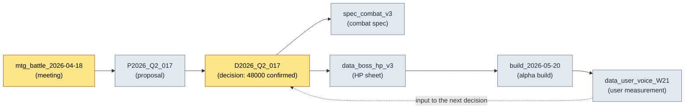

# 24.4 Source Tracking and Data Lineage

> The moment you start doubting a piece of data always arrives too late. Only after a wrong number has gone into the live build do you ask, "Where did this come from?"

---

On the Friday evening right before the alpha build, team member B came to my desk, laptop in hand, the combat balance spreadsheet open on the screen. "Director, the sheet says the boss's phase 1 HP is 48,000, but the value that went into the build is 52,000. Which one is right?"

I don't know. To be precise — at that moment, nobody knows. The 52,000 could be the latest value, reflecting a decision from a meeting a few days back, or it could be an unverified value someone parked there temporarily. The 48,000 could be the agreed value from before that meeting. Both numbers are plausible. Plausibility is not evidence.

To answer the question, you have to trace back to the source. Which meeting decided it, what were that meeting's inputs, who copied it into the sheet. But if that chain of tracing exists only in people's memories, the answer becomes "I'll ask team member A tomorrow." Six months into live operations (live ops), unresolved questions like that pile up into a mountain. Data lineage — the genealogy of your data — is the infrastructure that keeps that mountain from forming.

The core principle is a single one: never record sources by hand. Source records that people backfill after the fact don't survive a month. Only sources recorded automatically, at the moment the data is created, survive.

---

## 24.4.1 The Five Costs of Data with Broken Sources

Recording one line of `_source_map.tsv` automatically costs a few milliseconds. The cost you pay when that line is missing spreads in five directions.

<svg viewBox="0 0 720 300" xmlns="http://www.w3.org/2000/svg" font-family="sans-serif">
  <rect x="280" y="120" width="160" height="60" rx="8" fill="#1f2933" stroke="#0b3d2e"/>
  <text x="360" y="148" fill="#ffffff" font-size="15" text-anchor="middle">Broken source</text>
  <text x="360" y="168" fill="#9fb3c8" font-size="12" text-anchor="middle">(source not recorded)</text>

  <rect x="20" y="20" width="170" height="44" rx="6" fill="#e8f0fe" stroke="#1967d2"/>
  <text x="105" y="40" fill="#1a1a1a" font-size="12.5" text-anchor="middle">Unverifiable</text>
  <text x="105" y="56" fill="#5f6368" font-size="11" text-anchor="middle">"Where is this number from?"</text>

  <rect x="530" y="20" width="170" height="44" rx="6" fill="#e8f0fe" stroke="#1967d2"/>
  <text x="615" y="40" fill="#1a1a1a" font-size="12.5" text-anchor="middle">Missed updates</text>
  <text x="615" y="56" fill="#5f6368" font-size="11" text-anchor="middle">source updated → derivatives stale</text>

  <rect x="20" y="236" width="170" height="44" rx="6" fill="#fce8e6" stroke="#c5221f"/>
  <text x="105" y="256" fill="#1a1a1a" font-size="12.5" text-anchor="middle">Legal exposure</text>
  <text x="105" y="272" fill="#5f6368" font-size="11" text-anchor="middle">basis for external assets lost</text>

  <rect x="530" y="236" width="170" height="44" rx="6" fill="#fce8e6" stroke="#c5221f"/>
  <text x="615" y="256" fill="#1a1a1a" font-size="12.5" text-anchor="middle">Slow incident diagnosis</text>
  <text x="615" y="272" fill="#5f6368" font-size="11" text-anchor="middle">bad values cannot be traced back</text>

  <rect x="275" y="236" width="170" height="44" rx="6" fill="#fef7e0" stroke="#f29900"/>
  <text x="360" y="256" fill="#1a1a1a" font-size="12.5" text-anchor="middle">Handover loss</text>
  <text x="360" y="272" fill="#5f6368" font-size="11" text-anchor="middle">no answer to "why this decision?"</text>

  <line x1="280" y1="135" x2="190" y2="55" stroke="#5f6368" stroke-width="1.5"/>
  <line x1="440" y1="135" x2="530" y2="55" stroke="#5f6368" stroke-width="1.5"/>
  <line x1="280" y1="165" x2="190" y2="245" stroke="#c5221f" stroke-width="1.5"/>
  <line x1="440" y1="165" x2="530" y2="245" stroke="#c5221f" stroke-width="1.5"/>
  <line x1="360" y1="180" x2="360" y2="236" stroke="#f29900" stroke-width="1.5"/>
</svg>

The trap is that none of the five costs is visible at the moment the data is created. Every invoice arrives weeks later, months later, after the people have changed. That is why sources can never be a "we'll clean it up later" item. They must be recorded at the moment of creation.

---

## 24.4.2 _source_map.tsv — The Standard Skeleton of Source Mapping

Project A runs exactly one source-mapping file: `_source_map.tsv`. The reason it is tab-separated text is simple. A human can read one line at a glance, a script parses it with a single `split('\t')`, and git diff shows a one-line change cleanly. CSV breaks when commas appear inside the content, and JSON makes a single line hard for a human to read.

```tsv
asset_id	source_type	source	created	creator	notes
spec_combat_v3	internal	mtg_battle_2026-04-18	2026-04-18	teammate_a	based on decision_D2026_Q2_017
data_boss_hp_v3	internal	decision_D2026_Q2_017	2026-04-18	teammate_b	phase 1 48000 confirmed
asset_K_001_concept	internal_ai_assisted	imagegen + teammate_b cleanup	2026-04-20	teammate_b	legal_review done
data_user_voice_W21	external_aggregated	forum + community + sns	2026-05-25	auto_collect	output of the 13.1 pipeline
ref_visual_tone_a	external_reference	refgame (2024)	2026-04-15	teammate_c	visual tone reference, no direct borrowing
```

The six columns have clear roles. `asset_id` is the data's unique key; `source_type` is the classification (covered below); `source` is where it came from — a meeting ID, a decision ID, a collection pipeline, an external work; `created`/`creator` are when and by whom; `notes` is one line of context for humans to read.

Now look at the second and third rows again, and the answer to team member B's question from the previous section appears. The source of `data_boss_hp_v3` is `decision_D2026_Q2_017`, and its notes read "phase 1 48000 confirmed." The build's 52,000 is nowhere in this lineage. In other words, 52,000 is an unverified temporary value, and the correct answer is 48,000. The question closes in one or two minutes — without calling on anyone's memory, and without ruining a Friday evening.

There is one more rule attached to this file, though. If a human edits `_source_map.tsv` by hand, the audit in `integrity_check` reports FAIL. The reason comes in a later section — sources must be recorded only automatically.

---

## 24.4.3 The Five source_type Categories — Classification Is the Processing Rule

The reason sources are classified into five types is not tidiness for its own sake. Each source_type carries its own operating rules.

<svg viewBox="0 0 720 270" xmlns="http://www.w3.org/2000/svg" font-family="sans-serif">
  <rect x="20" y="20" width="210" height="48" rx="6" fill="#e6f4ea" stroke="#137333"/>
  <text x="32" y="40" fill="#1a1a1a" font-size="13" font-weight="bold">internal</text>
  <text x="32" y="58" fill="#5f6368" font-size="11">meetings, proposals, decisions → tracking only</text>

  <rect x="20" y="76" width="210" height="48" rx="6" fill="#e6f4ea" stroke="#137333"/>
  <text x="32" y="96" fill="#1a1a1a" font-size="13" font-weight="bold">internal_ai_assisted</text>
  <text x="32" y="114" fill="#5f6368" font-size="11">AI-generated + human cleanup → cite source</text>

  <rect x="20" y="132" width="210" height="48" rx="6" fill="#fef7e0" stroke="#f29900"/>
  <text x="32" y="152" fill="#1a1a1a" font-size="13" font-weight="bold">external_aggregated</text>
  <text x="32" y="170" fill="#5f6368" font-size="11">user measurement → note date and sample</text>

  <rect x="20" y="188" width="210" height="48" rx="6" fill="#fce8e6" stroke="#c5221f"/>
  <text x="32" y="208" fill="#1a1a1a" font-size="13" font-weight="bold">external_reference</text>
  <text x="32" y="226" fill="#5f6368" font-size="11">third-party works → legal_review required</text>

  <rect x="20" y="244" width="210" height="22" rx="6" fill="#e8f0fe" stroke="#1967d2"/>
  <text x="32" y="259" fill="#1a1a1a" font-size="12" font-weight="bold">self_measured</text>

  <rect x="280" y="20" width="420" height="246" rx="8" fill="#f8f9fa" stroke="#dadce0"/>
  <text x="300" y="48" fill="#1a1a1a" font-size="13" font-weight="bold">Classification → processing rule mapping</text>
  <text x="300" y="78" fill="#3c4043" font-size="12">internal family: passes if traceable to a decision ID</text>
  <text x="300" y="104" fill="#3c4043" font-size="12">ai_assisted: notes must say which tool, which prompt</text>
  <text x="300" y="130" fill="#3c4043" font-size="12">aggregated: numbers uninterpretable without a collection date</text>
  <text x="300" y="156" fill="#c5221f" font-size="12">reference: empty legal_review → audit FAIL ← enforced</text>
  <text x="300" y="182" fill="#3c4043" font-size="12">self_measured: sims/KPIs; repro conditions in notes advised</text>
  <text x="300" y="222" fill="#5f6368" font-size="11.5">→ source_type is not a label but</text>
  <text x="300" y="242" fill="#5f6368" font-size="11.5">  a switch the checker reads and branches on</text>
</svg>

Take the `external_reference` row. If an asset drew on refgame as a visual tone reference, that asset must not go into a build without legal review. When the source_type is `external_reference` and the legal_review record is empty, the audit blocks it. This is the point where the label stops being just a label and becomes a switch the checker reads. When I say the five-type classification is the skeleton of operational trust, this enforcement is what I mean.

---

## 24.4.4 Automatic Recording — One Line Left at the Moment of Creation

Now the core. Sources must be recorded automatically at the moment data is created. Project A's `source_tracker.py` is hooked into asset creation.

```python
# source_tracker.py
import time, getpass, csv
from pathlib import Path

SOURCE_MAP = Path("_source_map.tsv")
VALID_TYPES = {
    "internal", "internal_ai_assisted",
    "external_aggregated", "external_reference", "self_measured",
}

def track_source(asset_id: str, source_type: str, source: str, notes: str = ""):
    if source_type not in VALID_TYPES:
        raise ValueError(f"unknown source_type: {source_type}")
    if source_type == "external_reference" and "legal_review" not in notes:
        raise ValueError(f"{asset_id}: external_reference assets must be marked legal_review")

    record = [
        asset_id,
        source_type,
        source,
        time.strftime("%Y-%m-%d"),
        getpass.getuser(),
        notes,
    ]
    with SOURCE_MAP.open("a", encoding="utf-8", newline="") as f:
        csv.writer(f, delimiter="\t").writerow(record)
```

With this function hooked into the asset creation pipeline — when a sheet is exported, when a concept asset is registered, when user data is aggregated — one line of source is appended automatically. There is no step a human can forget. The burden of backfilling drops close to zero.

Auto-filling the `creator` column with `getpass.getuser()` is a small but decisive detail. Make people type their own names and you get blank cells. Have the system write it and there are none. And when an `external_reference` carries no legal_review, the record itself is refused — the channel through which an unsourced external asset could enter the system is closed off.

Here I want to pin down what using AI actually looked like. I got the first draft of this `track_source` function from Claude. What follows is one spine of that worked transcript.

**My prompt (verbatim):**

```
Write me a Python function that appends one source line to _source_map.tsv.
Columns: asset_id, source_type, source, created (today's date),
creator (current OS user), notes. Tab-separated.
Restrict source_type to five values: internal, internal_ai_assisted,
external_aggregated, external_reference, self_measured.
```

**Claude's raw output (not summarized):**

```python
import csv, datetime, os

def track_source(asset_id, source_type, source, notes=""):
    record = [asset_id, source_type, source,
              datetime.date.today().isoformat(),
              os.getlogin(),          # ← current user
              notes]
    with open("_source_map.tsv", "a", newline="") as f:
        csv.writer(f, delimiter="\t").writerow(record)
```

> If you want to add source_type validation, you can build a VALID_TYPES set
> and check it at the top of the function. Shall I add that for you?

**My verification and rejection:**

This output works, but in two places it did not fit our operation. First, `os.getlogin()`, when called from cron or CI, can return an empty string or raise an exception depending on the environment. Our export pipeline also runs on an unattended schedule. So I switched to `getpass.getuser()` — it consults environment variables and resolves the user more reliably. Second, Claude left source_type validation as an option — "shall I add that for you?" — but for us that is not an option, it is mandatory. Without validation, a typoed source_type gets in and the classification collapses.

**My follow-up request:**

```
Switch to getpass.getuser(). And make source_type validation mandatory,
baked into the function, not optional. Also, when the type is
external_reference and notes does not contain the string legal_review,
raise a ValueError. I want to block at the source any external asset
being recorded without legal review.
```

The result of this follow-up is the final `source_tracker.py` shown above. The point worth marking is not that Claude's first output was wrong, but that the rejection and follow-up were needed because I knew operational constraints the AI did not — the unattended schedule, the legal_review mandate. The AI delivers generally correct code fast; the human verifies whether it is correct in our environment. That verification point becomes a design decision of the source tracking system itself.

---

## 24.4.5 audit FAIL — The Integrity Check That Blocks Manual Edits

I said earlier that if a human hand-edits `_source_map.tsv`, `integrity_check` reports FAIL. How is that caught?

The principle is simple. Every time `track_source` appends a line, it serializes the line's key columns (asset_id, source_type, source, created, creator) into a hash and accumulates it in a separate `.source_map.audit` file. The audit check re-reads `_source_map.tsv`, recomputes the hashes the same way, and compares the two hash lists.

```python
# the source_map audit part of integrity_check
def audit_source_map():
    fails = []
    rows = read_tsv(SOURCE_MAP)
    expected = read_lines(AUDIT_FILE)   # hashes accumulated at append time

    for i, row in enumerate(rows):
        h = row_hash(row["asset_id"], row["source_type"],
                     row["source"], row["created"], row["creator"])
        if i >= len(expected) or h != expected[i]:
            fails.append(f"L{i+1} {row['asset_id']}: suspected manual edit (hash mismatch)")

    if len(rows) != len(expected):
        fails.append(f"row count mismatch: tsv={len(rows)} audit={len(expected)}")
    return fails
```

Suppose someone hand-edits the source of `data_boss_hp_v3` in the sheet to `decision_D2026_Q2_099`. The hash of that line no longer matches the original hash accumulated in the audit file, and the check prints this.

```
[FAIL] source_map audit
  L3 data_boss_hp_v3: suspected manual edit (hash mismatch)
  → Change bypassed track_source(). Sources must be recorded via the code path only.
```

Why does this enforcement matter? Allow hand edits, and sooner or later someone under pressure fills in a source that merely looks plausible. At that moment the lineage stops being the truth and degrades into a file of somebody's guesses. The audit FAIL gives teeth to the rule that sources go through the automated path only. The verification system of §24.1 bundles this audit with the other checks and runs it in CI.

---

## 24.4.6 Change Propagation — When the Original Changes, Wake the Derivatives

The real reason to record sources automatically is the reverse query: "Original X changed. What is affected?"

```python
def find_derivatives(source_id: str):
    return [
        row for row in read_tsv(SOURCE_MAP)
        if row["source"] == source_id
    ]

# usage: decision_D2026_Q2_017 was overturned in a meeting
deps = find_derivatives("decision_D2026_Q2_017")
# → [spec_combat_v3, data_boss_hp_v3, ...]
```

Say `decision_D2026_Q2_017` is overturned at the next meeting and the boss's phase 1 HP changes from 48,000 to 50,000. Call `find_derivatives` and every derived asset hanging off that decision comes back immediately — the combat spec document, the HP data sheet. Each asset's owner gets notified, and the incident of "an asset still pointing at an old decision" surviving into the build drops from several per quarter to nearly zero.

With hand-written sources, this reverse query never holds. If sources are free text, `decision_D2026_Q2_017` gets written as "the Q2 017 decision" on one line and "the decision from Q2 meeting no. 17" on another, and matching breaks. Only with `_source_map.tsv`'s standard format and `track_source`'s automatic recording does change propagation actually work.

---

## 24.4.7 The Lineage Graph — A Data Genealogy in One Screen

Read line by line, `_source_map.tsv` is flat — but as one asset's source becomes another asset's source, the data's genealogy forms a chain. Unfold that chain on one screen and the trustworthiness of a decision's inputs becomes visible. This mermaid diagram is generated directly from `_source_map.tsv` by the automated diagram pipeline of §24.2 — the technique proving its own assets, so to speak.



A cycle forms naturally. The build produces user data, and the user data becomes the input to the next decision. Once that cycle is visible, "where did this number come from" becomes a path on the screen. Team member B's Friday question, on this graph, is one hop back along `Data → Decision`.

---

## 24.4.8 Measurement — The Effects of Running Lineage

On Project A I compared before and after adopting the lineage system. The time figures below are the author's estimates (unverified); read them for direction and ratio rather than absolute values. The counts are measured, tallied from the quarterly audit logs.

| Item | Without lineage | With lineage | Nature |
|---|---|---|---|
| Time to identify a data source | 1–2 hours | 1–2 minutes | author's estimate (unverified) |
| Basis for verifying data trust | a senior's memory | immediate source lookup | qualitative |
| Derivatives missed on source change | 5–8 per quarter | 0–1 | measured from audit logs |
| External assets missing legal review | possible | 0 (recording enforced) | measured from audit logs |
| Quarterly audit duration | 1–2 days | 2–3 hours | author's estimate (unverified) |

The hardest number is the "derivatives missed on source change" row. It can be counted because the audit log keeps the decision ID and the missed derivative assets verbatim. The time figures depend heavily on the measurement environment (team size, asset count), so I marked them as estimates. The direction is unambiguous — once sources are recorded automatically, tracing shifts from memory to lookup.

---

## 24.4.9 Common Failures and Remedies

| Failure pattern | Remedy |
|---|---|
| Sources backfilled by hand after the fact | automatic recording at creation time via `track_source` |
| Source format differs from line to line | `_source_map.tsv` tab standard + format enforcement |
| External assets missing legal review | legal_review enforced in source_type validation |
| Hand-editing `_source_map.tsv` | hash-comparison FAIL via the `integrity_check` audit |
| Derivatives left stale when the original changes | `find_derivatives` reverse query + notifications |
| Genealogy explained only in prose | one-screen visualization via auto-generated mermaid |

What the six remedies share is that none of them depends on human diligence. Automatic recording, format enforcement, hash comparison, reverse queries — the system does all of it. Because the single reason source tracking collapses is that people forget.

---

## 24.4.10 Closing Part 24

Part 24 has been four threads of propping up operational trust with automation: chapter 1 gathered verification into one point with the verification system, chapter 2 drew the structure with automated mermaid generation, chapter 3 connected and layered the documents with wikilinks and the document hierarchy, and finally this chapter 4 sealed the trustworthiness of the data with sources and lineage.

The one sentence running through all four chapters is this: **operational trust comes from the system's records, not from people's memories.** Just as verification automatically asks "does this artifact conform to the rules," lineage automatically answers "where did this data come from." The crux of both is that they don't collapse even when people forget.

This operating know-how runs along the same grain as the book's Layer-unified design philosophy. Vision (assetization, trust) descends into systems (source rules), systems into data (`_source_map.tsv`), and data into build and QA (audit, automatic refresh) — one chain. That chain itself is lineage.

---

### Key Takeaways
- Sources must be recorded automatically at the moment of creation; sources backfilled after the fact don't survive a month.
- The `_source_map.tsv` standard and the five source_type categories are the skeleton of change propagation and legal enforcement.
- Block hand edits with audit FAIL, or the lineage stops being the truth.

---

## Try It Yourself (setup → prompt → verify)

**setup.** Create `_source_map.tsv` at the project root with a single header line (`asset_id\tsource_type\tsource\tcreated\tcreator\tnotes`), and put the `source_tracker.py` above next to it. Hook a `track_source(...)` call into the end of your asset export and registration scripts.

**prompt.** When you need an automatic source-recording function, ask Claude like this.

```
Write me a Python function that appends one line to _source_map.tsv
(tab-separated; columns: asset_id, source_type, source, created, creator, notes).
Restrict source_type to the five types, and when it is external_reference
with no legal_review in notes, raise a ValueError. Use getpass.getuser() for creator.
```

**verify.** Check two things yourself. (1) Call it with `external_reference` but leave notes empty, and confirm a ValueError is raised. (2) Change one character in the source column of `_source_map.tsv` with a text editor, run the source_map audit in `integrity_check`, and confirm it reports FAIL. If both are blocked, the source path is sealed.

### Solo Scale-Down
If you work alone, one file — `_source_map.tsv` — and one function — `track_source` — are enough. Add the integrity audit, the reverse query, and the mermaid automation one at a time, once your assets pass a few dozen and the sources start to blur. The starting point is one habit: whenever you write down a number, leave one line of source in the same place, automatically.
