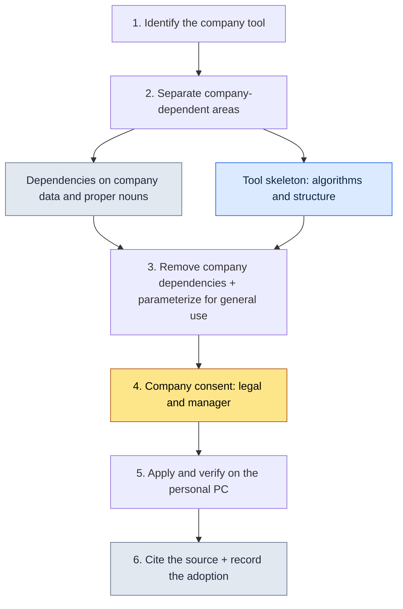

# Appendix B. Tool Adoption Procedure (Generalizing from Company to Personal Use)

> This appendix documents the procedure I used to bring the tools and skills I had built and operated on the company's Project A over to my personal PC and to general-purpose work. The core question is a single one: "How do I legitimately take only the skeleton of the tools I learned to build there, without infringing on the company's knowledge assets?" This appendix shows where I drew that line, what I brought over and what I left behind, and how I kept a record of those decisions.

Here is how to use this appendix. First, read the five principles in B.1 against your own situation, then walk through the procedure in B.3 once, exactly as written. After that, copy the record template in B.4 and fill it in for the tool you want to bring over. Because this involves company assets, "leaving a trail" takes priority over "moving fast," and this entire appendix is structured from that perspective.

---

## B.1 The Five Principles of Adoption

These are the five principles I settled on before bringing any tool over. They are not a sequence but conditions that must hold simultaneously; if even one collapses, the adoption itself goes on hold. The first three are technical boundaries about "what to take," and the last two are procedural boundaries about "how to take it with a clear conscience."

| Principle | Description |
|---|---|
| 1. No company IP included | Remove company names, real names, and proper nouns |
| 2. Take only the tool skeleton | Block company domain data |
| 3. Reconstruct for general use | Rebuild around general use cases |
| 4. Clear citation and attribution | State explicitly that the tool was adopted from the company |
| 5. Legal and HR agreement | Go through the company's consent process |

The line that wavers most often is number 2. You may take the algorithm and the structure (the skeleton), but the moment the company data formats that the skeleton assumed come along with it, you have taken IP. Separating skeleton from data is the real substance of adoption.

---

## B.2 The Six Tools and Skills I Adopted

Following these principles, the tools I actually brought to my personal PC number six (as of May 2026). They share one trait — all of them handle data — and that is no coincidence. Data-processing tools are comparatively easy to split into skeleton (parsing, transformation, and visualization logic) and domain (the specific formats of company sheets).

| Tool | Company original | Personal generalized edition |
|---|---|---|
| excel-reader | xlsm sheet and VBA extraction | General-purpose Excel processing |
| relation-map-gen | FK relationship HTML | General-purpose data relationship maps |
| schema-doc | Markdown schema generation from sheets | General-purpose schema documentation |
| table-creator | Mass production of data tables | General-purpose table generation |
| gdd-gen | Automatic GDD (game design document) generation | General-purpose document generation |
| gdd-export | Markdown to multi-sheet xlsx conversion | General-purpose xlsx conversion |

Compare the middle and right columns and what generalization means becomes visible. The left side carries domain-laden names like "company sheets" and "GDD"; the right side carries names with the domain stripped out, like "general-purpose Excel" and "general-purpose documents." The company disappearing from the name is the first sign of generalization.

---

## B.3 The Adoption Procedure

Translating the principles (B.1) into actual hand movements yields the six steps below. The two critical junctures are steps 2 and 4. If you fail to cleanly split skeleton from domain in step 2, every step after it gets contaminated; and if you skip the company's consent in step 4, the tool is unusable no matter how well you build it.



Of the six steps, the one that takes the longest is not the code work (steps 2 and 3) but step 4 — reaching agreement with the company and clearing legal review. The biggest gate is trust, not technology, which is why adoption always runs in this order: secure the agreement first, polish the code later.

---

## B.4 The Adoption Record

An adopted tool must always come with a record. A moment may arrive later when someone asks, "Where did this tool come from, what was removed, and whose consent did it have?" Below is the record template using excel-reader as the example; copy this frame as is and fill it in for your own tool.

```yaml
---
tool: excel-reader (personal generalized edition)
original_source: Project A (company)
adopted: 2026-05
permission: Company manager + legal review cleared
modifications:
  - Removed dependency on company sheet formats
  - Removed company domain functions (xlsm VBA)
  - Generalized to standard csv/xlsx processing
  - Removed all references to company names and real names
usage_in_book: Cited as tool examples in this book (Parts 1, 5, 6, 8, etc.)
---
```

For the date field (`adopted`), write a confirmed year-month like `2026-05`. A loose entry like "around May 2026" reads like a blank to be filled in later, so pin down the moment you confirmed the adoption right then and there.

The two most valuable lines in this record are `permission` and `modifications`. The former proves the adoption was legitimate; the latter proves what was stripped out. With these two lines in place, a traceable basis remains even if questions are raised later.

---

## B.5 Tools I Did Not Adopt

What I left behind matters as much as what I brought over. Here are the company tools I deliberately chose not to adopt, and why. What they have in common is that they are either core company IP or so deeply bound to the company's organizational structure that skeleton and domain cannot be pulled apart.

| Tool | Reason not adopted |
|---|---|
| Company combat system tools | Core company IP, company-exclusive |
| Company narrative documentation tools | Depends on the company's world setting |
| Company combat task force (TF) tools | Depends on the company's organizational structure |
| Company HR and finance tools | Does not fit external environments |

This contrasts precisely with the adopted tools in B.2, which were all "data processing." What I brought were tools separable from their domain; what I left were tools fused with their domain. Separability determines adoptability.

---

## B.6 For the Reader — A Pre-Adoption Self-Checklist

Finally, here are the five items you must pass yourself through before bringing a tool over. This table is a pass/fail checklist: adopt only when all five items pass, and hold off if even one fails. There is no "mostly fine." Partial passes do not work when company assets are involved.

| Check item | Pass criterion |
|---|---|
| Did you obtain the company's consent | Explicit agreement from manager and legal |
| Did you clear legal review | Written or recorded confirmation |
| Did you completely remove company IP | Zero hits on the grep watchlist |
| Did you verify generality | Confirmed working in other environments |
| Do you have an incident response procedure | Tracing and recall paths defined |

Read these five items not as five boxes to tick but as five locks. Bringing what you learned at a company into your personal assets legitimately is entirely possible — but that legitimacy holds only when all five locks are engaged.
