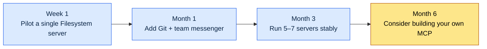

# Appendix E. MCP Server Catalog (A Game Design Perspective)

MCP (Model Context Protocol) is the channel through which an LLM connects to external tools and data in a standardized way. Part 20 covered project management MCP servers, but the MCP servers you can pull into a game design workflow go far beyond that. This appendix is a catalog that gathers those candidates in one place and assigns priorities for the order in which they are worth adopting.

The point of this catalog is not "install all of these" but "know where to look when you need one." If you attach several MCP servers at once, you cannot tell which one is causing problems. Follow the adoption cycle in E.4 and add them one at a time.

Here is how to use it. At first, look only at the P0 list in E.2.1. Once the basics are in place, move on to E.2.2 (P1); when your team develops specific needs, consider E.2.3 (P2) or E.3 (building your own). If cost is a concern, read E.5 first; if you want to prepare for failures, start with E.6.

---

## E.1 The Four Application Areas of MCP

MCP servers fall into four broad areas depending on what they connect to. Most of the tools a game designer touches every day fit inside them.

| Area | MCP Servers |
|---|---|
| Project management | ClickUp, JIRA, Linear |
| Documents | Confluence, Notion, Google Drive |
| Collaboration | Team messengers (Slack, Discord, etc.) |
| Data | Excel, Google Sheets, DB |

Project management leads to tasks and schedules, documents to design docs and wikis, collaboration to team communication, and data to balance and item sheets. Pin down which area the tools your team already uses belong to, and the adoption candidates narrow themselves naturally.

---

## E.2 Recommended MCP Servers (Game Design Priorities)

I assigned the priorities by one criterion: does work stall without it? P0 is the foundation for almost all work, P1 makes things much easier to have, and P2 is a choice that depends on your team's situation.

### E.2.1 P0 — Adopt First

| Server | Use | Notes |
|---|---|---|
| Filesystem MCP | Local file access | Foundational |
| Git MCP | Change tracking | Essential |
| Team messenger MCP | Team communication | Recommended |
| Collaboration tool MCP (ClickUp, JIRA, etc.) | Tasks | Your company's tool |

Filesystem and Git come first because they are the foundation that lets the LLM read materials and follow change history. The team messenger MCP pulls in team context, and for tasks, connect whatever tool your company already uses — whether that is ClickUp or JIRA.

### E.2.2 P1 — Add Next

| Server | Use |
|---|---|
| Wiki MCP (Confluence, Notion, etc.) | Wiki |
| Google Drive MCP | Externally shared materials |
| Excel MCP | Direct sheet queries |
| Mermaid MCP | Diagram rendering |

Once P0 is stable, expand toward documents and data. Excel MCP in particular lets the LLM query balance sheets directly, which makes it highly useful in game design. Mermaid MCP renders design diagrams on the spot, so it never breaks the documentation flow.

### E.2.3 P2 — Optional

| Server | Use |
|---|---|
| Discord MCP | User community |
| GitHub MCP | External collaboration |
| Linear MCP | Alternative task tool |
| Notion MCP | Alternative wiki |

P2 servers are alternatives or built for specific situations. Attach Discord if you run a user community, and GitHub if you collaborate with outside parties often. Linear and Notion are substitutes for tools you have already adopted, so there is no need to install duplicates.

---

## E.3 Game-Specific MCP Servers (Built by the Author)

Where commercial MCP servers leave a gap, I build my own. Below are the MCP servers I developed in-house to fit my game design workflow. All of them exist to query the systems covered in the main text — atoms, decision cards, and meeting notes — directly from the LLM.

| Server | Use |
|---|---|
| Atom MCP | atom search and lookup |
| Decision Card MCP | Decision card lookup and creation |
| KPI Dashboard MCP | Dashboard data |
| Meeting Notes MCP | Meeting notes search |

These four handle in-house assets that commercial tools do not cover: knowledge atoms, decision history, and meeting notes. Building your own is a heavy lift, so defer it to the last stage of the E.4 cycle and start only once it is clear that no commercial MCP server can fill the gap.

---

## E.4 The MCP Adoption Cycle

Attach MCP servers all at once and it becomes hard to isolate the cause of a problem. The cycle below stretches one principle — one at a time, and the next only after the last is stable — along a time axis.

There is exactly one core rule: never adopt 5 at the same time. Each time you attach a new MCP server, spend a few days watching whether that one runs stably before moving on to the next.

---

## E.5 MCP Operating Costs

| Server | Cost |
|---|---|
| External MCP (open source) | Infrastructure only |
| Self-hosted | Infrastructure + operations |
| Commercial MCP | Monthly subscription |

The cost structure splits three ways. Open-source MCP servers cost only the infrastructure to run them, self-hosting adds the cost of operations staff on top, and commercial MCP servers charge a subscription. Running 8–10 servers, the monthly cost comes to roughly $50–200 by my estimate, but it varies widely with your configuration — treat it as a direction, not a figure.

---

## E.6 Incident Response

| Incident | Response |
|---|---|
| MCP server outage | Run fallbacks for critical servers |
| Permission incident (wrong data modified) | Default to read-only |
| Data leak | Self-host sensitive data |
| Cost explosion | Cap + monitoring |

MCP wires external tools directly into the LLM, so a single bad write can corrupt real data. That is why the default stays read-only, and write permission opens only on servers that truly need it. Prepare fallbacks for critical servers in case of outages, and run any MCP server that handles sensitive data on self-hosted infrastructure rather than externally. Contain cost with a cap and monitoring together.

---

## E.7 Pre-Adoption Self-Checklist

The preceding sections covered what to attach, in what order, and at what cost. This table collects the items you should pass yourself through right before actually attaching a single MCP server. Instead of rereading the catalog from the top, recheck just these five lines every time you add a new MCP server. Each of the five items compresses a core rule from an earlier section into one line.

| Check Item | Pass Criterion | Source Section |
|---|---|---|
| Which area does it belong to | Clearly falls under one of project management, documents, collaboration, or data | E.1 |
| Is it the right priority for now | P1 only after P0 is stable, then P2 — in that order | E.2 |
| Are you attaching one at a time | No adopting several at once | E.4 |
| Are permissions minimal | Read-only by default; write only on servers that truly need it | E.6 |
| Is there a cost ceiling | A cap and monitoring are both in place | E.5 |

Of the five items, the one most often skipped is "one at a time." Put several MCP servers up at once and, when a problem appears, you cannot tell which server is to blame. Attach an MCP server only when it passes all five lines; if it trips on even one, push that server to the next cycle.
