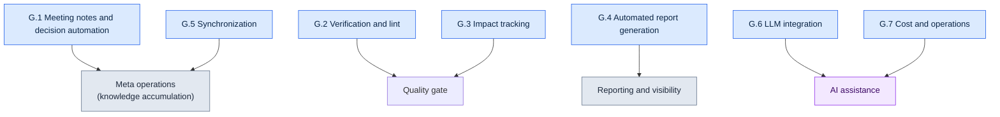

# Appendix G. Operations Script Casebook

This appendix is a casebook that gathers in one place the operations automation scripts mentioned in the main text. The main text explained why each script was needed as part of the larger flow, but when you actually sit down to build something similar, you need a map that shows at a glance which scripts exist and how they group by role. This appendix is that map.

For each script I list its name, a one-line description, and the section of the main text where it appears. For the core scripts that generalize cleanly — the format lint (G.1.1), the integrity check (G.2.1), the relation graph (G.3.1), and the cost tracker (G.7.1) — and for the test and hook examples in G.8, I included real code: written fresh as general skeletons unrelated to any company material and verified to run as is. The sample inputs, outputs, and exit codes are all values I confirmed by actually running them. The remaining entries carry only a name, a role, and the linked section in the main text; I explain the reason honestly in G.9. Use the real-code entries as models to build implementations that fit your own environment.

Here is how to use it. First decide the nature of the task you want to automate (verification, report generation, or synchronization), then open the matching section (G.1 through G.7). Pick the closest script there, follow the section number in parentheses back to the main text to check the context and design intent, and finally test your own script against the operating principles in G.8.

Grouped by role, the full set looks like this.



---

## G.1 Meeting Notes and Decision Automation

This group of scripts keeps decisions made in meetings from scattering, so they accumulate as knowledge assets. It runs as one continuous line from meeting-note linting through atom extraction to formal promotion.

### G.1.1 meeting_lint.py

Checks whether a meeting note follows the required format (mandatory frontmatter and mandatory sections). A note with a broken format breaks the automated extraction downstream, so this blocks it at the door (17.2.2).

Below is a general skeleton, unrelated to any company material. It uses only the standard library (just sys) and runs as is. It checks that a Markdown meeting note has all the frontmatter keys (the block wrapped in `---`) and all the body section headings (`## ...`). If anything is missing, it emits violations and exits 1; if everything is present, it exits 0.

```python
#!/usr/bin/env python3
"""meeting_lint.py

Checks whether a Markdown meeting note follows the required format.
- Whether the frontmatter (--- block) contains all required keys.
- Whether the body contains all required section headings (## ...).
If anything is missing, print the violations and exit 1; otherwise exit 0.
Uses only the standard library.

Usage:
    python meeting_lint.py meeting.md
"""
import sys

REQUIRED_FRONTMATTER = ["type", "date", "category", "attendees"]
REQUIRED_SECTIONS = ["## Agenda", "## Decisions", "## Action Items", "## Next Meeting"]


def lint(text):
    """Take the meeting-note text and return the list of missing items (violations)."""
    violations = []

    # Frontmatter: if the first line is ---, treat everything up to the next --- as frontmatter.
    lines = text.splitlines()
    front = []
    if lines and lines[0].strip() == "---":
        for line in lines[1:]:
            if line.strip() == "---":
                break
            front.append(line)
    front_keys = [ln.split(":", 1)[0].strip() for ln in front if ":" in ln]
    for key in REQUIRED_FRONTMATTER:
        if key not in front_keys:
            violations.append({"kind": "frontmatter", "missing": key})

    # Sections: check that each heading line appears verbatim in the body.
    body_lines = [ln.strip() for ln in lines]
    for section in REQUIRED_SECTIONS:
        if section not in body_lines:
            violations.append({"kind": "section", "missing": section})

    return violations


def main(argv=None):
    argv = sys.argv[1:] if argv is None else argv
    if len(argv) != 1:
        sys.stderr.write("Usage: python meeting_lint.py meeting.md\n")
        return 2
    with open(argv[0], encoding="utf-8") as f:
        violations = lint(f.read())

    for v in violations:
        print(f"[VIOLATION] {v['kind']}: {v['missing']}")
    if violations:
        sys.stderr.write(f"[FAIL] {len(violations)} format violations\n")
        return 1
    sys.stderr.write("[PASS] format OK\n")
    return 0


if __name__ == "__main__":
    sys.exit(main())
```

The two constants are the check criteria. For example, feed it a meeting note whose frontmatter is missing `attendees` and whose body lacks `## Next Meeting`, and it catches both, like this, with exit code 1.

```text
[VIOLATION] frontmatter: attendees
[VIOLATION] section: ## Next Meeting
```

### G.1.2 decision_parser.py

Reads the "Decisions" section of a meeting note and automatically extracts knowledge-atom candidates. It replaces the work a person used to do by hand, copying entries one by one (17.2.3).

### G.1.3 promote.py

Promotes atoms in pending (awaiting review) state to the formal atom folder. It puts a human review gate between automated extraction and formal assets (17.2.6).

---

## G.2 Verification and Lint

These are quality gates that automatically catch data and content that break the rules. The machine filters out the consistency errors that human eyes easily miss.

### G.2.1 integrity_check_id_uniqueness.py

Verifies that data entry IDs are unique, with no duplicates. An ID collision is an accident that only blows up at runtime, so this stops it at the data stage (10.1.2).

Below is a general skeleton, unrelated to any company material. It uses only the standard library (csv, json, sys, argparse), and you can save it and run it right away. The input is a simple format any game data set would plausibly have: a CSV with an `id` column.

```python
#!/usr/bin/env python3
"""integrity_check_id_uniqueness.py

Checks that the id column of a CSV is unique.
- If duplicate ids exist, print the violation list and exit 1.
- If all ids are unique, exit 0.
Uses only the standard library.

Usage:
    python integrity_check_id_uniqueness.py data.csv
    python integrity_check_id_uniqueness.py data.csv --id-column quest_id
"""
import argparse
import csv
import json
import sys


def find_duplicate_ids(rows, id_column):
    """Find duplicate id_column values in rows (a list of dicts).

    Returns: a list of violations. Each entry has the form
    {"id": value, "row_numbers": [1-based row number, ...]}.
    The header counts as row 1, so the first data row is 2.
    """
    seen = {}  # id value -> list of row numbers where it appeared
    for index, row in enumerate(rows):
        row_number = index + 2  # data rows start after the header (row 1)
        key = row.get(id_column, "")
        seen.setdefault(key, []).append(row_number)

    violations = []
    for key, row_numbers in seen.items():
        if len(row_numbers) > 1:
            violations.append({"id": key, "row_numbers": row_numbers})
    violations.sort(key=lambda v: v["row_numbers"][0])
    return violations


def load_rows(csv_path):
    with open(csv_path, newline="", encoding="utf-8") as f:
        return list(csv.DictReader(f))


def main(argv=None):
    parser = argparse.ArgumentParser(description="Check CSV id uniqueness")
    parser.add_argument("csv_path", help="path to the CSV file to check")
    parser.add_argument("--id-column", default="id", help="column name to use as the id (default: id)")
    args = parser.parse_args(argv)

    rows = load_rows(args.csv_path)
    violations = find_duplicate_ids(rows, args.id_column)

    # G.8 output standard: emit violation_list as JSON on stdout.
    print(json.dumps({"violation_list": violations}, ensure_ascii=False, indent=2))

    if violations:
        sys.stderr.write(f"[FAIL] {len(violations)} duplicate ids found\n")
        return 1
    sys.stderr.write("[PASS] no duplicate ids\n")
    return 0


if __name__ == "__main__":
    sys.exit(main())
```

Sample input (`data.csv`):

```text
id,name
Q001,First Commission
Q002,The Lost Norigae
Q001,First Commission (duplicate)
```

Running it produces the following. `Q001` appears twice, on rows 2 and 4, so one violation is caught and the exit code is 1.

```json
{
  "violation_list": [
    {
      "id": "Q001",
      "row_numbers": [2, 4]
    }
  ]
}
```

### G.2.2 voice_lint.py

Checks NPC dialogue for voice consistency (speech style and personality). It catches the mismatch where the same character speaks differently from one chapter to the next (5.2, 5.4).

### G.2.3 visual_regression.py

A regression-check script that compares assets (art, UI, and so on) after a change to see whether unintended visual changes crept in (12.1.5).

---

## G.3 Impact Tracking

This group of scripts tracks what shakes loose when you change one thing. It follows the links among documents, decisions, and assets to show the blast radius of a change.

### G.3.1 wikilink_graph.py

Scrapes the wikilinks between documents (`[[target]]`) and automatically builds a link graph. It lets you see at a glance which document references which (24.3.4).

Below is a general skeleton, unrelated to any company material. It uses only the standard library (os, re, json, argparse). It reads the `.md` files in one folder, treats each file name (minus the extension) as a node and each `[[...]]` link as an edge, and outputs both an adjacency list and Mermaid diagram code.

```python
#!/usr/bin/env python3
"""wikilink_graph.py

Builds a graph of the [[Wikilink]] connections among .md documents in a folder.
- Nodes: file names without the extension.
- Edges: [[target]] notations in the body. For [[target|label]], only the target counts.
Uses only the standard library.

Usage:
    python wikilink_graph.py ./docs
    python wikilink_graph.py ./docs --format mermaid
"""
import argparse
import json
import os
import re
import sys

WIKILINK = re.compile(r"\[\[([^\]|#]+)")  # [[target]] / [[target|label]] / [[target#anchor]]


def extract_links(text):
    """Extract link target names from the body, in order of appearance, deduplicated."""
    result = []
    for match in WIKILINK.findall(text):
        target = match.strip()
        if target and target not in result:
            result.append(target)
    return result


def build_graph(doc_dir):
    """Scan the folder's .md files into a {doc name: [link target, ...]} adjacency list."""
    graph = {}
    for name in sorted(os.listdir(doc_dir)):
        if not name.endswith(".md"):
            continue
        node = name[:-3]
        path = os.path.join(doc_dir, name)
        with open(path, encoding="utf-8") as f:
            graph[node] = extract_links(f.read())
    return graph


def to_mermaid(graph):
    """Convert the adjacency list into a Mermaid flowchart code string."""
    lines = ["flowchart LR"]
    for node, targets in graph.items():
        if not targets:
            lines.append(f'    {_id(node)}["{node}"]')
        for target in targets:
            lines.append(f'    {_id(node)}["{node}"] --> {_id(target)}["{target}"]')
    return "\n".join(lines)


_ID_CACHE = {}


def _id(name):
    """Mermaid node ids must be ASCII. Korean names get short ASCII ids n1, n2, ...
    in first-seen order, and the original name is preserved in the [...] label."""
    if name not in _ID_CACHE:
        _ID_CACHE[name] = "n%d" % (len(_ID_CACHE) + 1)
    return _ID_CACHE[name]


def main(argv=None):
    parser = argparse.ArgumentParser(description="Wikilink graph builder")
    parser.add_argument("doc_dir", help="folder containing the .md documents")
    parser.add_argument("--format", choices=["json", "mermaid"], default="json")
    args = parser.parse_args(argv)

    graph = build_graph(args.doc_dir)
    if args.format == "mermaid":
        print(to_mermaid(graph))
    else:
        print(json.dumps(graph, ensure_ascii=False, indent=2))
    return 0


if __name__ == "__main__":
    sys.exit(main())
```

Sample input (three files in a `docs/` folder). The Korean file names — 세계관 (worldbuilding), 지역_한양 (region: Hanyang), 세력_의금부 (faction: Uigeumbu) — are kept as is, since handling non-ASCII names is exactly what this example demonstrates:

```text
docs/세계관.md     body links to [[지역_한양]] and [[세력_의금부]]
docs/지역_한양.md  body links to [[세력_의금부]]
docs/세력_의금부.md  no links
```

Run it with `--format mermaid` and you get the diagram code below. Nodes are processed in file-name order (세계관 → 세력_의금부 → 지역_한양), and the original Korean names survive inside the labels. You can see at a glance which document reaches where, and which one is the endpoint (`세력_의금부`).

```text
flowchart LR
    n1["세계관"] --> n2["지역_한양"]
    n1["세계관"] --> n3["세력_의금부"]
    n3["세력_의금부"]
    n2["지역_한양"] --> n3["세력_의금부"]
```

### G.3.2 decision_impact.sh

Analyzes which documents and assets a given decision card affects. Check the blast radius before you reverse a decision (18.4.3).

### G.3.3 find_skills_using.py

Finds, in reverse, the skills that use a given asset. Know what depends on an asset before you modify or delete it (11.2.4).

---

## G.4 Automated Report Generation

These scripts bundle scattered data into reports and diagrams a person can read. Automating recurring periodic reports cuts down on manual chores.

### G.4.1 alpha_gap_report_generator.py

Tallies the gap against alpha-stage targets and automatically generates a weekly report (10.3.3).

### G.4.2 decision_graph_to_mermaid.py

Converts the link structure among decision cards into Mermaid diagram code. See the flow of decisions as a picture (24.2.3).

### G.4.3 weekly_kpi_summary.py

Summarizes key performance indicators (KPIs) on a weekly basis (13.2).

---

## G.5 Synchronization

These scripts keep material scattered across multiple locations efficiently aligned. Instead of copying everything every time, they pick out and sync only what changed.

### G.5.1 incremental_sync.py

Syncs only the changed meeting notes rather than all of them. Full copies get slower as material accumulates, so it goes incremental (17.5.4).

### G.5.2 Change Detection with git diff

An approach that uses git's diff to detect efficiently what changed. No separate tracking machinery — git itself serves as the change detector (17.5.4.1).

---

## G.6 LLM Integration

These scripts delegate work that requires judgment — classification, invocation, and the like — to an LLM. Tasks that do not reduce cleanly to rules get handled with LLM assistance.

### G.6.1 faq_classifier.py

Automatically classifies incoming FAQs by category (13.1.3).

### G.6.2 meeting_classifier.py

Automatically classifies meetings into categories by their nature. It is used to fill in the category field in the meeting-note frontmatter (17.3.6).

### G.6.3 prompt_library_loader.py

Loads the prompt you need from a pre-organized prompt library, so the same prompt never gets rewritten from scratch (22.1.2).

---

## G.7 Cost and Operations

These scripts keep the automation itself from creating blind spots in cost and source tracking.

### G.7.1 llm_cost_tracker.py

Tracks LLM call costs and applies a cap. It stops a cost blowup before it happens, not after (22.3.5).

Below is a general skeleton, unrelated to any company material. It uses only the standard library (json, os, argparse). It records token counts per call, computes the running cost, and emits a rejection signal (exit 2) when the cap is exceeded. The unit prices are constants in the code; swap in the actual price table of whatever model you use (the values below are placeholders for illustration).

```python
#!/usr/bin/env python3
"""llm_cost_tracker.py

Keeps a running record of LLM call tokens and checks a daily cost cap.
- record: adds one call (input/output tokens) to the ledger file.
- If the cumulative cost exceeds the cap, exit 2 blocks the call (pre-emptive cutoff).
Uses only the standard library.

Usage:
    python llm_cost_tracker.py --ledger ledger.json --in 1200 --out 800
    python llm_cost_tracker.py --ledger ledger.json --in 1200 --out 800 --cap-usd 5.0
"""
import argparse
import json
import os
import sys

# Unit prices: USD per 1,000 tokens. Placeholder values for illustration — replace with your model's actual price table.
PRICE_PER_1K_INPUT = 0.003
PRICE_PER_1K_OUTPUT = 0.015


def cost_of(in_tokens, out_tokens):
    """Compute the cost (USD) of one call from its input/output tokens."""
    return (in_tokens / 1000) * PRICE_PER_1K_INPUT + (out_tokens / 1000) * PRICE_PER_1K_OUTPUT


def load_ledger(path):
    if os.path.exists(path):
        with open(path, encoding="utf-8") as f:
            return json.load(f)
    return {"calls": 0, "in_tokens": 0, "out_tokens": 0, "total_usd": 0.0}


def save_ledger(path, ledger):
    with open(path, "w", encoding="utf-8") as f:
        json.dump(ledger, f, ensure_ascii=False, indent=2)


def main(argv=None):
    parser = argparse.ArgumentParser(description="LLM cost tracking and cap")
    parser.add_argument("--ledger", required=True, help="path to the cumulative ledger JSON file")
    parser.add_argument("--in", dest="in_tokens", type=int, required=True, help="input tokens for this call")
    parser.add_argument("--out", dest="out_tokens", type=int, required=True, help="output tokens for this call")
    parser.add_argument("--cap-usd", type=float, default=None, help="cumulative cost cap (USD); block when exceeded")
    args = parser.parse_args(argv)

    ledger = load_ledger(args.ledger)
    this_cost = cost_of(args.in_tokens, args.out_tokens)

    ledger["calls"] += 1
    ledger["in_tokens"] += args.in_tokens
    ledger["out_tokens"] += args.out_tokens
    ledger["total_usd"] = round(ledger["total_usd"] + this_cost, 6)
    save_ledger(args.ledger, ledger)

    print(json.dumps({"this_call_usd": round(this_cost, 6), "ledger": ledger}, ensure_ascii=False, indent=2))

    if args.cap_usd is not None and ledger["total_usd"] > args.cap_usd:
        sys.stderr.write(f"[CAP] cumulative {ledger['total_usd']} USD > cap {args.cap_usd} USD — blocked\n")
        return 2
    return 0


if __name__ == "__main__":
    sys.exit(main())
```

Sample input and result. Starting from an empty ledger, recording 1,200 input and 800 output tokens makes this call cost `1200/1000*0.003 + 800/1000*0.015 = 0.0036 + 0.012 = 0.0156` USD.

```json
{
  "this_call_usd": 0.0156,
  "ledger": {
    "calls": 1,
    "in_tokens": 1200,
    "out_tokens": 800,
    "total_usd": 0.0156
  }
}
```

Pass `--cap-usd 0.01` along with it, and the cumulative 0.0156 exceeds the 0.01 cap, so exit code 2 blocks the next call. This is what "stop it before, not after" actually does.

### G.7.2 source_tracker.py

Automatically records the sources of quoted and referenced material, leaving a trail you can retrace later (24.5.4).

---

## G.8 Script Operating Principles

Making your scripts run reliably matters more than making many of them. The five principles below apply to every script above.

| Principle | Description |
|---|---|
| Simplicity | Avoid complex libraries |
| Testing | Unit-test every script |
| Output standard | Standards such as violation_list (10.1.7) |
| Version control | git |
| Human review gate | Automation still gets human review |

The last principle matters most. Automation does not replace people; it shrinks the steps that come before human judgment. Whether the script verifies, extracts, or generates, always put a gate where a person looks once before final application.

### G.8.1 Unit Test Example

Rather than leave the "testing" principle as words, here is an actual test that verifies G.2.1's core function `find_duplicate_ids` with the standard library's `unittest`. There are no external dependencies, so save it as is and run `python -m unittest test_integrity_check -v`. The key point: a function is this easy to test only when it is separated from file I/O — which is why G.2.1 splits the check logic apart from `load_rows`.

```python
# test_integrity_check.py
import unittest

from integrity_check_id_uniqueness import find_duplicate_ids


class TestFindDuplicateIds(unittest.TestCase):
    def test_no_duplicates_returns_empty(self):
        rows = [{"id": "Q001"}, {"id": "Q002"}]
        self.assertEqual(find_duplicate_ids(rows, "id"), [])

    def test_one_duplicate_reports_row_numbers(self):
        rows = [{"id": "Q001"}, {"id": "Q002"}, {"id": "Q001"}]
        self.assertEqual(
            find_duplicate_ids(rows, "id"),
            [{"id": "Q001", "row_numbers": [2, 4]}],
        )

    def test_missing_column_treated_as_empty_string(self):
        rows = [{"name": "a"}, {"name": "b"}]
        result = find_duplicate_ids(rows, "id")
        self.assertEqual(result, [{"id": "", "row_numbers": [2, 3]}])


if __name__ == "__main__":
    unittest.main()
```

Run it and all three tests pass.

```text
test_missing_column_treated_as_empty_string ... ok
test_no_duplicates_returns_empty ... ok
test_one_duplicate_reports_row_numbers ... ok

----------------------------------------------------------------------
Ran 3 tests in 0.000s

OK
```

### G.8.2 Silent Failure in Hooks (exit 0)

Of the principles above, the one that slips through most easily is hook failure handling. A hook that runs automatically before a commit or on save should be a side branch of the main task (the commit or the save). But if the hook exits nonzero because of an internal error, the main task it is attached to gets blocked outright — the auxiliary device takes the main body hostage. So an auxiliary hook, no matter what happens inside it, should only leave a warning on standard error (stderr) and return exit code 0, so the main task is never blocked. Here is the minimal form; even when an exception is raised inside, the exit code is 0.

```python
import sys

def run_hook():
    raise RuntimeError("internal error")

def main():
    try:
        run_hook()
    except Exception as exc:
        sys.stderr.write(f"[hook] warning: {exc} — not blocking the main task\n")
    return 0  # An auxiliary hook never blocks the main task, no matter what

if __name__ == "__main__":
    sys.exit(main())
```

Run it and you see the warning, but the exit code is 0. A person can tell what went wrong, and the workflow is not interrupted.

```text
[hook] warning: internal error — not blocking the main task
(exit code 0)
```

Use this "silent failure" only for auxiliary hooks. Verification whose whole purpose is the pass/fail verdict — like the quality gates in G.2 — must do the opposite: exit nonzero on failure (the exit 1 we saw earlier) and stop the pipeline. Even in the same hook slot, the exit-code policy flips completely depending on whether the hook is "auxiliary" or a "gate."

### G.8.3 How to Notice and Recover from a Silent Failure

The exit 0 policy of the previous section comes with one price. If an auxiliary hook never blocks the main task no matter what, then flip that around: **the main task keeps running fine even when the hook dies silently**. A hook that runs on a side branch, like automatic context injection, can stay down for days without a single red light in your workflow. So an auxiliary hook must always carry a companion device: alongside "failure does not block," you need "a person eventually sees the failure." Drop the companion, and one day in a retrospective you notice "this atom has not come up at all lately" — and only then learn the hook has been dead for a week.

That companion is a log. Do not let the warning from the minimal form above (`sys.stderr.write(...)`) evaporate — drop it into a file: one line per normal call, one line with the reason per failed call. In my environment this trail accumulates in `~/.claude/hooks/_injection_log.txt` (the same log the trigger verification in §21.3.4 reads). The operating loop is not grand. One lap of a three-step check-and-recover procedure is enough.

| Step | What you look at | What you do |
|---|---|---|
| Detect | Whether the log's recent normal-injection lines have stopped, or failure lines with the same reason keep repeating | Skim the log tail once during the weekly retrospective (one auto-captured line is enough) |
| Isolate | Whether the failure reason is a bug in the hook itself or in the input data (a broken manifest, a missing atom file) | Split the two by the stderr reason string — fix the code if it is a code problem, the manifest if it is a data problem |
| Recover | Whether the trigger produces a normal injection again | After the fix, enter the intended trigger once in a new session and confirm a normal line lands in the log again (same as the trigger verification in §21.3.4) |

The point is that "detect" rests not on human attentiveness but on **one log file and one retrospective line**. What exit 0 prevented was the interruption of the main task — not the concealment of failure. Failures surface through stderr into the log, the retrospective looks at that log on a schedule, and recovery reuses the trigger verification you already use. Only when "don't block + surface it + look regularly + revive the same way" travel as one bundle does a silent failure not harden into silent neglect.

---

## G.9 A Note for Readers

The code in this casebook comes in two kinds. The first — G.1.1, G.2.1, G.3.1, G.7.1, and G.8 — is code I wrote fresh as general skeletons unrelated to any company material and verified to run as is. It uses only the standard library, and every sample input, output, and exit code above is a result I confirmed by actually running it. Copy-paste it and use it right away, changing only the placeholder values — the price table, the column names — to fit your environment.

The second kind, like the rest of the entries, lists only a name, a role, and the linked section in the main text. Honestly, there are two reasons I did not print these in full. First, the original company operations scripts are company IP and cannot be carried over as is. Second, much of their logic is bound to company-specific data schemas, folder structures, and decision-card formats; strip those premises away and no code remains that a general reader could use directly. So I promoted only the four that generalize cleanly — the format lint, the integrity check, the relation graph, and the cost tracker — to real code, and left the rest as skeletons. Use these four as models and build an implementation for your own environment the same way: separate the check logic from I/O, emit the violation list on standard output, and attach unit tests.

For the procedure of taking an existing tool and adapting it, see Appendix B.
