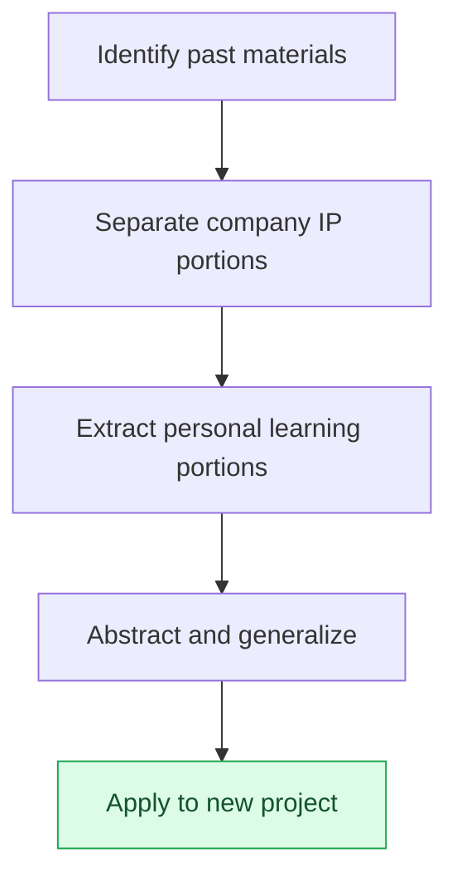

# Appendix H. Reusing Past Work Materials

A game designer who has worked long enough accumulates decades of work materials. Meeting notes, decision records, retrospectives, study notes, lessons pulled from failures. This appendix covers how to put those materials back to work on a new project. The core tension is a single one: much of the material is company IP and cannot be moved freely, yet mixed into it is personal learning that applies anywhere. Drawing the line between the two is where reuse begins.

How you use this appendix depends on where you stand. If you are about to pull old materials into a new project, follow H.2 (the separation principle) and H.3 (the procedure) in order. If you worry about causing an incident while moving things over, read H.5 (the five pitfalls) first and steer clear of them. If you are early in your career and have little material stacked up yet, see H.6 and decide what to keep — and how — starting now.

The principles here are not some grand theory of asset management. They compress into one sentence: keep the concrete at the company, take only the abstract patterns. Everything else is how to apply that sentence to real situations.

---

## H.1 The Value of Past Materials

First, let's look at what kinds of materials accumulate and how their retention rights differ. Different retention rights mean different limits on reuse.

| Material | Retention |
|---|---|
| Meeting notes (company material) | Within company authority |
| Decision cards (company material) | Within company authority |
| Quarterly retrospectives (personal + company) | Personal copy allowed |
| Study notes (personal) | Personal, permanent |
| Incident records (personal learning) | Personal, permanent |

Meeting notes and decision cards stay within company authority. Retrospectives can be kept as personal copies, and study notes and incident records are fully personal assets. Materials accumulated over many years are a major learning asset in their own right, but the boundary between company IP territory and personal territory must not blur. The clearer the boundary, the more comfortably you can reuse.

---

## H.2 Separating Company IP from Personal Learning

The criterion for separation is "concrete or abstract." Concrete deliverables belong to the company; the thinking patterns that produced them belong to you. The key point is that both aspects come out of the same work.

| Area | Company IP | Personal Learning |
|---|---|---|
| Decision content | Company | — |
| Decision patterns (this kind of decision works in this kind of situation) | — | Personal |
| Game data | Company | — |
| Operating know-how (rulebook and tool operation) | — | Personal |
| Code | Company | — |
| Algorithms and structures | — | Personal |

"Which decision was made" is company IP, but the pattern — "in this kind of situation, this kind of decision tends to work" — is personal learning. The game data values themselves belong to the company, but the know-how gained from operating that data is yours. Keep the concrete materials at the company and take only the abstract patterns — that is the separation principle.

---

## H.3 The Reuse Procedure

Turning the separation principle into actual work gives you the following five steps. Identify the materials, strip out the IP, extract the learning, generalize it, and apply it to the new project.

Always run this procedure only after checking company permissions and getting legal review. Even when the abstraction is thorough, if the starting point was company material, it is safer to have the procedural sign-off on record.

---

## H.4 A Reuse Case — This Book

The nearest reuse case is this book itself. Much of the main text started from my past work and went through the procedure above to be generalized and anonymized.

| Area | Source | Reuse |
|---|---|---|
| Layer-unified design (Part 6) | My years of operation | Personal learning → generalized |
| Meeting-notes system (Part 17) | My Project A operation | Company pattern → anonymized |
| Operating know-how (Part 24) | Accumulated over years | Personal learning → generalized |
| Appendix A inventory | Company Project A | Anonymized + partially reworked |

The Layer design and the operating know-how generalize personal learning; the meeting-notes system and Appendix A anonymize company patterns. Every item passed company consent, and every piece of company IP was anonymized without exception. The book as a deliverable is itself a demonstration of the H.3 procedure.

---

## H.5 The Five Pitfalls of Reuse

Done well, reuse is an asset; done badly, it is an incident. The five pitfalls below are spots people actually step on often, and each comes with a prescription.

### H.5.1 Pitfall 1 — Skipping Company Approval

Using materials without the company's consent escalates into a dispute. The prescription is simple: get company consent before you use anything.

### H.5.2 Pitfall 2 — Missed Anonymization

If a company name or a real name survives in even one place, it becomes an IP incident. The prescription is an automated grep check. Build a watchlist of company names, real names, and paths, and let the machine sweep them exhaustively.

### H.5.3 Pitfall 3 — Applying the Past Unchanged

Old know-how used untouched will not fit the present. The prescription is to reconstruct it for the times: keep the principle, but update the tools and the context to today.

### H.5.4 Pitfall 4 — Insufficient Abstraction

Moving only concrete cases makes them hard to apply in other environments. The prescription is to keep the abstract pattern and the concrete example side by side. The pattern carries the generality; the example carries the understanding.

### H.5.5 Pitfall 5 — Skipping the Learning Itself

No matter how much material you have, if you never open it again, it might as well not exist. The prescription is a regular learning cycle. Like daily, weekly, and monthly retrospectives, build a cadence for meeting your materials again.

---

## H.6 For the Reader — Reusing Your Own Materials

This principle is not mine alone. You can reuse the materials of your own career the same way. Below are recommended habits you can start today.

| Recommendation | Why |
|---|---|
| Retrospect on your own decisions every quarter | Pattern discovery |
| Keep study notes separately | Separation from company IP |
| State abstract patterns explicitly | Future reuse becomes possible |
| Mentoring and external talks | Pattern sharing |
| Books and blogs (after company consent) | Learning lasts |

Retrospect on your own decisions each quarter and patterns start to show; keep your study notes separate from company materials and you can pull them out later with peace of mind. Send those patterns out through mentoring, talks, and writing, and your learning lasts instead of being used once and lost. In the end, your own learning is your own asset.
