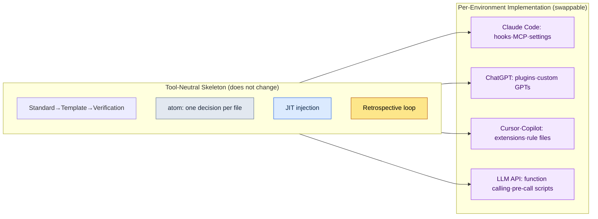

# Appendix K. Porting to Other LLMs and Harnesses

Nearly every example and tool in this book assumes a single environment: Claude Code. So there is one objection that comes up almost without fail in sign-off meetings and external reviews: "Doesn't this tie us to one company's tool?" A head of design is reluctant to approve a decision that depends on a single vendor; a skeptic suspects that if the tool changes, this book's methods collapse wholesale; and those evaluating overseas publishing rights ask whether the book is still useful in a country where a different tool is the standard. The three phrasings differ, but the substance is the same: distrust of vendor lock-in — being locked into one tool.

The purpose of this appendix is to answer that distrust. The conclusion first: the skeleton of the work this book recommends is tool neutral. It is tied neither to a specific model name nor to a specific command-line tool. Claude Code was simply the vessel that implemented that skeleton most smoothly, and the same skeleton can be poured into other vessels. This appendix (1) shows in a table what the tool-independent skeleton is, (2) pairs each element of Claude Code with its counterpart in other environments, (3) sets a principle for checking what is current, on the premise that model generations keep changing, and (4) states honestly what you lose and what you keep when you move.

---

## K.1 The Tool-Independent Skeleton

The way of working that runs through this entire book can be summarized as five pillars. None of the five is the feature name of a specific model or command-line tool; they are answers to the question of how people and AI, working together, can repeatedly produce results they can trust. That is why they remain when the tool changes.

| Skeleton | What it is | Why it is tool neutral |
|---|---|---|
| Standard → template → verification gate | Solidify agreed rules (the standard) into fill-in-the-blank forms (templates), and place an automatic checkpoint (the gate) that filters whether the result followed the rules | Rules, forms, and checks are concepts any tool can express as text and scripts |
| atom = one decision, one file | Write one decision in one small file, pull it out when needed, and when something changes, fix only that one cell | Splitting decisions into small files requires nothing but a file system |
| JIT injection | Pick out only the decisions the current conversation actually needs and feed them to the model just in time | It is the principle of "inject only the necessary context"; only the injection method differs by tool |
| Retrospective loop | Look back on the work daily, weekly, and monthly, and promote recurring patterns into rules for the next round of work | The procedure of looking back and improving runs on habit and documents, not on a tool |
| Tool-borrowing boundary | Borrow only the skeleton (algorithms, structure); leave the domain data behind (Appendix B) | The judgment of what to take and what to leave is the same in any tool |

The right-hand column of this table is the point. In all five pillars, not a single product name appears in the definition. What appears are universal concepts found in any work environment — rules, files, context, habits, boundaries. So the question "what do we do if we can no longer use Claude Code?" actually turns into a much easier question: "how do we implement these five concepts in another tool?" The answer is the next section.

---

## K.2 Element Mapping Table (Claude Code → Other Environments)

Claude Code has concrete mechanisms that make implementing the skeleton above convenient: hooks (scripts that run automatically at specific points), MCP (a protocol that connects external tools and data to the model), settings files (permissions and environment configuration), slash commands (shortcuts that invoke a frequently used procedure in one line), and skills (reusable bundles of work). These names are specific to Claude Code, but their roles have counterparts in almost every other environment. The table below shows the pairs.

| Claude Code | ChatGPT (web/app) | Cursor / Copilot | Plain LLM API |
|---|---|---|---|
| hook (automatic execution at set points) | manual pre/post-conversation procedures / custom GPT instructions | pre/post editor tasks and pre-commit hooks | pre- and post-call scripts wrapped around each call |
| MCP (external connection protocol) | plugins / actions / code interpreter | extensions / built-in tool calls | function calling / hand-built API wrappers |
| settings file (permissions, environment) | custom GPT settings screen / project settings | `.cursor` and workspace settings files | in-code config objects / `.env` and YAML config files |
| slash command (procedure shortcut) | saved prompts / custom GPTs | snippets / user-defined commands | prompt template functions |
| skill (reusable work bundle) | custom GPTs / prompt collections | rule files + scripts | modularized prompts and code functions |
| CLAUDE.md / memory | custom instructions / memory feature | project rule files (rules) | system prompt + external memory store |
| atom file collection | (tool-independent) Markdown files | (tool-independent) Markdown in the repository | (tool-independent) files and DB records |

One thing becomes clear from the table. The further right you go — toward the plain LLM API — the more "things done for you automatically" turn into "things you have to build and wire in yourself." Automatic injection that took a single hook line in Claude Code becomes a pre-call script you write yourself against a plain API. The convenience of automation shrinks, but the skeleton itself carries over intact. Porting, in other words, is not "losing features" but "re-laying the conveniences with your own hands."

This diagram is the one-page summary of the whole appendix. The upper box (the skeleton) keeps the same contents no matter which environment the arrows point to; only the lower box (the implementation) gets swapped to match the environment. When the words "vendor lock-in" come up at a sign-off meeting, open this one diagram and answer: what gets locked in is the lower box, not the upper one.

---

## K.3 The Premise That Model Names Change

When discussing porting, the information that goes stale fastest is the model name. If I nailed the latest model name as of this writing into the text, that sentence would become wrong the moment the next generation shipped. So this book follows one principle from the start: never explain by leaning on a specific model's name or generation number; explain by leaning on the role the model plays (functions such as reasoning, summarization, or code generation).

| What changes (do not nail down) | What does not change (safe to lean on) |
|---|---|
| Model product names and generation numbers | Role distinctions such as "a model that reasons well" or "a model that takes long context" |
| Specific figures for context limits | The JIT principle: "there is a limit, so inject only the context you truly need" |
| Specific figures for price and speed | The cost discipline: "run expensive work only on what has passed the gate" |
| How to switch a specific feature on and off | "The role that feature plays," and the skeleton that can replace it |

In practice, checking the latest models and features takes one line in any tool. In Claude Code, the `/model` command instantly shows the model in use and the available options, and tools like ChatGPT and Cursor show the same information in a settings screen or a model-picker dropdown. So if any sentence in this book seems to clash with a model name, the sentence is not wrong — the model is one generation on. As long as the role matches, the method applies as is. When a model name in the book looks unfamiliar, do not doubt the text; first run something like `/model` and check the current state of the tool in your hands.

---

## K.4 What You Lose and What You Keep When Porting

Switching tools clearly loses you something. Hiding that fact would cost more trust than it saves, so I will state honestly what you lose first. But what you lose is almost entirely in the territory of "convenience," and what you keep is in the territory of "skeleton." That is, what you lose can be recovered by laying it down again, and what you keep was never tied to the tool in the first place.

| Category | Item | Description |
|---|---|---|
| What you lose (convenience) | The smoothness of automatic execution | Automation that used to step in on its own, like hooks, must be rebuilt by hand as pre- and post-scripts |
| What you lose (convenience) | One integrated screen | Commands, tools, and files that gathered in a single flow may have to be spread across several tools |
| What you lose (convenience) | Skills and commands that work immediately | Slash commands and skills must be re-registered in the new tool's way |
| What you keep (skeleton) | Standards, templates, verification gates | Rules, forms, and checks are text and scripts, so they live anywhere as is |
| What you keep (skeleton) | atoms, JIT, the retrospective loop | They run on files and habits, so they survive a change of tools |
| What you keep (skeleton) | The tool-borrowing boundary (Appendix B) | The criteria for what to take and what to leave are independent of the environment |

Compressed into one sentence, the table says this: what porting loses is the convenience of automation, which time can restore; what porting keeps is the skeleton of the work, which this book tried from the very beginning to keep outside any tool. So the most honest answer to "isn't this vendor lock-in?" is this: there is a part that gets tied down, but that part is a vessel you can swap out, and the real value — the contents — was never bound to any vessel to begin with. I hope this one appendix can stand in for that answer at the sign-off table.
