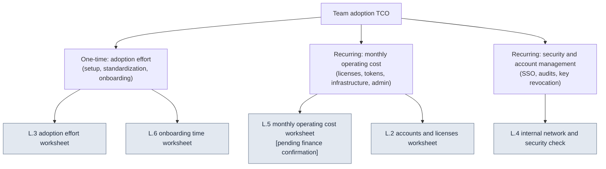

# Appendix L. Team Adoption TCO and Onboarding Worksheets

> This appendix is a fill-in-the-blanks worksheet built to answer the question studio PDs (project directors) and CEOs ask: "When a one-person, six-month system scales to a mid-sized team, what do we use to estimate adoption effort, operating costs, accounts, and internal-network security — and how?" Where §19.3 in the main text (AI Adoption Strategy and Executive Buy-In) said "don't doctor the ROI," this appendix applies the same principle to the cost side of adoption. In other words, **this appendix provides no numbers.** Every field is blank; filling those fields is your team's measurement and estimation, and no one fills a field marked `[pending finance confirmation]` with an estimate before finance does.

Here is how to use this appendix. First, in L.1, get a picture of how TCO (total cost of ownership) breaks down into line items. Then print the five worksheets in L.2–L.6 — still blank — matched to your team-size row, and either measure the values yourself or hand them to finance or information security as one-line questions. Finally, run the self-checklist in L.7 to confirm no field is missing. The value of this appendix lies not in filled-in numbers but in **turning the cost items that are easiest to forget into fields ahead of time**.

---

## L.1 TCO Is Not the License Fee

The trap PDs fall into most often is seeing adoption cost as nothing but "subscription × headcount." The real total cost of ownership is wider. It splits into one-time **adoption effort** (setup, standardization, onboarding) and recurring **monthly operating costs** (licenses, tokens, infrastructure, admin labor), with the less visible cost of **security and account management** layered on top.

Of the three branches, the ones PDs most easily underestimate are the left (adoption effort) and the right (security and accounts). The license fee arrives written on a quote, but "the effort of organizing the standards and skills one person built by hand over six months into a form the team can share" and "the security review that decides how far external LLM calls are allowed on the internal network" appear on no quote — which is why they always overrun the schedule and the budget. The worksheets in this appendix exist to surface those invisible costs first, even if only as blank fields.

> §19.3.6 in the main text said "costs get no absolute figures in this book — they are blanks to be filled by finance." This appendix lays out, item by item, where those blanks belong.

---

## L.2 Accounts and Licenses Worksheet

Fill this table in first. Write down who uses which tool, and how those permissions get issued and revoked, alongside headcounts. Fill the headcount fields with your team's actual numbers; fill the price fields from quotes or public price lists. This book does not supply prices.

| Item | What to write | Who fills it | Your team's value |
|---|---|---|---|
| Seats per tool | Number of accounts (seats) each tool needs | Lead | ______ seats |
| Permission tier distribution | full / per-task cap / one-time contractor (Appendix C.1.2) | Lead | full __ / regular __ / contractor __ |
| Per-seat price | Monthly per-seat fee for each tool | Finance/Purchasing | ______ per seat per month |
| Shared key or not | Team-shared API key vs. per-person keys | InfoSec | □ Shared □ Per-person |
| Issuance procedure | Path and lead time for issuing accounts to new hires | Lead | ______ |
| Revocation procedure | Path for reclaiming keys/seats at departure or contract end | InfoSec | ______ |

There are two rules. First, **do not issue standing seats to contractors and short-term staff — open and revoke access per task** (Appendix C.1.2). Second, **if the revocation procedure field is blank, do not start issuing.** The most common incident is a departed employee's account going unrevoked, leaking cost and key exposure at the same time — so design revocation before issuance.

---

## L.3 Adoption Effort Worksheet by Team Size

This table estimates, by team size, the one-time effort that grows when "one person, six months" scales to a team. Fill the effort fields in **person-days (the amount of work one person does in one day)**, measured or estimated by your own team. This book provides no person-day figures — they vary too widely with the team's skill level and how organized its existing standards already are.

| Adoption effort item | 1–3 people | 4–10 people | 11–30 people | 31–50 people | Measured/estimated by |
|---|---|---|---|---|---|
| Environment install and setup (tools, hooks, permissions) | ___ person-days | ___ person-days | ___ person-days | ___ person-days | Lead/Infra |
| Turning one person's assets into team-shared form (organizing skills, standards, atoms) | ___ person-days | ___ person-days | ___ person-days | ___ person-days | Lead |
| Establishing team standards (naming, frontmatter, rulebook — Appendix D) | ___ person-days | ___ person-days | ___ person-days | ___ person-days | Lead |
| Building verification gates (lint and rulebook automation) | ___ person-days | ___ person-days | ___ person-days | ___ person-days | QA/Lead |
| Producing onboarding materials (tied to L.6) | ___ person-days | ___ person-days | ___ person-days | ___ person-days | Lead |
| Total (one-time adoption effort) | ___ person-days | ___ person-days | ___ person-days | ___ person-days | — |

The field most easily skipped in this table is the second row. The assets one person piled up over six months — in their head and in personal folders — take separate, dedicated effort for someone to pull out, organize, and turn into documents before a team can share them. Budget this effort at "0" and the adoption schedule slips, without exception. The table's shape also shows in advance that as headcount grows, **standards-setting and verification-gate** effort climbs more steeply than install effort — more people means more standards that have to be agreed on.

> Follow the staged adoption in §19.3.1 (conservative → progressive) and you don't have to spend this effort in a single quarter; you can spread it out, starting from the Stage 1 (context injection) pilot. Don't try to get the table's total approved in one shot — peel off just the Stage 1 effort and get that approved first. That is the realistic move.

---

## L.4 Internal Network and Security Check Worksheet

This is the area PDs and CEOs fear most directly. It checks, item by item, what leaves for external LLMs and how far external calls are allowed from the internal network. This table is a checklist that sorts pass from hold (tied to Appendix C.6, Security); if even one item is undecided, adoption in that scope goes on hold.

| Check item | Pass bar | Owner | Status |
|---|---|---|---|
| Scope of data sent to external LLMs | Sensitive data via placeholders / self-hosting (C.6) | InfoSec | □ Pass □ Hold |
| Payment and personal data transmission | Prohibition codified, no exceptions | InfoSec | □ Pass □ Hold |
| Internal-network outbound call policy | Allowed domains, proxy, log retention period defined | Infra | □ Pass □ Hold |
| Whether self-hosting is needed | Decide whether core IP runs on a self-hosted model | CEO/InfoSec | □ Decided □ Undecided |
| Key exposure incident response | Immediate rotation + usage history review path (C.7) | InfoSec | □ Pass □ Hold |
| Audit logs | Who called what, and when — recorded and retained | Infra | □ Pass □ Hold |
| Company IP leak screening | Advance screening such as a grep watchlist (Appendix B.6) | Lead | □ Pass □ Hold |
| Contractor access isolation | Contractor accounts blocked from core assets, isolated per task | InfoSec | □ Pass □ Hold |

The field where cost diverges most in this table is the fourth row (whether self-hosting is needed). Decide that core IP can never be sent to an external LLM, and the entire cost of self-hosted infrastructure lands on the operating costs in L.5. That is why this decision belongs not to the lead but to **the CEO and information security together**, and until it is made, the infrastructure field in L.5 cannot be finalized. The two worksheets connect through this one field.

---

## L.5 Monthly Operating Cost Worksheet [Pending Finance Confirmation]

This table breaks the recurring monthly costs into line items. **Every amount field in this table is blank, and no one fills a field marked `[pending finance confirmation]` with an estimate before finance does.** Token prices, subscriptions, and infrastructure fees shift every month with models, call volume, and contracts, so this book writes no absolute figures.

| Operating cost item | How it's calculated | Who fills it | Monthly amount |
|---|---|---|---|
| Licenses and subscriptions | Seat count × per-seat price (L.2) | Finance | [pending finance confirmation] |
| LLM token costs | Call volume × token price, sum of per-tool caps | Finance | [pending finance confirmation] |
| Infrastructure (if self-hosting) | Servers, GPUs, storage per the L.4 decision | Finance/Infra | [pending finance confirmation] |
| Backup and sync | Repository and backup storage (Appendix C.5) | Finance | [pending finance confirmation] |
| Operations admin labor | Hours spent managing tools, keys, and logs, converted to cost | Lead/Finance | [pending finance confirmation] |
| Monthly total | Sum of the items above | Finance | [pending finance confirmation] |

This table has exactly one rule: **a blank stays blank.** Recall the failure in §19.3.2, where the AI fabricated a plausible `$4,500` into the operating-cost field — human or AI, the moment someone fills this field with an estimate, the report collapses at the first question. The real device that controls cost is not an amount but **a structure where each tool carries a monthly cap and overruns get reported automatically** (§19.3.6). What you show executives at approval time is not filled-in amounts but that structure — "caps are in place and overruns get reported" — plus the list of blanks finance will fill.

> The fifth row (operations admin labor) is the one most often dropped. A tool is not done once installed; it eats someone's hours every month — revoking keys, reading logs, adjusting caps. Leave this field at 0 and that work hides as the lead's invisible overtime.

---

## L.6 Onboarding Time Worksheet

This table estimates, stage by stage, how long it takes one new member to start pulling their weight on top of the system. The most accurate way to fill the time fields is to actually run one onboarding on your team and measure it (the same method as the baseline measurement recipe in §19.3.7). Until measured, leave them blank.

| Onboarding stage | What happens | Measured time | Notes |
|---|---|---|---|
| Environment setup | Through tool, hook, and account setup | ___ hours | Tied to the L.2 issuance procedure |
| Learning the standards | Naming, frontmatter, rulebook (Appendix D) | ___ hours | Shorter if materials exist |
| First task (conservative) | First deliverable via context injection, passing review | ___ hours | Stage 1 of §19.3.1 |
| Adapting to verification gates | Working within the lint and rulebook gates | ___ hours | — |
| Reaching independent work | Can work and make accept/reject calls unsupervised | ___ days | The bar for onboarding completion |

Fill in this table and it becomes clear why the "producing onboarding materials" field in the adoption effort worksheet (L.3) matters. The better organized the onboarding materials, the shorter the second and third rows — and the more new members you add, the more that saving compounds. Producing onboarding materials is a one-time effort, but the payback repeats once per member. What §19.3.3 in the main text meant by "221 JIT auto-injections — new members work on top of the same rules" shows up in this table as a shorter third row.

> The last row (reaching independent work) is the real completion bar for onboarding. Mistake "environment setup finished" for "onboarding finished," and the supervision cost keeps piling onto the lead. The bar has to be "makes accept/reject calls without supervision."

---

## L.7 Pre-Adoption Self-Checklist

Finally, these are the items to pass on your own before taking the worksheets to executives. In the same spirit as Appendix B.6 (the pre-adoption check), if even one item is blank, postpone the approval request and fill that field first.

| Check item | Pass bar |
|---|---|
| Is the account revocation procedure defined? | The revocation procedure field in L.2 is not blank |
| Have all security checks passed or been decided? | Zero □ Hold / □ Undecided entries in L.4 |
| Have the operating-cost blanks gone to finance? | The L.5 [pending finance confirmation] items sent out as questions |
| Is the adoption effort split into stages? | Approval starts from the Stage 1 effort, not the L.3 total |
| Is the onboarding completion bar "independent work"? | Completion judged by the last row of L.6 |
| Are no estimates written as assertions? | Every estimated field labeled with "estimate + sample size" |

Please don't read this table as five boxes to pass — read it as six locks. Scaling a one-person system to a team is absolutely possible, but the cost of that scaling is not the license fee; the full picture appears only once you have honestly filled in these six blanks. And don't ask the AI to fill in any of them — as in §19.3.2, AI fills blanks with plausible numbers. The AI's seat ends at taking the values you measured and shaping them into the sentences on the approval slide.
