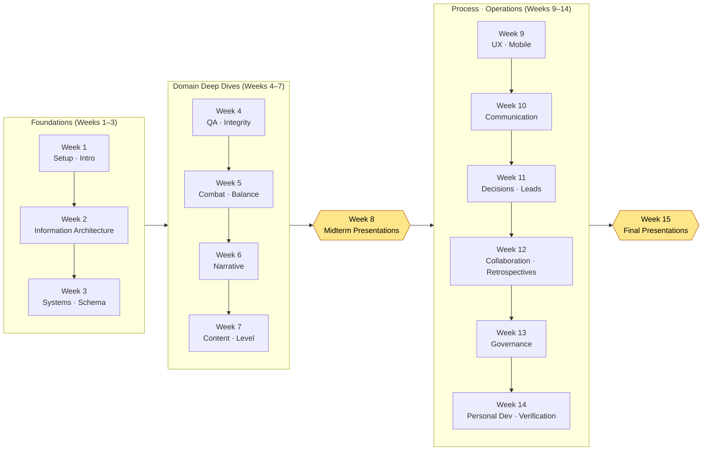

# Appendix N. A 15-Week Course Schedule and Difficulty Guide

This appendix is for anyone who wants to build a semester-long course on top of this book — instructors at universities, colleges, and academies, in-house training leads, study-group organizers. Splitting a single volume of nearly 1,000 pages across a semester is more daunting than it looks. Which parts go into which weeks, how the Try It Yourself sections in the body become assignments, what criteria to grade submissions by — when those three questions stall, even a good book is hard to adopt as a textbook. This appendix turns those three things into tools you can copy as is.

Here is how to use it. First, read the 15-week schedule in N.1 against your own academic calendar (16-week and intensive-term variants are kept separately in N.2), then gauge your students' level with the difficulty badges and prerequisite table in N.3. After that, copy the grading rubric in N.4 and swap in the items for your own assignment. Every table is built so you can print it as is and paste it into your syllabus.

One thing worth saying up front. Every chapter in this book ends with a Try It Yourself. The body's goal was never a chapter you read and close — it was a chapter that gets your hands moving today. In a course, that very Try It Yourself becomes the primary raw material for assignments. That is why the schedule in this appendix also notes how each Try It Yourself in the body is carried over into a weekly assignment.

---

## N.1 The Standard 15-Week Schedule

This is the standard schedule, built for the most common 15-week semester (one 3-hour session per week). It does not cover all 24 parts of this book in one semester — cram them in and nothing stays in anyone's hands. Instead, the structure I chose is this: **lay the foundation (Parts 1 and 2) solidly, go deep on five or six representative domains, and close with only the essentials of process and operations.** Parts left uncovered are marked as Further Reading, so students with the interest can open them on their own.

Every learning objective is written as a verb of what students will be able to do — not "knows" but "builds, verifies, chooses." This whole book repeats a single sentence — the AI proposes candidates and a human filters them — so the verbs in the objectives follow that division of labor.

| Week | Parts and Chapters | Learning Objectives (What Students Can Do Afterward) | Try It Yourself Converted into the Assignment |
|---|---|---|---|
| 1 | 1.0 Before You Start + Part 1 (Introduction) | Explain terminals, accounts, and pricing, install the AI tool on their own PC, and open a first session | The 1.0 setup Try It Yourself — submit an installation screenshot plus the first prompt and output |
| 2 | Part 2 (Information Architecture) | Turn documents into data with YAML frontmatter and design folder and naming conventions | The 2.1 frontmatter Try It Yourself — add frontmatter to three of their own documents |
| 3 | Part 3 (Systems Design) | Define a data sheet's $schema first, following the schema-first principle | The 3.2 schema Try It Yourself — write the spec for one mini sheet |
| 4 | Part 10 (QA and Integrity) | Follow along and build a tool that checks FK integrity across 30 sheets in code | The 10.1 integrity check Try It Yourself — **the core assignment, graded with the N.4 rubric** |
| 5 | Part 4 (Combat) + Part 8 (Balance) | Decompose combat numbers into Layers and keep a deterministic balance formula as a rulebook | The 8.1 balance formula Try It Yourself — one damage formula plus a simulation |
| 6 | Part 5 (Narrative) | Build an NPC dialogue voice_profile and catch tone drift with voice_lint | The 5.2 voice_profile Try It Yourself — a voice profile for one character |
| 7 | Part 6 (Content) + Part 7 (Level) | Distinguish the two axes of procedural generation (rules vs. AI) and mass-produce and review content candidates | The 6.2 generator Try It Yourself — generate 10 content candidates plus a review log |
| 8 | **Midterm Check-in and Presentations** | Integrate the Weeks 1–7 assignments and demo them as their own mini project | Midterm presentation (an integrated demo of the Weeks 3–6 deliverables) |
| 9 | Part 9 (UX/UI) + Part 14 (Mobile) | Run a HUD through lint to catch gaze drift and contrast shortfalls, and compress a PC HUD for mobile | The 9.1 HUD lint Try It Yourself — a lint report for one screen |
| 10 | Part 16 (Communicator) + Part 17 (Meeting Notes) | Canonize only the decisions from an isolated workspace, and structure meeting notes | The 17.x meeting notes Try It Yourself — structure one real meeting recording |
| 11 | Part 18 (Decision-Making) + Part 19 (Team Lead) | Leave decisions as traceable cards and turn the vision into a scorecard for decisions | The 18.1 decision tracking Try It Yourself — write three decision cards |
| 12 | Part 20 (Collaboration Memory) + Part 21 (Self-Improvement) | Run collaboration context as memory and turn retrospectives into a self-improving loop | The Part 21 retrospective Try It Yourself — one weekly retrospective plus one extracted rule |
| 13 | Part 22 (Governance) | Inspect the boundaries of prompts, hallucination, cost, legal, and ethics, and set the rules | The 22.1 prompt Try It Yourself — one work order plus a hallucination-check procedure |
| 14 | Part 23 (Personal Development) + Part 24 (Operations Deep Dive) | Port the tools to a solo scale-down, and verify integrity, links, and staleness in code | The 24.1 verification Try It Yourself — one verification script for their own project |
| 15 | **Final Project Presentations and Evaluation** | Design, demo, and verify one workflow of their own that spans the whole semester | Final presentation (evaluated with the extended N.4 rubric) |

> **Further Reading (not covered in the course; self-study recommended):** Part 11 (Characters, Pets, and Mounts), Part 12 (Art Direction), Part 13 (Data and KPIs), Part 15 (Live Ops). These four parts are strongly domain-specific, so I left them for students to open according to their own field. Appendix F (the case index) works as a guide: students can start from the cases closest to their own environment and trace backward from there.

The flow of the schedule at a glance: foundations → domain deep dives → midterm integration → process and operations → final integration — a structure with two peaks (midterm and final).

---

## N.2 Semester-Length Variants (16 Weeks / 8-Week Intensive Term)

Semester lengths differ from school to school. Beyond the standard 15 weeks, here are adjustments for the two variants you will meet most often. I recommend keeping the core assignment (the Week 4 integrity check) and the two presentation peaks in any variant — they are where this book's honesty principle ("show the structure, not the effect") comes through most clearly.

| Semester Format | How to Adjust |
|---|---|
| 16-week | The standard 15 weeks, plus a **make-up and reassessment week** in Week 16. A chance to resubmit the final project, or a special session on one of the four Further Reading parts chosen by student vote |
| 8-week intensive term (twice weekly or condensed) | Week 1 (setup and intro) → Week 2 (information and schema) → Week 3 (integrity, the core assignment) → Week 4 (combat, balance, and narrative bundled) → Week 5 midterm presentations → Week 6 (meetings, decisions, and collaboration) → Week 7 (governance and verification) → Week 8 final presentations. Cut the domains down to three representatives, and absorb the Try It Yourself sections into in-class exercises |
| Flipped classroom | Move the reading to pre-class assignments and give class time entirely to Try It Yourself exercises and rubric-based peer review. The code in this book runs as is, with no external dependencies, which suits exercise-centered teaching |

---

## N.3 Chapter Difficulty Badges and Prerequisites

Even within the same book, chapters demand different background knowledge. Some chapters can be followed by a first-year student who has never opened a terminal; others need database key concepts or basic statistics to digest fully. I organized them into three badge levels, for pacing the course to your students' level or pointing them to prerequisite courses.

The badges mean the following.

| Badge | Level | Meaning |
|---|---|---|
| 🟢 Intro | Intro | Non-majors and first-years can follow. Copying and running the code is enough |
| 🟡 Practitioner | Practitioner | Students should be able to read the code and adapt it to their own data. Familiarity with working design practice recommended |
| 🔴 Advanced | Advanced | Designing and extending algorithms and structures. Hard to digest without the prerequisites |

Badges and prerequisites for each week's core parts are below. "Prerequisites" are background that helps students follow the week comfortably — lacking them does not bar anyone from taking the course.

| Week | Core Parts | Badge | Prerequisites |
|---|---|---|---|
| 1 | 1.0 and the Part 1 introduction | 🟢 Intro | None (assumes first contact with a terminal) |
| 2 | Part 2 Information Architecture | 🟢 Intro | Using a text editor |
| 3 | Part 3 Systems and Schema | 🟡 Practitioner | Table/spreadsheet basics, the concept of data types |
| 4 | Part 10 Integrity Verification | 🔴 Advanced | **Python basics** (functions, loops), the concept of relational keys (FK) |
| 5 | Parts 4 and 8 Combat and Balance | 🟡 Practitioner | Arithmetic formulas, **spreadsheet calculation** (Excel functions) |
| 6 | Part 5 Narrative | 🟢 Intro | A feel for character and scenario writing |
| 7 | Parts 6 and 7 Content and Level | 🟡 Practitioner | Procedural generation concepts (recommended), a feel for coordinates and grids |
| 9 | Parts 9 and 14 UX and Mobile | 🟡 Practitioner | Screen layout and resolution concepts |
| 10 | Parts 16 and 17 Communication | 🟢 Intro | None (collaboration experience helps) |
| 11 | Parts 18 and 19 Decisions and Leads | 🟡 Practitioner | Teamwork and project management experience (recommended) |
| 12 | Parts 20 and 21 Collaboration and Retrospectives | 🟡 Practitioner | Completion of Week 2 (information architecture) |
| 13 | Part 22 Governance | 🟡 Practitioner | **Basic statistics** (means and distributions, for the hallucination-detection context), copyright basics |
| 14 | Parts 23 and 24 Personal and Operations | 🔴 Advanced | Python basics, git basics, completion of Week 4 (integrity) |

> **Prerequisite one-liner (for the syllabus):** "An introductory Python course or equivalent programming basics is recommended but not required. The advanced chapters in Weeks 4 and 14 assume Python functions and loops; students without that background can fully keep up via the Weeks 1–3 intro track, with assignments run on a separate track."

Tips for different class compositions:

- **Non-major and general-education courses:** Run the 🔴 advanced weeks (4 and 14) as "have the AI write the code and review the result," and students who have never written Python can still reach the learning objectives. The division of labor this book's body demonstrates — the human keeps the reviewer's seat — becomes the instructional design as is.
- **Major and practitioner-training programs:** In the 🔴 advanced chapters, have students read the AI-generated code themselves and explain it line by line; the reviewing skill itself becomes the object of assessment (this connects to item 4 of the N.4 rubric).

---

## N.4 Sample Grading Rubric — The Integrity Checker Try It Yourself (Week 4 Core Assignment)

Without a rubric, Try It Yourself submissions tend to get graded on a binary: it ran or it did not. That erases from the assessment the thing this book values most — the process of **reviewing and rejecting AI output**. So here is a rubric that grades the process as well as the result, using the Week 4 core assignment (the 10.1 integrity check atom Try It Yourself) as the example. For other weeks' assignments, swap the item names and use it as is.

**Assignment definition:** Working with an AI, build a tool that checks foreign key (FK) integrity across several data sheets the student made (or was given), and demonstrate that the tool catches errors planted on purpose. Submissions: ① the tool's code, ② the check run's results (a pass/fail report), ③ the full text of the prompts given to the AI, with a record of which outputs were rejected or revised.

The rubric has four items at 25 points each (100 points total). The key point: separate from "the tool runs" (item 2), **how the student handled the AI** (items 3 and 4) carries half the weight.

| # | Criterion | Points | Poor (0–12) | Fair (13–19) | Excellent (20–25) |
|---|---|---|---|---|---|
| 1 | **Integrity rule definition** — is it clear which FK relations are checked and why | 25 | Target relations unclear or arbitrary | Major FK relations identified, but the rationale is thin | Relations between sheets defined with diagrams and rationale, and check priorities explained |
| 2 | **Tool behavior and error detection** — does it actually catch the planted errors | 25 | Does not run, or misses obvious errors | Catches most errors, with some misses or false positives | Catches every planted error, no false positives, and prints a report a human can read |
| 3 | **Transparency of the AI process** — are the full prompts and outputs recorded reproducibly | 25 | No prompt/output record, or results only | Prompts present, but the rejection/revision process is missing | Full prompts, raw outputs, and the reject-and-redirect process kept in chronological order |
| 4 | **Review and rejection judgment** — what in the AI output was rejected or revised, and why | 25 | Output accepted as is (no trace of review) | Some revisions, but the rationale is weak | Errors, hallucinations, and overengineering identified and rejected, with the rationale explained in the student's own words |

> **Grading note:** Items 3 and 4 (50 points together) are the spine of this rubric. Even if the tool runs perfectly (full marks on item 2), a student who accepted the AI output uncritically (poor on item 4) has missed this assignment's learning objective — the human keeps the reviewer's seat. Conversely, a student whose tool is somewhat incomplete but whose reject-and-redirect process is solid can score high. The book's principle — evaluate the structure (how it was handled), not the effect (the fact that it ran) — applies to grading just the same.

For the final project, I recommend an extended rubric: the four items above plus **⑤ workflow generalization (explaining the port to the student's own field)** — five items at 20 points each. Can the student carry the tools the semester covered into their own project — that is the question this book asks at the end, and it is enough for the course's final assessment to ask the same one.

---

## N.5 The Course on One Page

Finally, this appendix reduced to a single page.

- **Choose; do not include everything.** Do not try to cover all 24 parts. Build the semester from the foundation (Parts 1 and 2) + integrity (Part 10) + five or six representative domains + the essentials of process and operations. Leave the rest as Further Reading.
- **Carry the Try It Yourself sections into assignments.** The body is already designed to get hands moving, so half of the assignment design is already inside the book.
- **Grade the review, not the result.** Put the rubric's center of gravity on how the student handled the AI. That is how the one sentence this book repeats from start to finish — the AI proposes candidates, and a human makes the final decision — stays alive in the classroom.

This schedule is a starting point, not the answer. Move the weeks and change the assignments to fit your students' level and your academic calendar. Feeding this entire book to an AI tool and asking, "rebuild this schedule for my 16-week course and my students' level" — fittingly, as the fastest way to use this book — is an open path too.
